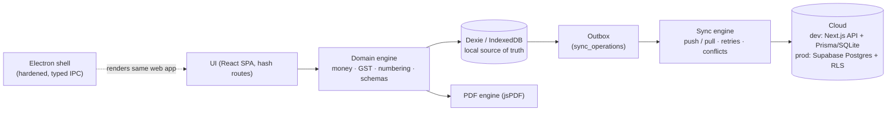

# InvoiceFlow

**Offline-first invoice & quotation management for Indian businesses — GST-aware, local-first, cloud-optional.**


InvoiceFlow keeps every business operation working **locally first**: you create customers, products, quotations, and invoices even with zero network; data lives in IndexedDB on your device, documents render as GST-ready PDFs offline, and an optional cloud sync (Supabase in production) drains an operation outbox whenever connectivity returns. It runs in the browser as an installable PWA and ships as a secure Electron desktop app.

The golden rule of the product:

```
USER ACTION → DOMAIN VALIDATION → LOCAL DB TRANSACTION → LOCAL UI UPDATE → OUTBOX QUEUE → CLOUD SYNC WHEN AVAILABLE
```

---

## Features

### Core documents
- ✓ Quotations and invoices with shared editors, live totals, and per-line discounts
- ✓ Full lifecycles: quotation (DRAFT → SENT → ACCEPTED/REJECTED → CONVERTED) and invoice (DRAFT → FINALIZED → PARTIALLY_PAID → PAID, CANCELLED)
- ✓ One-click quotation-to-invoice conversion that preserves items, charges, notes, and terms
- ✓ Manual payment recording against invoices with automatic paid/outstanding status
- ✓ Fiscal-year document numbering (`INV/2025-26/0042`), provisional draft numbers, server-authoritative allocation, and deterministic duplicate-number resolution

### GST & money engine
- ✓ Integer-paise arithmetic everywhere (no floats): quantities in milli-units, rates and discounts in basis points, half-up rounding
- ✓ CGST/SGST (UTGST mapped to SGST) for intra-state supply and IGST for inter-state supply, driven by place of supply
- ✓ GSTIN format validation, state/UT code handling, HSN/SAC codes per product and per line item
- ✓ Tax-inclusive and tax-exclusive pricing, configurable tax rates with versioned history, additional charges with tax
- ✓ Round-off control and Indian-numbering "amount in words" on every document

### Offline-first & sync
- ✓ Full offline operation: IndexedDB (via Dexie) is the store of record per device
- ✓ Outbox-based sync: batched push, cursor-based pull, retry with exponential backoff, schema-version guard, auth-expiry handling
- ✓ Compare-and-swap conflict detection with six documented conflict classes and a side-by-side resolution UI (keep mine / keep server's / delete)
- ✓ Guest mode is first-class — no account required; register later and your guest workspace is claimed and synced automatically

### Output & insights
- ✓ Offline PDF generation (jsPDF) with a unified document model for previews and exports — A4 layout, GST breakdown, bank details, amount in words, page numbering
- ✓ Dashboard with 8 KPI cards, revenue trend (invoiced vs collected), and recent activity
- ✓ Reports: Sales, GST Summary, Outstanding, Customers, Products — each with CSV export (UTF-8 BOM)
- ✓ JSON backup export/import and local-data management from Settings

### Platform
- ✓ Installable PWA with a service worker for offline asset caching and an offline/connectivity badge
- ✓ Electron desktop scaffold with hardened main/preload, typed IPC, and builder configuration
- ✓ Light/dark/system theming, ⌘K global search, keyboard-accessible actions, and toasts for every outcome

---

## Architecture at a glance



Every write flows through the domain engine into a local Dexie transaction first; the outbox queues the operation and the sync engine drains it to the cloud when a connection is available. The server always revalidates input, recomputes all monetary totals, and enforces workspace membership.

---

## Quick start

### Prerequisites
- Node.js 20+ **or** [Bun](https://bun.sh) 1.x (Bun is used in this repository)

### Run it
```bash
bun install
bun run db:push     # create/push the Prisma schema to the dev-cloud SQLite database
bun run dev         # start the dev server on http://localhost:3000
```

Then open **http://localhost:3000**:

1. The app starts in **guest mode** — no account needed. Everything works offline.
2. On the onboarding screen, either **create your company** or **"Load sample data"** to explore immediately.
3. To enable cloud sync, **register an account** (in-app via Settings → Security or the login screen). A guest workspace is claimed automatically and its full dataset is pushed to the cloud.

> The dev cloud runs inside the same Next.js process (API routes + Prisma/SQLite). Production targets Supabase Postgres with row-level security — see [docs/19-CLOUD-SYNC.md](docs/19-CLOUD-SYNC.md).

---

## Project structure

The production target is a pnpm/Turborepo monorepo; in this repository the packages are folded into the web app one-to-one:

```
├── docs/                  # Canonical spec + 41 module documents (docs/01 … docs/41)
├── src/
│   ├── app/               # Next.js App Router shell + hash-routed SPA
│   │   └── api/           # Dev-cloud HTTP API (auth, workspace claim, sync push/pull)
│   ├── components/        # UI components (shadcn/ui)
│   └── lib/
│       ├── domain/        # Entities, money/GST math, numbering, Zod schemas, document engine
│       ├── db/            # Dexie schema, repositories, seed (local source of truth)
│       ├── sync/          # Sync engine: outbox, push/pull, conflict handling
│       ├── pdf/           # Unified document model + jsPDF renderer
│       └── server/        # Server-side models, auth, sync server logic
├── electron/              # Desktop scaffold: main, preload, typed IPC, services, builder config
├── supabase/              # Production migrations: init DDL, RLS policies, functions, seed
└── prisma/                # Dev-cloud schema (Prisma/SQLite) mirroring the Supabase model
```

---

## Documentation

The full documentation set lives in [`docs/`](docs/); [`docs/_CANON.md`](docs/_CANON.md) is the canonical specification every document derives from.

| # | Document | Summary |
|---|----------|---------|
| 01 | [PROJECT-OVERVIEW](docs/01-PROJECT-OVERVIEW.md) | Product identity, goals, golden rule, and target environments. |
| 02 | [REQUIREMENTS](docs/02-REQUIREMENTS.md) | Functional and non-functional requirements for the MVP. |
| 03 | [FEATURES](docs/03-FEATURES.md) | Complete feature catalogue grouped by module. |
| 04 | [TECH-STACK](docs/04-TECH-STACK.md) | Technology choices (Next.js, Dexie, Prisma, Supabase, Electron, jsPDF) and rationale. |
| 05 | [SYSTEM-ARCHITECTURE](docs/05-SYSTEM-ARCHITECTURE.md) | Layered architecture, package mapping, and end-to-end data flow. |
| 06 | [DATABASE-DESIGN](docs/06-DATABASE-DESIGN.md) | Entity model, relationships, cloud schema, and the server change log. |
| 07 | [AUTHENTICATION](docs/07-AUTHENTICATION.md) | Guest-first account model, dev auth adapter, and the Supabase Auth swap. |
| 08 | [COMPANY-MANAGEMENT](docs/08-COMPANY-MANAGEMENT.md) | Company profile: GSTIN, address, bank details, numbering and tax defaults. |
| 09 | [CUSTOMER-MANAGEMENT](docs/09-CUSTOMER-MANAGEMENT.md) | Customer records, GSTIN validation, state codes, soft deletion. |
| 10 | [PRODUCT-SERVICE-MANAGEMENT](docs/10-PRODUCT-SERVICE-MANAGEMENT.md) | Products/services: SKU, HSN/SAC, pricing, per-product tax defaults. |
| 11 | [QUOTATION-MODULE](docs/11-QUOTATION-MODULE.md) | Quotation lifecycle, expiry, and conversion to invoices. |
| 12 | [INVOICE-MODULE](docs/12-INVOICE-MODULE.md) | Invoice lifecycle, finalization, payments, and cancellation rules. |
| 13 | [GST-MODULE](docs/13-GST-MODULE.md) | GST computation: basis points, intra/inter-state, CGST/SGST/IGST split. |
| 14 | [PDF-GENERATION](docs/14-PDF-GENERATION.md) | Unified document model, jsPDF layout, outputs, and the ₹/`Rs.` font limitation. |
| 15 | [OFFLINE-FIRST](docs/15-OFFLINE-FIRST.md) | Local-first design, offline modes, and the PWA service worker. |
| 16 | [INDEXEDDB-DATABASE](docs/16-INDEXEDDB-DATABASE.md) | Dexie schema v1, repositories, and the migration/versioning strategy. |
| 17 | [SYNC-ENGINE](docs/17-SYNC-ENGINE.md) | Outbox, push/pull protocol, triggers, retry/backoff, and failure states. |
| 18 | [CONFLICT-RESOLUTION](docs/18-CONFLICT-RESOLUTION.md) | Conflict classes, policy matrix, and the conflict-resolution UI. |
| 19 | [CLOUD-SYNC](docs/19-CLOUD-SYNC.md) | Dev cloud vs Supabase, workspace claim, and provider swap. |
| 20 | [DASHBOARD](docs/20-DASHBOARD.md) | KPI cards, revenue trend, recent activity, and quick actions. |
| 21 | [REPORTS](docs/21-REPORTS.md) | Sales/GST/outstanding/customer/product reports and CSV export. |
| 22 | [STORAGE](docs/22-STORAGE.md) | Local storage budget, attachments, eviction risk, and data safety. |
| 23 | [NOTIFICATIONS](docs/23-NOTIFICATIONS.md) | Toast/status feedback today and the notification extension point. |
| 24 | [WHATSAPP-SHARING](docs/24-WHATSAPP-SHARING.md) | WhatsApp document sharing as a designed extension point (not implemented). |
| 25 | [EMAIL](docs/25-EMAIL.md) | Email delivery of documents as a designed extension point (not implemented). |
| 26 | [SUBSCRIPTION](docs/26-SUBSCRIPTION.md) | SaaS subscription plans and entitlement design (docs only). |
| 27 | [PAYMENT-INTEGRATION](docs/27-PAYMENT-INTEGRATION.md) | Razorpay/Stripe gateway design; MVP records payments manually. |
| 28 | [TEAM-MEMBERS](docs/28-TEAM-MEMBERS.md) | Roles (OWNER/ADMIN/MEMBER/VIEWER) and schema-ready collaboration. |
| 29 | [SECURITY](docs/29-SECURITY.md) | Security baseline: validation, authorization, RLS, hardening. |
| 30 | [API-DESIGN](docs/30-API-DESIGN.md) | Full endpoint contracts, error codes, and sync envelopes. |
| 31 | [UI-UX](docs/31-UI-UX.md) | Design system, palette, layout, states, and accessibility. |
| 32 | [ROUTES](docs/32-ROUTES.md) | Production route table and hash-route equivalents. |
| 33 | [VALIDATION](docs/33-VALIDATION.md) | Shared Zod schemas and validation rules on both ends. |
| 34 | [ERROR-HANDLING](docs/34-ERROR-HANDLING.md) | Error codes, sync failure states, and user-facing error surfaces. |
| 35 | [TESTING](docs/35-TESTING.md) | Vitest/RTL/Playwright strategy (defined, not bundled in this sandbox). |
| 36 | [OFFLINE-TESTING](docs/36-OFFLINE-TESTING.md) | Offline simulation, outbox, and conflict test strategy. |
| 37 | [DEPLOYMENT](docs/37-DEPLOYMENT.md) | Hosting, Supabase setup, PWA deployment, Electron packaging. |
| 38 | [ENVIRONMENT](docs/38-ENVIRONMENT.md) | Environment variables and configuration reference. |
| 39 | [BACKUP-RESTORE](docs/39-BACKUP-RESTORE.md) | JSON backup export/import and restore procedures. |
| 40 | [PERFORMANCE](docs/40-PERFORMANCE.md) | Performance budgets, indexing strategy, and list virtualization. |
| 41 | [FUTURE-ROADMAP](docs/41-FUTURE-ROADMAP.md) | Post-MVP roadmap and designed extension points. |

Additional root guides: [DATABASE.md](DATABASE.md) · [API.md](API.md) · [SECURITY.md](SECURITY.md) · [DEVELOPMENT.md](DEVELOPMENT.md) · [CHANGELOG.md](CHANGELOG.md)

---

## Roadmap

The MVP ships offline-first invoicing with the dev cloud; the following are designed and documented as the next steps (see [docs/41-FUTURE-ROADMAP.md](docs/41-FUTURE-ROADMAP.md)):

- **Cloud hardening** — swap the dev auth adapter for Supabase Auth and the dev cloud for Supabase Postgres (the sync protocol is provider-agnostic; migrations and RLS are already provided).
- **Payments** — Razorpay/Stripe gateway integration replacing manual-only payment recording ([docs/27](docs/27-PAYMENT-INTEGRATION.md)).
- **Sharing & notifications** — WhatsApp and email delivery of document PDFs ([docs/24](docs/24-WHATSAPP-SHARING.md), [docs/25](docs/25-EMAIL.md)).
- **SaaS layer** — subscription plans and multi-user team workflows on the schema/policy-ready roles ([docs/26](docs/26-SUBSCRIPTION.md), [docs/28](docs/28-TEAM-MEMBERS.md)).
- **Testing & release** — the Vitest/RTL/Playwright suites defined in [docs/35](docs/35-TESTING.md)/[docs/36](docs/36-OFFLINE-TESTING.md) and electron-builder packaging.

---

## License

Released under the MIT License.

## Disclaimer

InvoiceFlow computes GST following Indian GST rules **as commonly understood**, but it is **not legally certified GST software** and makes no compliance claims. Rates are kept configurable. Have tax professionals validate your documents and figures before any statutory reliance. Known limitations: INR only, English UI, and PDFs render `Rs.` instead of the `₹` glyph (a jsPDF core-font limitation) — see [docs/_CANON.md §19](docs/_CANON.md).
