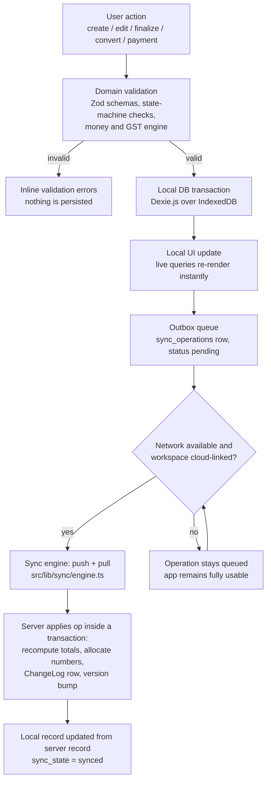
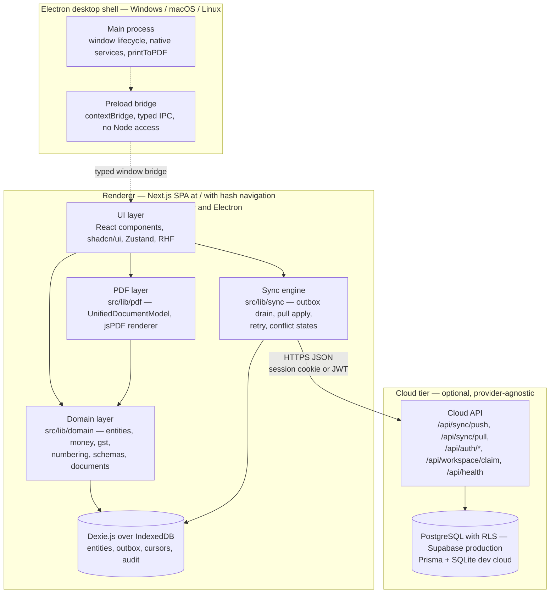

# InvoiceFlow — 01 · Project Overview

> This document is part of the InvoiceFlow documentation set. The canonical specification
> `docs/_CANON.md` is the single source of truth; this overview restates and visualizes its
> product-level decisions without deviating from them.

---

## 1. Purpose

This document introduces **InvoiceFlow** to every stakeholder — engineers, reviewers, and future
contributors — and answers four questions: *what are we building, for whom, under which operating
constraints, and around which architectural spine*. It defines the vision, the problem statement,
the target users, product goals and non-goals, the supported environments, the offline-first
golden rule (CANON §1), the high-level module map, the success metrics, and the delivery phases
(CANON §18), and closes with a high-level system architecture diagram that every deeper document
(02–36) expands upon.

## 2. Scope

**In scope:** product identity and vision; target users; business goals and explicit non-goals;
environment matrix (desktop / web PWA / offline / online); the golden-rule pipeline; module map;
success metrics; phase plan; high-level architecture and its data, API, security, and error-handling
posture at overview depth.

**Out of scope:** requirement IDs and acceptance statements (docs/02-REQUIREMENTS.md), per-feature
behavior (docs/03-FEATURES.md), technology rationale (docs/04-TECH-STACK.md), and all module deep
dives (docs/07–docs/36). Where this document summarizes a CANON section, the section is cited and
remains authoritative.

## 3. Problem statement

Indian small and medium businesses and independent freelancers quote, invoice, and collect money
under three punishing constraints at once:

1. **Connectivity is not guaranteed.** Shops, warehouses, field sales, and tier-2/3 offices lose
   internet routinely; cloud-only invoicing tools become unusable exactly when a customer is
   standing at the counter.
2. **GST arithmetic is unforgiving.** CGST/SGST/UTGST versus IGST depends on place of supply,
   taxable values must be computed from discounts and tax-inclusive pricing with exact rounding,
   and a single paise of drift breaks trust with accountants and buyers.
3. **Existing tools force a false choice.** Desktop-only tools are fast offline but strand data on
   one machine; SaaS tools sync but fail offline. Almost none treat guest usage, data export, and
   device-local ownership as first-class.

InvoiceFlow resolves this with an **offline-first, local-first architecture**: the entire business
application — master data, quotations, GST invoices, payments, PDFs, reports — runs against a local
database (Dexie.js over IndexedDB) with zero network, and an optional, idempotent sync layer
reconciles the local dataset with a cloud account (Supabase PostgreSQL in production) when
connectivity returns.

## 4. Vision

> **Every business operation works locally first — the cloud is an accelerator, never a
> prerequisite.**

Concretely (CANON §1 golden rule):
`USER ACTION → DOMAIN VALIDATION → LOCAL DB TRANSACTION → LOCAL UI UPDATE → OUTBOX QUEUE → CLOUD SYNC WHEN AVAILABLE`

The product should feel like a native accounting utility and behave like a SaaS: instant UI, exact
integer money math, deterministic PDFs, durable local data the user owns, and background sync that
never blocks, never loses an operation, and never silently merges financial changes.

## 5. Target users

| Persona | Profile | What they need most |
|---|---|---|
| **Trader / distributor (SMB)** | GST-registered (`gstin` on `company_profiles`), sells goods with HSN codes, intra- and inter-state | Correct CGST/SGST vs IGST split, HSN on lines, bank details on invoices, outstanding tracking |
| **Freelancer / consultant** | Individual or small services business, SAC codes, often taxes inclusive in quoted price | Tax-inclusive pricing (`price_includes_tax`), quick quotations that convert to invoices, clean PDFs |
| **Field-sales / shop counter user** | Works in patchy connectivity, fast repetitive entry | Full offline CRUD, instant PDF download, guest mode without an account |
| **Owner with two devices** | Laptop in office, desktop at shop, occasionally a second phone browser | Multi-device convergence via outbox sync with explicit, human conflict resolution |

All UI is English-only and all money is **INR only in MVP** (CANON §19.1).

## 6. Business requirements

### 6.1 Product goals

| # | Goal | Grounding |
|---|---|---|
| G-1 | **Offline-first by construction** — every mutation validates and persists locally before any network involvement | CANON §1 golden rule, §17 |
| G-2 | **Exact GST & money engine** — integer paise, milli-unit quantities, basis-point rates, half-up rounding, one shared computation engine for client and server | CANON §4, §5 |
| G-3 | **Complete document lifecycle** — quotation (DRAFT→SENT→ACCEPTED/REJECTED/EXPIRED→CONVERTED) and invoice (DRAFT→FINALIZED→PARTIALLY_PAID→PAID, CANCELLED rules) state machines, deterministic numbering, immutable finalized documents | CANON §6, §12 |
| G-4 | **Optional, safe cloud sync** — outbox push + cursor pull, idempotent server, explicit conflict UI, guest→account claim | CANON §8–§11 |
| G-5 | **Owner-owned data** — JSON backup export/import, CSV exports, soft-delete retention, no vendor lock-in | CANON §15 Settings, §19.8 |
| G-6 | **Ship everywhere** — browser PWA today, security-hardened Electron desktop (Win/macOS/Linux) with the same renderer | CANON §2, §13, §17 |

### 6.2 Non-goals (MVP)

| # | Non-goal | Note |
|---|---|---|
| NG-1 | Payment gateways (Razorpay/Stripe), WhatsApp/email sending, subscription billing | Designed extension points only (CANON §19.3; docs 24–28) |
| NG-2 | Legal/compliance certification of GST output | App computes GST per rules as understood; rates configurable; no statutory reliance claims (CANON §5, §19.2) |
| NG-3 | Multi-currency, non-English UI, or `₹` glyph inside PDFs | INR + English + `Rs.` PDF prefix (font limitation) (CANON §19.1) |
| NG-4 | Multi-user team UI | Schema/RLS/roles (OWNER>ADMIN>MEMBER>VIEWER) are ready; UI limited to owner workflows (CANON §19.7) |
| NG-5 | Server-rendered documents or server-side PDF rendering | PDFs are generated client-side from the local dataset (CANON §13) |
| NG-6 | Native mobile apps | Mobile web via PWA + Sheet navigation is the supported path (CANON §15) |

## 7. Environments and operating modes

| Environment | Shell | Offline mode | Online mode | Notes |
|---|---|---|---|---|
| **Browser (PWA)** | Next.js app at `/`, installable via `manifest.webmanifest` | Service worker `public/sw.js` (cache `invoiceflow-v1`): cache-first static assets, network-first `/` navigation with offline fallback. All business features work against IndexedDB. | Sync engine pushes/pulls; offline badge driven by `navigator.onLine` + heartbeat to `/api/health` | Service worker registers only in production builds; browser storage eviction risk documented (CANON §17); no native print → PDF download fallback |
| **Electron desktop (Windows / macOS / Linux)** | Security-hardened shell: main process + preload bridge (`contextIsolation: true`, `nodeIntegration: false`, `sandbox: true`), renderer reuses the web app verbatim | Full CRUD + PDF; local files; native `printToPDF` via typed IPC; outbox drains on reconnect | Same sync engine over HTTPS | Shipped as `electron-builder` packages (Phase 8); scaffold cannot execute in this sandbox (CANON §19.6) |
| **Modes (both environments)** | — | **Guest** (no account, local workspace, banner "Guest workspace — connect cloud to sync") and **signed-in** (cloud-linked workspace) | — | Guest→account claim migrates the local workspace without data loss (CANON §11) |

Routing note (CANON §2): the app ships as an SPA at `/` with hash navigation (`#/dashboard`,
`#/invoices`, `#/invoices/:id`, …) so the identical bundle serves the sandbox preview, production
web, and the Electron renderer.

## 8. The offline-first golden rule (CANON §1)

Every user interaction — creating a customer, editing an invoice line, recording a payment,
finalizing a document — follows exactly one pipeline:

| Stage | Guarantee | Home |
|---|---|---|
| Domain validation | Zod schemas + document state checks reject invalid data before persistence; money math runs through `computeDocumentTotals` | `src/lib/domain/` |
| Local DB transaction | The mutation is atomic and durable in IndexedDB — a crash or refresh cannot lose it | `src/lib/db/` |
| Local UI update | UI reads from Dexie live queries; no spinner, no network wait | `src/components/` |
| Outbox queue | A `sync_operations` row records `op_id`, `entity`, `action` (`upsert|finalize|cancel|delete`), `base_version`, `payload_json` | `src/lib/db/` (Dexie schema v1) |
| Cloud sync when available | Triggered by `online` event, app focus, post-mutation, 30 s interval, or manual "Sync now" | `src/lib/sync/engine.ts` |

## 9. High-level module map

Production targets a pnpm/Turborepo monorepo; in this sandbox the packages fold into the web app
1:1 (CANON §2):

| Module | Responsibility | Sandbox location |
|---|---|---|
| **Domain** | Entities, money & GST engine, numbering, Zod schemas, document lifecycle (`computeDocumentTotals`, `fiscalYearOf`) | `src/lib/domain/` |
| **Local DB** | Dexie schema v1, repositories, seed, migrations (`db.version(n+1)`) | `src/lib/db/` |
| **Sync engine** | Outbox drain, push/pull protocol, retry & backoff, conflict states, cursors | `src/lib/sync/` |
| **Cloud** | API routes (`/api/sync/push`, `/api/sync/pull`, `/api/auth/*`, `/api/workspace/claim`), dev-cloud persistence (Prisma/SQLite), production Supabase DDL | `src/lib/server/`, `src/app/api/*`, `prisma/`, `supabase/` |
| **PDF** | `UnifiedDocumentModel` + jsPDF/jspdf-autotable renderer (A4, deterministic) | `src/lib/pdf/` |
| **Web app** | Pages, hash router, document editor, dashboard, reports, settings | `src/app/`, `src/components/` |
| **Desktop shell** | Electron main + preload (typed IPC, `printToPDF`, services), builder config | `electron/` |
| **Shared** | Utils, cross-cutting types, root configs | `src/lib/utils.ts`, root configs |

## 10. Success metrics

| # | Metric | Target |
|---|---|---|
| SM-1 | Offline completeness: business operations that require a network round-trip | **0** — create/edit/finalize/convert/payment/PDF/report all run locally (CANON §17) |
| SM-2 | Draft-to-final invoice time for a 5-line GST document on a mid-range laptop | under 60 s, fully offline |
| SM-3 | Money-math correctness: any disagreement between client-computed and server-recomputed totals | 0 paise by design (server recomputation is authoritative, CANON §4) |
| SM-4 | Sync convergence: two devices editing disjoint data after a week offline | fully converge within one sync cycle after reconnect; no op dropped, no silent merge |
| SM-5 | Durability: committed local mutations lost after crash/refresh/restart | 0 (IndexedDB is the store of record) |
| SM-6 | Conflict clarity: financial changes merged without explicit user decision | 0 (CANON §10 — never silently merge) |
| SM-7 | Accessibility: WCAG 2.1 AA conformance on primary flows | pass (see docs/02 §5.4) |
| SM-8 | Recoverability: a user with only the JSON backup can rebuild their workspace on a fresh device | yes (export/import in Settings → Data) |

## 11. Phase summary (CANON §18)

| Phase | Delivers |
|---|---|
| **Phase 0** | Docs & architecture (this documentation set, `_CANON.md`) |
| **Phase 1** | Foundation — sandbox scaffold: Next.js 16 + TS strict + Tailwind 4 + shadcn/ui |
| **Phase 2** | Local DB + domain — Dexie schema, repositories, seed, money/GST engine |
| **Phase 3** | MVP documents — quotation/invoice editors, numbering, PDF, dashboard |
| **Phase 4** | Offline engine — outbox, retry & backoff, push/pull, conflicts UI |
| **Phase 5** | Cloud — dev auth + claim + sync endpoints now; Supabase migrations & RLS ready; swap documented |
| **Phase 6** | Reports — Sales/GST Summary/Outstanding/Customers/Products + CSV, audit trail |
| **Phase 7** | SaaS — subscription/teams as **designed extension points only, docs-only by decision** (CANON §18) |
| **Phase 8** | Testing & release — strategies in docs/35 & docs/36, GitHub Actions CI, `electron-builder` packaging |

The current sandbox deliverable realizes Phases 1–6 inside the single Next.js app (fold per CANON
§2); Phase 7 is intentionally documentation-only; Phase 8 test suites are defined but not bundled
in the sandbox per environment rules (CANON §19.5).

## 12. Technical design — high-level system architecture

Reading the diagram:

- **Renderer UI → Domain:** every write passes through the domain layer (validation + computation);
  the UI never computes totals itself (CANON §4, §15).
- **Domain → Dexie/IndexedDB:** the local database is the store of record; repositories in
  `src/lib/db/` encapsulate all table access; documents embed their items and are written
  atomically.
- **Outbox → Sync Engine:** mutations enqueue `sync_operations` rows; the engine claims batches of
  25, pushes them, then pulls the server ChangeLog feed since the stored `pull_cursor`, applying
  changes in one Dexie transaction (CANON §9).
- **Sync Engine → Cloud API → Postgres/RLS:** the API is provider-agnostic; the dev cloud uses
  Prisma/SQLite behind Next.js API routes, production uses Supabase PostgreSQL with row-level
  security enforced via `is_workspace_member` / `has_role` helpers (CANON §8). The identical sync
  protocol serves both (CANON §19.4).
- **Electron main + preload (desktop only):** the renderer is sandboxed; native capabilities
  (window lifecycle, printing via `printToPDF`) are exposed exclusively through the typed
  `contextBridge` API (CANON §16).

## 13. Data models (overview)

Full field lists are canonical in CANON §7; the conventions every module obeys (CANON §3):

- All business IDs are **UUIDv4**; every synced entity carries `id, workspace_id, created_at,
  updated_at, deleted_at, version, sync_state, origin_device_id`.
- `sync_state` lifecycle: `local → pending → synced`, or `failed` / `conflict`.
- Soft deletion via `deleted_at`; records are retained because historical documents reference them;
  UI hides soft-deleted rows by default.
- Financial document dates (`invoice_date`, `due_date`, `quotation_date`, `valid_until`, `paid_at`)
  are `YYYY-MM-DD` strings; timestamps are ISO-8601 strings.
- Money in integer **paise** (`*_paise`), quantities in **milli-units** (`qty_milli`), rates in
  **basis points** (`gst_rate_bps`, `discount_bps`).
- Core entity families: `workspaces` + `workspace_members`; `company_profiles`; `customers`;
  `products`; `quotations`/`quotation_items` and `invoices`/`invoice_items` (with computed snapshot
  columns); `payments`; `tax_rates`; `document_sequences`; `attachments`; `audit_logs`;
  `sync_operations` (outbox); `sync_metadata`; `app_settings`.

## 14. API contracts (overview)

Canonical surface (CANON §14; full contracts in docs/30-API-DESIGN.md and `API.md`):

| Endpoint | Method | Purpose |
|---|---|---|
| `/api/health` | GET | Liveness + connectivity heartbeat |
| `/api/auth/register` | POST | Create account (+ auto-claim guest workspace if present) |
| `/api/auth/login` / `/api/auth/logout` | POST | Session lifecycle |
| `/api/auth/session` | GET | Current user or `{ user: null }` |
| `/api/auth/account` | DELETE | Delete account + server-side data cascade |
| `/api/workspace/claim` | POST | Attach local (guest) workspace to the account |
| `/api/sync/push` | POST | Outbox batch push — CANON §9 contract |
| `/api/sync/pull` | GET | ChangeLog feed since cursor |

Bodies are JSON; errors use `{ error: string, code?: string }` with HTTP 400/401/403/404/409/429/500.

## 15. Offline behavior

- IndexedDB (Dexie schema v1) is the store of record; **all features except cloud sync work with
  zero network** (CANON §17).
- The outbox guarantees at-least-once delivery with idempotent server application
  (`ProcessedOp`), exponential backoff `min(10 min, 2^attempts × 2 s)`, and 8-attempt failure with
  visible manual retry — failed operations are never silently dropped.
- PWA: installable manifest, offline navigation fallback, versioned cache with cleanup on activate.
- Browser-mode limitations are documented and mitigated: storage eviction risk (PWA install or
  desktop app advised; JSON backup provided), no native printing (PDF download fallback).

## 16. Online behavior

- Sync triggers: `online` event, app focus, post-mutation, 30 s interval, manual "Sync now";
  single-flight mutex; skipped when offline, not cloud-linked, or unauthenticated.
- The server is authoritative for numbers and totals: it recomputes every total from item payloads,
  allocates document numbers in `document_sequences` (server number always wins; offline-allocated
  numbers may be `number_reassigned`), and appends every applied mutation to the ChangeLog
  (CANON §6, §8, §9).
- Pull applies server changes only for entities without pending local operations; version
  comparison (server wins when `record.version > local.version`) keeps devices convergent.
- Conflicts surface in Settings → Sync → Conflicts with side-by-side diff and **Keep mine /
  Keep server's / Delete** actions; every resolution writes an audit log entry.

## 17. Security

Baseline (CANON §16, expanded in docs/29-SECURITY.md): Zod validation on both ends; server-side
recomputation of money and membership/role checks on every operation; parameterized queries
(Prisma) and RLS (Supabase); XSS-safe React rendering (no `dangerouslySetInnerHTML`); CSRF posture
via SameSite=Lax cookies + JSON-only APIs; uploads limited to PNG/JPEG ≤ 1 MB; rate limiting
(10 req/min/IP on auth routes); scrypt password hashing in the dev cloud / Supabase Auth in
production; service-role keys server-side only; hardened Electron (contextIsolation, sandbox, CSP
`default-src 'self'; img-src 'self' data: blob:; style-src 'self' 'unsafe-inline'`, https
allow-list for external links); audit logs for finalize/convert/cancel/payment/conflict;
dependency audit in CI.

## 18. Error handling

| Layer | Behavior |
|---|---|
| Forms & editor | Inline Zod field errors; nothing persists until valid (golden rule stage 2) |
| Domain transitions | Illegal lifecycle moves (e.g. editing a FINALIZED invoice, cancelling an invoice with payments) are rejected locally with an explanatory message before any write |
| Sync push | Per-op outcomes `applied|duplicate|conflict|rejected|number_reassigned`; `rejected` keeps the op visible with its `last_error`; `conflict` opens the conflict UI |
| Sync pull | Batch applied in one transaction; a failed batch leaves cursors untouched for clean retry |
| Auth | 401 pauses sync and flags `needs_reauth` with a re-login prompt that preserves local data; 429 surfaces rate-limit feedback |
| Transport | Errors normalized to `{ error, code? }`; the sync pill reflects `Synced / Pending N / Offline / Syncing / Error` |
| Schema drift | HTTP 409 `{ code: 'schema_version' }` stops syncing and shows an upgrade notice (CANON §9) |

## 19. Acceptance criteria (overview level)

1. With the network disabled from first launch, a user can create a company, customers, products,
   a quotation, convert it to an invoice, finalize it, record a payment, and download the PDF —
   with no feature degraded except cloud sync.
2. Every mutation appears in the outbox with correct `base_version` and is delivered exactly once
   (server-side idempotency) after connectivity returns.
3. Recomputed totals on the server match the document snapshot to the paise, and any client/server
   divergence resolves in favor of the recomputed server value.
4. Two devices that concurrently finalize the same draft converge deterministically: first CAS
   write wins, the loser adopts the server record (CANON §10 class 4).
5. A guest can register and the local workspace migrates via `/api/workspace/claim` with
   `cloud_linked_at` set, `pull_cursor` reset, and a full-dataset push — no data re-entry.
6. The PWA installs, launches offline, and serves the last-visited shell; the Electron scaffold
   builds via `electron-builder` config with the security flags of CANON §16 in place.

## 20. Document set map

| Document | Subject |
|---|---|
| docs/02-REQUIREMENTS.md | Functional + non-functional requirements, traceability |
| docs/03-FEATURES.md | Feature catalog with offline/online behavior and edge cases |
| docs/04-TECH-STACK.md | Technology choices and rationale |
| docs/07-AUTHENTICATION.md | Auth interface, dev adapter vs Supabase Auth |
| docs/14-PDF-GENERATION.md | PDF system rationale and layout |
| docs/16-INDEXEDDB-DATABASE.md | Dexie schema and migration strategy |
| docs/18-CONFLICT-RESOLUTION.md | Conflict classes and UI diagrams |
| docs/19-CLOUD-SYNC.md | Sync protocol and Supabase swap |
| docs/24–28 | Extension points: payments gateways, WhatsApp/email, subscription |
| docs/29-SECURITY.md | Security baseline |
| docs/30-API-DESIGN.md + `API.md` | API contracts |
| docs/32-ROUTES.md | Production routes ↔ hash routes |
| docs/35-TESTING.md, docs/36-OFFLINE-TESTING.md | Test strategies (not bundled in sandbox, CANON §19.5) |
