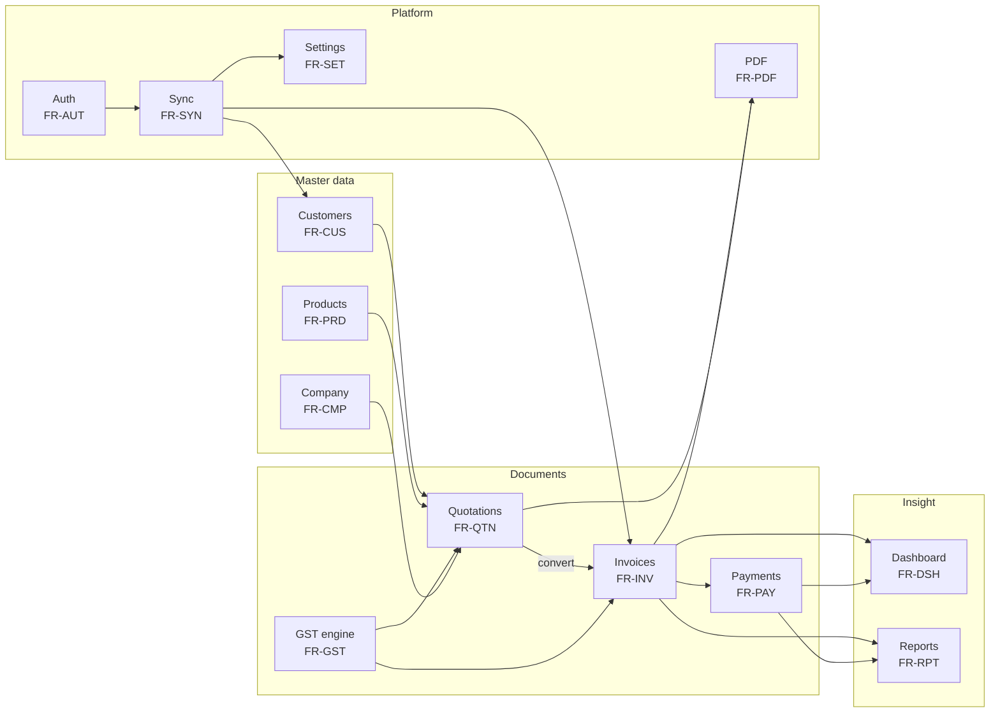

# InvoiceFlow — 02 · Requirements Specification

> Derived from `docs/_CANON.md` (source of truth). Requirement IDs are stable identifiers used by
> feature docs (03), test docs (35/36), and the traceability matrix at the end of this document.

---

## 1. Purpose

This document specifies **what InvoiceFlow must do** and **how well it must do it**. It decomposes
the product into thirteen functional modules, assigns a stable requirement ID to every verifiable
capability, states non-functional requirements (performance, offline capability, security,
accessibility, data integrity, auditability), records constraints and assumptions, and closes with
a traceability matrix linking modules to requirements and CANON sections.

## 2. Scope

**In scope:** functional requirements for company profile, customers, products, quotations,
invoices, the GST engine, payments, dashboard, reports, settings, sync, auth, and PDF; cross-cutting
non-functional requirements; constraints and assumptions; traceability.

**Out of scope:** technology selection and rationale (docs/04-TECH-STACK.md), interaction-level
feature behavior (docs/03-FEATURES.md), protocol field-level contracts (docs/30-API-DESIGN.md,
docs/19-CLOUD-SYNC.md), and test case design (docs/35-TESTING.md, docs/36-OFFLINE-TESTING.md).

## 3. Requirement conventions

- **ID scheme:** `FR-<MODULE>-<nn>` for functional requirements, `NFR-<KIND>-<nn>` for
  non-functional requirements. IDs are immutable once published.
- **Acceptance statement:** each functional requirement carries one short, verifiable acceptance
  statement; "verify" always means locally observable behavior first (offline), since the app must
  satisfy it without a server.
- **Priority:** all `FR` requirements listed here are MVP scope unless explicitly marked
  *(extension point)*; extension points are tracked in docs/03-FEATURES.md §F-20 and docs/24–28.
- **Module dependency shape:**

## 4. Functional requirements

### 4.1 Company profile (FR-CMP)

| ID | Requirement | Acceptance statement |
|---|---|---|
| FR-CMP-01 | Manage the company profile (`company_profiles`): `name`, `business_type`, GSTIN, PAN, `address_line1/2`, `city`, `state_name`, `state_code`, `pincode`, `phone`, `email`, `website`, bank fields (`bank_name`, `bank_account`, `bank_ifsc`, `bank_branch`), `authorized_signatory` | Saving persists locally in IndexedDB immediately; reopening `#/company` shows identical values with zero network |
| FR-CMP-02 | Branding assets: `logo_data` and `signature_data` accepted as PNG/JPEG ≤ 1 MB (dataURL or attachment ref) | Oversized or non-PNG/JPEG uploads are rejected with a toast; accepted assets render on the PDF header/signature block |
| FR-CMP-03 | Numbering defaults: `invoice_prefix` (default `INV`), `quotation_prefix` (default `QT`) editable | A changed prefix applies to the next finalized document; already-issued numbers never change |
| FR-CMP-04 | Document defaults: `default_gst_rate_bps` (default `1800`), `price_includes_tax` (default `false`), `enable_round_off` (default `true`), `default_terms`, `default_notes` | New document editors prefill these values; toggling round-off changes `grand_total`/`round_off_paise` per CANON §4 |
| FR-CMP-05 | One active company profile per workspace in MVP; schema supports many | The editor edits the single bound profile; duplicate active profiles cannot be created from the UI |

### 4.2 Customers (FR-CUS)

| ID | Requirement | Acceptance statement |
|---|---|---|
| FR-CUS-01 | CRUD with fields: auto `code` (`CUS-0001` style), `type` (`BUSINESS|INDIVIDUAL`), `business_name`, `contact_person`, `email`, `phone`, `gstin`, `billing_address`, `shipping_address`, `state_name`, `state_code`, `notes` | Create/edit via react-hook-form + zodResolver; record appears in `#/customers` instantly and lands in the outbox as an `upsert` op |
| FR-CUS-02 | GSTIN validation with the canonical regex `^[0-9]{2}[A-Z]{5}[0-9]{4}[A-Z]{1}[1-9A-Z]{1}Z[0-9A-Z]{1}$` (15 chars; state code = first 2 digits) | An invalid GSTIN blocks save with an inline field error |
| FR-CUS-03 | Duplicate detection before save: match on `gstin`, `phone`, or normalized email within the workspace | A warning dialog lists the matching customer(s) with "Open existing" and "Create anyway" actions; nothing is auto-merged |
| FR-CUS-04 | Soft delete (`deleted_at`) with hidden-by-default lists | Deleted customers disappear from pickers/lists, remain in Dexie, and historical documents keep their `customer_name_snapshot` |
| FR-CUS-05 | List with search, sort, filters, client-side pagination (10/page) | Typing in the search box filters locally with no network; state matches after refresh |
| FR-CUS-06 | State selection from the canonical `INDIAN_STATES` list (state code + UT flag) | Selected `state_code` becomes the default place of supply for that customer's documents |

### 4.3 Products (FR-PRD)

| ID | Requirement | Acceptance statement |
|---|---|---|
| FR-PRD-01 | CRUD with fields: `name` (required), `sku`, `hsn_sac`, `description`, `unit` (default `NOS`), `selling_price_paise` (required ≥ 0), `cost_price_paise`, `gst_rate_bps` (defaults from company), `price_includes_tax` (falls back to company default), `active` | Prices are stored as integer paise; entering `₹250.50` stores `selling_price_paise = 25050`; invalid input blocks save |
| FR-PRD-02 | Duplicate detection on `sku` (exact) and `name` (case-insensitive) within the workspace | Warning dialog offers "Open existing" / "Create anyway"; no silent merge |
| FR-PRD-03 | Active/inactive toggle (index `[workspace_id+active]`) | Inactive products vanish from document line pickers but remain reportable and editable |
| FR-PRD-04 | Workspace tax-rate library `tax_rates` (`name`, `rate_bps`, `active`, `effective_from`) with versioned history | Selecting a rate stamps its `rate_bps` onto the product and, later, onto document lines as a snapshot |
| FR-PRD-05 | Line autofill: picking a product in a document line fills `hsn_sac`, `unit`, price and `gst_rate_bps` | Filled values are snapshots on the line item — later product edits do not mutate existing documents |

### 4.4 Quotations (FR-QTN)

| ID | Requirement | Acceptance statement |
|---|---|---|
| FR-QTN-01 | Shared document editor (`kind: 'quotation'`): customer picker (+ quick-create), `quotation_date`, `valid_until`, place of supply, product lines, charges list, tax-inclusive toggle, live totals panel | The totals panel updates on every keystroke using `computeDocumentTotals` and matches the PDF exactly |
| FR-QTN-02 | Drafts receive a provisional number `DRAFT-<8 random chars>`, clearly labelled provisional | Saving a draft stores that number; finalizing replaces it with a real `QT/{FY}/{seq4}` number |
| FR-QTN-03 | Status machine per CANON §12: `DRAFT → SENT → ACCEPTED / REJECTED`; `EXPIRED` computed lazily when `valid_until` < today and not converted; `CONVERTED` reachable only from `ACCEPTED` | Illegal transitions are rejected locally with a message; `EXPIRED` appears on list render without any write |
| FR-QTN-04 | After `SENT`, only status transitions are allowed (item/date edits blocked) | The editor renders read-only lines for SENT+ quotations |
| FR-QTN-05 | Conversion: `ACCEPTED` quotation → new invoice `DRAFT` copying items, charges, notes, terms; `source_quotation_id` set; quotation becomes `CONVERTED` with `converted_invoice_id`; both ops enqueued; audit logged on both documents | One action produces both records atomically in Dexie; the invoice opens pre-filled |
| FR-QTN-06 | Duplicate any quotation (including `EXPIRED`) into a fresh `DRAFT` | The duplicate opens in edit mode with a new provisional number and no status carry-over |
| FR-QTN-07 | PDF export and in-app blob preview for quotations | `save` downloads `QT-2025-26-0042.pdf` (slashes → dashes); preview renders in an iframe object URL offline |

### 4.5 Invoices (FR-INV)

| ID | Requirement | Acceptance statement |
|---|---|---|
| FR-INV-01 | Shared document editor (`kind: 'invoice'`) with `invoice_date`, optional `due_date`, same line/charges UX as quotations | Editor parity with quotations except finalization replaces "mark SENT" |
| FR-INV-02 | Finalization allocates the real number per CANON §6 (`{prefix}/{FY}/{seq4}`, FY April–March), stamps `finalized_at`, and makes the document immutable | After finalize, item edits are impossible in UI and rejected server-side; sequence never decrements |
| FR-INV-03 | Payment-driven status: `FINALIZED → PARTIALLY_PAID → PAID` derived from `payments` against `grand_total_paise` and `paid_total_paise` | Recording a payment recomputes status locally and on the server (server recalculates, CANON §9) |
| FR-INV-04 | Cancel rules: `FINALIZED|PARTIALLY_PAID → CANCELLED` only when `paid_total_paise = 0`; otherwise blocked with explanation; `cancelled_at` stamped; the number is retained | Attempting to cancel an invoice with payments shows the explanatory block; a successful cancel keeps the number visible on lists and PDFs |
| FR-INV-05 | Offline number allocation in a Dexie transaction; on push the server re-validates: fast-forwards a behind sequence, or reassigns (`status: 'number_reassigned'`) which the client adopts | A finalized-offline invoice syncs without user action; if reassigned, the new number appears with a notice and the old number is never reused |
| FR-INV-06 | Duplicate from any state creates a fresh `DRAFT` | Source `source_quotation_id` linkage is not copied; the duplicate gets a provisional number |
| FR-INV-07 | Server-side immutability: `FINALIZED`/`PAID` invoices reject `upsert`/`delete` ops (only `cancel`/payments allowed); correction workflow is duplicate → edit → reissue | A tampered push receives `rejected`; the local op shows the error in Settings → Sync |
| FR-INV-08 | Overdue detection: `FINALIZED`/`PARTIALLY_PAID` invoices with `due_date` < today are flagged overdue | Overdue badges appear on lists and the dashboard without any background writer |

### 4.6 GST engine (FR-GST)

| ID | Requirement | Acceptance statement |
|---|---|---|
| FR-GST-01 | Place of supply: defaults to the customer's billing `state_code`; overridable per document | Changing place of supply flips `tax_mode` snapshot between `INTRA|INTER` and recomputes tax split live |
| FR-GST-02 | Split rule: intra-state → CGST + SGST with `cgst = roundHalfUp(taxCombined / 2)` and the odd paise to SGST; UTGST recorded in the SGST slot with the UT flag from `INDIAN_STATES`; inter-state → IGST | A ₹100 taxable intra-state line at 18% yields CGST 9.00 / SGST 9.00; a 9.99 combined tax yields 5.00/4.99 (odd paise to SGST) |
| FR-GST-03 | Line math order per CANON §4: gross → discount → taxable (exclusive or inclusive formula) → combined tax → line total, all in integers with half-up rounding | Property tests over `computeDocumentTotals` (docs/35) show zero paise drift against the spec examples, including tax-inclusive lines |
| FR-GST-04 | Charges: each `{ id, label, amount_paise, taxable, gst_rate_bps }` taxed by the same rule; totals include `charges_total_paise` + `charges_tax_paise` | Adding a taxable ₹500 shipping charge at 18% adds ₹500 to charges and ₹90 to the tax split correctly |
| FR-GST-05 | Round-off per company setting: `grand_total = roundHalfUp(grandTotalRaw / 100) * 100`, `round_off_paise = grand_total − grandTotalRaw` | With round-off on, grand totals always end in `.00`; with it off, `round_off_paise = 0` and raw totals display |
| FR-GST-06 | Amount in words in Indian numbering (crore/lakh/thousand) | ₹1,23,050.50 renders "Rupees One Lakh Twenty Three Thousand Fifty and Fifty Paise Only" on UI and PDF |
| FR-GST-07 | No legal-compliance claims; rates fully configurable via `tax_rates` history | Docs and About screen state the app is not certified GST-compliant (CANON §5, §19.2) |

### 4.7 Payments (FR-PAY)

| ID | Requirement | Acceptance statement |
|---|---|---|
| FR-PAY-01 | Manual payment recording against an invoice: `amount_paise` > 0, `paid_at` (`YYYY-MM-DD`), `method` (`CASH|BANK_TRANSFER|UPI|CHEQUE|CARD|OTHER`), optional `reference`, `notes` | A payment saved offline persists immediately, appears under `#/payments` and on the invoice, and enqueues its op |
| FR-PAY-02 | Domain rule: payment amount must not exceed the outstanding (`grand_total_paise − paid_total_paise`) | Overpayment is rejected with an inline message stating the exact outstanding paise |
| FR-PAY-03 | Invoice status recomputation after each payment (`PARTIALLY_PAID` / `PAID`), server-recomputed on push | Paying the exact outstanding flips status to `PAID` locally and stays `PAID` after sync |
| FR-PAY-04 | Per-invoice payment history with audit action `PAYMENT` | Every payment row appears in `audit_logs` with `at` and `device_id` |

### 4.8 Dashboard (FR-DSH)

| ID | Requirement | Acceptance statement |
|---|---|---|
| FR-DSH-01 | Eight KPI stat cards: total invoices, drafts, paid, unpaid, overdue, quotations, accepted quotations, outstanding | Each card matches the corresponding filtered list count/sum exactly, computed from local Dexie |
| FR-DSH-02 | Revenue trend chart: monthly invoiced vs collected for the last 6 months | Chart renders offline from local data; values reconcile with the Sales report for the same months |
| FR-DSH-03 | Recent activity feed from `audit_logs`, sync status card, quick actions | Activity shows the latest transitions with actor `device_id`; quick actions navigate to new invoice/quotation/customer |
| FR-DSH-04 | Empty states with icon + copy + CTA when no data exists | A fresh workspace shows onboarding-first empty states, never blank panes |

### 4.9 Reports (FR-RPT)

| ID | Requirement | Acceptance statement |
|---|---|---|
| FR-RPT-01 | Tabs: Sales, GST Summary, Outstanding, Customers, Products | Each tab renders from local data with no network; totals reconcile with dashboard KPIs |
| FR-RPT-02 | Date-range filter defaulting to the current fiscal year (April–March, `fiscalYearOf`) | Changing the range re-computes every tab consistently |
| FR-RPT-03 | GST Summary grouping by rate and place of supply with CGST/SGST(-UTGST)/IGST totals | Intra- and inter-state amounts land in the correct columns and sum to `taxable_total_paise`-based figures |
| FR-RPT-04 | Outstanding report: per-invoice `grand_total_paise − paid_total_paise` for unpaid non-cancelled invoices | Sum matches the dashboard "outstanding" card |
| FR-RPT-05 | CSV export (UTF-8 BOM) on every tab | Exported files open in Excel with correct ₹ formatting and no mojibake |

### 4.10 Settings (FR-SET)

| ID | Requirement | Acceptance statement |
|---|---|---|
| FR-SET-01 | Tabs: Company, Preferences, Sync, Data, Security, About per CANON §15 | All tabs reachable from `#/settings`; each tab renders offline |
| FR-SET-02 | Preferences: workspace defaults (round-off, tax-inclusive default, theme) persisted in `app_settings` | Changing preferences affects only future documents |
| FR-SET-03 | Sync tab: live status, "Sync now" button, outbox table (`sync_operations` with status/attempts/last_error), conflicts UI, failed-op manual retry | A failed op is visible with its error and retryable by button; done ops older than 7 days are pruned |
| FR-SET-04 | Data tab: JSON backup export/import, CSV shortcuts, clear local data | Export downloads a complete JSON snapshot; import restores it on a fresh device; clear-local asks AlertDialog confirmation and wipes IndexedDB only |
| FR-SET-05 | Security tab: account info, guest→cloud connection, logout, delete account | Delete account calls `DELETE /api/auth/account` and leaves local data intact with an explanatory note |
| FR-SET-06 | About: app version and the limitations notice (Rs. PDF prefix, INR-only, non-certification) | Version string matches the build; limitations text present |

### 4.11 Sync (FR-SYN)

| ID | Requirement | Acceptance statement |
|---|---|---|
| FR-SYN-01 | Outbox ops carry `op_id`, `workspace_id`, `entity`, `entity_id`, `action` (`upsert|finalize|cancel|delete`), `base_version`, `payload_json` (full record, items embedded) | Inspecting any queued op shows a complete, replayable payload |
| FR-SYN-02 | Push contract per CANON §9: batch of 25 oldest `pending` ops ordered by `created_at`, marked `in_flight`, POST `/api/sync/push`; per-op results `applied|duplicate|conflict|rejected|number_reassigned` handled distinctly | Replaying an already-applied op returns `duplicate` (idempotency via `ProcessedOp`) without duplicating data |
| FR-SYN-03 | Pull per CANON §9: GET `/api/sync/pull?workspace_id=…&cursor=<seq>&limit=500`, apply in ONE Dexie transaction, skip entities with pending local ops, server wins when `record.version > local.version`, documents replace embedded items atomically, update `pull_cursor` + `last_sync_at` | A pulled batch either fully applies or fully rolls back; a partial network failure never advances the cursor |
| FR-SYN-04 | Triggers: `online` event, app focus, post-mutation, 30 s interval, manual "Sync now"; single-flight mutex; skip when offline / not cloud-linked / unauthenticated | Rapid edits enqueue exactly one op per mutation and never spawn concurrent sync runs |
| FR-SYN-05 | Retry/backoff: `attempts++`, `next_attempt_at = now + min(10 min, 2^attempts × 2 s)`; after 8 attempts → `failed` with manual retry; ops never silently dropped | An unreachable server shows growing `attempts` and scheduled `next_attempt_at`; after 8 failures the op sits in `failed` with its `last_error` |
| FR-SYN-06 | Auth expiry (401) pauses sync and flags `needs_reauth`; schema mismatch (409 `schema_version`) stops syncing with an upgrade notice | Re-login resumes sync with no data loss; the upgrade notice blocks further pushes until resolved |
| FR-SYN-07 | Local maintenance: `applied|duplicate|number_reassigned` adopt the server record (version, `sync_state='synced'`, server numbers/totals), mark op `done`, prune done ops older than 7 days | After a successful push, entity `sync_state` is `synced` and the outbox does not grow unboundedly |

### 4.12 Auth & accounts (FR-AUT)

| ID | Requirement | Acceptance statement |
|---|---|---|
| FR-AUT-01 | Guest mode is first-class: full offline usage with a local workspace, banner "Guest workspace — connect cloud to sync" | A brand-new user creates invoices with no account; the banner shows until cloud-linked |
| FR-AUT-02 | Account lifecycle: register / login / logout / session. Dev cloud: scrypt hashing (random 16-byte salt, 64-byte key, timing-safe compare), random 32-byte session token in `if_session` httpOnly SameSite=Lax cookie, 30-day expiry. Production: Supabase Auth behind the same interface (docs/07) | Registering while a guest workspace exists auto-triggers the claim flow; logout destroys the server session but keeps local data |
| FR-AUT-03 | Workspace claim: `POST /api/workspace/claim {workspace_id, name, device_id}` creates the server workspace owned by the caller + OWNER membership + initial ChangeLog entry; client sets `cloud_linked_at`, resets `pull_cursor = 0`, pushes the full local dataset as normal bulk-safe ops | After claim, a second device logging into the same account pulls the entire dataset |
| FR-AUT-04 | Rate limiting: in-memory token bucket, 10 req/min/IP on auth routes | The 11th request within a minute receives HTTP 429 with the standard error envelope |
| FR-AUT-05 | Account deletion: `DELETE /api/auth/account` cascades user data server-side; local data remains under user control | After deletion, `/api/auth/session` returns `{ user: null }` and the local workspace remains usable offline |
| FR-AUT-06 | Role model ready: `OWNER > ADMIN > MEMBER > VIEWER` enforced server-side (`VIEWER` read-only, `MEMBER` cannot delete, `ADMIN` cannot delete workspace) | A VIEWER-session push of a write op is rejected HTTP 403 (server-side enforcement only) |

### 4.13 PDF (FR-PDF)

| ID | Requirement | Acceptance statement |
|---|---|---|
| FR-PDF-01 | Client-side generation with jsPDF + jspdf-autotable from the shared `UnifiedDocumentModel`; totals sourced exclusively from the domain engine | The PDF totals equal the editor panel to the paise for the same document |
| FR-PDF-02 | A4 portrait, Helvetica core fonts; layout per CANON §13: header (logo/company, `TAX INVOICE`/`QUOTATION`, meta grid with number/dates/place of supply), Bill-To block, items table (`# / Item & description / HSN-SAC / Qty / Rate / Discount / Taxable / GST% / GST amt / Amount`), totals block, amount in words, bank details (invoices), notes, terms, signature + authorized signatory, `Page x of y`, footer "Generated by InvoiceFlow" | A 60-line document paginates with repeated headers and correct `Page x of y` |
| FR-PDF-03 | Outputs: `save` (download), `blob` (in-app preview), `print` (Electron only); filename = document number with `/` → `-` | Browser print attempt falls back to download; Electron exposes native `printToPDF` via typed IPC |
| FR-PDF-04 | Documented limitation: `₹` glyph absent in core fonts → PDFs render `Rs.`; UI shows `₹` via Intl | About + docs/14 state the limitation; no rendering regression risk |
| FR-PDF-05 | Electron native printing path via `printToPDF` IPC | The scaffold's IPC channel is typed and deny-by-default (CANON §16, §19.6) |

## 5. Non-functional requirements

### 5.1 Performance (NFR-PERF)

| ID | Requirement | Acceptance statement |
|---|---|---|
| NFR-PERF-01 | All reads/writes hit the local database; no business screen waits on a network call | With airplane mode on, list render, editor open, and save are indistinguishable from online timings |
| NFR-PERF-02 | Lists stay responsive at 5,000 invoices / 5,000 customers via indexed queries, client-side pagination (10/page), and scoped compound indexes (`[workspace_id+status]`, `[workspace_id+deleted_at]`) | Scrolling/filtering remains smooth; queries use Dexie indexes (no full-table scans in hot paths) |
| NFR-PERF-03 | PDF for a 50-line document generates in under 2 s on a mid-range laptop | Measured via docs/35 performance test |
| NFR-PERF-04 | A sync cycle of one full push batch (25 ops) + one pull page (500 changes) completes without blocking the UI thread | UI interactions never queue behind sync; the mutex only serializes sync itself |

### 5.2 Offline capability (NFR-OFF)

| ID | Requirement | Acceptance statement |
|---|---|---|
| NFR-OFF-01 | IndexedDB is the store of record; every feature except cloud sync and account auth works with zero network (CANON §17) | Disabling the network never disables CRUD, finalize, convert, payments, PDF, reports, or backup |
| NFR-OFF-02 | Queued operations survive restart/crash (Dexie persistence) and drain automatically on reconnect | Kill the tab mid-edit, reopen: committed data and pending ops are intact |
| NFR-OFF-03 | PWA: service worker cache-first for static assets, network-first for `/` navigation with offline fallback, versioned cache `invoiceflow-v1` with cleanup on activate; registration only in production builds | The installed PWA opens offline to the last shell; dev HMR is never clobbered |
| NFR-OFF-04 | Connectivity truth: `navigator.onLine` + heartbeat to `/api/health` drive the offline badge and sync gating | The badge flips within one heartbeat of network change |

### 5.3 Security (NFR-SEC)

| ID | Requirement | Acceptance statement |
|---|---|---|
| NFR-SEC-01 | Zod validation on both ends; the server recomputes every total and overwrites client numbers (never trusts client arithmetic, CANON §4/§9) | A mutated push payload with wrong totals is stored with server-recomputed values |
| NFR-SEC-02 | Server-side membership and role enforcement on every op (RLS `is_workspace_member`/`has_role` in production; API checks in dev cloud) | Non-members receive 403; VIEWER writes rejected |
| NFR-SEC-03 | Sessions: httpOnly `if_session` SameSite=Lax cookie (dev) / Supabase JWT (prod); scrypt password hashing (dev); 10 req/min/IP auth rate limit; no GET mutations; JSON-only APIs | Cookie is invisible to JS; CSRF surface limited to JSON POSTs from same-site contexts |
| NFR-SEC-04 | XSS-safe rendering (no `dangerouslySetInnerHTML`); upload validation PNG/JPEG ≤ 1 MB (client check + dataURL size check); service-role keys server-side only, never bundled | Injected strings render as text; oversized dataURL rejected before persistence |
| NFR-SEC-05 | Electron: `contextIsolation: true`, `nodeIntegration: false`, `sandbox: true`, CSP `default-src 'self'; img-src 'self' data: blob:; style-src 'self' 'unsafe-inline'`, typed `contextBridge` only, external links via `shell.openExternal` with https allow-list, no remote content | The preload exposes a fixed typed API; any other channel is absent |

### 5.4 Accessibility (NFR-ACC) — WCAG 2.1 AA

| ID | Requirement | Acceptance statement |
|---|---|---|
| NFR-ACC-01 | Contrast ≥ 4.5:1 for body text in both themes using the emerald/slate palette (primary emerald-600 light / emerald-500 dark; NO blue/indigo) | Automated contrast checks pass on primary screens |
| NFR-ACC-02 | Full keyboard operability: all actions reachable via tab focus, visible focus rings, ⌘K global search | A keyboard-only user can create and finalize an invoice |
| NFR-ACC-03 | Status is never conveyed by color alone: sync pill and dots pair text/dot semantics (paid=emerald, unpaid=amber, overdue=red, draft=slate) with labels | Color-blind review confirms every state is text-readable |
| NFR-ACC-04 | Semantic structure: landmarks, labelled form controls, `AlertDialog` confirmation for destructive actions, Sheet-based mobile nav | Screen-reader smoke test passes on dashboard, editor, settings |

### 5.5 Data integrity (NFR-INT) — integer paise math per CANON §4

| ID | Requirement | Acceptance statement |
|---|---|---|
| NFR-INT-01 | Money is integer paise (`*_paise`), quantities integer milli-units (`qty_milli`: 2500 = 2.5), rates basis points (`gst_rate_bps`, `discount_bps`); never floats anywhere in the pipeline | A repo-wide audit finds no float arithmetic on money paths |
| NFR-INT-02 | One computation engine (`computeDocumentTotals` in `src/lib/domain/documents.ts`) shared by client and server; the server recomputes and overwrites | No UI code computes totals independently |
| NFR-INT-03 | Financial dates are `YYYY-MM-DD` strings (`invoice_date`, `due_date`, `quotation_date`, `valid_until`, `paid_at`); timestamps are ISO-8601; timezone-safe comparisons | Date pickers round-trip losslessly; no `Date` objects persist for these fields |
| NFR-INT-04 | Sequences never decrement; cancelled invoices keep their numbers; finalized documents are immutable; correction = duplicate → edit → reissue | Cancelling and re-issuing never reuses a number |
| NFR-INT-05 | Soft deletes + snapshots: `deleted_at` retained records; `customer_name_snapshot`, `customer_gstin_snapshot`, `price_includes_tax`, `tax_mode`, computed item columns freeze document meaning | Editing/deleting a customer never alters an issued invoice's rendered data |
| NFR-INT-06 | Dexie migrations are append-only (`db.version(n+1).stores({...})` with upgrade callbacks); v1 is never mutated in place (CANON §7) | Upgrade from v1 preserves all rows (migration test in docs/16/35) |

### 5.6 Auditability (NFR-AUD)

| ID | Requirement | Acceptance statement |
|---|---|---|
| NFR-AUD-01 | `audit_logs` record `CREATE|UPDATE|FINALIZE|CONVERT|CANCEL|PAYMENT|DELETE|SYNC_CONFLICT|STATUS` with `entity_type`, `entity_id`, `detail_json`, `device_id`, `at` | Every lifecycle transition on any document yields exactly one audit row locally, mirrored by the server ChangeLog |
| NFR-AUD-02 | The server ChangeLog appends one row per applied mutation with the full record including items (pull feed; CANON §8) | Two devices converge to byte-identical logical data after both consume the same ChangeLog range |
| NFR-AUD-03 | Every conflict resolution writes `audit_logs(action='SYNC_CONFLICT')` with the chosen outcome | Conflict history is reconstructible from the audit trail |

## 6. Constraints & assumptions (quoted from CANON §19)

1. **Currency INR only; English UI; `Rs.` in PDFs** (font limitation of jsPDF core fonts).
2. **GST logic follows Indian GST rules as commonly understood; not legally certified** —
   professional validation required before statutory reliance.
3. **MVP payments = manual recording (no gateway).** Razorpay/Stripe/WhatsApp/email/subscription
   are designed extension points (docs 24–28), not implemented.
4. **Dev cloud uses SQLite via Next API routes; production target is Supabase Postgres with RLS**
   (migrations provided). The sync protocol is identical for both.
5. **No test files in the sandbox** (environment rule); the full test strategy is documented in
   docs/35-TESTING.md & docs/36-OFFLINE-TESTING.md.
6. **Electron is a scaffold** (cannot execute in this sandbox) — security-hardened main/preload/IPC
   code + builder config provided; the renderer reuses the web app verbatim.
7. **Team collaboration (multi-user roles) is schema/policy-ready; UI limited to owner workflows in
   MVP.**
8. **Browser data eviction:** users are advised to install as PWA or use the desktop app for
   durability; JSON backup is provided.

Additional standing assumptions: sandbox preview serves `/` only → SPA with hash navigation
(CANON §2); API routes are real HTTP endpoints (no server actions).

## 7. Traceability matrix

| Module | Key requirement IDs | Primary CANON grounding | Deep-dive docs |
|---|---|---|---|
| Company profile | FR-CMP-01…05 | §7 `company_profiles`, §15 | 03 §F-02 |
| Customers | FR-CUS-01…06 | §7 `customers`, §5 GSTIN | 03 §F-03 |
| Products | FR-PRD-01…05 | §7 `products`, `tax_rates` | 03 §F-04 |
| Quotations | FR-QTN-01…07 | §12 lifecycle, §6 numbering, §15 editor | 03 §F-05 |
| Invoices | FR-INV-01…08 | §12 lifecycle, §6 numbering, §9 finalize rules | 03 §F-06 |
| GST engine | FR-GST-01…07 | §4 money math, §5 GST domain | 03 §F-07 |
| Payments | FR-PAY-01…04 | §7 `payments`, §12 status derivation | 03 §F-20 (extension point: gateways) |
| Dashboard | FR-DSH-01…04 | §15 dashboard | 03 §F-10 |
| Reports | FR-RPT-01…05 | §15 reports | 03 §F-11 |
| Settings | FR-SET-01…06 | §15 settings tabs | 03 §F-14, §F-16 |
| Sync | FR-SYN-01…07 | §9 protocol, §8 ChangeLog, §10 conflicts | 19-CLOUD-SYNC.md, 18-CONFLICT-RESOLUTION.md |
| Auth & accounts | FR-AUT-01…06 | §11 auth & claim, §16 security | 07-AUTHENTICATION.md, 29-SECURITY.md |
| PDF | FR-PDF-01…05 | §13 PDF system | 14-PDF-GENERATION.md |
| Cross-cutting integrity | NFR-INT-01…06 | §3 metadata, §4 money | 16-INDEXEDDB-DATABASE.md |
| Cross-cutting offline | NFR-OFF-01…04 | §1 golden rule, §17 offline/PWA | 36-OFFLINE-TESTING.md |
| Cross-cutting security | NFR-SEC-01…05 | §16 baseline | 29-SECURITY.md |
| Cross-cutting accessibility | NFR-ACC-01…04 | §15 UI/UX | 03 §F-17 |
| Cross-cutting audit | NFR-AUD-01…03 | §7 `audit_logs`, §8 ChangeLog, §10 conflicts | 18-CONFLICT-RESOLUTION.md |

## 8. Error handling requirements (cross-cutting)

| ID | Requirement | Acceptance statement |
|---|---|---|
| NFR-ERR-01 | API errors use `{ error: string, code?: string }` with HTTP 400/401/403/404/409/429/500 (CANON §14) | Every failure path in docs/30 maps to this envelope |
| NFR-ERR-02 | Validation failures never persist; lifecycle violations explain the rule that was violated | The cancel-blocked message names the payment count blocking it |
| NFR-ERR-03 | Sync failures are visible and actionable: `rejected` ops keep `last_error`, `failed` ops offer manual retry, conflicts open the dedicated UI | No error state is reachable only via devtools |
| NFR-ERR-04 | Destructive actions require explicit `AlertDialog` confirmation; toasts (sonner) acknowledge every mutating action | Clearing local data or deleting an account always double-prompts |

## 9. Acceptance criteria (definition of done for the MVP)

1. Every `FR-*` requirement in §4 has a demonstrable offline pass and, where applicable, an online
   pass documented in docs/35 & docs/36 test plans.
2. The golden-rule pipeline holds for 100% of mutations: no write path skips domain validation,
   the local transaction, or outbox enqueueing.
3. `NFR-INT-*` hold by construction (single shared engine; server recomputation authoritative).
4. Sync behaves per FR-SYN-01…07 against both the dev cloud and the documented Supabase contract —
   identical client code, provider swapped by configuration only.
5. The constraint list in §6 is reproduced in user-facing About copy where relevant (Rs. prefix,
   INR-only, non-certification, manual payments).
6. The traceability matrix above has no dangling references: every ID maps to a CANON section and
   a deep-dive document.
