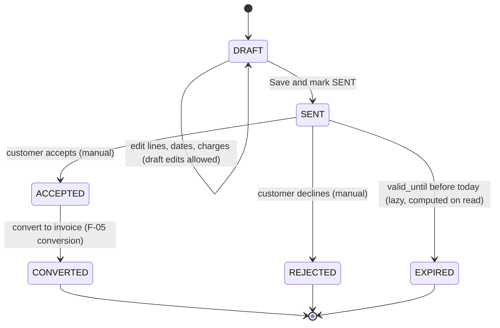
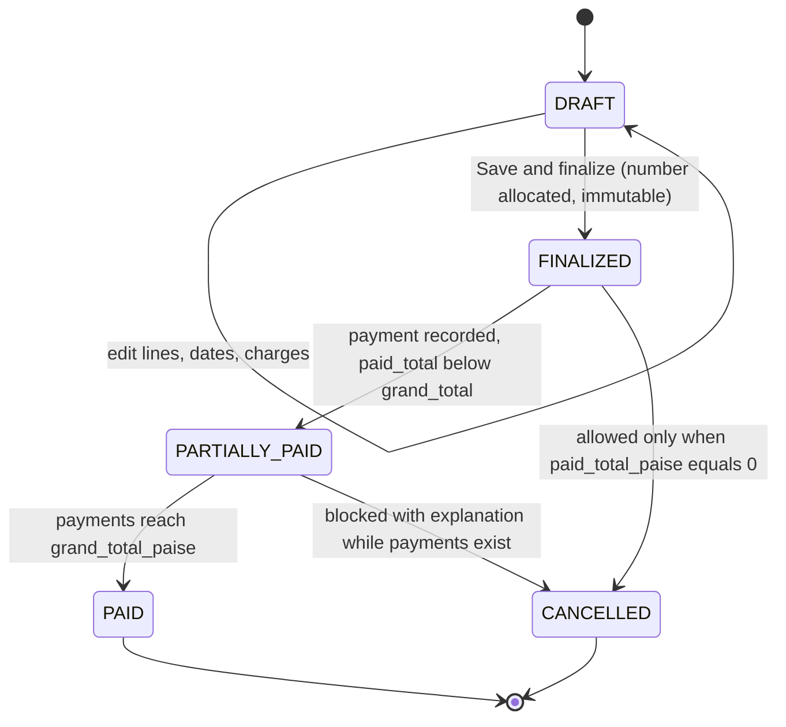
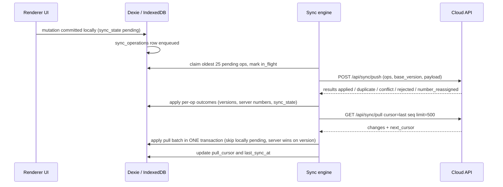

# InvoiceFlow — 03 · Feature Catalog

> Derived from `docs/_CANON.md` (source of truth). Each feature documents its offline behavior,
> online behavior, edge cases, and delivery status. Requirement IDs referenced here are defined in
> docs/02-REQUIREMENTS.md.

---

## 1. Purpose

This catalog is the behavioral reference for InvoiceFlow: what each feature does, the user story it
serves, how it behaves offline versus online, the edge cases it must survive, and its delivery
status. Product decisions live here; protocol and schema details live in CANON §6–§13 and their
deep-dive documents.

## 2. Scope

**In scope:** all MVP features (F-01 … F-19) and the enumerated designed extension points (F-20).
Each entry covers description, user story, offline behavior, online behavior, edge cases, status.

**Out of scope:** requirement acceptance wording (docs/02), stack rationale (docs/04), field-level
schemas (CANON §7), and HTTP payloads (CANON §9, docs/30-API-DESIGN.md).

## 3. Status conventions

- **Implemented in MVP** — the feature exists in the shipped application (desktop-shell items are
  scaffolded per CANON §19.6 where noted).
- **Designed extension point** — deliberately not implemented in the MVP; the extension seam is
  documented (CANON §18 Phase 7, §19.3; docs/24–28).

## 4. Feature catalog

---

### F-01 · Multi-workspace

- **Description.** A device can hold several workspaces (`workspaces` table, `workspace_members`
  roles `OWNER|ADMIN|MEMBER|VIEWER`). One workspace is active at a time (`app_settings.active_workspace_id`);
  every entity row is namespaced by `workspace_id`. MVP UI manages one workspace per user with the
  schema ready for switching.
- **User story.** As a bookkeeper who handles records for more than one business, I want each
  business's data isolated in its own workspace so that invoices and GST figures never mix.
- **Offline behavior.** Full: all workspaces live in IndexedDB; every query is scoped by compound
  indexes (`[workspace_id+status]`, `[workspace_id+deleted_at]`, …).
- **Online behavior.** Sync is per-workspace: `sync_metadata` (one row per `workspace_id`) keeps an
  independent `pull_cursor`; the engine syncs the active, cloud-linked workspace.
- **Edge cases.** Switching workspaces mid-sync is safe (single-flight mutex); entities are never
  queried without their workspace scope; a workspace not linked to the cloud keeps working guest-mode.
- **Status.** Implemented in MVP (single active workspace UI; schema/roles ready for teams per CANON §19.7).

---

### F-02 · Company branding & profile

- **Description.** `company_profiles` holds the business identity: name, `business_type`, address
  with `state_code`, `gstin`, `pan`, contacts, bank details (`bank_name`, `bank_account`,
  `bank_ifsc`, `bank_branch`), `authorized_signatory`, `logo_data` / `signature_data`
  (PNG/JPEG ≤ 1 MB), plus defaults (`invoice_prefix` `INV`, `quotation_prefix` `QT`,
  `default_gst_rate_bps` `1800`, `price_includes_tax` `false`, `enable_round_off` `true`,
  `default_terms`, `default_notes`).
- **User story.** As a business owner, I want my logo, GSTIN, bank account and signature on every
  invoice so that documents look official and customers can pay my bank directly.
- **Offline behavior.** Fully editable offline at `#/company`; assets stored locally (dataURL or
  attachment ref); PDFs render branding from local data.
- **Online behavior.** Profile syncs as an `upsert` op (`entity: 'company'`); in production, logos
  and signatures belong in the `company-assets` storage bucket with path
  `{workspace_id}/{entity}/{filename}`.
- **Edge cases.** Oversized/unsupported images rejected with a toast before persistence; changing
  prefixes never rewrites issued numbers; onboarding wizard (welcome → create company / load sample
  data / sign in) appears when no profile exists.
- **Status.** Implemented in MVP.

---

### F-03 · Customer management (CRUD + duplicate detection)

- **Description.** Customers carry auto `code` (`CUS-0001`), `type` (`BUSINESS|INDIVIDUAL`),
  `business_name`, `contact_person`, `email`, `phone`, validated `gstin`, billing/shipping
  addresses, `state_name`/`state_code` (from `INDIAN_STATES`), `notes`. Lists support search,
  sort, filters, 10/page client-side pagination.
- **User story.** As a salesperson, I want fast customer creation with GSTIN checks and a warning
  when a customer already exists so that my ledger stays clean without blocking urgent entry.
- **Offline behavior.** Full CRUD offline; duplicate detection runs locally against the workspace's
  Dexie indexes (`gstin`, `phone`).
- **Online behavior.** Upserts sync with CAS on `base_version`; concurrent edits on two devices are
  3-way field-merged against the base — disjoint fields auto-merge, overlapping fields escalate to
  the conflict UI (CANON §10 class 1).
- **Edge cases.** Invalid GSTIN blocks save; duplicate warning offers "Open existing" /
  "Create anyway" (no auto-merge); soft delete hides the customer but preserves
  `customer_name_snapshot` on issued documents; delete-vs-edit races surface the restore/keep
  conflict choice (CANON §10 class 3).
- **Status.** Implemented in MVP.

---

### F-04 · Product & service catalog (CRUD + duplicate detection)

- **Description.** Products/services: `name` (required), `sku`, `hsn_sac` (HSN for goods, SAC for
  services), `description`, `unit` (default `NOS`), `selling_price_paise` (required ≥ 0, integer
  paise), `cost_price_paise`, `gst_rate_bps` (defaults from company), `price_includes_tax` (falls
  back to company default), `active` flag; workspace-level `tax_rates` library with versioned
  history (`name`, `rate_bps`, `active`, `effective_from`).
- **User story.** As a shop owner, I want a reusable catalog with prices and GST rates so that
  invoice lines auto-fill correctly every time.
- **Offline behavior.** Full CRUD offline; inactive products (index `[workspace_id+active]`) are
  excluded from document line pickers but remain reportable.
- **Online behavior.** Upserts sync with CAS; a rate change creates a new `tax_rates` row rather
  than mutating history.
- **Edge cases.** Duplicate detection on `sku` (exact) and `name` (case-insensitive) warns before
  create; product edits never mutate existing documents — lines store `hsn_sac`, `qty_milli`,
  `unit_price_paise`, `discount_bps`, `gst_rate_bps` as snapshots; zero-priced products allowed
  (≥ 0), negative rejected.
- **Status.** Implemented in MVP.

---

### F-05 · Quotation lifecycle

- **Description.** Quotations follow CANON §12: `DRAFT → SENT → ACCEPTED / REJECTED`;
  `EXPIRED` computed lazily on read when `valid_until` < today and not converted;
  `ACCEPTED → CONVERTED`. Drafts are freely editable; after `SENT` only status transitions are
  allowed. Drafts carry provisional numbers `DRAFT-<8 random chars>`; real numbers
  (`{quotation_prefix}/{FY}/{seq4}`, e.g. `QT/2025-26/0042`) are allocated per CANON §6.

- **User story.** As a freelancer, I want to send a quotation, mark it accepted, and turn it into
  an invoice in one click so that I never retype the same line items.
- **Offline behavior.** Create/edit/status transitions/convert all work offline; conversion writes
  the invoice `DRAFT` (items, charges, notes, terms copied; `source_quotation_id` set) and stamps
  the quotation `CONVERTED` with `converted_invoice_id` in one Dexie transaction; both ops enqueue.
- **Online behavior.** `finalize`-style transitions sync as ops; CAS prevents double-finalize races
  (first wins, loser adopts the server record — CANON §10 class 4); the server ChangeLog propagates
  status to other devices.
- **Edge cases.** `EXPIRED` is derived (no write) and permits duplication; `CONVERTED` is terminal;
  converting twice is blocked by state validation; the converted invoice starts as `DRAFT` and
  follows invoice numbering rules on its own finalization; both documents receive audit rows.
- **Status.** Implemented in MVP.

---

### F-06 · Invoice lifecycle

- **Description.** Invoices follow CANON §12: `DRAFT → FINALIZED` (number allocated, immutable)
  `→ PARTIALLY_PAID → PAID` (payment-driven; server recalculates from `payments` and
  `paid_total_paise`); `CANCELLED` reachable from `FINALIZED|PARTIALLY_PAID` **only when
  `paid_total_paise = 0`**; `VOIDED` is a future status (not in MVP).

- **User story.** As a trader, I want finalizing an invoice to lock its number and contents, and
  payments to track exactly what remains outstanding so that my books match reality.
- **Offline behavior.** Drafts, finalization (local number allocation in a Dexie transaction),
  payments, and cancellation all work offline; PDFs render from local data.
- **Online behavior.** Server-side enforcement: `FINALIZED`/`PAID` invoices reject `upsert`/`delete`
  (only `cancel`/payments allowed; cancel blocked when payments exist); the server recomputes every
  total; offline-allocated numbers are validated on push — a behind server sequence fast-forwards,
  an already-issued number triggers `number_reassigned` and the client adopts the server number
  (CANON §6).
- **Edge cases.** Cancelling with payments is blocked with an explanation; cancelled invoices keep
  their numbers (sequences never decrement); correction workflow is duplicate → edit → reissue
  (CANON §10 class 6); duplicates from any state create a fresh `DRAFT`; overdue is derived
  (`due_date` < today on unpaid statuses, lazy on read).
- **Status.** Implemented in MVP.

---

### F-07 · GST computation & split (CGST / SGST / UTGST / IGST)

- **Description.** The GST engine (CANON §4–§5) computes, in exact order per line: `gross =
  roundHalfUp(qty_milli * unit_price_paise / 1000)`; discount from `discount_bps`; taxable via the
  tax-exclusive or tax-inclusive formula; combined tax from `gst_rate_bps`; split by `tax_mode`:
  intra-state → CGST + SGST (odd paise to SGST; UTGST recorded in the SGST slot with the UT flag
  from `INDIAN_STATES`), inter-state → IGST. Place of supply defaults to the customer's billing
  state and is overridable per document. Charges (`{ id, label, amount_paise, taxable, gst_rate_bps }`)
  are taxed by the same rule; round-off is company-configurable; amounts in words use Indian
  numbering.
- **User story.** As a GST-registered seller shipping across states, I want the invoice to switch
  between CGST+SGST and IGST based on place of supply automatically so that my documents are
  structurally correct every time.
- **Offline behavior.** 100% offline — the engine is local code shared verbatim with the server
  (`src/lib/domain/documents.ts`, `computeDocumentTotals`).
- **Online behavior.** The server recomputes all totals from item payloads and overwrites client
  numbers; disagreements are impossible to persist (CANON §4, §9 rule 4).
- **Edge cases.** Odd-paise CGST splits (e.g. 9.99 → 5.00/4.99); tax-inclusive lines where
  `taxable = roundHalfUp(grossAfterDisc * 10000 / (10000 + gst_rate_bps))`; UT supplies (Ladakh,
  J&K, Chandigarh, DNH-DD, Puducherry, A&N) render SGST/UTGST correctly; the app makes no legal
  compliance claims — rates stay configurable (CANON §19.2).
- **Status.** Implemented in MVP.

---

### F-08 · Document numbering

- **Description.** Format `{prefix}/{FY}/{seq4}` (e.g. `INV/2025-26/0042`), fiscal year April–March
  (`fiscalYearOf`). Sequences live in `document_sequences` (`doc_type` `INVOICE|QUOTATION`,
  `fiscal_year`, `next_seq`, unique per workspace). Drafts use `DRAFT-<8 random chars>` displayed
  as provisional. Online allocation happens server-side inside a serializable transaction (server
  number always wins); offline allocation is local, re-validated on push (fast-forward or
  `number_reassigned`).
- **User story.** As an accountant, I want sequential, gap-proof invoice numbers per fiscal year so
  that my books and GST filings line up.
- **Offline behavior.** Finalizing offline allocates the next local sequence atomically; provisional
  drafts never consume sequence slots.
- **Online behavior.** Server allocation is authoritative; `number_reassigned` outcomes are adopted
  silently with a user notice (documents are immutable once finalized); server fast-forwards its
  sequence when a valid offline number is ahead.
- **Edge cases.** Two devices racing to finalize resolve by CAS (first wins); sequences never
  decrement; cancelled invoices keep their numbers; prefix changes affect only future allocations.
- **Status.** Implemented in MVP.

---

### F-09 · PDF generation

- **Description.** Client-side PDF per CANON §13: jsPDF + jspdf-autotable from the shared
  `UnifiedDocumentModel` (`src/lib/pdf/document-model.ts`), one source for preview and export;
  totals come exclusively from the domain engine. A4 portrait, Helvetica; header with logo/company
  and `TAX INVOICE`/`QUOTATION` + meta grid; Bill-To block; items table (`# / Item & description /
  HSN-SAC / Qty / Rate / Discount / Taxable / GST% / GST amt / Amount`); totals block (Subtotal,
  Discount, Taxable value, CGST, SGST/UTGST or IGST, charges, round-off, Grand Total); amount in
  words; bank details on invoices; notes, terms; signature image + authorized signatory;
  `Page x of y`; footer "Generated by InvoiceFlow".
- **User story.** As a business owner at a customer's site with no internet, I want to download or
  print a professional GST invoice from my laptop so that I can hand it over on the spot.
- **Offline behavior.** Fully offline generation; `save` downloads `INV-2025-26-0042.pdf` (slashes
  → dashes); `blob` preview via object URL in an iframe; browsers without native printing fall back
  to download.
- **Online behavior.** No server involvement in rendering; Electron additionally offers native
  `printToPDF` through typed IPC.
- **Edge cases.** The `₹` glyph is absent from jsPDF core fonts → PDFs print `Rs.` (UI shows `₹`
  via Intl) — documented limitation; long documents paginate with `Page x of y`; missing logo or
  signature degrade gracefully.
- **Status.** Implemented in MVP (Electron print path: scaffolded per CANON §19.6).

---

### F-10 · Dashboard KPIs

- **Description.** Eight KPI stat cards — total invoices, drafts, paid, unpaid, overdue,
  quotations, accepted quotations, outstanding — plus a 6-month revenue trend chart (monthly
  invoiced vs collected), a recent-activity feed from `audit_logs`, a sync status card, and quick
  actions.
- **User story.** As an owner, I want one glance at money in, money out, and sync health every
  morning so that I know what needs chasing today.
- **Offline behavior.** Entirely local: KPIs and chart recompute from Dexie live queries; overdue
  derives from `due_date` < today on unpaid statuses.
- **Online behavior.** KPIs converge as sync applies remote changes; the sync card reflects
  `Synced / Pending N / Offline / Syncing / Error`.
- **Edge cases.** Fresh workspaces see onboarding empty states (never blank panes); cancelled
  invoices are excluded from outstanding; KPI figures reconcile with the Reports module (FR-RPT-04).
- **Status.** Implemented in MVP.

---

### F-11 · Reports & CSV export

- **Description.** Five report tabs — Sales, GST Summary, Outstanding, Customers, Products — with a
  date-range filter defaulting to the current fiscal year, and CSV export (UTF-8 BOM) on every tab.
  GST Summary groups by rate and place of supply with CGST/SGST(-UTGST)/IGST columns; Outstanding
  lists `grand_total_paise − paid_total_paise` per unpaid non-cancelled invoice.
- **User story.** As an accountant, I want FY-scoped sales and GST summaries I can open in Excel so
  that period closing takes minutes, not days.
- **Offline behavior.** All tabs compute locally; CSV downloads work offline.
- **Online behavior.** Figures converge post-sync; CSV shortcuts live beside JSON backup in
  Settings → Data.
- **Edge cases.** CSV uses UTF-8 BOM so Excel opens `₹`/`Rs.` values without mojibake; empty ranges
  render explicit empty states; exports exclude soft-deleted entities unless the report is
  historical by design.
- **Status.** Implemented in MVP.

---

### F-12 · Offline outbox

- **Description.** Every mutation appends a `sync_operations` row: `op_id`, `workspace_id`,
  `entity` (`invoice|quotation|customer|product|company|payment|workspace`), `entity_id`, `action`
  (`upsert|finalize|cancel|delete`), `base_version`, `payload_json` (full record, items embedded),
  `status` (`pending|in_flight|done|failed|conflict`), `attempts`, `last_error`,
  `next_attempt_at`. The UI exposes the outbox table in Settings → Sync.
- **User story.** As a field user, I want my day's invoices safely queued while offline so that
  everything reaches the cloud the moment I get signal — in order, exactly once.
- **Offline behavior.** The outbox is the durability guarantee: ops persist across crashes;
  ordering follows `created_at`; nothing is ever silently dropped.
- **Online behavior.** The engine claims the oldest 25 `pending` ops (marks `in_flight`), pushes
  them, and applies per-op outcomes; done ops older than 7 days are pruned.
- **Edge cases.** Replayed ops return `duplicate` via server idempotency (`ProcessedOp`); 8 failed
  attempts park an op in `failed` for manual retry; 401 flags `needs_reauth` and pauses the queue
  without data loss.
- **Status.** Implemented in MVP.

---

### F-13 · Sync push/pull

- **Description.** The engine (CANON §9) runs Phase 1 **push** (batch 25 → POST `/api/sync/push`)
  then Phase 2 **pull** (GET `/api/sync/pull?workspace_id=…&cursor=<seq>&limit=500`), applying
  changes in ONE Dexie transaction: records with pending local ops are skipped (conflicts resolve
  at push time), otherwise upserts apply when `record.version > local.version`; documents replace
  embedded items atomically; `pull_cursor` and `last_sync_at` update together with the batch.
- **User story.** As an owner with a laptop and a desktop, I want both machines to converge
  automatically so that either one shows the same customers, invoices, and balances.
- **Offline behavior.** Sync is skipped (offline, guest/not cloud-linked, or unauthenticated);
  the queue grows; the sync pill shows `Offline` / `Pending N`.
- **Online behavior.** Triggers: `online` event, app focus, post-mutation, 30 s interval, manual
  "Sync now"; single-flight mutex; retry/backoff `next_attempt_at = now + min(10 min, 2^attempts × 2 s)`;
  401 → `needs_reauth`; 409 `schema_version` → stop with upgrade notice.

- **Edge cases.** Concurrent sync runs are impossible (mutex); a failed pull leaves cursors
  untouched; schema-version mismatch halts sync with a visible notice rather than corrupting data;
  the identical protocol serves the dev cloud (Prisma/SQLite) and Supabase Postgres (CANON §19.4).
- **Status.** Implemented in MVP.

---

### F-14 · Conflict resolution UI

- **Description.** Six conflict classes with a fixed policy matrix (CANON §10): (1) master-data
  edits on 2 devices → 3-way field merge, overlaps escalate; (2) draft document edits → same, with
  item conflicts resolved whole-document; (3) delete vs edit → restore or keep deleted;
  (4) concurrent finalization → first CAS wins, loser adopts server record; (5) concurrent number
  claims → deterministic per §6, no user action; (6) finalized-document edits → rejected;
  correction = duplicate → edit → reissue. The UI (Settings → Sync → Conflicts) shows a side-by-side
  diff with **Keep mine** (re-enqueue with `base_version =` server version) / **Keep server's** /
  **Delete** (deletable entities); every resolution writes `audit_logs(action='SYNC_CONFLICT')`.
- **User story.** As a user who edited the same customer on two devices, I want to see both
  versions and choose, so that no financial change is ever merged without my decision.
- **Offline behavior.** Conflicts are detected only at push time (server arbitration); until then
  the entity carries `sync_state='conflict'` after a failed push and remains locally usable.
- **Online behavior.** Conflict ops store `server_record_json` for the diff; resolution re-enqueues
  or adopts and clears the flag.
- **Edge cases.** Financial values are never auto-merged (CANON: never silently merge financial
  changes); number conflicts require no UI (deterministic); the conflicts list empties as
  resolutions complete and remains auditable.
- **Status.** Implemented in MVP.

---

### F-15 · Guest mode → account claim

- **Description.** Guest mode is first-class (CANON §11): the app is fully usable offline with a
  local workspace and no account; a banner reads "Guest workspace — connect cloud to sync".
  Claiming runs `POST /api/workspace/claim {workspace_id, name, device_id}` (authenticated): the
  server creates the workspace owned by the caller + OWNER membership + an initial ChangeLog entry;
  the client then sets `cloud_linked_at`, resets `pull_cursor = 0`, and the sync engine pushes the
  full local dataset as normal bulk-safe ops. Registering while a guest workspace exists triggers
  the claim automatically.
- **User story.** As a cautious shop owner, I want to try the app with zero signup and connect an
  account only when I trust it — without re-entering a single record.
- **Offline behavior.** Guest usage is unlimited in time and features (minus cloud sync); the claim
  itself requires connectivity and completes locally with `cloud_linked_at` set.
- **Online behavior.** After claim, standard push/pull takes over; a second device on the same
  account pulls the entire dataset; dev auth uses scrypt + httpOnly `if_session` cookie (30-day);
  production swaps to Supabase Auth behind the same interface (docs/07).
- **Edge cases.** `DELETE /api/auth/account` cascades server data while local data remains (user's
  choice to clear); claim on an already-claimed workspace is rejected; auth rate limit 10 req/min/IP.
- **Status.** Implemented in MVP.

---

### F-16 · JSON backup / export & import

- **Description.** Settings → Data exports a complete JSON snapshot of the local workspace
  (entities, items, sequences, settings) and imports it on any device; CSV shortcuts complement it
  for tabular data; "Clear local data" wipes IndexedDB after `AlertDialog` confirmation.
- **User story.** As a user worried about browser storage eviction, I want a one-click full backup
  I can save anywhere so that my business data is never hostage to a device.
- **Offline behavior.** Export/import are 100% offline operations over Dexie.
- **Online behavior.** Backup content converges with the cloud dataset after sync; import into a
  cloud-linked workspace enqueues the restored records as normal ops.
- **Edge cases.** Import validates schema versions before writing; import does not merge — it
  replaces after explicit confirmation; browser eviction risk is documented with PWA/desktop
  recommended for durability (CANON §19.8).
- **Status.** Implemented in MVP.

---

### F-17 · Theming (light / dark / system)

- **Description.** Theme via next-themes with three modes; palette: primary emerald (light
  `emerald-600`, dark `emerald-500`), slate neutrals, semantic colors paid=emerald, unpaid=amber,
  overdue=red, draft=slate; **no blue/indigo**. Fixed dark sidebar (slate-950) with emerald
  accents; sticky footer shows app version • sync status • workspace.
- **User story.** As a night-shift user, I want a true dark theme that follows my system so that
  late invoicing does not blind me.
- **Offline behavior.** Theme preference persists in `app_settings.theme` locally; applies at
  launch without network.
- **Online behavior.** Preference is device-local by design (not a synced entity).
- **Edge cases.** Contrast meets WCAG 2.1 AA in both themes (docs/02 §5.4); sync dots always pair
  color with text so state is never color-only.
- **Status.** Implemented in MVP.

---

### F-18 · PWA installability & offline shell

- **Description.** `manifest.webmanifest` makes the app installable; service worker `public/sw.js`
  (cache `invoiceflow-v1`) is cache-first for static assets, network-first for `/` navigation with
  an offline fallback, and cleans old caches on activate; registration only in production builds to
  protect dev HMR. Connectivity truth = `navigator.onLine` + heartbeat to `/api/health`.
- **User story.** As a user on flaky hotel Wi-Fi, I want to install InvoiceFlow from the browser
  and keep working offline so that connectivity drama never interrupts billing.
- **Offline behavior.** Installed PWA opens to the last shell offline; all business features run
  from IndexedDB.
- **Online behavior.** Service worker refreshes assets in the background; the offline badge tracks
  real reachability, not just `onLine`.
- **Edge cases.** Browsers without service-worker support run online-first (documented); browser
  storage may be evicted under pressure — mitigation is PWA install / desktop app / JSON backup
  (CANON §17, §19.8); no persistence API request in MVP (documented extension seam).
- **Status.** Implemented in MVP.

---

### F-19 · Electron desktop shell

- **Description.** Security-hardened shell (CANON §16, §19.6): main process owns window lifecycle
  and native services (including `printToPDF`); preload exposes a typed `contextBridge` API only;
  `contextIsolation: true`, `nodeIntegration: false`, `sandbox: true`; CSP
  `default-src 'self'; img-src 'self' data: blob:; style-src 'self' 'unsafe-inline'`; external
  links via `shell.openExternal` with an https allow-list; no remote content. The renderer reuses
  the web app verbatim; packaging via `electron-builder` (Phase 8).
- **User story.** As a desktop-first trader, I want a native Windows app with my data at rest on my
  machine and real printing so that InvoiceFlow feels like installed software, not a website.
- **Offline behavior.** Full CRUD + PDF offline; local files; outbox drains on reconnect.
- **Online behavior.** Identical sync engine over HTTPS from the renderer.
- **Edge cases.** The scaffold cannot execute in this sandbox (main/preload/IPC code and builder
  config are provided and reviewed statically); any IPC channel beyond the typed allow-list is
  absent by construction.
- **Status.** Implemented in MVP — shell scaffold (CANON §19.6); renderer functionality complete.

---

### F-20 · Designed extension points (not implemented — docs only)

| Extension | Seam | Reference |
|---|---|---|
| Payment gateways (Razorpay / Stripe) | `payments.method` model + invoice status engine already server-recomputed; gateway adapter attaches to the payment-recording flow | CANON §19.3; docs/24 |
| WhatsApp / email sharing | PDF `blob` output is the attachment source; share adapters wrap it | CANON §13, §19.3; docs/25–26 |
| Subscription billing (SaaS) | Phase 7 is deliberately docs-only; workspace/roles/RLS schema is ready | CANON §18, §19.7; docs/27–28 |
| Multi-user team UI | `workspace_members` roles enforced server-side; UI limited to owner workflows in MVP | CANON §19.7 |
| `VOIDED` invoice status | Enum slot reserved in the model | CANON §7 |
| Storage persistence request | `navigator.storage.persist()` seam for browser eviction hardening | CANON §17 |

- **User story (shared).** As a growing business, I want the tool I adopted to grow into payments,
  sharing, and team access without a migration so that my data and habits carry forward.
- **Offline/Online behavior.** Extension points inherit the golden rule: any future integration
  must persist locally first and sync through the same outbox contract.
- **Edge cases.** Extensions must respect immutability of finalized documents and the
  never-silently-merge conflict rule.
- **Status.** Designed extension point (CANON §18 Phase 7; docs/24–28).

## 5. Security posture across features

Every feature obeys the CANON §16 baseline: local validation (Zod) before persistence; server
recomputation of money; membership/role checks server-side; XSS-safe rendering; upload limits
(PNG/JPEG ≤ 1 MB); rate-limited auth; scrypt/Sessions per docs/02 §5.3; hardened Electron; audit
rows on finalize/convert/cancel/payment/conflict. No feature embeds service keys client-side.

## 6. Error handling across features

- **Form/editor errors** are inline and blocking (nothing persists until valid).
- **Lifecycle errors** explain the violated rule (e.g. cancel blocked by N payment(s)).
- **Sync errors** surface in the outbox with `last_error`, `attempts`, and a manual retry; the sync
  pill reflects aggregate state (`Synced / Pending N / Offline / Syncing / Error`).
- **Conflict errors** route to the dedicated UI (F-14) — never auto-resolved.
- **Infrastructure errors** (429, 500, 401, 409-schema) each have a defined user-visible behavior
  (docs/02 §8, CANON §9, §14).

## 7. Acceptance criteria

1. Every feature above marked **Implemented in MVP** demonstrates its offline behavior with the
   network disabled, and its online behavior against the dev cloud — per the test plans in
   docs/35 & docs/36.
2. F-05 and F-06 state machines reject every transition not drawn in their diagrams, locally and
   server-side.
3. F-07 property tests prove paise-exact math for exclusive/inclusive pricing, odd-paise splits,
   charges, and round-off on/off.
4. F-12 + F-13 together guarantee: no lost operations, no duplicate application, no silent merges,
   and full observability of queue state in the UI.
5. F-20 items appear nowhere in shipped UI as half-working features — they exist only as
   documented seams (no dead buttons).
