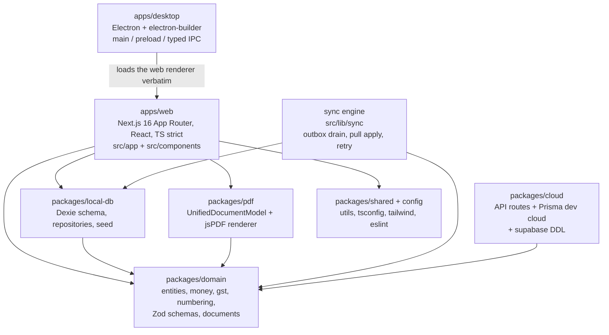

# InvoiceFlow — 04 · Technology Stack & Rationale

> Derived from `docs/_CANON.md` (source of truth). Every choice below is justified against the
> product's non-negotiable constraint: **every business operation works locally first** (CANON §1).

---

## 1. Purpose

This document fixes the technology stack of InvoiceFlow and justifies each choice against the
offline-first, GST-exact, multi-environment requirements. It also records the monorepo layout, the
sandbox mapping (CANON §2), the version-pinning policy, and the package dependency graph that
contributors must preserve.

## 2. Scope

**In scope:** frontend framework and language; styling and UI system; forms, validation, and client
state; the local database layer and why SQLite is excluded from the MVP client; cloud platform and
the dev-cloud adapter; PDF generation; PWA; desktop shell; testing; CI/CD and hosting; monorepo
tooling; version policy; stack-level data, API, offline/online, security, and error-handling
posture.

**Out of scope:** feature behavior (docs/03), requirement IDs (docs/02), protocol payloads
(docs/30-API-DESIGN.md, docs/19-CLOUD-SYNC.md), test case design (docs/35, docs/36).

## 3. Stack summary

| Concern | Choice | One-line rationale |
|---|---|---|
| Framework | **Next.js 16 (App Router) + TypeScript strict** | One codebase for web + Electron renderer; API routes host the cloud; strict TS enforces paise/bps/milli integer types |
| Styling | **Tailwind CSS 4** | Token-driven emerald/slate design system per CANON §15 without runtime CSS |
| UI kit | **shadcn/ui (New York) + lucide-react** | Accessible primitives we own in-tree; lucide is the only icon set |
| Forms | **React Hook Form + Zod** (zodResolver) | Entity forms re-render cheaply; Zod schemas are shared client↔server |
| Document editor | **Controlled React state** (per CANON §15) | Dynamic line items need whole-document undo/validate semantics RHF is wrong for |
| Client state | **Zustand** | Tiny store for sync pill, offline badge, theme, active workspace — no provider pyramids |
| Local DB | **Dexie.js over IndexedDB** — **no SQLite in the MVP client** | Local-first, real transactions, live queries, versioned migrations, zero native deps |
| Cloud | **Supabase (PostgreSQL + Auth + Storage + RLS)**, migrations in `supabase/` | Managed Postgres with row-level security matching the role model |
| Dev cloud | **Next.js API routes + Prisma/SQLite** (CANON §8) | Same sync protocol, runnable in this environment; production swap is configuration |
| PDF | **jsPDF + jspdf-autotable** | Deterministic, fully client-side, offline-capable vector PDFs |
| PWA | **Hand-rolled service worker `public/sw.js` + `manifest.webmanifest`** | Precise cache policy (cache-first assets, network-first navigation) without a framework |
| Desktop | **Electron + electron-builder** | Win/macOS/Linux from one renderer; hardened main/preload split |
| Testing | **Vitest + React Testing Library + Playwright** | Unit/component/E2E split incl. offline fake-indexeddb runs (docs-defined, CANON §19.5) |
| CI/CD | **GitHub Actions** | Lint, typecheck, audit, build, test gates |
| Hosting | **Vercel** | Native Next.js App Router hosting incl. API routes |
| Monorepo | **pnpm workspaces + Turborepo** | Typed package boundaries folded 1:1 into this sandbox (CANON §2) |

## 4. Frontend framework — Next.js 16 App Router + TypeScript strict

**Why Next.js 16 App Router.** InvoiceFlow needs three runtimes from one codebase: a browser SPA,
an installable PWA, and an Electron renderer. Next.js gives all three from a single tree, and its
route handlers host the cloud API (`/api/sync/push`, `/api/sync/pull`, `/api/auth/*`,
`/api/workspace/claim`) so the dev cloud ships in the same deployable. The routing constraint of
the sandbox (only `/` is previewable, CANON §2) is honored by shipping the UI as an SPA at `/` with
hash navigation (`#/invoices/:id`, …) via `src/lib/router.ts`; production route equivalence is
mapped in docs/32-ROUTES.md. API routes are real HTTP endpoints — server actions are not used, so
the sync client and server share one HTTP contract (CANON §9) that survives the Supabase swap.

**Why TypeScript strict.** The money domain is integers: `*_paise`, `qty_milli`, `*_bps`. Strict
mode plus domain types makes float money math and missing metadata fields (`version`,
`sync_state`, `origin_device_id`) compile-time errors, protecting CANON §3/§4 invariants across
every module. Shared types in `src/lib/domain/schemas.ts` are consumed by both client and server —
one Zod schema validates a payload twice (locally before persistence, remotely on push).

## 5. Styling & UI system — Tailwind CSS 4, shadcn/ui (New York), lucide-react

**Tailwind CSS 4** encodes the CANON §15 design system as tokens: primary emerald (`emerald-600`
light / `emerald-500` dark), slate neutrals, semantic states (paid=emerald, unpaid=amber,
overdue=red, draft=slate; synced=emerald dot, pending-sync=amber dot) — and makes the "no
blue/indigo" rule trivially greppable. Zero runtime CSS keeps the PWA bundle lean for offline
cache-first serving.

**shadcn/ui (New York style)** provides accessible, WAI-ARIA-correct primitives (Dialog,
AlertDialog for destructive confirms, Sheet for mobile nav, Command for ⌘K search, Table, Tabs,
Sonner toasts) that live **in-tree** (`src/components/ui/`) — we own and can audit every line,
which matters for the WCAG 2.1 AA commitment (docs/02 §5.4) and for consistent focus rings.
**lucide-react** is the sole icon set, keeping the icon layer consistent and tree-shaken.
Supporting cast: **recharts** for the dashboard revenue trend and report visuals, **sonner** for
toasts, **next-themes** for light/dark/system, **Geist** fonts.

## 6. Forms & validation — React Hook Form + Zod (with the documented editor exception)

**React Hook Form + zodResolver** powers entity forms (customer, product, company, auth): they are
schema-shaped, benefit from uncontrolled inputs (few re-renders), and validate against the exact
Zod schemas the server uses — a GSTIN failing `^[0-9]{2}[A-Z]{5}[0-9]{4}[A-Z]{1}[1-9A-Z]{1}Z[0-9A-Z]{1}$`
cannot reach Dexie or the API.

**The document editor uses controlled state** (CANON §15): line items are added, removed,
reordered, and re-priced continuously; the live totals panel must recompute through
`computeDocumentTotals` on every change; draft state must serialize the whole document atomically.
Whole-document controlled state models this naturally, whereas a form library per line would fight
the dynamic shape. This split is a documented, deliberate choice — not an inconsistency.

**Zod** is the single validation language: entity schemas, sync op payloads (`payload_json`),
API envelopes, and the `{ error: string, code?: string }` error shape are all Zod-first, shared via
`src/lib/domain/schemas.ts` (CANON §9 rule 2: server rejects with Zod before anything else).

## 7. Client state — Zustand

Global client state is deliberately small: connectivity flag (`navigator.onLine` + `/api/health`
heartbeat), sync pill state (`Synced / Pending N / Offline / Syncing / Error`), theme, active
workspace id (`app_settings.active_workspace_id`), and transient editor UI. Zustand fits because
this state is cross-cutting but tiny; business data deliberately does **not** live in the store —
it lives in Dexie and is read through live queries, so the store can never drift from the store of
record. This is the architectural guard against the classic local-first failure of duplicated
client caches.

## 8. Local database — Dexie.js over IndexedDB (and why NO SQLite in the MVP)

**Why IndexedDB is the store of record.** It is the only durable, transactional storage available
to a browser-origin app with no install step; it survives restarts; and it is where the PWA already
runs. The desktop renderer is the same web app (CANON §19.6), so one storage layer serves both.

**Why Dexie.js specifically.**

1. **Real transactions.** Document writes must be atomic: an invoice plus its embedded
   `invoice_items`, the audit row, and the outbox op commit together or not at all (CANON §7, §9).
   Dexie's `transaction()` gives us exactly this across multiple tables.
2. **Live queries** (`dexie-react-hooks`): lists, KPI cards, and the totals panel subscribe to
   tables and re-render on commit — this is what makes "local UI update" instant in the golden
   rule, with no manual cache invalidation.
3. **Versioned migrations.** `db.version(n+1).stores({...})` with upgrade callbacks implements the
   append-only migration policy (CANON §7: never mutate v1 in place) — the schema in docs/16 is
   executable code, not documentation.
4. **Compound indexes** map 1:1 to the query plan: `[workspace_id+status]`, `[workspace_id+deleted_at]`,
   `[status+created_at]` on the outbox, `[workspace_id+doc_type+fiscal_year]` on sequences.
5. **No native dependencies.** SQLite (via better-sqlite3/wasm) would add a native or WASM layer,
   break the pure-browser story, and buy nothing: the dataset is per-workspace business data, well
   inside IndexedDB's comfort zone. **Decision: NO SQLite in the MVP client.** The only SQLite in
   the system is the dev-cloud server database (§10), which is server-side and swappable.

**Persistence hygiene.** `device_id` is a random UUID persisted on first launch; `sync_metadata`
holds `pull_cursor`/`last_sync_at` per workspace; done outbox ops are pruned after 7 days to keep
the database bounded.

## 9. Cloud platform — Supabase (PostgreSQL + Auth + Storage + RLS)

**PostgreSQL** is the production system of record for synced data. Migrations live in `supabase/`
(`0001_init.sql` tables, `0002_rls.sql` policies, `0003_functions.sql`, `seed.sql`): UUID PKs, FKs
to `workspaces(id)`, `updated_at` triggers, soft deletes — mirroring the Dexie model field-for-field
so push payloads validate unchanged (CANON §8).

**RLS** enforces the role model (`OWNER > ADMIN > MEMBER > VIEWER`) with
`is_workspace_member(workspace_id)` / `has_role(workspace_id, role[])` helpers on **every** table —
VIEWER read-only, MEMBER cannot delete, ADMIN cannot delete workspace. Server-side enforcement
only; the client never decides authorization.

**Supabase Auth** replaces the dev adapter (email/password + Google OAuth) behind the same
interface documented in docs/07; **Supabase Storage** hosts `company-assets` (logos, signatures)
and `attachments` buckets with path convention `{workspace_id}/{entity}/{filename}`. The app never
embeds service keys — they are server-side only (CANON §16).

## 10. Dev-cloud adapter — Next.js API routes + Prisma/SQLite

Per CANON §8, this environment runs the identical relational model on **Prisma/SQLite**
(`prisma/schema.prisma`: User, Session, Workspace, WorkspaceMember, CompanyProfile, Customer,
Product, Quotation(+Item), Invoice(+Item), Payment, TaxRate, DocumentSequence, ChangeLog,
ProcessedOp) exposed through Next.js API routes (`src/lib/server/` + `src/app/api/*`). The sync
endpoints are provider-agnostic: push validates (Zod) → checks idempotency (`ProcessedOp`) → CAS on
`base_version` → recomputes totals → allocates numbers → appends ChangeLog → bumps version. Pull
serves the ChangeLog feed past a cursor. Swapping to Supabase changes persistence and auth, not the
protocol (CANON §19.4). Prisma's fully parameterized queries are the dev-cloud stand-in for RLS.

## 11. PDF — jsPDF + jspdf-autotable

Rationale per CANON §13: PDFs must be **generated client-side and offline** — a server-rendered PDF
would violate the golden rule and die with connectivity. jsPDF is pure JS (no headless browser, no
native deps), producing deterministic vector output that is byte-stable for identical documents —
important for audit trust. **jspdf-autotable** handles the items table (repeat headers across
pages, column widths for `# / Item & description / HSN-SAC / Qty / Rate / Discount / Taxable /
GST% / GST amt / Amount`). The shared **UnifiedDocumentModel** (`src/lib/pdf/document-model.ts`)
builds from either document kind via the domain layer, so preview and export cannot diverge.
Known, documented limitation: core fonts lack the `₹` glyph → PDFs print `Rs.`; UI shows `₹` via
Intl. Electron adds native `printToPDF` through typed IPC (§13).

## 12. PWA service worker

`public/sw.js` implements the exact policy of CANON §17: **cache-first** for static assets,
**network-first** for `/` navigation with an offline fallback, cache bucket `invoiceflow-v1`,
activate-time cleanup of old caches; `manifest.webmanifest` makes the app installable. Registration
happens **only in production builds** so dev HMR is never clobbered. A hand-rolled worker (no
workbox) is chosen because the policy is three rules — a dependency would exceed the policy it
implements.

## 13. Desktop — Electron + electron-builder

Electron is the only practical way to ship Win/macOS/Linux from the existing web renderer with
local file access and native printing. The security posture is non-negotiable (CANON §16):
`contextIsolation: true`, `nodeIntegration: false`, `sandbox: true`; a **preload bridge** exposing
a typed, allow-listed `contextBridge` API (window lifecycle, `printToPDF`, shell-open with https
allow-list) and nothing else; CSP
`default-src 'self'; img-src 'self' data: blob:; style-src 'self' 'unsafe-inline'`; no remote
content. **electron-builder** produces installers/updates per platform (Phase 8). The scaffold
cannot execute in this sandbox; main/preload/IPC code and builder config are provided and reviewed
statically (CANON §19.6).

## 14. Testing — Vitest / React Testing Library / Playwright

The stack is fixed in docs but **not bundled in the sandbox** per environment rules (CANON §19.5,
§2): **Vitest** for domain property tests (paise math, GST splits, numbering, `fiscalYearOf`) and
sync-engine state machines (fake-indexeddb); **React Testing Library** for component behavior
(editor totals, forms, conflict UI); **Playwright** for E2E including offline scenarios (service
worker, outbox drain) in docs/36-OFFLINE-TESTING.md. Choosing them now fixes CI wiring (§15) so the
monorepo scaffold inherits working gates instead of a test vacuum.

## 15. CI/CD — GitHub Actions; hosting — Vercel

**GitHub Actions** runs on every PR: typecheck, ESLint, Zod-schema drift checks, dependency audit
(CANON §16), Vitest/RTL/Playwright suites (once scaffolded), desktop build smoke via
electron-builder config. **Vercel** hosts the Next.js app including API routes — the natural home
for App Router deployments; the dev cloud and production web share the deploy shape, while Supabase
carries production data (swap documented in docs/19-CLOUD-SYNC.md).

## 16. Monorepo — pnpm workspaces + Turborepo, and the sandbox mapping

Production targets typed package boundaries so domain code is literally un-importable from the UI
layer bypassing repositories. **pnpm workspaces** provide strict, fast linking; **Turborepo**
provides cached task graphs (`lint`/`typecheck`/`test`/`build`) across packages. In this sandbox
the web app **is** the deliverable and the packages fold into it 1:1 (CANON §2):

| Monorepo package | Sandbox location |
|---|---|
| `packages/domain` | `src/lib/domain/` (entities, money, gst, numbering, schemas, documents) |
| `packages/local-db` | `src/lib/db/` (Dexie schema, repositories, seed) |
| `packages/cloud` | `src/lib/server/` + `src/app/api/*` + `prisma/schema.prisma` (dev cloud) + `supabase/` (production DDL) |
| `packages/pdf` | `src/lib/pdf/` (shared document model + jsPDF renderer) |
| `apps/web` | `src/app/` + `src/components/` |
| `apps/desktop` | `electron/` (scaffold: main, preload, typed IPC, services, builder config) |
| `packages/shared`, `config` | `src/lib/utils.ts`, root configs |

The fold is 1:1 by design: when the monorepo is scaffolded, each directory lifts into its package
with imports rewritten — no logic moves.

## 17. Version pinning policy

1. **Exact versions, no ranges.** Runtime dependencies are pinned to exact versions in
   `package.json` (`^`/`~` are not used for runtime deps); the committed lockfile is the source of
   truth for reproducible installs across web, desktop, and CI.
2. **Deliberate upgrades.** Version bumps happen as dedicated PRs that must pass the full CI gate;
   framework majors (Next.js, Electron, Tailwind) are adopted within a maintenance window after
   release, never mid-phase.
3. **One version per package.** In the monorepo, shared dependencies (React, Zod, Dexie, TypeScript)
   resolve to a single version via the workspace root so the renderer and packages cannot diverge.
4. **Security drift is not pinned.** `npm audit`/equivalent runs in CI; critical advisories are
   patched out-of-band regardless of the cadence rule (CANON §16 dependency audit).
5. **Runtime-reported versions.** The About screen and `/api/health` report the app version so
   support can pin bug reports to exact builds; the schema version (currently `1`) rides every push
   (CANON §9) and mismatches stop sync with an upgrade notice.

## 18. Package dependency diagram

Layering rules the diagram encodes: **domain depends on nothing** (pure functions); **local-db,
pdf, sync, cloud depend on domain** (shared Zod schemas + `computeDocumentTotals`); **web depends
on local-db/pdf/sync** (never on domain bypassing them); **desktop depends on web** (verbatim
renderer); nothing depends upward.

## 19. Data models & storage responsibilities

| Store | Technology | Holds | Authoritative for |
|---|---|---|---|
| Local business DB | Dexie.js / IndexedDB (schema v1 per CANON §7) | All entity tables, `sync_operations`, `sync_metadata`, `audit_logs`, `app_settings` | Current local truth; survives offline indefinitely |
| Dev cloud | Prisma / SQLite behind API routes | Mirrored entities + `ChangeLog` + `ProcessedOp` + `Session` | Server truth in this environment |
| Production cloud | Supabase PostgreSQL + RLS | Same model via `supabase/migrations/` | Server truth in production |
| Assets (prod) | Supabase Storage | `company-assets`, `attachments` (`{workspace_id}/{entity}/{filename}`) | Binary blobs |
| Ephemeral | Zustand + localStorage | Connectivity/sync UI state, `device_id`, `session_cache` | Nothing financial |

## 20. Offline behavior (stack-level)

Dexie transactions + live queries deliver stages 3–4 of the golden rule; the outbox tables deliver
stage 5; the service worker keeps the shell loadable; jsPDF works offline; Zustand flags keep UI
truthful (`navigator.onLine` + `/api/health` heartbeat). The stack contains **no component that
requires a server to render or mutate business data** — the only network-dependent features are
auth and sync by definition.

## 21. Online behavior (stack-level)

The sync engine speaks the CANON §9 contract over HTTPS with cookie (dev) or JWT (prod) auth;
Vercel-hosted route handlers (or Supabase functions in the production swap) enforce Zod
validation, idempotency (`ProcessedOp`), CAS, recomputation, numbering, and the ChangeLog feed.
The protocol — not the provider — is the stability guarantee, which is why the provider is a
configuration choice.

## 22. Security (stack-level)

Defense in depth from the choices above: strict TS + Zod at both ends; server recomputation of all
money; RLS (prod) / membership-checked route handlers (dev); Prisma parameterized queries;
httpOnly `if_session` SameSite=Lax cookies; scrypt hashing (dev) / Supabase Auth (prod); in-tree
auditable UI components; no `dangerouslySetInnerHTML`; upload limits (PNG/JPEG ≤ 1 MB); rate
limiting on auth (10 req/min/IP); hardened Electron defaults; service keys server-side only;
dependency audit in CI. Details and threat model: docs/29-SECURITY.md.

## 23. Error handling (stack-level)

Errors are typed at each layer and translated once at the UI boundary: Zod issues become inline
field errors; domain rule violations become explanatory toasts/blocks; HTTP failures normalize to
`{ error, code? }` (400/401/403/404/409/429/500) and drive the sync pill, retry scheduling, or
conflict UI; Dexie transaction failures roll back atomically leaving cursors and outbox states
consistent. No layer swallows an error silently — failed ops remain visible with `last_error`
(docs/02 §8).

## 24. Acceptance criteria (stack-level)

1. The app builds and runs as: browser SPA at `/` (hash navigation), installable PWA with the
   documented service-worker policy, and Electron renderer behind the hardened shell.
2. Zero SQLite in the client bundle; the only SQLite is the dev-cloud server database.
3. Domain code has no imports from UI/db/cloud layers (enforced by the §18 layering rules).
4. Lockfile-pinned exact versions reproduce identical installs in CI and locally (§17).
5. Every stack choice above traces to a CANON section and a product constraint in docs/01 — no
   dependency exists without a stated reason.
