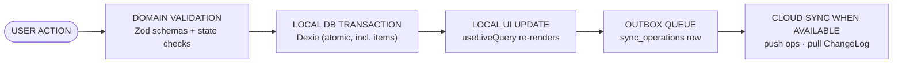
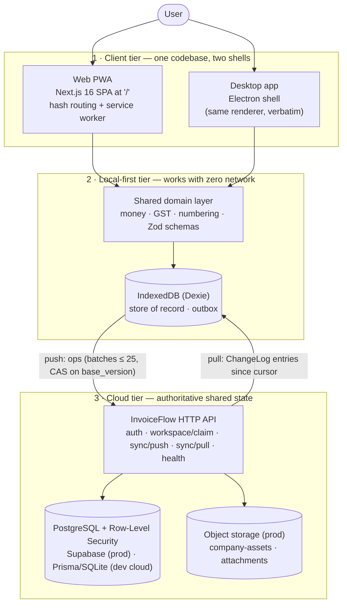
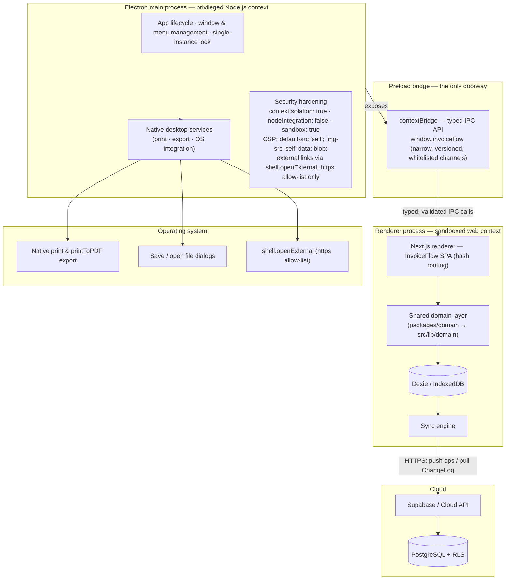
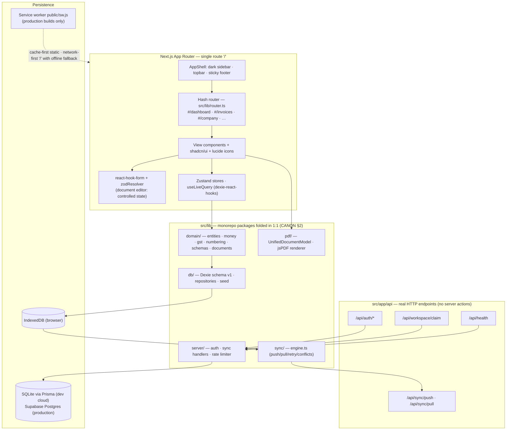
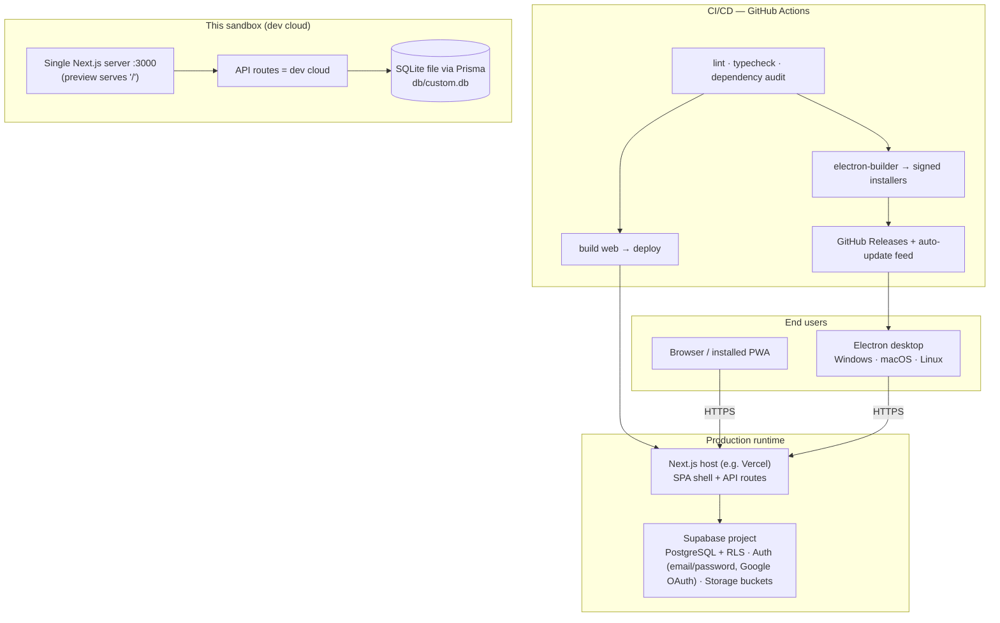

# InvoiceFlow — System Architecture

> Derived from `docs/_CANON.md` (single source of truth). If any statement here appears to deviate from CANON, CANON wins and this doc must be corrected.

## 1. Purpose

This is the flagship architecture document for **InvoiceFlow**, an offline-first Invoice & Quotation management SaaS for Indian businesses (GST-aware). It defines:

- the overall system shape (client, local-first tier, cloud tier),
- the Electron process architecture (secure main process → preload bridge → renderer → domain → local DB → sync → cloud),
- the web application architecture as implemented in this repository,
- the deployment architecture for production and for this sandbox,
- the layered design rules, the source-of-truth model, the offline-first pipeline,
- the monorepo → sandbox mapping, and the key Architecture Decision Records (ADRs).

## 2. Scope

Covers architecture-level design only: responsibilities, boundaries, data flow direction, and the rationale behind irreversible decisions. Detailed contracts live in their own documents:

| Topic | Document |
|---|---|
| Data model (local + cloud) | `docs/06-DATABASE-DESIGN.md` |
| Authentication & account model | `docs/07-AUTHENTICATION.md` |
| Company management | `docs/08-COMPANY-MANAGEMENT.md` |
| Offline engine deep-dive | `docs/15-OFFLINE-FIRST.md`, `docs/16-INDEXEDDB-DATABASE.md` |
| Sync engine, conflicts, cloud | `docs/17-SYNC-ENGINE.md`, `docs/18-CONFLICT-RESOLUTION.md`, `docs/19-CLOUD-SYNC.md` |
| PDF system | `docs/14-PDF-GENERATION.md` |
| API design & security | `docs/30-API-DESIGN.md`, `docs/29-SECURITY.md` |
| Routes & testing | `docs/32-ROUTES.md`, `docs/35-TESTING.md`, `docs/36-OFFLINE-TESTING.md` |

## 3. Business requirements

The architecture exists to satisfy these product-level requirements:

1. **Offline-first operation** — every business operation (create/edit customers, products, quotations, invoices, record payments, generate PDFs) works with zero network connectivity. Cloud sync is an enhancement, never a prerequisite.
2. **Guest-first access** — the app is fully usable without an account; a local workspace is created on first launch. Accounts exist only to enable cloud sync and multi-device access (`docs/07`).
3. **GST-aware invoicing for India** — intra-state (CGST+SGST/UTGST) and inter-state (IGST) computation, GSTIN validation, HSN/SAC codes, place of supply, with rates kept configurable. The app computes GST per rules as commonly understood and is **not certified GST-compliant** (CANON §19.2).
4. **Exact money math** — integer paise arithmetic everywhere; totals recomputed server-side; no floating-point drift (ADR-002).
5. **Deterministic document numbering** — `{prefix}/{FY}/{seq4}` with server authority on conflict; sequences never decrement (CANON §6).
6. **Multi-surface delivery** — browser/PWA today, Electron desktop (Windows/macOS/Linux) from the same codebase, native print/export on desktop.
7. **Data durability & portability** — soft deletion preserves history; JSON backup export/import; user is warned about browser storage eviction and advised to install as PWA or use the desktop app (CANON §19.8).
8. **Security baseline** — validated inputs on both ends, server-side authorization, no secrets in the client bundle, hardened Electron shell (CANON §16).

## 4. Technical design

### 4.1 Architectural style and the source-of-truth model (master principle)

InvoiceFlow is a **local-first, offline-first SPA with op-based cloud synchronization**. The master principle that governs every design choice:

> **The local database (IndexedDB via Dexie) is the source of truth for responsive operations; the server is the authoritative shared state.**

Concretely:

| Concern | Local (IndexedDB/Dexie) | Server (PostgreSQL/Supabase) |
|---|---|---|
| Reads (lists, dashboards, PDFs) | **Sole source** — always served locally, never blocked by network | Not consulted for reads |
| Writes (create/edit/finalize/cancel/pay) | **Applied first**, unconditionally, in a Dexie transaction | Reconciled asynchronously; server revalidates |
| Totals & arithmetic | Computed by the shared domain engine for immediate UI | **Recomputed and overwritten** on every applied op (CANON §9 rule 4) |
| Document numbers | Provisional (`DRAFT-xxxxxxxx`) for drafts; locally allocated when finalizing offline | Authoritative allocation at finalize; fast-forwards or reassigns on push (CANON §6) |
| Concurrency | `version` + `sync_state` per record | CAS on `base_version`; every apply appended to the `ChangeLog` |
| Identity of records | UUIDv4 generated on-device | Accepted as-is (client-generated UUIDs, CANON §3) |

The two truths are reconciled exclusively by the **sync engine** (a separate bounded context — §4.3). The user never waits for the server, and the server never trusts the client's arithmetic or authorization claims. This is the enforcement of CANON §1 (golden rule) and CANON §9 (server rules).

### 4.2 The offline-first pipeline (CANON §1)

Every user action follows one pipeline, without exception:

Implications:

- If step F never happens, the app remains fully functional: data, numbering, and PDFs are all local.
- Step E is automatic and invisible: repositories enqueue one op per mutation; the sync pill reflects `sync_state`.
- Step F is triggered by: `online` event, app focus, post-mutation, a 30 s interval, or manual "Sync now" (CANON §9).

### 4.3 Layered design (dependency rule)

Dependencies point strictly downward. The sync engine sits **beside** the layers as a separate bounded context: it reads/writes the local DB and uses shared schemas, but no UI component depends on it and it never calls views directly — it communicates through the database (`sync_state`, `sync_operations`, `sync_metadata`) and store flags (`needs_reauth`).

| Layer | Sandbox location | Responsibility | May depend on |
|---|---|---|---|
| UI (views, components, stores) | `src/app/`, `src/components/`, Zustand stores | Rendering, forms, navigation (hash router), toasts | domain, repositories (via hooks) |
| Domain | `src/lib/domain/` — entities, money, gst, numbering, schemas, documents | Pure business logic: `computeDocumentTotals`, GST split, `fiscalYearOf`, Zod schemas, state machines | nothing (pure functions) |
| Repositories | `src/lib/db/` — Dexie schema, repositories, seed | Transactions, queries, op enqueueing, seed data | domain, Dexie |
| Local DB | IndexedDB (browser API) | Store of record, 17 object stores | — |
| **Sync engine (bounded context)** | `src/lib/sync/engine.ts` | Push (batches of 25), pull (cursor), retry/backoff, conflict parking, auth-expiry handling | domain (schemas), repositories, HTTP |
| PDF | `src/lib/pdf/` — UnifiedDocumentModel + jsPDF renderer | Deterministic offline PDF from the domain model | domain |
| Server (dev cloud) | `src/lib/server/` + `src/app/api/*` + `prisma/schema.prisma` | Auth, claim, sync push/pull, ChangeLog, rate limiting, revalidation | domain (shared Zod schemas) |

### 4.4 High-level system architecture

### 4.5 Electron process architecture

The desktop shell mirrors the reference architecture: a hardened **main process** owns everything privileged; the **preload bridge** exposes a minimal typed API via `contextBridge`; the **renderer** is the web app verbatim, running the same domain layer over Dexie/IndexedDB and the same sync engine against the same cloud API; native desktop services hang off the main process for print, export, and OS integration.

Rules enforced in the shell (CANON §16, §19.6):

- The renderer never touches Node APIs; every privileged capability is an explicit, typed IPC channel validated in the main process.
- No remote content is loaded; the renderer bundle is local (or the exact web build).
- PDF generation is jsPDF in-renderer for parity; the main process additionally offers native `printToPDF` and OS print dialogs via IPC (`docs/14-PDF-GENERATION.md`).
- Electron is a **scaffold** in this sandbox (cannot be executed here): hardened main/preload/IPC code and electron-builder config are provided; the renderer reuses the web app verbatim.

### 4.6 Web application architecture

Key points:

- **One route, many views.** The sandbox preview can only serve `/`, so the app is an SPA with hash navigation (`#/invoices`, `#/invoices/inv_123`, …). `docs/32-ROUTES.md` maps every production App-Router route to its hash equivalent (ADR-007).
- **API routes are real HTTP endpoints** (no server actions) so the identical contract works against the dev cloud today and Supabase-backed routes in production.
- **Reactivity without a cache layer:** `useLiveQuery` re-renders views on every local mutation — this is what makes "local UI update" step of the pipeline instant.

### 4.7 Deployment architecture

| Environment | Web | Cloud | Auth | Notes |
|---|---|---|---|---|
| Production | Next.js host (Vercel or equivalent), PWA service worker enabled | Supabase Postgres + RLS + Storage (`company-assets`, `attachments`) | Supabase Auth (email/password + Google OAuth, JWT) | Migrations in `supabase/migrations/` (0001_init, 0002_rls, 0003_functions, seed) |
| Desktop | Electron shell bundling the same renderer | Same cloud | Same auth (JWT in renderer; typed IPC for native services) | electron-builder packages; no remote content |
| Sandbox (this repo) | Next.js server on :3000, SPA at `/`, service worker disabled in dev | Next.js API routes + Prisma/SQLite (`db/custom.db`) | Dev auth: scrypt + httpOnly session cookie | Identical sync HTTP contract (ADR-005); no test files bundled (CANON §19.5) |

### 4.8 Monorepo layout & sandbox mapping (CANON §2)

The production target is a pnpm/Turborepo monorepo. In this sandbox the web app **is** the deliverable and the packages are folded into it 1:1:

| Monorepo package | Sandbox location |
|---|---|
| `packages/domain` | `src/lib/domain/` (entities, money, gst, numbering, schemas, documents) |
| `packages/local-db` | `src/lib/db/` (Dexie schema, repositories, seed) |
| `packages/cloud` | `src/lib/server/` + `src/app/api/*` + `prisma/schema.prisma` (dev cloud) + `supabase/` (production DDL) |
| `packages/pdf` | `src/lib/pdf/` (shared document model + jsPDF renderer) |
| `apps/web` | `src/app/` + `src/components/` |
| `apps/desktop` | `electron/` (scaffold: main, preload, typed IPC, services, builder config) |
| `packages/shared`, `config` | `src/lib/utils.ts`, root configs |

Constraints honored by this architecture (CANON §2):

- **Routing constraint:** the preview serves only `/` → hash-based SPA navigation; API routes remain real HTTP endpoints.
- **Testing note:** no test files are bundled in the sandbox; `docs/35-TESTING.md` and `docs/36-OFFLINE-TESTING.md` define the Vitest/RTL/Playwright strategies for the monorepo.

### 4.9 Key Architecture Decision Records

#### ADR-001 — Local-first IndexedDB over SQLite

- **Status:** Accepted · **References:** CANON §1, §7; `docs/16-INDEXEDDB-DATABASE.md`
- **Context.** InvoiceFlow must run identically in a zero-install browser and inside Electron. SQLite would require native modules (or a WASM build) per platform, complicating web delivery, PWA operation, and CI; the product explicitly must not require SQLite in its initial version.
- **Decision.** IndexedDB is the **only** store of record, accessed exclusively through Dexie repositories (ADR-003). No SQLite exists in the client stack; SQLite appears only server-side in the dev cloud (ADR-005).
- **Consequences.**
  - ➕ Zero-install web/desktop parity; the Electron renderer reuses the web app verbatim; no native builds.
  - ➕ Structured clone storage fits the document + items aggregate model.
  - ➖ Browser storage eviction risk (no persistence API request in MVP) — mitigated by PWA install advice, the desktop app, and JSON backup export (CANON §19.8).
  - ➖ No SQL joins — compound indexes are designed upfront in the Dexie v1 schema (§7 of `docs/06-DATABASE-DESIGN.md`).

#### ADR-002 — Integer paise math (no floats)

- **Status:** Accepted · **References:** CANON §4; `docs/13-GST-MODULE.md`
- **Context.** Financial documents demand exact arithmetic; IEEE-754 floats drift on GST splits and totals; Indian GST expects paise-accurate figures; client and server must agree to the paisa.
- **Decision.** All monetary amounts are **integer minor units (paise)**; quantities are **integer milli-units** (`qty_milli`: 2500 = 2.5); discounts and tax rates are **basis points** (18% = 1800). Rounding is **half-up on the paise** (`roundHalfUp(x) = Math.floor(x + 0.5)` for positive values). One shared engine — `computeDocumentTotals` in `src/lib/domain/documents.ts` — computes totals for UI, PDF, and server, and the **server recomputes and overwrites** client numbers on every applied op.
- **Consequences.**
  - ➕ Deterministic, testable, drift-free arithmetic; identical results on client, PDF, and server.
  - ➕ Server as arithmetic authority blocks tampered payloads (defense in depth for money).
  - ➖ Every UI boundary converts formats (₹ display via `Intl`; user input parsed to paise/milli/bps).
  - ➖ PDFs render `Rs.` instead of `₹` (jsPDF core-font limitation, documented in CANON §13).

#### ADR-003 — Dexie.js over raw IndexedDB

- **Status:** Accepted · **References:** CANON §7; `docs/16-INDEXEDDB-DATABASE.md`
- **Context.** Raw IndexedDB is verbose, callback-heavy, and offers no reactivity; the offline-first pipeline requires instant UI updates after every local transaction.
- **Decision.** Use **Dexie** with `dexie-react-hooks` (`useLiveQuery`). Schema is versioned via `db.version(n).stores({...})` + upgrade callbacks; the v1 index set is fixed by CANON §7 and never mutated in place.
- **Consequences.**
  - ➕ Declarative schema, typed table handles, atomic `transaction()` blocks, and automatic reactive re-rendering (replacing any manual cache invalidation).
  - ➕ Clean upgrade path for future schema versions (append-only).
  - ➖ Locked to Dexie's index model — query patterns must match declared indexes (no ad-hoc SQL).
  - ➖ Upgrade bugs are costly; upgrades are exercised against seeded v1 databases per `docs/36-OFFLINE-TESTING.md`.

#### ADR-004 — Op-based sync with server change-log cursors

- **Status:** Accepted · **References:** CANON §6, §8, §9, §10; `docs/17-SYNC-ENGINE.md`
- **Context.** Devices go offline for hours or days. Snapshot sync wastes bandwidth and loses intent; CRDTs are overkill for single-owner financial documents and cannot express "allocate a number" or "finalized documents are immutable". A server authority is required for numbering, immutability, and conflict detection.
- **Decision.** The client queues **operations** (per entity: `upsert | finalize | cancel | delete`, payload = full record with items embedded) in the `sync_operations` outbox, each carrying `base_version` for CAS. The server applies ops **idempotently** (`ProcessedOp(op_id)`), recomputes totals, allocates/validates document numbers, appends every apply to the **`ChangeLog`** (`seq` autoincrement, full record incl. items), and clients **pull** changes since their per-workspace `pull_cursor`. Pending local ops for an entity suppress pulled updates for that entity (conflicts resolve at push time, CANON §9).
- **Consequences.**
  - ➕ Minimal bandwidth (deltas of intent), replayable audit feed, resumable ordered pull.
  - ➕ Deterministic conflict semantics (CANON §10 matrix) and deterministic numbering resolution (fast-forward or `number_reassigned`).
  - ➖ Whole-document payloads on item edits (acceptable at MVP volumes).
  - ➖ Requires the conflict UI and the ProcessedOp idempotency store — both are first-class components, not afterthoughts.

#### ADR-005 — Dev-cloud adapter (Prisma/SQLite behind the same HTTP contract)

- **Status:** Accepted · **References:** CANON §8, §9, §14; `docs/19-CLOUD-SYNC.md`
- **Context.** Supabase cannot be provisioned in this sandbox, yet the sync engine must be exercised end-to-end now; the contract must not change when production lands.
- **Decision.** The **dev cloud** implements the exact HTTP contract (CANON §9, §14) on Next.js API routes with Prisma/SQLite (`prisma/schema.prisma` mirrors the Postgres model: User, Session, Workspace, WorkspaceMember, CompanyProfile, Customer, Product, Quotation(+Item), Invoice(+Item), Payment, TaxRate, DocumentSequence, ChangeLog, ProcessedOp). The client engine is provider-agnostic (base URL + cookie/JWT auth only). Production swaps persistence to Supabase Postgres; the sync protocol is identical for both.
- **Consequences.**
  - ➕ Fully functional offline→sync loop in the sandbox; zero client changes for production.
  - ➕ RLS policies (0002_rls.sql) validated as defense-in-depth in production while the dev API enforces membership/role in code.
  - ➖ SQLite lacks JSONB/RLS — feature parity is asserted by the shared Zod schemas and migration files, not by the runtime.
  - ➖ `schema_version` handshake (HTTP 409 `{code:'schema_version'}`) guards against contract drift.

#### ADR-006 — jsPDF for offline PDF generation

- **Status:** Accepted · **References:** CANON §13; `docs/14-PDF-GENERATION.md`
- **Context.** PDFs must generate **offline** in both browser and Electron with deterministic output; server-side headless-Chrome rendering is impossible offline and heavy to ship.
- **Decision.** Client-side PDF via **jsPDF + jspdf-autotable**, fed exclusively by the **UnifiedDocumentModel** (`src/lib/pdf/document-model.ts`) built from the domain engine — one source for preview and export; totals come only from `computeDocumentTotals`. Electron additionally offers native `printToPDF` via typed IPC.
- **Consequences.**
  - ➕ Zero network, deterministic vector output, no binaries/headless browser, works in every target surface.
  - ➕ Identical totals on screen and paper (same domain engine).
  - ➖ `₹` glyph unavailable in core Helvetica → PDFs use `Rs.` (documented; UI shows `₹` via `Intl`).
  - ➖ Layouts are code-drawn (autotable) rather than CSS-driven — more effort for complex templates.

#### ADR-007 — SPA hash routing in the sandbox

- **Status:** Accepted · **References:** CANON §2, §15; `docs/32-ROUTES.md`
- **Context.** The sandbox preview can serve only the `/` route; the product is an SPA regardless (offline-first shell); production would otherwise use App Router paths.
- **Decision.** Ship as a single-page app at `/` with **hash navigation** (`#/invoices`, `#/invoices/inv_123`, …) driven by `src/lib/router.ts`; API routes are real HTTP endpoints (no server actions); `docs/32-ROUTES.md` maps every production route to its hash equivalent 1:1.
- **Consequences.**
  - ➕ Deployable anywhere a static shell + API can run; deep links preserved via the hash; no server-side navigation to break offline.
  - ➖ Per-route server rendering is unused (client rendering only) — acceptable for an authenticated tool with no SEO requirement.
  - ➖ Production migration is a routing-table swap with identical view components (documented, low risk).

## 5. Data models

The complete data model — 17 local object stores, the identical PostgreSQL mapping, sync metadata conventions, RLS policy summary, indexing, retention, and migration strategy — is specified in **`docs/06-DATABASE-DESIGN.md`**. Architectural ownership summary:

| Tier | Owned data |
|---|---|
| IndexedDB (store of record) | All business entities with sync metadata (`id, workspace_id, created_at, updated_at, deleted_at, version, sync_state, origin_device_id`), plus local-only `sync_operations` (outbox), `sync_metadata` (cursors), `app_settings`, `audit_logs` |
| Server (authoritative shared state) | Mirrored business tables, `document_sequences` (number authority), `ChangeLog` (pull feed), `ProcessedOp` (idempotency), users/sessions (dev) or Supabase `auth.users` (prod) |

## 6. API contracts

Full contracts: `docs/30-API-DESIGN.md` and `API.md`. Surface (CANON §14):

| Endpoint | Method | Purpose |
|---|---|---|
| `/api/health` | GET | liveness + `{ ok, time, version }` (connectivity heartbeat) |
| `/api/auth/register` | POST | create account (+claim guest workspace if any) |
| `/api/auth/login` | POST | session cookie |
| `/api/auth/logout` | POST | destroy session |
| `/api/auth/session` | GET | current user or `{ user: null }` |
| `/api/auth/account` | DELETE | delete account + server data |
| `/api/workspace/claim` | POST | attach local workspace to account (CANON §11) |
| `/api/sync/push` | POST | op-based push (CANON §9) |
| `/api/sync/pull` | GET | ChangeLog pull since cursor (CANON §9) |

All bodies are JSON; errors use the envelope `{ "error": string, "code"?: string }` with HTTP 400 (validation), 401 (unauthenticated), 403 (forbidden/not member), 404 (missing), 409 (conflict), 429 (rate-limited), 500.

## 7. Offline behavior

- **Everything except cloud sync works offline**: CRUD on all entities, document lifecycle transitions, numbering (local allocation for offline finalize, CANON §6), PDF generation (jsPDF), reports, dashboard, CSV export.
- The **outbox** (`sync_operations`) records intent; `sync_state` per record (`local → pending → synced | failed | conflict`) drives the sync pill (Synced / Pending N / Offline / Syncing / Error).
- **Web:** service worker `public/sw.js` (cache-first static assets, network-first `/` navigation with offline fallback, cache `invoiceflow-v1`, registered only in production builds) + `manifest.webmanifest`; connectivity = `navigator.onLine` + heartbeat to `/api/health`.
- **Desktop:** full offline parity; native print/export via IPC; outbox drains on reconnect.
- **Guest mode is first-class:** no account required; banner "Guest workspace — connect cloud to sync" (CANON §11).

## 8. Online behavior

- The sync engine (single-run mutex) pushes the oldest `pending` ops (batch 25, ordered by `created_at`), then pulls `ChangeLog` entries since `pull_cursor`, applying them in **one** Dexie transaction; records with pending local ops for the same `entity_id` are skipped (conflict resolved at push time).
- Per-op outcomes: `applied | duplicate | number_reassigned` → adopt server record (`version`, `sync_state='synced'`); `conflict` → park server record on the op, surface in Settings → Sync → Conflicts (Keep mine / Keep server's / Delete, CANON §10); `rejected` → op `failed` with visible error (never silently dropped).
- Retry/backoff: `next_attempt_at = now + min(10 min, 2^attempts × 2 s)`; after 8 attempts → `failed` with manual retry.
- Registering or claiming a workspace attaches the local dataset to the cloud: `cloud_linked_at` set, `pull_cursor = 0`, full local dataset pushed as normal ops (CANON §11).

## 9. Security considerations

Summary of the CANON §16 baseline (details: `docs/29-SECURITY.md`):

- Zod validation on **both** ends; server recomputes money and re-checks membership/role on **every** op; parameterized queries (Prisma) / RLS (Supabase).
- XSS-safe React rendering (no `dangerouslySetInnerHTML`); uploads (logo/signature) limited to PNG/JPEG ≤ 1 MB with client + dataURL size checks.
- CSRF stance: `SameSite=Lax` session cookies + JSON-only APIs with **no GET mutations** — no CSRF tokens required (rationale in `docs/07-AUTHENTICATION.md`).
- scrypt password hashing (dev) / Supabase Auth (prod); rate limiting on auth routes (10 req/min/IP).
- **Service-role keys only server-side, never bundled.**
- Electron: `contextIsolation: true`, `nodeIntegration: false`, `sandbox: true`, strict CSP, typed `contextBridge` API only, external links via `shell.openExternal` with an https allow-list, no remote content.
- Audit logs record `FINALIZE | CONVERT | CANCEL | PAYMENT | SYNC_CONFLICT | STATUS` transitions; dependency audit runs in CI.

## 10. Error-handling rules

| Failure | Detection | Architecture-level response |
|---|---|---|
| Network loss mid-operation | `navigator.onLine`, fetch rejection | Operation already committed locally (pipeline §4.2); op stays `pending`; UI switches to offline badge; no rollback |
| Server rejects an op (validation) | push result `rejected` | Op → `failed` with visible error; user edits the record to retry; **never silently dropped** |
| Concurrent modification | push result `conflict` (CAS) | Server record parked on the op; `sync_state='conflict'`; resolution via conflict UI (CANON §10) |
| Number collision | push result `number_reassigned` | Client adopts server number; document immutable once finalized (CANON §6) |
| Session expiry during sync | HTTP 401 | Sync pauses, `needs_reauth` flag, re-login prompt **without data loss** (CANON §9) |
| Schema drift | HTTP 409 `{code:'schema_version'}` | Sync stops; upgrade notice shown (documented) |
| Local storage quota/eviction | Dexie `QuotaExceededError` | User notified; JSON backup advised; desktop/PWA recommended (CANON §19.8) |
| Server error (5xx) | HTTP 500 | Op remains `pending`, retried with backoff; user sees "Sync error" pill state |

## 11. Acceptance criteria

- [ ] Every user action follows the pipeline: domain validation → local transaction → local UI update → outbox → sync (no code path writes to the server first).
- [ ] All features except cloud sync work with the network fully disabled in browser and desktop shells.
- [ ] The renderer (web and Electron) reads exclusively from IndexedDB; no UI fetches business data from the API.
- [ ] Server recomputes all totals on push and overwrites client numbers; client adopts server records on `applied`/`number_reassigned`.
- [ ] Sync engine never runs concurrently with itself; honors offline state, unauthenticated state, and non-cloud-linked workspaces.
- [ ] Monorepo → sandbox mapping matches CANON §2 exactly; every package boundary in docs corresponds to a real folder.
- [ ] All seven ADRs are reflected in the code layout (IndexedDB-only client persistence, integer math module, Dexie v1 schema, outbox + ChangeLog, dev-cloud adapter, jsPDF renderer, hash router).
- [ ] Production deployment artifacts exist as described: `supabase/migrations/0001_init.sql`, `0002_rls.sql`, `0003_functions.sql`, `seed.sql`; electron-builder config; PWA `sw.js` + `manifest.webmanifest`.
- [ ] No secret (service key, session token store) is bundled client-side; Electron hardening flags match §9.
