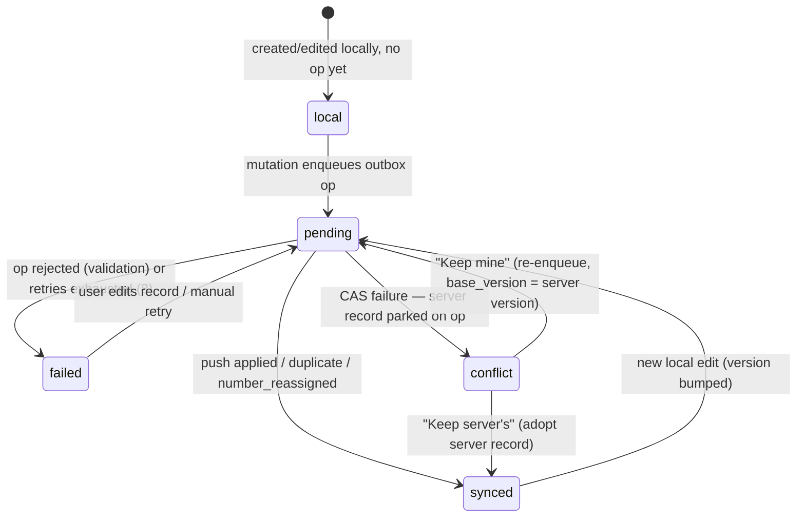
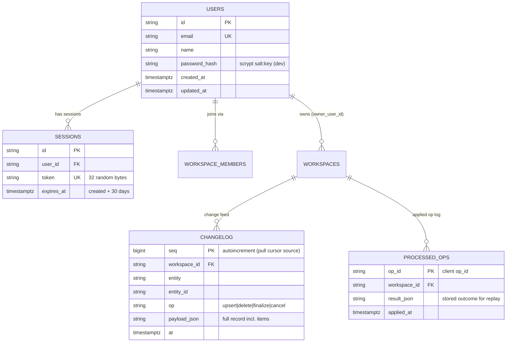

# InvoiceFlow — Database Design

> Derived from `docs/_CANON.md` (single source of truth; especially §3 identity/metadata, §7 entity model, §8 cloud schema, §9 sync contract). If any statement here appears to deviate from CANON, CANON wins and this doc must be corrected.

## 1. Purpose

Define the **complete InvoiceFlow data model**:

- every table/object store with its **full field list** (name, type, nullability, meaning),
- the identity and sync-metadata conventions every record carries,
- the entity-relationship diagram across all 17 stores,
- the identical PostgreSQL (Supabase) mapping with the RLS policy summary,
- the indexing strategy, the retention & soft-deletion policy,
- and the migration strategy for **both** IndexedDB (Dexie versions) and Postgres (`supabase/migrations/`).

## 2. Scope

Covers the two persisted tiers of InvoiceFlow:

1. **Local store of record** — IndexedDB via Dexie (`src/lib/db/`), 17 object stores, version `1` at launch.
2. **Cloud authoritative shared state** — Supabase PostgreSQL in production (`supabase/migrations/0001_init.sql`, `0002_rls.sql`, `0003_functions.sql`, `seed.sql`) and the provider-agnostic **dev cloud** (Prisma/SQLite behind Next.js API routes) in this sandbox.

Server-only infrastructure tables (users, sessions, `ChangeLog`, `ProcessedOp`) are documented here because the sync protocol depends on them. Query/UI usage, conflict semantics, and the sync engine behavior are specified in `docs/17-SYNC-ENGINE.md` and `docs/18-CONFLICT-RESOLUTION.md`.

## 3. Business requirements

1. **Offline durability** — all business data must live on-device and remain fully queryable without network (CANON §1).
2. **Multi-tenancy from day one** — every row is partitioned by `workspace_id`; roles (OWNER > ADMIN > MEMBER > VIEWER) gate writes server-side (CANON §8).
3. **Financial integrity** — integer paise/milli/bps columns only; document totals and item snapshots stored alongside inputs so historical documents never change retroactively; `version`-based optimistic concurrency (CANON §3, §4, §9).
4. **Auditable history** — soft deletion retains records; document numbers never decrement; state transitions are recorded in `audit_logs` locally and echoed in the server `ChangeLog` (CANON §3, §6, §8).
5. **Syncable by construction** — every synced entity carries the same metadata block so one generic engine can push/pull any entity type (CANON §3, §9).
6. **Evolvable schema** — append-only Dexie versions and forward-only SQL migrations; a `schema_version` handshake stops sync safely on drift (CANON §7, §9).

## 4. Data models

### 4.1 Storage tiers and where each table lives

| Table | IndexedDB (local, Dexie v1) | Dev cloud (Prisma/SQLite) | Supabase Postgres (prod) | Notes |
|---|:---:|:---:|:---:|---|
| `workspaces` | ✓ | ✓ | ✓ | `owner_user_id` set at claim (cloud-side) |
| `workspace_members` | ✓ | ✓ | ✓ | guest member = `device_id`; cloud member = `user_id` |
| `company_profiles` | ✓ | ✓ | ✓ | 1 per workspace in MVP; schema supports many |
| `customers` | ✓ | ✓ | ✓ | |
| `products` | ✓ | ✓ | ✓ | |
| `quotations` / `quotation_items` | ✓ | ✓ | ✓ | items embedded in sync payloads |
| `invoices` / `invoice_items` | ✓ | ✓ | ✓ | items embedded in sync payloads |
| `payments` | ✓ | ✓ | ✓ | |
| `tax_rates` | ✓ | ✓ | ✓ | versioned rate history |
| `document_sequences` | ✓ | ✓ | ✓ | number authority (CANON §6) |
| `attachments` | ✓ (inline data) | — | Storage bucket + path convention | blobs stay local in MVP; prod bucket `attachments` |
| `audit_logs` | ✓ | — | — | local append-only trail; server trail = `ChangeLog` |
| `sync_operations` | ✓ | — (`ProcessedOp` counterpart) | — (`ProcessedOp` counterpart) | outbox is client-owned |
| `sync_metadata` | ✓ | — (cursor is client state) | — (cursor is client state) | per-workspace cursors |
| `app_settings` | ✓ | — | — | device-scoped k/v |
| *server-only:* `users`, `sessions` | — | ✓ | Supabase `auth.users` + refresh tokens | dev auth tables |
| *server-only:* `changelog` | — | ✓ | ✓ | pull feed (`seq` ordered) |
| *server-only:* `processed_op` | — | ✓ | ✓ | push idempotency (`op_id` PK) |

### 4.2 Identity & sync metadata conventions (CANON §3)

Every **synced business entity** (all tables in §4.4 except `sync_operations`, `sync_metadata`, `app_settings`, `audit_logs` — which have their own definitions) carries this common metadata block, implied on all field tables below:

| Field | Type (IndexedDB) | PostgreSQL | Null | Meaning |
|---|---|---|:---:|---|
| `id` | string (UUIDv4) | `uuid` PRIMARY KEY | no | Client-generated `crypto.randomUUID()`; no auto-increment for synced entities |
| `workspace_id` | string (UUIDv4) | `uuid` NOT NULL REFERENCES `workspaces(id)` | no | Tenant partition key; every query, index, and RLS policy is scoped by it |
| `created_at` | ISO-8601 string | `timestamptz` NOT NULL | no | Creation timestamp (client clock; reconciled on first push) |
| `updated_at` | ISO-8601 string | `timestamptz` NOT NULL | no | Last mutation; server bumps on every applied op |
| `deleted_at` | ISO-8601 string | `timestamptz` | yes | Soft-delete tombstone; `null` = live record |
| `version` | integer | `integer` NOT NULL DEFAULT 1 | no | Optimistic-concurrency counter; starts at 1; server bumps on every apply (CAS target) |
| `sync_state` | string enum | — (not persisted server-side) | no | `local` → `pending` → `synced` → `failed` \| `conflict`; drives the sync pill; client-only |
| `origin_device_id` | string (UUIDv4) | `text` | no | `device_id` of the creating device (informational/audit) |

`device_id` itself is a random UUID persisted in `app_settings` on first launch (never auto-increment, never derived from hardware).

**Value conventions (CANON §3):**

- Business entity IDs: **UUIDv4**.
- Financial document dates (`invoice_date`, `due_date`, `quotation_date`, `valid_until`, `paid_at`): **`YYYY-MM-DD` strings** — never JS `Date` objects.
- Timestamps (`created_at`, `updated_at`, `at`, `finalized_at`, …): **ISO-8601 strings** locally, `timestamptz` server-side.
- Money: integer **paise** (`*_paise`); rates: integer **basis points** (`*_bps`); quantities: integer **milli-units** (`*_milli`). Currency: INR only in MVP.

**`sync_state` lifecycle (record-level):**



### 4.3 Entity-relationship diagram (local + cloud business tables)

```mermaid
erDiagram
    WORKSPACES ||--o{ WORKSPACE_MEMBERS : "has members"
    WORKSPACES ||--o| COMPANY_PROFILES : "has profile"
    WORKSPACES ||--o{ CUSTOMERS : "owns"
    WORKSPACES ||--o{ PRODUCTS : "owns"
    WORKSPACES ||--o{ QUOTATIONS : "owns"
    WORKSPACES ||--o{ INVOICES : "owns"
    WORKSPACES ||--o{ PAYMENTS : "owns"
    WORKSPACES ||--o{ TAX_RATES : "owns"
    WORKSPACES ||--o{ DOCUMENT_SEQUENCES : "allocates"
    WORKSPACES ||--o{ ATTACHMENTS : "owns"
    WORKSPACES ||--o{ AUDIT_LOGS : "records"
    WORKSPACES ||--o{ SYNC_OPERATIONS : "outbox"
    WORKSPACES ||--o| SYNC_METADATA : "cursors"
    CUSTOMERS ||--o{ QUOTATIONS : "billed to"
    CUSTOMERS ||--o{ INVOICES : "billed to"
    QUOTATIONS ||--o{ QUOTATION_ITEMS : "line items"
    INVOICES ||--o{ INVOICE_ITEMS : "line items"
    INVOICES ||--o{ PAYMENTS : "settled by"
    QUOTATIONS |o--o| INVOICES : "CONVERTED into (source_quotation_id / converted_invoice_id)"
    INVOICES ||--o{ ATTACHMENTS : "has"
    CUSTOMERS ||--o{ ATTACHMENTS : "has"

    WORKSPACES {
        string id PK
        string name
        string slug
        string owner_user_id "cloud-only, set at claim"
        string cloud_linked_at "local-only flag"
        string settings_json
    }
    WORKSPACE_MEMBERS {
        string id PK
        string workspace_id FK
        string user_id "null in guest mode"
        string device_id "null for cloud users"
        string role "OWNER|ADMIN|MEMBER|VIEWER"
    }
    COMPANY_PROFILES {
        string id PK
        string workspace_id FK
        string name
        string gstin
        string logo_data "dataURL or attachment ref"
        string signature_data
        string invoice_prefix "default INV"
        string quotation_prefix "default QT"
        int default_gst_rate_bps "default 1800"
        bool price_includes_tax "default false"
        bool enable_round_off "default true"
    }
    CUSTOMERS {
        string id PK
        string workspace_id FK
        string code "CUS-0001 auto"
        string type "BUSINESS|INDIVIDUAL"
        string business_name
        string gstin
        string state_code
    }
    PRODUCTS {
        string id PK
        string workspace_id FK
        string name
        string sku
        string hsn_sac
        int selling_price_paise
        int gst_rate_bps
        bool active
    }
    QUOTATIONS {
        string id PK
        string workspace_id FK
        string number "QT/2025-26/0007"
        string status "DRAFT|SENT|ACCEPTED|REJECTED|EXPIRED|CONVERTED"
        string quotation_date
        string customer_id FK
        int grand_total_paise
        string converted_invoice_id
    }
    QUOTATION_ITEMS {
        string id PK
        string quotation_id FK
        int position
        string description
        int qty_milli
        int unit_price_paise
        int gst_rate_bps
        int total_paise
    }
    INVOICES {
        string id PK
        string workspace_id FK
        string number "INV/2025-26/0042"
        string status "DRAFT|FINALIZED|PARTIALLY_PAID|PAID|CANCELLED"
        string invoice_date
        string due_date
        string customer_id FK
        int paid_total_paise
        int grand_total_paise
        string source_quotation_id
    }
    INVOICE_ITEMS {
        string id PK
        string invoice_id FK
        int position
        string description
        int qty_milli
        int unit_price_paise
        int gst_rate_bps
        int total_paise
    }
    PAYMENTS {
        string id PK
        string workspace_id FK
        string invoice_id FK
        int amount_paise
        string paid_at "YYYY-MM-DD"
        string method "CASH|BANK_TRANSFER|UPI|CHEQUE|CARD|OTHER"
    }
    TAX_RATES {
        string id PK
        string workspace_id FK
        string name
        int rate_bps
        bool active
        string effective_from
    }
    DOCUMENT_SEQUENCES {
        string id PK
        string workspace_id FK
        string doc_type "INVOICE|QUOTATION"
        string fiscal_year "2025-26"
        int next_seq
    }
    ATTACHMENTS {
        string id PK
        string workspace_id FK
        string entity_type
        string entity_id
        string filename
        string mime
        int size_bytes
        string data "inline blob in MVP"
    }
    AUDIT_LOGS {
        string id PK
        string workspace_id FK
        string entity_type
        string entity_id
        string action "CREATE|UPDATE|FINALIZE|CONVERT|CANCEL|PAYMENT|DELETE|SYNC_CONFLICT|STATUS"
        string detail_json
        string device_id
        string at
    }
    SYNC_OPERATIONS {
        string id PK "op_id"
        string workspace_id FK
        string entity "invoice|quotation|customer|product|company|payment|workspace"
        string entity_id
        string action "upsert|finalize|cancel|delete"
        int base_version
        string payload_json
        string status "pending|in_flight|done|failed|conflict"
        int attempts
    }
    SYNC_METADATA {
        string workspace_id PK
        int push_cursor
        int pull_cursor "server ChangeLog seq, default 0"
        string last_sync_at
        string last_sync_error
    }
```



`attachments` and `audit_logs` reference their targets polymorphically (`entity_type` + `entity_id`), so no hard FK exists to customers/invoices — the diagram edges are logical.

### 4.4 Table reference (full field lists)

All synced tables **inherit the common metadata block (§4.2)** — not repeated per table. "Null: no" means NOT NULL. String columns are nullable unless stated, per CANON §7.

#### 4.4.1 `workspaces`

| Field | Type (IndexedDB) | PostgreSQL | Null | Meaning |
|---|---|---|:---:|---|
| `name` | string | `text` NOT NULL | no | Workspace display name |
| `slug` | string | `text` NOT NULL | no | URL-safe identifier derived from `name` |
| `owner_user_id` | string (UUIDv4) | `uuid` REFERENCES users (prod: `auth.users.id`) | yes | Cloud-only: auth user owning the workspace; set by `/api/workspace/claim` |
| `cloud_linked_at` | ISO-8601 string | `timestamptz` | yes | **Local-only flag**: when the workspace was attached to a cloud account (guest → cloud migration, CANON §11) |
| `settings_json` | string (JSON) | `jsonb` | yes | Workspace-scoped settings (extension point) |

#### 4.4.2 `workspace_members`

| Field | Type (IndexedDB) | PostgreSQL | Null | Meaning |
|---|---|---|:---:|---|
| `workspace_id` | string (UUIDv4) | `uuid` NOT NULL FK → workspaces | no | Owning workspace |
| `user_id` | string (UUIDv4) | `uuid` FK → users | yes | Cloud user identity; `null` in guest mode |
| `device_id` | string (UUIDv4) | `text` | yes | Local device identity; **exactly one** of `user_id`/`device_id` identifies the member |
| `role` | string enum | `text` CHECK (`OWNER`,`ADMIN`,`MEMBER`,`VIEWER`) | no | Precedence OWNER > ADMIN > MEMBER > VIEWER (CANON §8) |

#### 4.4.3 `company_profiles`

1 per workspace in MVP; the schema supports many (future multi-company, `docs/08-COMPANY-MANAGEMENT.md`).

| Field | Type (IndexedDB) | PostgreSQL | Null | Meaning |
|---|---|---|:---:|---|
| `name` | string | `text` NOT NULL | no | Legal/business name printed on documents |
| `business_type` | string | `text` | no | e.g. sole proprietor / partnership / pvt ltd (free label) |
| `logo_data` | string (dataURL) | `text` | yes | Logo image — dataURL (PNG/JPEG ≤ 1 MB) or attachment ref |
| `address_line1` | string | `text` | no | Registered address, line 1 |
| `address_line2` | string | `text` | yes | Registered address, line 2 |
| `city` | string | `text` | no | City |
| `state_name` | string | `text` | no | State display name (from `INDIAN_STATES` in `src/lib/domain/gst.ts`) |
| `state_code` | string (2) | `text` | no | 2-digit state/UT code — supplier state for intra/inter-state GST (CANON §5) |
| `pincode` | string (6) | `text` | no | PIN code |
| `gstin` | string (15) | `text` | yes | GSTIN, validated by the CANON §5 regex |
| `pan` | string (10) | `text` | yes | PAN |
| `phone` | string | `text` | yes | Contact phone |
| `email` | string | `text` | yes | Contact email (format-validated) |
| `website` | string | `text` | yes | Website URL |
| `bank_name` | string | `text` | yes | Bank name (printed on invoices) |
| `bank_account` | string | `text` | yes | Account number |
| `bank_ifsc` | string (11) | `text` | yes | IFSC code (pattern-validated) |
| `bank_branch` | string | `text` | yes | Branch |
| `authorized_signatory` | string | `text` | yes | Signatory name printed above/below signature image |
| `signature_data` | string (dataURL) | `text` | yes | Signature image — dataURL (PNG/JPEG ≤ 1 MB) or attachment ref |
| `invoice_prefix` | string | `text` NOT NULL DEFAULT `'INV'` | no | Prefix for invoice numbers (CANON §6) |
| `quotation_prefix` | string | `text` NOT NULL DEFAULT `'QT'` | no | Prefix for quotation numbers |
| `default_gst_rate_bps` | integer | `integer` NOT NULL DEFAULT `1800` | no | Default GST rate in bps (18% = 1800); seeds new products & line items |
| `price_includes_tax` | boolean | `boolean` NOT NULL DEFAULT `false` | no | Default pricing mode for new documents/products (tax-exclusive when `false`) |
| `enable_round_off` | boolean | `boolean` NOT NULL DEFAULT `true` | no | Round grand total to whole rupees (CANON §4 document totals) |
| `default_terms` | string | `text` | yes | Prefills quotation/invoice terms |
| `default_notes` | string | `text` | yes | Prefills quotation/invoice notes |

#### 4.4.4 `customers`

| Field | Type (IndexedDB) | PostgreSQL | Null | Meaning |
|---|---|---|:---:|---|
| `code` | string | `text` | yes | Human reference, auto-allocated `CUS-0001` per workspace |
| `type` | string enum | `text` CHECK (`BUSINESS`,`INDIVIDUAL`) | no | Customer kind |
| `business_name` | string | `text` | no | Name (business name; required for `BUSINESS`) |
| `contact_person` | string | `text` | yes | Contact person |
| `email` | string | `text` | yes | Format-validated |
| `phone` | string | `text` | yes | Indexed for lookup |
| `gstin` | string (15) | `text` | yes | CANON §5 regex; drives customer state; indexed |
| `billing_address` | string | `text` | yes | Free-form billing address |
| `shipping_address` | string | `text` | yes | Falls back to billing when blank |
| `state_name` | string | `text` | yes | Display name from `INDIAN_STATES` |
| `state_code` | string (2) | `text` | yes | Default place of supply for documents (CANON §5) |
| `notes` | string | `text` | yes | Free-form notes |

#### 4.4.5 `products`

| Field | Type (IndexedDB) | PostgreSQL | Null | Meaning |
|---|---|---|:---:|---|
| `name` | string | `text` NOT NULL | no | Product/service name — **required** |
| `sku` | string | `text` | yes | Stock-keeping unit; indexed |
| `hsn_sac` | string | `text` | yes | HSN (goods) / SAC (services) code; snapshotted onto line items |
| `description` | string | `text` | yes | Long description |
| `unit` | string | `text` NOT NULL DEFAULT `'NOS'` | no | Unit of measure |
| `selling_price_paise` | integer | `integer` NOT NULL CHECK ≥ 0 | no | Price per unit in paise — **required** |
| `cost_price_paise` | integer | `integer` | yes | Cost for margin visibility (not printed) |
| `gst_rate_bps` | integer | `integer` NOT NULL | no | Initialized from company `default_gst_rate_bps` |
| `price_includes_tax` | boolean | `boolean` | yes | Explicit override; **when null, falls back to company default** (CANON §7) |
| `active` | boolean | `boolean` NOT NULL DEFAULT `true` | no | Inactive products hidden from pickers (not soft-deleted) |

#### 4.4.6 `quotations`

| Field | Type (IndexedDB) | PostgreSQL | Null | Meaning |
|---|---|---|:---:|---|
| `number` | string | `text` NOT NULL | no | `DRAFT-xxxxxxxx` (provisional) or `{prefix}/{FY}/{seq4}` after finalize (CANON §6) |
| `status` | string enum | `text` CHECK (`DRAFT`,`SENT`,`ACCEPTED`,`REJECTED`,`EXPIRED`,`CONVERTED`) | no | Lifecycle (CANON §12); `EXPIRED` computed lazily on read |
| `quotation_date` | `YYYY-MM-DD` string | `date` NOT NULL | no | Quotation date |
| `valid_until` | `YYYY-MM-DD` string | `date` | yes | Expiry input for lazy `EXPIRED` status |
| `customer_id` | string (UUIDv4) | `uuid` NOT NULL FK → customers | no | Billed customer |
| `customer_name_snapshot` | string | `text` NOT NULL | no | Immutable print copy of customer name |
| `customer_gstin_snapshot` | string (15) | `text` | yes | Immutable print copy of customer GSTIN |
| `place_of_supply_code` | string (2) | `text` NOT NULL | no | Defaults to customer state; user-overridable per document |
| `tax_mode` | string enum | `text` CHECK (`INTRA`,`INTER`) | no | Snapshot derived from supplier vs place-of-supply codes (CANON §5) |
| `price_includes_tax` | boolean | `boolean` NOT NULL | no | Snapshot of pricing mode at creation |
| `subtotal_gross_paise` | integer | `integer` NOT NULL DEFAULT 0 | no | Σ line `gross` (server-recomputed) |
| `discount_total_paise` | integer | `integer` NOT NULL DEFAULT 0 | no | Σ line discounts |
| `taxable_total_paise` | integer | `integer` NOT NULL DEFAULT 0 | no | Σ taxable values |
| `cgst_paise` | integer | `integer` NOT NULL DEFAULT 0 | no | CGST total (intra-state) |
| `sgst_paise` | integer | `integer` NOT NULL DEFAULT 0 | no | SGST/UTGST total (UTGST mapped to SGST slot) |
| `igst_paise` | integer | `integer` NOT NULL DEFAULT 0 | no | IGST total (inter-state) |
| `charges_total_paise` | integer | `integer` NOT NULL DEFAULT 0 | no | Σ additional charges |
| `charges_tax_paise` | integer | `integer` NOT NULL DEFAULT 0 | no | GST on taxable charges |
| `round_off_paise` | integer | `integer` NOT NULL DEFAULT 0 | no | `grandTotal − grandTotalRaw` when round-off enabled |
| `grand_total_paise` | integer | `integer` NOT NULL DEFAULT 0 | no | Final payable amount |
| `charges_json` | string (JSON) | `jsonb` NOT NULL DEFAULT `'[]'` | no | Stringified `DocCharge[]` — `{ id, label, amount_paise, taxable, gst_rate_bps }` |
| `notes` | string | `text` | yes | Prefilled from company `default_notes` |
| `terms` | string | `text` | yes | Prefilled from company `default_terms` |
| `converted_invoice_id` | string (UUIDv4) | `uuid` | yes | Set when status → `CONVERTED` (CANON §12) |
| `finalized_at` | ISO-8601 string | `timestamptz` | yes | Server-stamped at successful finalize |

#### 4.4.7 `quotation_items`

| Field | Type (IndexedDB) | PostgreSQL | Null | Meaning |
|---|---|---|:---:|---|
| `quotation_id` | string (UUIDv4) | `uuid` NOT NULL FK → quotations | no | Parent document (indexed `[quotation_id]`) |
| `position` | integer | `integer` NOT NULL | no | Display order on the document |
| `description` | string | `text` NOT NULL | no | Line description |
| `hsn_sac` | string | `text` | yes | Snapshot from product |
| `qty_milli` | integer | `integer` NOT NULL | no | Quantity in milli-units (2500 = 2.5) |
| `unit` | string | `text` | yes | Snapshot from product |
| `unit_price_paise` | integer | `integer` NOT NULL | no | Price per unit in paise |
| `discount_bps` | integer | `integer` NOT NULL DEFAULT 0 | no | Line discount in bps |
| `gst_rate_bps` | integer | `integer` NOT NULL | no | Line GST rate snapshot |
| `gross_paise` | integer | `integer` NOT NULL DEFAULT 0 | no | Computed snapshot (CANON §4 order) |
| `discount_paise` | integer | `integer` NOT NULL DEFAULT 0 | no | Computed snapshot |
| `taxable_paise` | integer | `integer` NOT NULL DEFAULT 0 | no | Computed snapshot (pricing-mode aware) |
| `cgst_paise` | integer | `integer` NOT NULL DEFAULT 0 | no | Computed snapshot |
| `sgst_paise` | integer | `integer` NOT NULL DEFAULT 0 | no | Computed snapshot |
| `igst_paise` | integer | `integer` NOT NULL DEFAULT 0 | no | Computed snapshot |
| `tax_paise` | integer | `integer` NOT NULL DEFAULT 0 | no | Combined tax snapshot |
| `total_paise` | integer | `integer` NOT NULL DEFAULT 0 | no | Line total snapshot |
| `price_includes_tax` | boolean | `boolean` NOT NULL | no | Pricing-mode snapshot per line |

Item rows are **immutable once the document is finalized** — corrections use duplicate → edit → reissue (CANON §10, class 6).

#### 4.4.8 `invoices`

Mirrors `quotations` (same totals/snapshot columns, with `invoice_date` in place of `quotation_date`) plus the following distinct fields:

| Field | Type (IndexedDB) | PostgreSQL | Null | Meaning |
|---|---|---|:---:|---|
| `number` | string | `text` NOT NULL | no | Provisional `DRAFT-xxxxxxxx` or allocated `{prefix}/{FY}/{seq4}` |
| `status` | string enum | `text` CHECK (`DRAFT`,`FINALIZED`,`PARTIALLY_PAID`,`PAID`,`CANCELLED`) | no | Lifecycle (CANON §12); `VOIDED` is a future state |
| `invoice_date` | `YYYY-MM-DD` string | `date` NOT NULL | no | Invoice date |
| `due_date` | `YYYY-MM-DD` string | `date` | yes | Payment due date (drives overdue) |
| `paid_total_paise` | integer | `integer` NOT NULL DEFAULT 0 | no | Σ payments; server-recalculated on every payment op |
| `source_quotation_id` | string (UUIDv4) | `uuid` | yes | Set when created via conversion of an accepted quotation |
| `cancelled_at` | ISO-8601 string | `timestamptz` | yes | Stamped on cancel (blocked when `paid_total_paise > 0`) |

All totals/snapshot columns of `quotations` (`subtotal_gross_paise … grand_total_paise`, `charges_json`, `customer_*_snapshot`, `place_of_supply_code`, `tax_mode`, `price_includes_tax`, `notes`, `terms`, `finalized_at`) exist identically on `invoices`.

#### 4.4.9 `invoice_items`

Identical shape to `quotation_items` with `invoice_id` (FK → invoices, indexed `[invoice_id]`) in place of `quotation_id`. Same computed snapshot columns and immutability rules.

#### 4.4.10 `payments`

| Field | Type (IndexedDB) | PostgreSQL | Null | Meaning |
|---|---|---|:---:|---|
| `invoice_id` | string (UUIDv4) | `uuid` NOT NULL FK → invoices | no | Paid invoice (indexed) |
| `amount_paise` | integer | `integer` NOT NULL CHECK > 0 | no | Payment amount in paise |
| `paid_at` | `YYYY-MM-DD` string | `date` NOT NULL | no | Payment date |
| `method` | string enum | `text` CHECK (`CASH`,`BANK_TRANSFER`,`UPI`,`CHEQUE`,`CARD`,`OTHER`) | no | Payment channel (manual recording in MVP — no gateway) |
| `reference` | string | `text` | yes | UTR/cheque number etc. |
| `notes` | string | `text` | yes | Free-form |

Payments drive invoice status (`PARTIALLY_PAID`/`PAID`) server-side; a payment can never exceed logic-blocking cancel — invoices with payments cannot be cancelled (CANON §12).

#### 4.4.11 `tax_rates`

Versioned rate history: old rates are kept (`active = false`), never mutated, so historical documents retain meaning.

| Field | Type (IndexedDB) | PostgreSQL | Null | Meaning |
|---|---|---|:---:|---|
| `name` | string | `text` NOT NULL | no | e.g. "GST 18%" |
| `rate_bps` | integer | `integer` NOT NULL | no | Rate in basis points |
| `active` | boolean | `boolean` NOT NULL DEFAULT `true` | no | Only active rates appear in pickers |
| `effective_from` | `YYYY-MM-DD` string | `date` | yes | Start of validity for this version |

#### 4.4.12 `document_sequences`

| Field | Type (IndexedDB) | PostgreSQL | Null | Meaning |
|---|---|---|:---:|---|
| `doc_type` | string enum | `text` CHECK (`INVOICE`,`QUOTATION`) | no | Sequence kind |
| `fiscal_year` | string | `text` NOT NULL | no | `YYYY-YY`, April–March (`fiscalYearOf('2025-06-01') = '2025-26'`) |
| `next_seq` | integer | `integer` NOT NULL DEFAULT 1 | no | Next number to allocate; **never decrements** |

**Unique constraint:** `(workspace_id, doc_type, fiscal_year)` — allocation happens inside a serializable transaction online (CANON §6); offline the client allocates locally and the server fast-forwards or reassigns on push.

#### 4.4.13 `attachments`

| Field | Type (IndexedDB) | PostgreSQL | Null | Meaning |
|---|---|---|:---:|---|
| `entity_type` | string | `text` NOT NULL | no | e.g. `customer`, `invoice`, `company` |
| `entity_id` | string (UUIDv4) | `text` NOT NULL | no | Polymorphic target (no hard FK) |
| `filename` | string | `text` NOT NULL | no | Original filename |
| `mime` | string | `text` NOT NULL | no | MIME type (uploads restricted to PNG/JPEG ≤ 1 MB for branding; CANON §16) |
| `size_bytes` | integer | `integer` NOT NULL | no | Size check input |
| `data` | string (base64/dataURL) | — (prod: Storage object) | yes | Small blobs stored inline in MVP; production mirrors to the `attachments` bucket under `{workspace_id}/{entity}/{filename}` |

#### 4.4.14 `audit_logs` (local, append-only)

| Field | Type (IndexedDB) | PostgreSQL | Null | Meaning |
|---|---|---|:---:|---|
| `entity_type` | string | — | no | Audited entity kind |
| `entity_id` | string (UUIDv4) | — | no | Audited entity |
| `action` | string enum | — | no | `CREATE \| UPDATE \| FINALIZE \| CONVERT \| CANCEL \| PAYMENT \| DELETE \| SYNC_CONFLICT \| STATUS` |
| `detail_json` | string (JSON) | — | yes | Transition details (e.g. old→new status, conflict resolution) |
| `device_id` | string (UUIDv4) | — | yes | Originating device |
| `at` | ISO-8601 string | — | no | Event time (indexed `[workspace_id+at]`) |

Local-only by design: the authoritative cross-device trail is the server `ChangeLog`; `audit_logs` gives the on-device timeline (Settings/reports) and survives even for guest workspaces.

#### 4.4.15 `sync_operations` (local outbox; local-only)

| Field | Type (IndexedDB) | Null | Meaning |
|---|---|:---:|---|
| `op_id` (= `id`) | string (UUIDv4), primary key | no | Idempotency key server-side (`ProcessedOp`) |
| `workspace_id` | string (UUIDv4) | no | Target workspace |
| `entity` | string enum: `invoice \| quotation \| customer \| product \| company \| payment \| workspace` | no | Entity kind |
| `entity_id` | string (UUIDv4) | no | Target record |
| `action` | string enum: `upsert \| finalize \| cancel \| delete` | no | Operation |
| `base_version` | integer | no | Local version at enqueue time (CAS input) |
| `payload_json` | string (JSON) | no | **Full record** — items embedded for documents |
| `server_record_json` | string (JSON) | yes | Server record parked on `conflict` for the resolution UI |
| `status` | string enum: `pending \| in_flight \| done \| failed \| conflict` | no | Op lifecycle (distinct from record `sync_state`) |
| `attempts` | integer | no | Retry counter; backoff `min(10 min, 2^attempts × 2 s)`; 8 → `failed` |
| `last_error` | string | yes | Last rejection/error text (visible in Settings → Sync) |
| `next_attempt_at` | ISO-8601 string | yes | Backoff gate |
| `created_at` | ISO-8601 string | no | Queue order key (`[status+created_at]` claim order) |

`done` ops are pruned after 7 days (CANON §9).

#### 4.4.16 `sync_metadata` (local; one row per workspace, PK = `workspace_id`)

| Field | Type (IndexedDB) | Null | Meaning |
|---|---|:---:|---|
| `pull_cursor` | integer | no | Last applied server `ChangeLog.seq` (default 0); advanced only inside the single pull transaction |
| `push_cursor` | integer | yes | Reserved push bookmark; the engine derives push work from `sync_operations` (`pending`), so this stays `null` in MVP |
| `last_sync_at` | ISO-8601 string | yes | Last successful cycle (Settings → Sync) |
| `last_sync_error` | string | yes | Last error message (Settings → Sync) |

#### 4.4.17 `app_settings` (local k/v, PK = `key`)

| Field | Type | Null | Meaning |
|---|---|:---:|---|
| `key` | string, primary key | no | Setting key |
| `value` | string (JSON where applicable) | yes | Setting value |

Known keys: `active_workspace_id`, `device_id`, `theme`, `session_cache` (offline display of the signed-in user's name — non-authoritative), plus misc UI preferences.

### 4.5 Server-only tables (dev cloud; production equivalents)



- **`users` / `sessions`** power the dev auth adapter (`docs/07-AUTHENTICATION.md`). In production, Supabase Auth owns identity (`auth.users`) and session/refresh tokens; the app's own `Session` table disappears.
- **`changelog`** is the pull feed: every applied mutation appends one row with the **full record including items** (CANON §8); clients pull `GET /api/sync/pull?cursor=<seq>` in `seq` order.
- **`processed_op`** makes push idempotent: replays of a seen `op_id` return the stored outcome as `duplicate` (CANON §9 rule 1).

## 5. Technical design

### 5.1 PostgreSQL (Supabase) mapping & RLS policy summary (CANON §8)

**Migrations** (forward-only, in `supabase/migrations/`):

| File | Content |
|---|---|
| `0001_init.sql` | All tables of §4.4 in Postgres DDL: UUID PKs, FKs to `workspaces(id)`, CHECK constraints for enums, soft-delete columns, `updated_at` triggers |
| `0002_rls.sql` | Row-Level Security enabled on every table + policies below |
| `0003_functions.sql` | Helper functions `is_workspace_member(workspace_id)` / `has_role(workspace_id, role[])`, atomic number allocation (serializable), `updated_at` triggers |
| `seed.sql` | Reference data (default tax rates, etc.) |

**Modeling rules:** UUID primary keys; every business table FKs to `workspaces(id)`; `updated_at` maintained by trigger; soft deletes (`deleted_at`) everywhere — hard deletes do not exist for business data; server-side enforcement only (the API re-checks membership/role on every op; RLS is defense-in-depth).

**RLS policy summary:**

| Operation | Required role (policy) | Notes |
|---|---|---|
| SELECT | any member — `is_workspace_member(workspace_id)` | VIEWER is read-only |
| INSERT / UPDATE | `has_role(workspace_id, ARRAY['OWNER','ADMIN','MEMBER'])` | MEMBER can create/edit |
| DELETE (business rows) | `has_role(workspace_id, ARRAY['OWNER','ADMIN'])` | **MEMBER cannot delete** (CANON §8) |
| DELETE / transfer `workspaces` | OWNER only | **ADMIN cannot delete workspace** |

Helpers resolve `auth.uid()` → `workspace_members.user_id` → role. Storage buckets **`company-assets`** (logos, signatures) and **`attachments`** use the path convention `{workspace_id}/{entity}/{filename}` with bucket policies requiring membership of the path's workspace.

### 5.2 Indexing strategy

**Dexie schema v1 (exact index set, CANON §7):**

```
workspaces:            'id, name, updated_at'
workspace_members:     'id, workspace_id, user_id, role'
company_profiles:      'id, workspace_id, updated_at'
customers:             'id, workspace_id, code, gstin, phone, sync_state, updated_at, deleted_at, [workspace_id+deleted_at]'
products:              'id, workspace_id, sku, hsn_sac, active, sync_state, updated_at, deleted_at, [workspace_id+active], [workspace_id+deleted_at]'
quotations:            'id, workspace_id, number, status, quotation_date, customer_id, sync_state, updated_at, deleted_at, [workspace_id+status], [workspace_id+deleted_at]'
quotation_items:       'id, quotation_id, workspace_id, [quotation_id]'
invoices:              'id, workspace_id, number, status, invoice_date, due_date, customer_id, sync_state, updated_at, deleted_at, [workspace_id+status], [workspace_id+deleted_at]'
invoice_items:         'id, invoice_id, workspace_id, [invoice_id]'
payments:              'id, workspace_id, invoice_id, paid_at, sync_state, updated_at, deleted_at, [workspace_id+paid_at], [invoice_id]'
tax_rates:             'id, workspace_id, active, [workspace_id+active]'
document_sequences:    'id, [workspace_id+doc_type+fiscal_year]'
attachments:           'id, workspace_id, entity_type, entity_id, [entity_type+entity_id]'
audit_logs:            'id, workspace_id, entity_type, entity_id, at, [workspace_id+at], [entity_type+entity_id]'
sync_operations:       'id, workspace_id, entity_id, status, created_at, next_attempt_at, [workspace_id+status], [status+created_at]'
sync_metadata:         'workspace_id'
app_settings:          'key'
```

Design rationale:

- **Tenant scoping** — every store indexes `workspace_id`; multi-workspace queries are always index-covered.
- **`[workspace_id+deleted_at]`** — the live-record filter used by every list view (soft-deleted hidden by default).
- **`[workspace_id+status]`** — list filters and dashboard KPI aggregations (drafts, unpaid, overdue…).
- **`[status+created_at]` on `sync_operations`** — the push claim query: oldest `pending` first, batch of 25.
- **`[workspace_id+doc_type+fiscal_year]` on `document_sequences`** — enforces the unique allocation key locally.
- **`[quotation_id]` / `[invoice_id]` on items** — atomic document assembly (document + items load/save in one transaction).
- **`[entity_type+entity_id]`** on `attachments`/`audit_logs` — detail views and timeline queries.
- **`sync_state`, `next_attempt_at`** on operational stores — sync pill counts and retry scheduling without full scans.

**PostgreSQL indexes (production DDL):**

- PK on `id` everywhere; FK indexes on `workspace_id` and parent refs (`customer_id`, `invoice_id`, `quotation_id`, `invoice_id` on payments).
- `UNIQUE (workspace_id, number)` on `invoices` and `quotations` — enforces the numbering invariant of CANON §6.
- `UNIQUE (workspace_id, doc_type, fiscal_year)` on `document_sequences`.
- `changelog`: index `(workspace_id, seq)` — the cursor pull query `WHERE workspace_id = $1 AND seq > $2 ORDER BY seq LIMIT 500`.
- `processed_op`: PK `op_id` (idempotency lookup).
- `sessions`: UNIQUE `token`, index `expires_at` for GC; `users`: UNIQUE `email`.

### 5.3 Retention & soft-deletion policy

- **Soft deletion:** a delete sets `deleted_at` and **retains the record** (historical invoices keep meaning — CANON §3). UI hides soft-deleted by default (queries on `[workspace_id+deleted_at]`).
- **Propagation:** a delete is an outbox op (`action: 'delete'`); the server sets `deleted_at`, appends a `ChangeLog` tombstone, and other devices adopt the tombstone on pull.
- **Immutability guards:** FINALIZED/PAID invoices reject `upsert`/`delete` server-side; only `cancel` (when `paid_total_paise = 0`) and payments are allowed (CANON §9 rule 5). Cancelled invoices keep their numbers.
- **Local housekeeping:** `done` outbox ops pruned after 7 days; expired dev sessions GC'd by `expires_at`. No purge of business rows or `audit_logs` in MVP.
- **User-facing durability:** JSON backup export/import (Settings → Data, `docs/39-BACKUP-RESTORE.md`); users are advised to install as PWA or use the desktop app because browsers may evict IndexedDB under storage pressure (CANON §19.8).

### 5.4 Migration strategy

**IndexedDB (Dexie) — append-only versions:**

```ts
// v1 is FROZEN — never mutate in place.
db.version(1).stores({ /* CANON §7 index set, exactly as in §5.2 */ });

// Future change example: add an index + backfill.
db.version(2).stores({
  invoices: 'id, workspace_id, number, status, invoice_date, due_date, customer_id, sync_state, updated_at, deleted_at, [workspace_id+status], [workspace_id+deleted_at], [customer_id+invoice_date]',
}).upgrade(async (tx) => {
  // data transforms here; run against a seeded v1 DB in tests (docs/36-OFFLINE-TESTING.md)
});
```

Rules: add `db.version(n+1).stores({...})` with upgrade callbacks; never rewrite v1; upgrade paths are exercised with seeded v1 databases per `docs/36-OFFLINE-TESTING.md`; full schema reference in `docs/16-INDEXEDDB-DATABASE.md`.

**PostgreSQL (Supabase):** forward-only, numbered files in `supabase/migrations/` (`0001_init.sql` → `0002_rls.sql` → `0003_functions.sql` → `seed.sql`); applied migrations are never edited — changes are new files. **Dev cloud:** `prisma/schema.prisma` + `prisma migrate` carries the identical relational model.

**Parity rule:** every PR that changes the data model ships **all three** together — a Dexie version bump, the Prisma model change, and a new Supabase migration — keeping the tiers in lockstep.

**Version handshake:** push payloads carry `schema_version` (currently `1`). On mismatch the server answers `409 { code: 'schema_version' }`; the client stops syncing and shows an upgrade notice (CANON §9).

## 6. API contracts (touchpoints with this schema)

Full contracts in `docs/30-API-DESIGN.md`; protocol rules in CANON §9. Table-level effects:

| Endpoint | Reads | Writes |
|---|---|---|
| `POST /api/auth/register` | `users` (email uniqueness) | `users`, `sessions`; on guest detection: `workspaces`, `workspace_members` (OWNER), initial `changelog` row |
| `POST /api/auth/login` / `logout` / `GET session` | `users` | `sessions` (create/destroy) |
| `DELETE /api/auth/account` | — | cascades user's server data; local data untouched (CANON §11) |
| `POST /api/workspace/claim` | `workspaces` (conflict check) | `workspaces` (owner), `workspace_members` (OWNER), initial `changelog` |
| `POST /api/sync/push` | business tables (CAS + Zod), `document_sequences`, `processed_op` | business tables (version+1), `document_sequences` (fast-forward), `changelog` (1 row per apply), `processed_op` |
| `GET /api/sync/pull` | `changelog` (`(workspace_id, seq)` index, limit 500) | — |

Push results per op: `applied | duplicate | conflict | rejected | number_reassigned`, each optionally carrying the server `record` (CANON §9).

## 7. Offline behavior

- IndexedDB is the **store of record**: all reads and writes hit Dexie first; nothing user-visible blocks on the network.
- The outbox (`sync_operations`) and cursors (`sync_metadata`) make sync fully resumable: kill the app mid-push and the pending ops remain `pending` with `attempts` intact.
- Offline finalize allocates numbers from `document_sequences` in a local Dexie transaction; the server re-validates on push (fast-forward or `number_reassigned`, CANON §6).
- Documents save atomically: record + embedded items in one Dexie transaction; pulled documents replace items in the same transaction (CANON §9 phase 2).

## 8. Online behavior

- Server applies ops inside transactions: Zod validation → membership/role check → CAS on `base_version` → totals recompute → number allocation (finalize) → write (version+1) → `ChangeLog` append → `ProcessedOp` insert. Any failure maps to the per-op result (`rejected | conflict | duplicate`), never a partial write.
- Pull replays the `ChangeLog` forward: records with pending local ops are skipped; server wins when `record.version > local.version`; documents replace embedded items atomically; `pull_cursor` advances inside the same local transaction.
- Concurrent devices converge because every apply is serialized through the server and every device pulls the same ordered feed.

## 9. Security considerations

- **RLS on every production table** (§5.1) with role-based INSERT/UPDATE/DELETE; VIEWER read-only; MEMBER cannot delete; ADMIN cannot delete the workspace; server-side enforcement only — API code re-checks on every op.
- All money columns are integers; the server recomputes totals so crafted payloads cannot alter amounts (ADR-002, CANON §4).
- Dev cloud uses parameterized queries via Prisma; no string-built SQL. Supabase access uses scoped keys — **service-role keys only server-side, never bundled** (CANON §16).
- Attachment uploads restricted (PNG/JPEG ≤ 1 MB; client check + dataURL size check); production storage paths are workspace-scoped.
- Personal/financial data lives primarily on-device; the server holds only what sync requires; account deletion cascades server data while local data remains under user control (CANON §11).

## 10. Error-handling rules

| Condition | Detection | Data-layer response |
|---|---|---|
| CAS failure | server: `version ≠ base_version` | Op result `conflict` + server record; local row `sync_state='conflict'`; no write |
| Validation failure | Zod (shared schemas, both ends) | Op result `rejected` with error string; op `failed`; data intact locally |
| Replay | `processed_op` hit | Op result `duplicate` with stored outcome; no double-apply |
| Number already issued | unique `(workspace_id, doc_type, fiscal_year)` + sequence check | Server issues next free number → `number_reassigned`; client adopts |
| Dexie upgrade failure | `VersionError`/upgrade throw | App shows a safe-recovery notice; data remains on the previous version; backup advised |
| Quota exceeded | `QuotaExceededError` | Toast + Settings guidance (JSON backup; PWA/desktop advice) — no silent truncation |
| Cursor regression / gap | pull response ordering | Engine stops and surfaces a sync error rather than applying out of order (cursor only advances on success) |
| Schema mismatch | `409 {code:'schema_version'}` | Sync halts; upgrade notice (CANON §9) |

## 11. Acceptance criteria

- [ ] All 17 object stores exist in Dexie v1 with exactly the index set of §5.2; no store was mutated after v1.
- [ ] Every synced record carries the full metadata block (§4.2) with `version ≥ 1` and a valid `sync_state`; only UUIDv4 ids exist for synced entities.
- [ ] Financial dates are `YYYY-MM-DD` strings; all money/rate/quantity columns are integers (`*_paise`, `*_bps`, `*_milli`).
- [ ] Document save/pull writes records **and** items in one transaction; items are replaced atomically.
- [ ] `document_sequences` enforces uniqueness on `(workspace_id, doc_type, fiscal_year)` locally and in Postgres; sequences never decrement.
- [ ] Production DDL enables RLS on every table with the role matrix of §5.1; helper functions `is_workspace_member` / `has_role` exist in `0003_functions.sql`.
- [ ] `(workspace_id, number)` is unique on `invoices` and `quotations` in Postgres; `changelog` is queryable by `(workspace_id, seq)` with a 500-row limit contract.
- [ ] Push replays are idempotent via `processed_op` (`duplicate`), and every applied op appends exactly one `changelog` row containing the full record with items.
- [ ] Soft deletion: deletes only set `deleted_at`; UI and queries hide tombstones by default; `done` outbox ops are pruned after 7 days.
- [ ] Migrations are append-only on both tiers; a `schema_version` mismatch stops sync with a visible upgrade notice.
