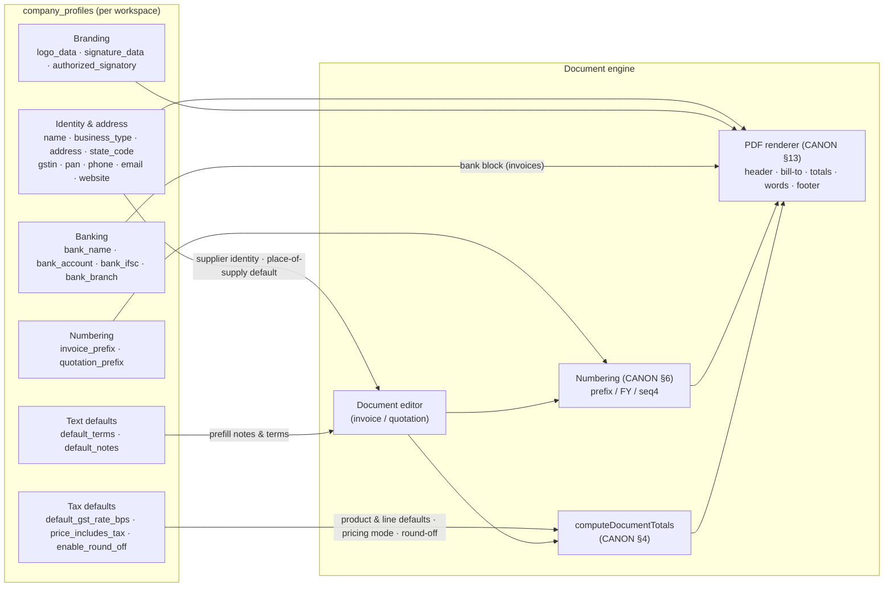

# InvoiceFlow — Company Management

> Derived from `docs/_CANON.md` (especially §5 GST domain, §6 numbering, §7 `company_profiles`, §11 workspace model, §15 UI/UX, §16 security baseline). If any statement here appears to deviate from CANON, CANON wins and this doc must be corrected.

## 1. Purpose

Specify the company profile feature end-to-end: the full `company_profiles` field reference, the Company form UX (`CompanyView` at `#/company`), branding (logo/signature), document-numbering configuration, tax defaults, and how the profile flows into every invoice, quotation, and PDF. It also defines the **multi-workspace design** (`workspaces` + `workspace_members` + future multi-company) that the company profile sits inside, and the offline/online behavior of company edits.

## 2. Scope

Covers: company profile CRUD (local-first), branding asset handling, numbering and tax default configuration, and workspace-level organization. Does **not** cover the document editors themselves (`docs/11-QUOTATION-MODULE.md`, `docs/12-INVOICE-MODULE.md`), GST computation (`docs/13-GST-MODULE.md`), PDF layout internals (`docs/14-PDF-GENERATION.md`), or team-role permissions beyond what workspace membership implies (`docs/28-TEAM-MEMBERS.md`).

## 3. Business requirements

1. **Legal identity on every document** — business name, address, GSTIN, PAN, and contact details must appear correctly on invoices and quotations (GST context, CANON §5).
2. **Branded output** — logo on the PDF header, signature image + authorized signatory above the footer, bank details on invoices for payment instructions (CANON §13).
3. **Numbering ownership** — each business controls its invoice/quotation prefixes (`INV`, `QT` defaults) within the `{prefix}/{FY}/{seq4}` scheme (CANON §6).
4. **Sensible tax defaults** — a workspace-wide default GST rate, pricing mode (tax-inclusive or exclusive), and round-off behavior seed new products and documents, eliminating repetition (CANON §7).
5. **Reusable text** — default terms and notes prefill every new document.
6. **Guest-first, offline-first** — the company profile is created and edited locally with no account and no network; cloud sync is optional (CANON §1, §11).
7. **One profile per workspace in MVP, many later** — schema and UX leave room for multi-company workspaces (CANON §7).

## 4. Technical design

### 4.1 Company form UX (`CompanyView`, `#/company`)

Reachable from the sidebar (`#/company`) and from Settings → Company (CANON §15). During **onboarding**, when no company profile exists, the welcome flow offers *create company form* / *load sample data* / *sign in* (CANON §15).

- **Framework:** react-hook-form + `zodResolver` (CANON §15 forms rule); all fields validated against the shared Zod schema in `src/lib/domain/schemas.ts` — the same schema the server revalidates on push.
- **Layout:** one scrollable form in logical sections (below), a sticky Save action, destructive-free (company has no delete — see §10).
- **Save semantics:** writes the full profile to `company_profiles` in one Dexie transaction and enqueues an outbox op `{ entity: 'company', action: 'upsert', base_version }`; toast confirms; sync pill turns amber (`pending`) until applied.

| Section | Fields | Validation highlights |
|---|---|---|
| Identity | `name` (required), `business_type` | non-empty name |
| Address | `address_line1` (required), `address_line2`, `city` (required), `state_name` + `state_code` (picker over `INDIAN_STATES` in `src/lib/domain/gst.ts`), `pincode` | 6-digit pincode; state codes come from the code file — never re-listed in UI code |
| Tax identity | `gstin`, `pan` | GSTIN regex `^[0-9]{2}[A-Z]{5}[0-9]{4}[A-Z]{1}[1-9A-Z]{1}Z[0-9A-Z]{1}$` (CANON §5); when the GSTIN's first two digits ≠ supplier `state_code`, the form warns and offers to fix the state |
| Contact | `phone`, `email`, `website` | email/URL patterns |
| Branding | `logo_data`, `signature_data` uploads, `authorized_signatory` | PNG/JPEG ≤ 1 MB (§4.2) |
| Banking | `bank_name`, `bank_account`, `bank_ifsc`, `bank_branch` | IFSC pattern `^[A-Z]{4}0[A-Z0-9]{6}$` |
| Numbering | `invoice_prefix` (default `INV`), `quotation_prefix` (default `QT`) | uppercase ASCII letters/digits, non-empty; live preview `INV/2025-26/0042` |
| Defaults | `default_gst_rate_bps` (percent input ↔ bps), `price_includes_tax` (toggle), `enable_round_off` (toggle) | rate ≥ 0 and < 100% |
| Text defaults | `default_terms`, `default_notes` | free text |

### 4.2 Branding — logo & signature assets

- **Accepted formats:** PNG or JPEG only, **≤ 1 MB**. Enforcement is layered (CANON §16): the file input restricts `accept="image/png,image/jpeg"`; the client checks `file.size` before reading; the resulting dataURL length is re-checked (base64 inflates ~4/3) before storage; the server revalidates the payload on push.
- **Storage:** images are stored inline as **dataURLs** in `logo_data` / `signature_data` (MVP, CANON §7: "dataURL or attachment ref"). Large-scale deployments mirror blobs to the Supabase **`company-assets`** bucket with path `{workspace_id}/{entity}/{filename}` (CANON §8); the dataURL remains the rendering source in the MVP.
- **Rendering:** the logo anchors the PDF header; the signature image renders above the `authorized_signatory` name; the UI previews both (`` with dataURL — XSS-safe React rendering, no `dangerouslySetInnerHTML`).
- A heavier logo is downscaled client-side where practical; oversized files are rejected with a clear message (§10).

### 4.3 Document numbering configuration

- Prefixes `invoice_prefix` (`INV`) and `quotation_prefix` (`QT`) feed the number format **`{prefix}/{FY}/{seq4}`** — e.g. `INV/2025-26/0042` — with fiscal year April–March (`fiscalYearOf`, CANON §6).
- Drafts carry provisional numbers `DRAFT-<8 random chars>` (clearly marked provisional in UI and PDF preview).
- **Finalize is the only moment numbers become real:** online, the server allocates from `document_sequences(workspace_id, doc_type, fiscal_year, next_seq)` in a serializable transaction and the server number always wins; offline, the client allocates locally and the server re-validates on push — fast-forwarding its sequence or issuing the next free number as a `number_reassigned` result the client must adopt (CANON §6).
- Sequences never decrement; cancelled documents keep their numbers (audit preserved). Changing a prefix affects only **future** allocations.

### 4.4 Tax defaults

| Setting | Default | Effect |
|---|---|---|
| `default_gst_rate_bps` | `1800` (18%) | Seeds `products.gst_rate_bps` for new products and the default line-item rate in the document editor; editable per product/line afterwards |
| `price_includes_tax` | `false` | Default pricing mode for new documents (snapshot per document, CANON §7); drives the tax-inclusive toggle in the editor and the CANON §4 computation branch |
| `enable_round_off` | `true` | Grand total rounded to whole rupees (`roundHalfUp(grandTotalRaw / 100) × 100`), difference recorded as `round_off_paise` |

All three are workspace-level defaults — snapshots on each document ensure historical documents never re-interpret old settings (CANON §7).

### 4.5 Multi-workspace design

The company profile lives inside a workspace abstraction that already supports more than one company:

- **`workspaces`** — one row per company context. Created locally on first launch (guest, `cloud_linked_at = null`); attached to the cloud at claim time (`owner_user_id` set, CANON §11).
- **`workspace_members`** — membership rows keyed by `user_id` (cloud) or `device_id` (guest) with roles `OWNER | ADMIN | MEMBER | VIEWER` (OWNER > ADMIN > MEMBER > VIEWER, CANON §8). The guest creator is OWNER.
- **`app_settings.active_workspace_id`** — points at the workspace the UI operates on. MVP uses exactly one.
- **`company_profiles`** — 1 per workspace in MVP; the schema supports many per workspace (CANON §7).
- **Future multi-company (designed, not implemented):** a workspace switcher would create/select workspaces, each with its own company profile, customers, products, documents, sequences, and cursors — the sync engine already scopes everything by `workspace_id`. Team collaboration is schema/policy-ready; MVP UI limits itself to owner workflows (CANON §19.7).

### 4.6 Company → documents flow



### 4.7 Save & sync flow (offline → online)

```mermaid
sequenceDiagram
    autonumber
    actor U as User
    participant CV as CompanyView (#/company)
    participant SCH as Zod schemas (shared)
    participant DB as Dexie (company_profiles)
    participant OUT as sync_operations (outbox)
    participant API as /api/sync/push
    participant CLG as ChangeLog (server)

    U->>CV: Edit fields / upload logo
    CV->>SCH: validate (zodResolver)
    SCH-->>CV: field errors or ok
    CV->>DB: upsert profile (single transaction)
    CV->>OUT: enqueue op {entity:'company', action:'upsert', base_version}
    Note over OUT: profile.sync_state = pending (sync pill amber)
    OUT->>API: push when online (batch ≤ 25)
    API->>API: Zod revalidate + membership/role check + CAS on base_version
    alt accepted
        API->>CLG: append ChangeLog row (full record)
        API-->>OUT: {status:'applied', record}
        OUT->>DB: adopt server record (version+1, sync_state='synced'); op done
    else version conflict
        API-->>OUT: {status:'conflict', record}
        Note over OUT: server record parked → Settings → Sync → Conflicts
    else validation failure
        API-->>OUT: {status:'rejected', error}
        Note over OUT: op failed — surfaced, user edits to retry
    end
```

## 5. Data models

### 5.1 `company_profiles` — full field reference

1 per workspace in MVP; schema supports many. Inherits the common sync metadata block (`id, workspace_id, created_at, updated_at, deleted_at, version, sync_state, origin_device_id` — CANON §3, full table in `docs/06-DATABASE-DESIGN.md` §4.2).

| Field | Type | Null | Default | Meaning |
|---|---|:---:|---|---|
| `name` | string | no | — | Legal/business name; printed as supplier identity on all documents |
| `business_type` | string | no | — | Business classification label (sole proprietor, partnership, …) |
| `logo_data` | string (dataURL) | yes | — | Logo image — PNG/JPEG dataURL ≤ 1 MB, or attachment ref; PDF header |
| `address_line1` | string | no | — | Registered address line 1 |
| `address_line2` | string | yes | — | Registered address line 2 |
| `city` | string | no | — | City |
| `state_name` | string | no | — | State display name (from `INDIAN_STATES`) |
| `state_code` | string (2) | no | — | 2-digit state/UT code — **supplier state** for intra/inter-state GST decisions (CANON §5) |
| `pincode` | string (6) | no | — | PIN code |
| `gstin` | string (15) | yes | — | GSTIN (CANON §5 regex); printed on documents |
| `pan` | string (10) | yes | — | PAN |
| `phone` | string | yes | — | Contact phone |
| `email` | string | yes | — | Contact email |
| `website` | string | yes | — | Website |
| `bank_name` | string | yes | — | Bank name — invoices' bank block |
| `bank_account` | string | yes | — | Account number |
| `bank_ifsc` | string (11) | yes | — | IFSC (pattern-validated) |
| `bank_branch` | string | yes | — | Branch |
| `authorized_signatory` | string | yes | — | Signatory name rendered with the signature image |
| `signature_data` | string (dataURL) | yes | — | Signature image — PNG/JPEG dataURL ≤ 1 MB, or attachment ref |
| `invoice_prefix` | string | no | `'INV'` | Invoice number prefix (CANON §6) |
| `quotation_prefix` | string | no | `'QT'` | Quotation number prefix |
| `default_gst_rate_bps` | integer | no | `1800` | Default GST rate in bps for new products/lines |
| `price_includes_tax` | boolean | no | `false` | Default pricing mode snapshot source for new documents |
| `enable_round_off` | boolean | no | `true` | Round grand total to whole rupees, record `round_off_paise` |
| `default_terms` | string | yes | — | Prefills document terms |
| `default_notes` | string | yes | — | Prefills document notes |

### 5.2 Related models

- **`workspaces`** — `name`, `slug` (derived), `owner_user_id?` (cloud, set at claim), `cloud_linked_at?` (local-only flag), `settings_json?` + metadata. The company profile belongs to exactly one workspace; the MVP UI exposes one workspace.
- **`workspace_members`** — `workspace_id`, `user_id?`, `device_id?`, `role` (`OWNER|ADMIN|MEMBER|VIEWER`) + metadata; the guest creator holds OWNER.
- **`tax_rates`** — workspace-scoped versioned rate history (`name`, `rate_bps`, `active`, `effective_from?`) that backs the `default_gst_rate_bps` picker with meaningful presets.
- **`attachments`** — when a branding image is stored as an attachment ref instead of an inline dataURL, an `attachments` row (`entity_type='company'`) records `filename`, `mime`, `size_bytes`, and optionally inline `data`.

## 6. API contracts

There is **no dedicated REST endpoint** for the company profile — it travels through the sync contract (CANON §9, §14), keeping the offline-first pipeline uniform:

- Push op: `{ op_id, entity: 'company', entity_id, action: 'upsert', base_version, payload: { …full profile record… } }` inside `POST /api/sync/push`.
- Server rules applied: Zod validation (shared schema — including GSTIN regex and the ≤ 1 MB dataURL size check), workspace membership & role ≥ MEMBER, CAS on `base_version`; on success the row is written with `version + 1` and a `ChangeLog` row (full record) is appended; result `applied` (or `duplicate` on replay / `conflict` on CAS failure / `rejected` on validation).
- Pull: other devices receive the profile through `GET /api/sync/pull` (`entity: 'company'`) and upsert it locally (server wins when `record.version > local.version`).
- Error envelope `{ error, code? }` with 400/401/403/404/409/429 as per CANON §14.

## 7. Offline behavior

- **All fields are editable locally, always.** Creating or editing the company profile requires neither account nor network — it is the very first screen of onboarding (CANON §15).
- Saving writes Dexie directly and enqueues the outbox op (`entity: 'company'`); the profile is immediately usable by the editor, numbering, and PDF renderer.
- Offline finalize uses the local prefixes and locally allocated sequences (CANON §6); PDFs render the current local branding even with the network down.
- Because there is exactly one profile per workspace in MVP, the editor is a **single-row upsert** — no list management UI is needed.

## 8. Online behavior

- The server **revalidates everything** on push: shared Zod schema (identity, GSTIN regex, IFSC pattern, asset size), membership/role, and CAS `base_version`; a stale edit returns `conflict` with the server record parked on the op for resolution (Keep mine / Keep server's — CANON §10).
- Every applied company upsert appends a **ChangeLog** row, so paired devices converge on pull; the next pull updates the local profile (`sync_state='synced'`) without user action.
- After claim (CANON §11), the existing local profile is part of the bulk initial push that populates the server workspace.
- The `company-assets` bucket (production) mirrors branding blobs under `{workspace_id}/{entity}/{filename}` when attachment refs are used.

## 9. Security considerations

- **Upload validation:** logo/signature restricted to PNG/JPEG ≤ 1 MB — enforced client-side (MIME + `file.size` + dataURL length) and revalidated server-side on push (CANON §16).
- **XSS-safe rendering:** branding dataURLs render through React `` only; no HTML injection surface (`dangerouslySetInnerHTML` is never used, CANON §16).
- **Tenancy & roles:** every company op is workspace-scoped; server checks membership and role ≥ MEMBER (WRITE); RLS policies mirror this on Postgres (`docs/06-DATABASE-DESIGN.md` §5.1); VIEWERs cannot save company edits.
- **Sensitive data:** bank details and tax identifiers are business data synced like any other entity; they never appear in URLs or logs; the workspace is protected by session/JWT auth (`docs/07-AUTHENTICATION.md`).
- **Storage paths:** production bucket paths are `{workspace_id}/…` so bucket policies can enforce per-workspace access (CANON §8).

## 10. Error-handling rules

| Scenario | Detection | Response |
|---|---|---|
| Invalid field (GSTIN, email, IFSC, pincode…) | Zod (client & server) | Inline field errors; push result `rejected` if it somehow reaches the server — op `failed`, visible in Settings → Sync, user edits to retry |
| Logo/signature too large or wrong type | file size/MIME check + dataURL length | Immediate form error; nothing saved |
| Concurrent edits (two devices) | CAS `base_version` mismatch | Op `conflict`; server record parked; conflict UI (Keep mine / Keep server's); resolution audited (`SYNC_CONFLICT`) |
| Guest edits while another device claimed | pull delivers server profile | Server wins on pull (higher `version`) unless a local op is pending — pending ops resolve at push time (CANON §9) |
| Not signed in / workspace not linked | engine guard | Op stays `pending`; no error noise; sync resumes after claim/login |
| Membership revoked | `403` on push | Sync halts for the workspace with an explanatory notice; local data intact |
| Deleted profile never happens | — | Company profiles are edited, not deleted; clearing happens only via workspace/data reset (Settings → Data) |

## 11. Acceptance criteria

- [ ] Onboarding shows the company form (or sample-data/sign-in alternatives) when no profile exists; `#/company` and Settings → Company open `CompanyView` thereafter.
- [ ] All fields of §5.1 are editable and persisted locally; save works fully offline and enqueues a `company` upsert op with the correct `base_version`.
- [ ] GSTIN is validated against the CANON §5 regex; state picker sources `INDIAN_STATES` from `src/lib/domain/gst.ts`; a GSTIN/state mismatch warns the user.
- [ ] Logo and signature accept only PNG/JPEG ≤ 1 MB (file check + dataURL check), render in the UI preview and the PDF (header logo; signature above `authorized_signatory`).
- [ ] Prefix fields default to `INV`/`QT`, validate as uppercase ASCII, and preview as `{prefix}/{FY}/{seq4}`; drafts still display `DRAFT-xxxxxxxx` as provisional.
- [ ] `default_gst_rate_bps` (percent ↔ bps), `price_includes_tax`, and `enable_round_off` seed new products/documents and match the CANON §4 computation branches; documents snapshot the settings in effect.
- [ ] `default_terms`/`default_notes` prefill new quotations and invoices.
- [ ] Online push revalidates the profile server-side, applies CAS, writes `version + 1`, appends a ChangeLog row, and paired devices receive the profile via pull.
- [ ] Conflicts surface in Settings → Sync → Conflicts with Keep mine / Keep server's, and every resolution writes an `audit_logs` row (`SYNC_CONFLICT`).
- [ ] Multi-workspace foundations hold: profile rows are `workspace_id`-scoped; `app_settings.active_workspace_id` selects the active context; the schema tolerates multiple profiles for future multi-company support without migration.
