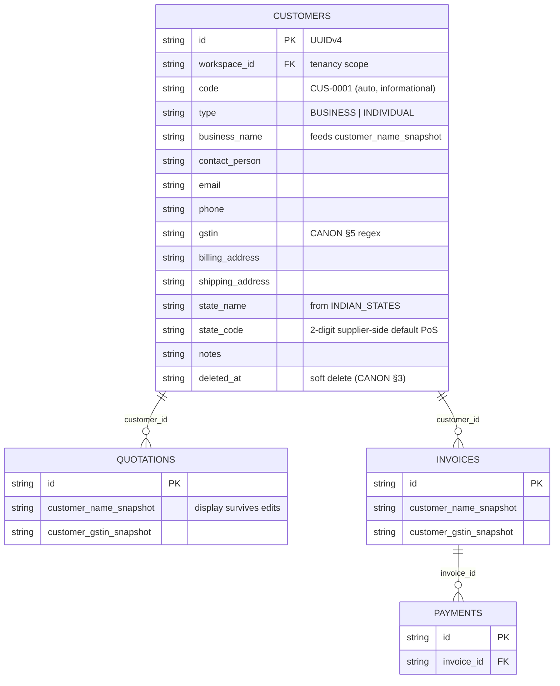

# InvoiceFlow — Customer Management

> Derived from `docs/_CANON.md` (§3 metadata & soft deletion, §5 GST domain, §7 `customers`, §8 roles, §9 sync protocol, §10 conflict policy, §15 UI/UX, §16 security baseline). If any statement here appears to deviate from CANON, CANON wins and this doc must be corrected.

## 1. Purpose

Specify the customer feature end-to-end: the full `customers` field reference, the list experience (search, filters, pagination), the create/edit form UX (react-hook-form + Zod), auto-code generation (`CUS-0001`), duplicate detection, per-customer transaction history, soft-deletion rules, and the offline/online behavior of customer data. Customers are the anchor of every document: the invoice/quotation editors pick customers from this catalog and snapshot the name/GSTIN/state at save time.

## 2. Scope

Covers: customer CRUD (local-first), the `#/customers` list and `#/customers/:id` detail (with transaction history), form validation, duplicate detection, soft deletion and restore, and sync behavior. Does **not** cover the document editors themselves (`docs/11-QUOTATION-MODULE.md`, `docs/12-INVOICE-MODULE.md`), GST computation (`docs/13-GST-MODULE.md`), or the sync engine internals (`docs/17-SYNC-ENGINE.md`).

## 3. Business requirements

1. **Reusable bill-to catalog** — customers are created once and reused across quotations and invoices; documents snapshot `customer_name_snapshot` and `customer_gstin_snapshot` so history survives customer edits (CANON §7).
2. **GST-aware identity** — a customer's `gstin` and `state_code` drive the Bill-To block on PDFs and the default place of supply, which decides intra vs inter-state tax (CANON §5).
3. **Business and individual buyers** — `type` is `BUSINESS | INDIVIDUAL`; the form adapts labels without a separate table (CANON §7).
4. **Offline-first, guest-first** — creating, editing, and deleting customers requires neither account nor network (CANON §1, §11).
5. **De-duplication guidance, not obstruction** — likely duplicates (same phone / GSTIN / name) produce a non-blocking warning so messy real-world data stays editable.
6. **History is sacred** — soft deletion only; invoices keep their meaning forever via snapshots (CANON §3: record retained, UI hides soft-deleted by default).
7. **Role-respecting writes** — every member may create/edit; only OWNER/ADMIN may delete (CANON §8 DELETE policy).

## 4. Technical design

### 4.1 List UX (`#/customers`)

- **Table** per CANON §15: sortable headers (Name, Code, Type, Phone, State, Updated), client-side pagination **10/page**, `max-h-[70vh]` scroll area, loading skeletons, and an empty state (icon + "No customers yet" + **Add customer** CTA).
- **Search** (debounced, case-insensitive) matches `business_name`, `code`, `phone` (digits-only compare), and `gstin` — the four Dexie-indexed lookup fields (`customers` indexes: `code`, `gstin`, `phone`, CANON §7).
- **Filters:** Type (All / Business / Individual), State (picker over `INDIAN_STATES`), and a **Show deleted** toggle (soft-deleted rows hidden by default, shown greyed with a `Deleted` badge when enabled).
- **Row actions:** Open (detail), Edit, Duplicate-check is automatic on edit, Delete (OWNER/ADMIN; AlertDialog confirm — CANON §15 destructive rule).
- Live updates via `useLiveQuery` over `db.customers` scoped to the active workspace and `deleted_at` filter.

### 4.2 Form UX (RHF + Zod)

React-hook-form + `zodResolver` against the shared `customerSchema` from `src/lib/domain/schemas.ts` — the same schema the server revalidates on push (CANON §9 rule 2, §15 forms rule). One scrollable form, sticky Save, sections:

| Section | Fields | Validation highlights |
|---|---|---|
| Identity | `type` (segmented BUSINESS / INDIVIDUAL), `business_name` (label switches to "Full name" for INDIVIDUAL), `contact_person`, `code` (read-only, auto) | `business_name` required — docs/33 §5.1 requires it for BUSINESS, and this form also requires it for INDIVIDUAL because it feeds `customer_name_snapshot`; `code` never hand-edited (immutable once set, docs/33 §5.1) |
| Tax | `gstin` | Optional; if present **must** match the CANON §5 regex (below) **and** its first-2-digit state prefix must exist in `INDIAN_STATES` (docs/33 §5.1); auto-uppercased on blur; a valid prefix that differs from `state_code` gets an inline warning, not a blocker (GSTIN registration state can legitimately differ from shipping) |
| Address | `billing_address`, `shipping_address` | `billing_address` required in the form (schema-nullable); "Same as billing" quick-fill for shipping |
| Location | `state_name` + `state_code` | Picker over `INDIAN_STATES` in `src/lib/domain/gst.ts`; selecting a state fills both; required (docs/33 §5.1) and drives the place-of-supply default |
| Contact | `phone`, `email` | Exactly **10 digits** (docs/33 §5.1 — `^[6-9]\d{9}$` for mobiles, plain 10 digits for landlines); duplicates/search compare on the stripped 10-digit value; email pattern when present |
| Notes | `notes` | Free text |

The GSTIN format check is the CANON §5 regex:

```
^[0-9]{2}[A-Z]{5}[0-9]{4}[A-Z]{1}[1-9A-Z]{1}Z[0-9A-Z]{1}$   (15 chars; state code = first 2 digits)
```

Save semantics: one Dexie transaction writes the row **and** enqueues the outbox op `{ entity: 'customer', action: 'upsert', base_version }` **and** an `audit_logs` row (`CREATE` or `UPDATE`) — a mutation, its audit, and its sync obligation share one commit (docs/16 §4.4). Toast confirms; sync pill turns amber until applied.

### 4.3 Customer code (`CUS-0001`)

- Generated on create as `CUS-` + the next zero-padded sequence: the client scans the workspace's customers (including soft-deleted, so codes are never reused) and takes `max(numeric suffix) + 1`, formatted `padStart(4, '0')` → `CUS-0001`, `CUS-0002`, …
- The code is **informational, not identity**: entity identity is the UUIDv4 `id` (CANON §3), the code column carries no uniqueness constraint, and two devices creating customers offline can collide harmlessly (both keep their codes; the server never keys on `code`).
- Codes display in lists, search, and PDF footers of the Bill-To block area; they never participate in document numbering (CANON §6 is for invoices/quotations only).

### 4.4 Duplicate detection

Before first save (and again on edit), the form scans **active** (`deleted_at IS NULL`) customers of the workspace for:

| Signal | Match rule |
|---|---|
| GSTIN | exact match after uppercase-trim (strongest signal) |
| Phone | digits-only compare (ignores spaces, `+`, leading `0`/`91`) |
| Name | `business_name` trimmed, case-insensitive equal |

Matches render as a non-blocking **warning banner** inside the form listing the candidates ("Possible duplicate: ACME Traders Pvt Ltd (CUS-0004, same phone)") with **Open** links. Saving is never blocked — real-world data is messy and the warning exists to inform, not to police. No duplicate record is auto-merged (CANON §10 never silently merges anything).

### 4.5 Transaction history per customer (`#/customers/:id`)

The detail page composes live queries over the customer's documents:

- **Profile card** — all §5.1 fields, `Deleted` badge when tombstoned, Edit / New invoice / New quotation actions.
- **Stats row** — Total invoiced (`Σ grand_total_paise` of non-deleted, non-CANCELLED invoices), Total collected (`Σ payments.amount_paise` joined via those invoices), Outstanding (Σ balances; may be negative → shown as Advance, consistent with docs/20/docs/27).
- **Invoices table** — Number, Date, Status, Grand total, Balance; links into `#/invoices/:id`.
- **Quotations table** — Number, Date, Status, Grand total; links into `#/quotations/:id`.
- **Payments list** — Date, Method, Reference, Amount (docs/27 Part 1 records).
- History reads **snapshots** for display (`customer_name_snapshot` on documents), so renaming a customer never rewrites the past; the profile card always shows the current values.

### 4.6 Soft deletion & restore

- **Delete** sets `deleted_at` (never a physical row delete) in the same transaction as the outbox `delete` op and an `audit_logs` (`DELETE`) row; restricted to OWNER/ADMIN in the UI and re-verified server-side (CANON §8).
- Invoices and quotations are **untouched** — they keep `customer_id` (a dangling pointer by design) plus `customer_name_snapshot` / `customer_gstin_snapshot`, which is what lists and PDFs render. Stats on the dashboard (docs/20) still count those documents.
- A tombstoned customer disappears from pickers, lists (default), and the "New document" flows.
- **Restore** clears `deleted_at` and enqueues a normal `upsert` op — the same mechanism the conflict UI's "restore" action uses for delete-vs-edit (CANON §10 #3). Restore is OWNER/ADMIN and writes an `UPDATE` audit row.

### 4.7 Entity relationships



## 5. Data models

### 5.1 `customers` — full field reference

Inherits the common sync metadata block (`id, workspace_id, created_at, updated_at, deleted_at, version, sync_state, origin_device_id` — CANON §3; full table in `docs/06-DATABASE-DESIGN.md`). Field-level validation authority is the shared Zod schema — rules summarized in §4.2 and specified in full in `docs/33-VALIDATION.md` §5.1; the table below records semantics.

| Field | Type | Meaning |
|---|---|---|
| `code` | string | Auto `CUS-{seq4}` (§4.3); informational only |
| `type` | enum | `BUSINESS \| INDIVIDUAL` (required) |
| `business_name` | string | Required in practice — person's name when `type = INDIVIDUAL`; feeds `customer_name_snapshot` on documents |
| `contact_person` | string | Secondary contact (typically for BUSINESS) |
| `email` | string | Pattern-validated when present |
| `phone` | string | Free-form entry, digits-only compare for search/duplicates |
| `gstin` | string(15) | CANON §5 regex when present; printed in Bill-To |
| `billing_address` | string | Multi-line; required by the form; PDF Bill-To body |
| `shipping_address` | string | Multi-line; optional; "ship to" variants |
| `state_name` | string | Display name paired with `state_code` |
| `state_code` | string(2) | 2-digit code from `INDIAN_STATES`; **defaults the document place of supply** (CANON §5) |
| `notes` | string | Free text, internal only (never printed) |

Dexie indexes (CANON §7): `id, workspace_id, code, gstin, phone, sync_state, updated_at, deleted_at, [workspace_id+deleted_at]`.

Representative shared schema (excerpt — full schema in `src/lib/domain/schemas.ts`):

```ts
const GSTIN_RE = /^[0-9]{2}[A-Z]{5}[0-9]{4}[A-Z]{1}[1-9A-Z]{1}Z[0-9A-Z]{1}$/;
export const customerSchema = z.object({
  type: z.enum(['BUSINESS', 'INDIVIDUAL']),
  business_name: z.string().trim().min(1),
  gstin: z.string().trim().toUpperCase().regex(GSTIN_RE).optional().or(z.literal('')),
  state_code: z.string().length(2).optional().or(z.literal('')),
  email: z.string().email().optional().or(z.literal('')),
  // …remaining fields per §5.1
});
```

## 6. API contracts

No dedicated REST endpoint — customers ride the sync contract (CANON §9, §14):

- Push op: `{ op_id, entity: 'customer', entity_id, action: 'upsert' | 'delete', base_version, payload: { …full record… } }` in `POST /api/sync/push`.
- Server rules applied: shared Zod revalidation (including the GSTIN regex), workspace membership + role ≥ MEMBER for writes and OWNER/ADMIN for deletes, CAS on `base_version`; on success `version + 1` + ChangeLog append; result `applied` / `duplicate` (replay) / `conflict` (CAS) / `rejected` (validation).
- Pull: other devices receive `entity: 'customer'` changes via `GET /api/sync/pull` and upsert locally (server wins when `record.version > local.version`).
- Errors: `{ error, code? }` with 400/401/403/404/409/429 semantics (CANON §14; full contracts in docs/30-API-DESIGN.md).

## 7. Offline behavior

- Full CRUD with zero network: the form, list, filters, detail history, duplicate scan, and code generation all run against Dexie only.
- Every mutation is immediately visible locally with `sync_state = 'pending'` (amber sync pill per docs/23); ops drain when connectivity returns (docs/17).
- Duplicate detection and code generation see only **local** data — a duplicate that exists only on another device will not warn until the next pull; acceptable and documented (warnings are advisory, §4.4).
- Soft-deleted customers keep satisfying historical document rendering offline (snapshots are on the documents themselves).

## 8. Online behavior

- Push revalidates and applies with CAS; a stale edit returns `conflict` and the server record parks on the op for the Settings → Sync → Conflicts UI (Keep mine / Keep server's — CANON §10).
- Customer edits are merged across devices by **3-way field merge** against `base_version` (CANON §10 #1): disjoint fields auto-merge, overlapping fields raise the conflict UI. Every resolution writes `audit_logs(action='SYNC_CONFLICT')`.
- Pull delivers other devices' creates/edits/deletes; tombstones propagate and remove rows from other devices' pickers.
- After a guest claims a workspace (CANON §11), existing customers join the initial bulk push.

## 9. Security considerations

- Tenancy: all queries are `workspace_id`-scoped; the server verifies membership and role on every op; Supabase RLS mirrors this in production (docs/06 §5).
- XSS-safe rendering: customer-supplied strings render through React text nodes only — never `dangerouslySetInnerHTML` (CANON §16).
- The GSTIN, phone, and notes are business data like any other: they never appear in URLs or logs, and are protected by the session cookie / JWT boundary (docs/07).
- Deletes are double-gated (UI role check + server re-check) and audited; there is no hard-delete path in the app (data removal is the account-deletion / clear-local-data flows, docs/29).

## 10. Error-handling rules

| Scenario | Detection | Response |
|---|---|---|
| Invalid GSTIN format (regex, or prefix not in `INDIAN_STATES`) | Zod (client & server), CANON §5 + docs/33 §5.1 | Inline field error; save blocked; push result `rejected` if it ever reached the server — op `failed`, visible in Settings → Sync |
| GSTIN state-prefix differs from `state_code` | First-2-digit cross-check | Non-blocking warning (registration state may differ) |
| Missing required form field (`business_name`, billing address, state) | Zod | Inline errors; save blocked |
| Duplicate candidate found | §4.4 scan | Warning banner with links; saving allowed |
| Two devices edited the same customer | CAS `base_version` mismatch | `conflict` → conflict UI; 3-way merge attempt first (§8) |
| Delete vs edit race | CANON §10 #3 | Conflict UI (restore vs keep deleted); resolution audited |
| Delete without permission (MEMBER/VIEWER) | UI role check + server 403 | Action hidden client-side; server re-rejects with 403 |
| Not signed in / workspace unlinked | Engine guard | Op stays `pending`; sync resumes after claim/login (docs/17) |

## 11. Acceptance criteria

- [ ] `#/customers` lists customers with search over name/code/phone/GSTIN, Type and State filters, sortable columns, 10/page pagination, and an empty state with an Add CTA; soft-deleted rows appear only with **Show deleted**.
- [ ] New customers get auto codes `CUS-0001`, `CUS-0002`, … increasing without gaps from prior (even soft-deleted) codes, and the code is display-only.
- [ ] The form saves a customer fully offline (airplane mode), writes the row + outbox op + audit row in one transaction, and the record is immediately selectable in the document editor's customer picker.
- [ ] A GSTIN failing the CANON §5 regex — or carrying a state prefix absent from `INDIAN_STATES` — blocks save with an inline error; a valid GSTIN auto-uppercases; a differing (but valid) prefix warns without blocking.
- [ ] State picker sources `INDIAN_STATES` from `src/lib/domain/gst.ts` and fills `state_name` + `state_code` together.
- [ ] Creating a customer with the same GSTIN / phone / name as an existing active customer shows the duplicate warning with an Open link, and the user can still save.
- [ ] `#/customers/:id` shows profile, invoiced/collected/outstanding stats, and the invoices, quotations, and payments tables, rendered from document snapshots.
- [ ] Deleting a customer (OWNER/ADMIN, confirm dialog) tombstones it, hides it from pickers and lists, leaves historical invoices rendering the `customer_name_snapshot`, and enqueues a `delete` op; Restore returns it to active use via an `upsert` op.
- [ ] Two-device edit converges per CANON §10 #1 (auto-merged disjoint fields; conflict UI for overlaps) with a `SYNC_CONFLICT` audit row on resolution.
- [ ] Server-side push rejects an invalid customer payload (`rejected`), keeps the op `failed` and visible, and never drops it silently.

## 12. References

CANON §1, §3, §5, §7, §8, §9, §10, §15, §16, §19.2; docs/06-DATABASE-DESIGN.md (field tables, RLS); docs/08-COMPANY-MANAGEMENT.md (supplier identity & state); docs/11-QUOTATION-MODULE.md and docs/12-INVOICE-MODULE.md (customer picker, snapshots); docs/13-GST-MODULE.md (state codes, place of supply); docs/17-SYNC-ENGINE.md and docs/18-CONFLICT-RESOLUTION.md; docs/20-DASHBOARD.md (customer-linked KPIs); docs/23-NOTIFICATIONS.md (toasts/pill); docs/29-SECURITY.md; docs/30-API-DESIGN.md; docs/32-ROUTES.md (route map); docs/33-VALIDATION.md (shared field rules); docs/35-TESTING.md.
