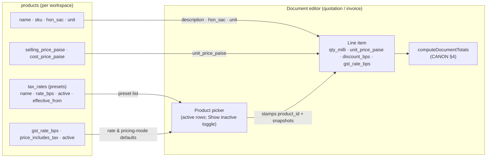

# InvoiceFlow — Product & Service Management

> Derived from `docs/_CANON.md` (§4 money rules, §5 GST domain, §7 `products`, §8 roles, §9 sync protocol, §10 conflicts, §15 UI/UX, §16 security). One catalog serves **both goods (HSN) and services (SAC)**; "product" is the table name, not a scope restriction. If any statement here appears to deviate from CANON, CANON wins and this doc must be corrected.

## 1. Purpose

Specify the product/service catalog feature end-to-end: the full `products` field reference, list and form UX, duplicate detection with override, per-product usage history, the effect of the `active` flag on document pickers, and offline/online behavior. The catalog exists to make document lines fast: the editor's product picker fills description, HSN/SAC, unit, price, and GST rate from here (CANON §15), while line items themselves remain immutable snapshots.

## 2. Scope

Covers: product CRUD (local-first), list/form UX, duplicate detection, `tax_rates` presets integration, usage history, active/inactive semantics, and sync behavior. Does **not** cover line-item computation (`docs/13-GST-MODULE.md`, CANON §4), the document editors (`docs/11-`, `docs/12-`), or inventory/stock (non-goal in MVP — docs/41 roadmap).

## 3. Business requirements

1. **Fast, consistent lines** — picking a product must stamp every tax-relevant field (HSN/SAC, unit, price, GST rate) so quotations and invoices stay correct by default (CANON §15).
2. **Goods and services in one list** — `hsn_sac` holds an HSN code (goods) or SAC code (services); the catalog makes no functional distinction beyond the code.
3. **Integer money discipline** — prices are stored in paise; rates in bps; quantities later consumed as milli-units (CANON §4). The form edits rupees/percent for humans and converts exactly.
4. **Sensible tax defaults** — a new product's GST rate and pricing mode seed from the company profile's `default_gst_rate_bps` / `price_includes_tax` and remain individually editable (CANON §7).
5. **De-duplication with override** — a product with the same name + SKU warns via toast but never blocks (businesses legitimately re-use names across SKUs).
6. **Catalog hygiene without history loss** — deactivation (`active = false`) removes items from pickers; soft deletion tombstones rows; both leave historical documents untouched (snapshots, CANON §3/§7).
7. **Role-respecting writes** — every member may create/edit; only OWNER/ADMIN may delete (CANON §8 DELETE policy).

## 4. Technical design

### 4.1 List UX (`#/products`)

- **Table** per CANON §15: sortable headers (Name, SKU, HSN/SAC, Unit, Selling price, GST %, Status), client-side pagination **10/page**, skeleton loading, empty state ("No products yet" + **Add product** CTA).
- **Search** (debounced, case-insensitive) over `name` and `sku` (plus `hsn_sac` — all three are Dexie-indexed, CANON §7).
- **Filters:** Status (All / Active / Inactive) driven by the `[workspace_id+active]` compound index; soft-deleted rows appear only under a **Show deleted** toggle (greyed, `Deleted` badge).
- **Row actions:** Edit, Deactivate/Activate (toggle `active`), Delete (OWNER/ADMIN, AlertDialog confirm), and a usage-history drawer (§4.4).
- Live updates via `useLiveQuery` scoped to the active workspace.

### 4.2 Form UX (RHF + Zod)

React-hook-form + `zodResolver` against the shared `productSchema` (`src/lib/domain/schemas.ts`), revalidated server-side on push. Sections:

| Section | Fields | Validation highlights |
|---|---|---|
| Identity | `name` (required), `sku`, `description` | `name` non-empty; `sku` free-form uppercase-friendly string; no uniqueness constraint (warn only, §4.3) |
| Classification | `hsn_sac`, `unit` | `hsn_sac` digits-only, ≤ 8 chars when present (HSN 4/6/8, SAC 6 — MVP performs **no HSN directory lookup**; documented limitation). `unit` defaults to `NOS`; free-text with suggestion chips (`NOS, PCS, KG, L, M, HRS, BOX, SET`) |
| Pricing | `selling_price_paise` (required ≥ 0), `cost_price_paise` (optional ≥ 0) | Rupee inputs with exact paise entry (₹ 1,234.56 → `123456`); when cost is present the form previews margin (`selling − cost`) |
| Tax | `gst_rate_bps`, `price_includes_tax` | Rate picker lists the **workspace's configured rate set** — the active `rate_bps` values of `tax_rates` (MVP seeds `{0, 250, 500, 750, 1200, 1800, 2800}` bps, docs/33 §5.2). A new rate is registered in `tax_rates` first (versioned, CANON §5), then selectable — validation accepts only values in the configured set, stored as integer bps (18% ↔ `1800`). `price_includes_tax` initializes from the company profile's `price_includes_tax` and may be flipped per product (CANON §7 "falls back to company default") |

Save semantics mirror docs/09 §4.2: one Dexie transaction writes the row + outbox op (`entity: 'product', action: 'upsert'`) + `audit_logs` row; toast confirms; the record is instantly available in the document picker.

### 4.3 Duplicate detection (name + SKU → warning toast with override)

Before save (create and edit), the form scans active (`deleted_at IS NULL`) products of the workspace:

- **Trigger:** a candidate matches when trimmed case-insensitive `name` is equal **and** the SKUs match (case-insensitive; two empty SKUs still count as equal, since name collision alone with identical taxonomy is the practical case).
- **UX:** a sonner **warning toast** — "Product 'Banner Ads Monthly' with SKU SVC-012 already exists — Save anyway?" — with a **Save anyway** action; the form also shows an inline non-blocking notice listing the candidate(s). Saving never blocks; no merge is performed (CANON §10 never silently merges).
- The scan sees local data only (offline caveat identical to docs/09 §7).

### 4.4 Usage history (documents referencing the product)

The row's usage-history drawer (and product detail view) lists documents whose **line items reference the product**:

- **Linkage:** the document editor's product picker stamps `product_id` on the line item at pick time (alongside the field snapshots description/hsn_sac/unit/price/rate — CANON §7 item fields remain authoritative for rendering).
- **Display:** grouped by document type — Number, Date, Qty (`qty_milli` ÷ 1000), Line total (`total_paise`) — linking into `#/invoices/:id` / `#/quotations/:id`; newest first.
- **Ad-hoc lines** (typed without the picker) carry no `product_id` and cannot be attributed; in reports they bucket under the pseudo-product "Ad-hoc line items" exactly as defined in docs/21 — this doc inherits that contract.
- **Documented deviation (additive field):** CANON §7 does not list `product_id` on item tables. It is added as a nullable, non-indexed v1 field in the Dexie domain schema and item payloads, justified because docs/21 (Products report) already consumes it and no CANON field is altered. Cloud mapping requires the equivalent additive nullable column (`ALTER TABLE … ADD COLUMN product_id uuid NULL`) as a follow-up migration per the docs/16 migration strategy; absence of the column in `supabase/migrations/0001_init.sql` is tracked as an orchestrator action, not a behavioral difference (the field is optional everywhere).
- **Query shape:** client-side scan of the workspace's item rows filtered by `product_id` (no v1 index; bounded by MVP data volume per docs/40 budgets). A Dexie `v2` additive index `[workspace_id+product_id]` may be added later per docs/16 §6 without any v1 mutation.

### 4.5 Active / inactive effect on pickers

- The document editor's product picker lists **active** products only, by default (queried via `[workspace_id+active]`). An **Show inactive** toggle inside the picker reveals inactive rows (greyed, badge) for edge cases; selecting an inactive product is allowed when revealed — the system trusts the user.
- Deactivating a product changes **nothing** in existing documents: lines are snapshots (`description`, `unit_price_paise`, `gst_rate_bps`, computed totals), and reports aggregate snapshot columns (docs/21).
- Duplicate detection and usage history include inactive products; new-document flows simply hide them.
- Deactivation is a normal `upsert` op (not a delete) — fully reversible, no tombstone.

### 4.6 Catalog → document flow

## 5. Data models

### 5.1 `products` — full field reference

Inherits the common sync metadata block (CANON §3; docs/06). CANON §7 lists `name` as the only hard-required field; the form requires the selling price too.

| Field | Type | Null | Default | Meaning |
|---|---|:---:|---|---|
| `name` | string | no | — | Catalog display name; seeds line `description` |
| `sku` | string | yes | — | Stock/item code; duplicate-warning signal; never a sync key |
| `hsn_sac` | string | yes | — | HSN (goods) or SAC (services); snapshot onto line items |
| `description` | string | yes | — | Long description; appended to line `description` on pick |
| `unit` | string | no | `'NOS'` | Unit label rendered on documents and qty inputs |
| `selling_price_paise` | integer | no | — | **Required, ≥ 0**; paise per unit (CANON §4) |
| `cost_price_paise` | integer | yes | — | Optional cost basis for margin preview; never printed |
| `gst_rate_bps` | integer | no | company `default_gst_rate_bps` | 18% = `1800`; editable per product |
| `price_includes_tax` | boolean | no | company `price_includes_tax` | Pricing-mode default this product suggests; documents may override per document (CANON §4 branch) |
| `active` | boolean | no | `true` | Picker visibility flag (§4.5) |

Dexie indexes (CANON §7): `id, workspace_id, sku, hsn_sac, active, sync_state, updated_at, deleted_at, [workspace_id+active], [workspace_id+deleted_at]`.

Related model — **`tax_rates`** (workspace presets): `name`, `rate_bps`, `active`, `effective_from?` + metadata. Versioned by retention: superseded rates are deactivated, never mutated, so a product pointing at an old rate keeps its meaning until edited; documents snapshot the numeric rate at save/finalize regardless (CANON §5, §7).

## 6. API contracts

No dedicated REST endpoint — products ride the sync contract (CANON §9, §14):

- Push op: `{ op_id, entity: 'product', entity_id, action: 'upsert' | 'delete', base_version, payload: { …full record… } }` in `POST /api/sync/push`.
- Server rules: shared Zod revalidation (price ≥ 0, rate bounds 0–10000 bps, GST-independent fields), membership/role ≥ MEMBER (writes) and OWNER/ADMIN (delete), CAS on `base_version`; success ⇒ `version + 1` + ChangeLog row; results `applied` / `duplicate` / `conflict` / `rejected`.
- Pull: `entity: 'product'` changes converge other devices (server wins on higher `version`).
- Line-item `product_id` travels inside the document payload's embedded items (CANON §9 push payload: "items embedded for documents") — no separate endpoint.
- Errors `{ error, code? }` per CANON §14; full contracts in docs/30-API-DESIGN.md.

## 7. Offline behavior

- Full CRUD offline: form, search, filters, duplicate scan, usage drawer, activate/deactivate, delete — all against Dexie with immediate UI feedback and a queued outbox op.
- New products are instantly pickable in the offline editor; rates/prices resolve locally so document math never waits for the network.
- The usage-history drawer reflects only locally present documents until the next pull; the duplicate scan sees only local rows (advisory, §4.3).

## 8. Online behavior

- Push revalidates and applies with CAS; concurrent edits on two devices resolve by 3-way field merge (disjoint fields) or the conflict UI (overlaps) per CANON §10 #1, with `SYNC_CONFLICT` auditing.
- Pull delivers other devices' catalog changes, including tombstones (removed from pickers) and `active` flips.
- After workspace claim (CANON §11), the local catalog joins the initial bulk push and backfills `product_id` linkage on subsequent document edits (existing lines are never retro-stamped).

## 9. Security considerations

- Tenancy scoping + server-side membership/role checks on every op; RLS-mirrored in production (docs/06 §5).
- XSS-safe rendering of all catalog strings (React text nodes; no HTML injection surface, CANON §16).
- `cost_price_paise` is margin-sensitive business data: it never prints on documents and never leaves the workspace except through the owner's own sync/backup (docs/39).
- Deletes are role-gated twice (UI + server) and audited; catalog rows are otherwise immortal (soft delete only).

## 10. Error-handling rules

| Scenario | Detection | Response |
|---|---|---|
| Missing `name` or negative price | Zod (client & server) | Inline field errors; save blocked; `rejected` result → op `failed`, visible in Settings → Sync |
| GST rate not in the workspace's configured rate set | Zod against the active `tax_rates` values (docs/33 §5.2) | Inline error on the rate picker; register the rate in `tax_rates` first |
| HSN/SAC with non-digits or > 8 chars | Zod | Inline error (no directory lookup in MVP — format-only validation) |
| Duplicate name + SKU | §4.3 scan | Warning toast with **Save anyway** override; inline notice |
| Two devices edited the same product | CAS mismatch | 3-way merge attempt → conflict UI for overlaps; `SYNC_CONFLICT` audit |
| Delete vs edit race | CANON §10 #3 | Conflict UI (restore vs keep deleted) |
| Delete without permission | UI role check + server 403 | Action hidden; server re-rejects 403 |
| Not signed in / unlinked workspace | Engine guard | Ops stay `pending`; resume after claim/login |

## 11. Acceptance criteria

- [ ] `#/products` lists the catalog with search over name/SKU/HSN-SAC, an Active/Inactive filter, sortable columns, 10/page pagination, and an empty state with an Add CTA; soft-deleted rows appear only under **Show deleted**.
- [ ] The form requires `name` and `selling_price_paise ≥ 0`, defaults `unit` to `NOS`, `gst_rate_bps` to the company's `default_gst_rate_bps`, and `price_includes_tax` to the company default; rupee inputs round-trip to exact paise.
- [ ] `gst_rate_bps` is selected from the workspace's configured rate set (active `tax_rates` rows — MVP `{0, 250, 500, 750, 1200, 1800, 2800}` bps, docs/33 §5.2; 18% ↔ `1800`), and new rates enter through the versioned `tax_rates` table before becoming selectable.
- [ ] Saving a product whose name + SKU match an existing active product shows the warning toast with a **Save anyway** action and still saves when chosen.
- [ ] The product picker in `#/quotations/new` and `#/invoices/new` fills description, HSN/SAC, unit, price, and GST rate, stamps `product_id`, and lists only active products unless **Show inactive** is on; deactivating a product never alters existing documents.
- [ ] The usage-history drawer lists every invoice/quotation whose lines carry this `product_id` (number, date, qty, line total) and explains the "Ad-hoc line items" limitation.
- [ ] Deactivate/activate toggles `active` via a normal upsert op and takes effect offline immediately.
- [ ] Delete (OWNER/ADMIN) tombstones the row, queues a `delete` op, and leaves historical lines and reports untouched.
- [ ] Offline save works end-to-end (row + outbox + audit in one transaction); push results (`applied`/`conflict`/`rejected`) update the record and the sync pill per docs/17.

## 12. References

CANON §3, §4, §5, §7, §8, §9, §10, §15, §16; docs/06-DATABASE-DESIGN.md; docs/08-COMPANY-MANAGEMENT.md (tax defaults source); docs/11-QUOTATION-MODULE.md and docs/12-INVOICE-MODULE.md (picker & snapshot semantics); docs/13-GST-MODULE.md (HSN/SAC, rates); docs/16-INDEXEDDB-DATABASE.md (migrations, repositories); docs/17-SYNC-ENGINE.md; docs/18-CONFLICT-RESOLUTION.md; docs/21-REPORTS.md (Products report, `product_id` linkage, ad-hoc bucket); docs/23-NOTIFICATIONS.md; docs/29-SECURITY.md; docs/30-API-DESIGN.md; docs/32-ROUTES.md; docs/35-TESTING.md; docs/41-FUTURE-ROADMAP.md (inventory non-goal).
