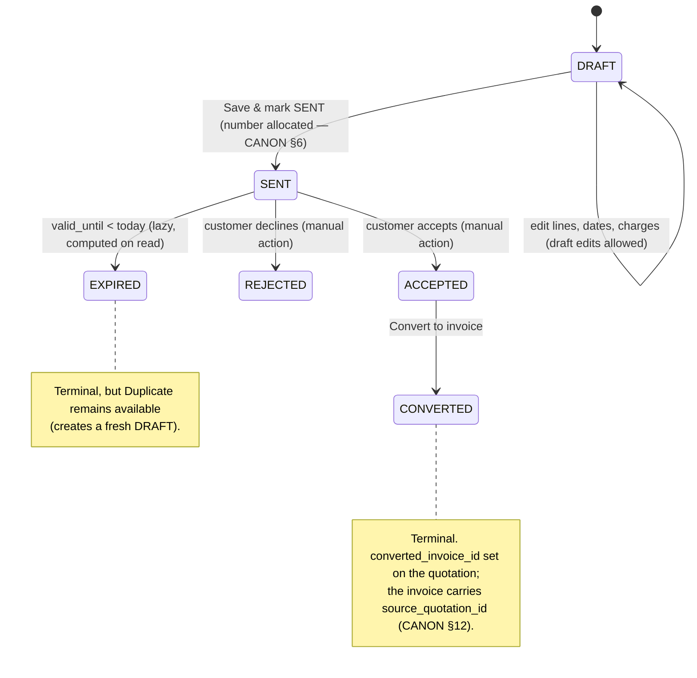

# InvoiceFlow — Quotation Module

> Derived from `docs/_CANON.md` (§4 money rules, §5 GST domain, §6 numbering, §7 `quotations`/`quotation_items`, §9 sync, §12 quotation lifecycle, §13 PDF, §15 editor UX). If any statement here appears to deviate from CANON, CANON wins and this doc must be corrected.

## 1. Purpose

Specify the quotation feature end-to-end: the `DRAFT → SENT → ACCEPTED / REJECTED → CONVERTED` lifecycle with lazy `EXPIRED`, the shared document editor, provisional vs final numbering, exact integer money math (with a complete worked example), duplicate and PDF flows, and the convert-to-invoice transaction. A quotation is a negotiable, payment-free document: its complexity is entirely in state management and in getting the tax math exactly right the first time.

## 2. Scope

Covers: quotation CRUD and lifecycle, the editor (shared line-item engine), numbering, totals computation (worked example), duplicate, PDF, conversion to invoice, immutability rules, offline/online behavior, and error handling. Does **not** cover GST formula derivations (`docs/13-GST-MODULE.md`), invoice-specific behavior (`docs/12-INVOICE-MODULE.md`), PDF layout internals (`docs/14-PDF-GENERATION.md`), or sync mechanics (`docs/17-SYNC-ENGINE.md`).

## 3. Business requirements

1. **Send-ready estimates** — a quotation is a draft the user can iterate on freely, then *mark SENT* to freeze content and track the customer's decision (CANON §12).
2. **Track outcomes** — ACCEPTED, REJECTED, EXPIRED (computed when `valid_until < today` and not converted) are first-class statuses; ACCEPTED quotations convert into invoice drafts with one action.
3. **Numbering discipline** — drafts carry clearly provisional numbers; marking SENT allocates a real `QT/{FY}/{seq4}` number; numbers never decrement or get reused (CANON §6).
4. **Exact money** — every total is integer paise math via the shared `computeDocumentTotals`, identical client and server, server-authoritative (CANON §4).
5. **Convert, don't retype** — conversion copies items, charges, notes, and terms into a new invoice DRAFT and records the lineage on both documents (CANON §12).
6. **History is immutable** — after SENT, only status transitions happen; corrections happen by duplicating into a fresh draft (CANON §10 #6, §12).
7. **Offline-first** — create, edit, mark SENT (with local number allocation), convert, and export PDF all work with zero network (CANON §1).

## 4. Technical design

### 4.1 Lifecycle



Rules (CANON §12):

- **Draft edits allowed** — lines, dates, charges, customer, everything; each save is a whole-document upsert (header + items replaced atomically).
- **After SENT, only status transitions.** Content is frozen (§4.6). ACCEPTED/REJECTED are recorded by explicit user actions on the quotation detail page.
- **EXPIRED is computed, not an event**: `effectiveStatusOf(quotation, today)` returns `EXPIRED` when `status = SENT` (or `ACCEPTED`, unconverted) and `valid_until < today`; lists, reports, and detail pages evaluate it lazily on read (docs/03). The persisted status flips opportunistically (app-start sweep / user action), enqueuing a status-only upsert with an `audit_logs(action='STATUS')` row.
- **Terminal states:** CONVERTED and EXPIRED accept no further transitions. **Duplicate is allowed from any state** (CANON §12) — see §4.5.
- Every transition validates locally (Zod + state check) **and** server-side, and writes an `audit_logs` row (CANON §12).

### 4.2 Editor UX (shared document editor, `kind: 'quotation'`)

One controlled-state editor serves both document kinds (CANON §15 — RHF+zod is reserved for customer/product/company/auth forms; the dynamic line-item editor uses controlled state by documented choice). Routes: `#/quotations`, `#/quotations/new`, `#/quotations/:id`.

- **Customer picker** (+ quick-create inline form) — sets `customer_id`, snapshots `customer_name_snapshot` / `customer_gstin_snapshot`, and defaults `place_of_supply_code` from the customer's `state_code` (CANON §5; user-overridable per document).
- **Dates** — `quotation_date` (default today, `YYYY-MM-DD` strings everywhere, CANON §3) and `valid_until` (optional; a warning appears if `valid_until < quotation_date`).
- **Place of supply** — state picker over `INDIAN_STATES`; the selection snapshots `tax_mode = INTRA | INTER` (supplier `state_code` vs place-of-supply code, CANON §5).
- **Line items** — product picker per line fills description, HSN/SAC, unit, price, GST rate, and stamps `product_id` (docs/10 §4.4); each line edits `qty_milli` (decimal entry ×1000, shown as 2–3 dp), `unit_price_paise` (rupee input), `discount_bps` (percent input, 0–100), `gst_rate_bps` (preset/custom); lines reorder (drag handle / up-down) and delete.
- **Charges** — repeatable list `{ label, amount_paise, taxable: bool, gst_rate_bps }` (e.g., freight, packing); charge tax computes by the same CANON §4 rule.
- **Tax-inclusive toggle** — document-level switch initialized from the company profile's `price_includes_tax`, snapshotted on the document and per line (`price_includes_tax` snapshot, CANON §7); toggling recomputes every line live under the new branch.
- **Live totals panel** — Subtotal, Discount, Taxable value, CGST, SGST/UTGST, IGST (zeroed when unused), charges + charge tax, Round-off, **Grand Total**, Amount in words (Indian numbering, CANON §4) — recomputed on every keystroke by `computeDocumentTotals`.
- **Notes & terms** — prefilled from `company_profiles.default_notes` / `default_terms`.
- **Actions:** **Save draft** (stays DRAFT, keeps provisional number) and **Save & mark SENT** (draft-validating then the finalize transition, §4.3); a **Provisional number** badge (`DRAFT-xxxxxxxx`) is always visible on unsent drafts; Preview PDF opens the blob viewer (§4.5).

### 4.3 Numbering (provisional drafts, QT allocation on SENT)

- **Drafts:** `DRAFT-<8 random chars>` — generated at draft creation (`crypto`-based, uppercase alphanumerics), clearly badged provisional in UI and PDF preview (CANON §6).
- **Mark SENT allocates the real number** — the quotation's finalize moment (outbox action `finalize`, `doc_type: 'QUOTATION'`):
  - **Online:** the server allocates from `document_sequences(workspace_id, 'QUOTATION', fiscal_year, next_seq)` inside a serializable transaction and returns the number in the op result; **the server number always wins** and is audit-logged (CANON §6).
  - **Offline:** the client allocates locally in a Dexie transaction (increment `next_seq`, never decrementing) and stamps `finalized_at`; on push the server re-validates — if its sequence is behind, it fast-forwards and adopts the client's number; if that number was already issued, the server issues the next free one and answers `status: 'applied'` with `notice: 'number_reassigned'`, which the client must adopt (the document is immutable once SENT; docs/18 documents the UI notice).
- Format `{quotation_prefix}/{FY}/{seq4}` → `QT/2025-26/0042` (prefix from `company_profiles.quotation_prefix`, default `QT`; fiscal year April–March via `fiscalYearOf`). Prefix changes affect only future allocations; SENT quotations keep their numbers forever.

### 4.4 Worked numeric example (exact integer math, CANON §4)

Setup — supplier in Maharashtra (`state_code 27`); customer in Maharashtra (place of supply `27` ⇒ **intra-state**, exclusive pricing, 18% GST, round-off on). Two lines and one charge:

| # | Item | qty_milli | unit_price_paise | discount_bps | gst_rate_bps |
|---|---|---:|---:|---:|---:|
| 1 | retainer_svc | 2000 (2 × NOS) | 50000 (₹500.00) | 0 | 1800 |
| 2 | hourly_svc | 3000 (3 × NOS) | 33333 (₹333.33) | 500 (5%) | 1800 |
| — | Charge "Delivery" | — | amount_paise 5000 (₹50.00), taxable, 1800 bps | | |

`roundHalfUp(x) = Math.floor(x + 0.5)` (CANON §4). Step by step:

```
Item 1
1. gross      = rHU(2000 × 50000 / 1000)  = 100000            (₹1,000.00)
2. discount   = rHU(100000 × 0 / 10000)   = 0     → after disc = 100000
3. exclusive  : taxable = 100000
   taxCombined= rHU(100000 × 1800 / 10000) = 18000 → lineTotal = 118000
4. intra      : cgst = rHU(18000 / 2) = 9000 ; sgst = 18000 − 9000 = 9000

Item 2
1. gross      = rHU(3000 × 33333 / 1000)  = 99999             (₹999.99)
2. discount   = rHU(99999 × 500 / 10000)  = rHU(4999.95) = 5000 → after disc = 94999
3. exclusive  : taxable = 94999
   taxCombined= rHU(94999 × 1800 / 10000) = rHU(17099.82) = 17100 → lineTotal = 112099
4. intra      : cgst = rHU(17100 / 2) = 8550 ; sgst = 17100 − 8550 = 8550

Charge: chargeTax = rHU(5000 × 1800 / 10000) = 900
```

Document totals (CANON §4 "Document totals"):

```
subtotalGross = 100000 + 99999                 = 199999  (₹1,999.99)
discountTotal = 0 + 5000                       =  5000   (₹50.00)
taxableTotal  = 100000 + 94999                 = 194999  (₹1,949.99)
cgstTotal     = 9000 + 8550                    = 17550   (₹175.50)
sgstTotal     = 9000 + 8550                    = 17550   (₹175.50)
igstTotal     = 0
chargesTotal  = 5000 ; chargesTaxTotal         =   900   (₹9.00)
grandTotalRaw = 194999 + 17550 + 17550 + 5000 + 900 = 235999  (₹2,359.99)
round-off     : grandTotal = rHU(235999 / 100) × 100 = 236000 (₹2,360.00)
                roundOff = 236000 − 235999 = +1            (₹0.01)
```

Amount in words: **"Rupees Two Thousand Three Hundred and Sixty Only"**. This exact document (raw `235999`, round-off `+1`, grand total `236000`) is the canonical fixture reused by docs/35 (domain unit tests) and docs/36 (offline walkthrough). The server recomputes all of the above on push and overwrites client numbers (CANON §9 rule 4) — for identical payloads the recomputation is bit-identical.

### 4.5 Duplicate & PDF

- **Duplicate** (available in every status, CANON §12): creates a **fresh DRAFT** with a new `id` and a new provisional number, copying customer (re-snapshotted from the live customer record), items, charges, place of supply, pricing mode, notes, and terms; `status`, `number` (final), `finalized_at`, `converted_invoice_id` are never copied. The copy is a normal draft upsert — no lineage field is recorded (CANON defines `source_quotation_id` for invoices only).
- **PDF** (docs/14): title **QUOTATION** via the shared `UnifiedDocumentModel`; totals exclusively from the domain engine; no bank block (invoices only, CANON §13); `Rs.` prefix instead of the ₹ glyph (jsPDF core-font limitation, CANON §19.1); filename `QT-2025-26-0042.pdf` (slashes → dashes); outputs `save` / `blob` (preview) — `print` is Electron-only.

### 4.6 Immutability after SENT

Once `status ≠ DRAFT`, the document is content-frozen (CANON §12: "after SENT only status transitions"):

- The client disables content editing; the server rejects any pushed `upsert` whose payload (items, charges, dates, totals, customer) differs from the stored record for a non-DRAFT quotation — **status-only diffs** (ACCEPTED / REJECTED / opportunistic EXPIRED) are applied, anything else is `rejected` with an explanatory error (mirroring the CANON §9 rule 5 stance for invoices).
- Numbers, totals, and items never change after SENT; `version` bumps only on status transitions. Corrections = **Duplicate → edit → re-send** (a new quotation with a new number).
- Deletion: drafts may be soft-deleted; SENT-and-beyond quotations cannot be deleted (deletion is not a status transition; the same conservatism as CANON §9 rule 5).

### 4.7 Convert to invoice (ACCEPTED → CONVERTED)

One Dexie transaction (docs/16 §4.4 `convertQuotationToInvoice`) — the parent documents must be `ACCEPTED` (CONVERTED is terminal; SENT/REJECTED/EXPIRED refuse conversion):

```mermaid
sequenceDiagram
    autonumber
    actor U as User
    participant UI as Quotation detail (#/quotations/:id)
    participant DOM as Domain + repositories
    participant DB as Dexie (one transaction)
    participant OUT as sync_operations (outbox)
    participant AUD as audit_logs

    U->>UI: Convert to invoice
    UI->>DOM: validate status == ACCEPTED (local Zod + state check)
    DOM->>DB: BEGIN rw(quotations, quotation_items, invoices, invoice_items, audit_logs, sync_operations)
    DOM->>DB: read quotation + items
    DOM->>DB: create invoice DRAFT (new id, provisional number,<br/>items/charges/notes/terms copied,<br/>source_quotation_id = quotation.id,<br/>invoice_date = today, due_date empty)
    DOM->>DB: update quotation: status CONVERTED,<br/>converted_invoice_id = invoice.id
    DOM->>DB: audit(CONVERT on quotation) + audit(CREATE on invoice)
    DOM->>OUT: enqueue op #1 {entity:'invoice', action:'upsert', payload incl. items}
    DOM->>OUT: enqueue op #2 {entity:'quotation', action:'upsert', status-only}
    DOM->>DB: COMMIT (all-or-nothing)
    DB-->>UI: { invoiceId } → navigate #/invoices/:id (still DRAFT)
    Note over OUT,AUD: Ops drain per docs/17; server recomputes totals (CANON §9 rule 4),<br/>re-validates ACCEPTED→CONVERTED, and appends ChangeLog rows for both documents.
```

The converted invoice is an ordinary **DRAFT**: the user reviews, sets the due date, and finalizes it separately (docs/12 §4.2) — conversion never auto-finalizes and never allocates an invoice number (CANON §12).

## 5. Data models

`quotations` (CANON §7): `number`, `status` (`DRAFT|SENT|ACCEPTED|REJECTED|EXPIRED|CONVERTED`), `quotation_date` (`YYYY-MM-DD`), `valid_until?`, `customer_id` (req), `customer_name_snapshot`, `customer_gstin_snapshot?`, `place_of_supply_code`, `tax_mode` (`INTRA|INTER` snapshot), `price_includes_tax` (snapshot bool), snapshot totals `subtotal_gross_paise, discount_total_paise, taxable_total_paise, cgst_paise, sgst_paise, igst_paise, charges_total_paise, charges_tax_paise, round_off_paise, grand_total_paise`, `charges_json` (stringified `DocCharge[]`: `{ id, label, amount_paise, taxable, gst_rate_bps }`), `notes?`, `terms?`, `converted_invoice_id?`, `finalized_at?` — plus the common metadata block (CANON §3).

`quotation_items`: `quotation_id`, `position` (int), `description`, `hsn_sac?`, `qty_milli`, `unit?`, `unit_price_paise`, `discount_bps`, `gst_rate_bps`, computed snapshots `gross_paise, discount_paise, taxable_paise, cgst_paise, sgst_paise, igst_paise, tax_paise, total_paise`, `price_includes_tax` (snapshot), and the optional `product_id` linkage documented in docs/10 §4.4.

Dexie indexes (CANON §7): `quotations: id, workspace_id, number, status, quotation_date, customer_id, sync_state, updated_at, deleted_at, [workspace_id+status], [workspace_id+deleted_at]`; `quotation_items: id, quotation_id, workspace_id, [quotation_id]`.

## 6. API contracts

Quotations travel exclusively through the sync contract (CANON §9, §14) — there is no dedicated REST endpoint:

- **Ops:** `upsert` (create/edit DRAFT, status transitions incl. CONVERTED pairing with the invoice op, soft `delete` of drafts), `finalize` (mark SENT — server allocates the `QT` number per §4.3), embedded items inside the payload ("full record, items embedded for documents").
- **Push results:** `applied` / `duplicate` (idempotent replay via `ProcessedOp`) / `conflict` (CAS on `base_version`; two devices finalizing the same draft → first wins, second adopts the server record — CANON §10 #4) / `rejected` (validation, illegal transition, non-DRAFT content edit) / `number_reassigned` (offline number clash — §4.3).
- **Pull:** `entity: 'quotation'` changes (full record incl. items) converge paired devices; pending local ops for the same id are skipped at pull time (CANON §9).
- Server-side guarantees on every apply: Zod revalidation, membership/role ≥ MEMBER, totals recomputed from items (rule 4), ChangeLog append + `version` bump. Errors `{ error, code? }` with CANON §14 status codes; full contracts in docs/30-API-DESIGN.md.

## 7. Offline behavior

- Every feature works offline: create/edit drafts, duplicate, mark SENT (local sequence allocation, §4.3), convert to invoice, EXPIRED evaluation (local clock), PDF export.
- The outbox drains on reconnect; `number_reassigned` is adopted silently-in-UI-with-notice (badge + toast per docs/18/23) — the number changes only if the server proves a clash, and document content never changes.
- EXPIRED uses the device clock; a wrong clock can compute EXPIRED early/late locally, but the server re-validates every persisted transition (wrong-clock EXPIRED persistence is rejected as an illegal transition rather than corrupting data).
- Offline conflict on finalize follows CANON §10 #4 (first finalize wins; the loser receives `conflict` and adopts the server record).

## 8. Online behavior

- The engine pushes on the usual triggers (online event, focus, post-mutation, 30 s interval, manual — docs/17): finalize ops get server-allocated numbers; status transitions re-validate; conversion ops land as a pair and other devices see both documents after one pull.
- Lists re-render from pull results with the server's numbers/totals (`sync_state='synced'`, green pill).
- When the workspace is cloud-linked and online, the "Save & mark SENT" button waits for the push result before rendering the final number (spinner state on the number chip) — online documents therefore never need `number_reassigned` adoption.

## 9. Security considerations

- Zod validation on both ends (shared schemas); the server recomputes totals and re-validates every state transition — the client can never mint a totals or status change by editing payloads (CANON §9/§16).
- Tenancy: every op is workspace-scoped with membership/role ≥ MEMBER; RLS mirrors it in production (docs/06 §5).
- Snapshots (`customer_name_snapshot`, `customer_gstin_snapshot`) render XSS-safe via React text nodes; `charges_json` parses through the shared Zod schema before any render.
- Audit completeness: CREATE / UPDATE / FINALIZE / CONVERT / STATUS / DELETE rows with `device_id` on every quotation mutation (CANON §7, §16).
- No quotation content is exposed via GET endpoints or URLs; documents move only inside the authenticated sync channel (docs/07).

## 10. Error-handling rules

| Scenario | Detection | Response |
|---|---|---|
| Mark SENT with no customer / no lines / all-zero qty | Domain validation at finalize | Blocking dialog listing the problems; document stays DRAFT |
| `valid_until < quotation_date` | Form check | Non-blocking warning before save |
| Convert on non-ACCEPTED quotation | Client state check + server re-validation | Action hidden client-side; server `rejected` with reason if forced |
| Content edit after SENT | Client disables editor; server diff check | Impossible locally; a forged push is `rejected` (§4.6) |
| Two devices finalize the same draft | CAS `base_version` | First wins; second gets `conflict` + server record (adopt or resolve in conflict UI) — CANON §10 #4 |
| Offline number clash on push | Server sequence check | `number_reassigned`: client adopts the new number, audit trail kept, toast notice (§4.3) |
| Push validation failure (e.g., corrupted payload) | Server Zod | Op `failed` with the error visible in Settings → Sync; never silently dropped; user edit/retry |
| Not signed in / workspace unlinked | Engine guard | Ops stay `pending`; drain after claim/login (docs/17) |
| Clock skew affecting EXPIRED | Local `effectiveStatusOf` | Display-only locally; persisted transitions re-validated server-side |

## 11. Acceptance criteria

- [ ] The state machine of §4.1 is enforced end-to-end: draft edits always allowed; SENT freezes content; ACCEPTED/REJECTED/CONVERTED/EXPIRED transitions only from legal predecessors; every transition writes an audit row.
- [ ] New drafts display `DRAFT-xxxxxxxx` with a provisional badge; "Save & mark SENT" online yields a `QT/{FY}/{seq4}` number allocated by the server; offline it yields a locally allocated number that survives push or is reassigned with a notice per CANON §6.
- [ ] The worked example of §4.4 reproduces bit-exactly through the domain engine (client and server): every snapshot column, `grandTotalRaw 235999`, round-off `+1`, grand total `236000`, and the in-words line.
- [ ] The live totals panel updates on every keystroke and switches correctly between tax-exclusive and tax-inclusive branches (per CANON §4) when the toggle flips.
- [ ] Place of supply defaults to the customer's billing state and can be overridden; the `tax_mode` snapshot reflects supplier vs place-of-supply comparison at save.
- [ ] Duplicate works from any status and produces a fresh editable DRAFT with a new provisional number and no copied final number/status/lineage.
- [ ] The PDF renders QUOTATION via the UnifiedDocumentModel (no bank block, `Rs.` prefix) with a filename derived from the final number.
- [ ] Convert-to-invoice from ACCEPTED creates one invoice DRAFT (items/charges/notes/terms copied, `source_quotation_id` set), sets the quotation to CONVERTED with `converted_invoice_id`, enqueues both ops, audits both documents, and navigates to the new draft — all atomically (rollback test: forcing a failure mid-conversion leaves both documents untouched, docs/35).
- [ ] After SENT, the editor is read-only and any non-status server push is rejected; status-only transitions continue to work offline and online.
- [ ] EXPIRED is computed lazily on read for lists/detail/reports and persists only through a validated status transition.

## 12. References

CANON §1, §3, §4, §5, §6, §7, §9, §10, §12, §13, §15, §16, §19.1; docs/08-COMPANY-MANAGEMENT.md (prefixes, defaults); docs/09-CUSTOMER-MANAGEMENT.md (picker, snapshots); docs/10-PRODUCT-SERVICE-MANAGEMENT.md (picker, `product_id`); docs/12-INVOICE-MODULE.md (conversion target, finalize); docs/13-GST-MODULE.md (formulas); docs/14-PDF-GENERATION.md; docs/16-INDEXEDDB-DATABASE.md (transaction patterns); docs/17-SYNC-ENGINE.md; docs/18-CONFLICT-RESOLUTION.md; docs/20-DASHBOARD.md (quotation KPIs); docs/21-REPORTS.md; docs/23-NOTIFICATIONS.md; docs/29-SECURITY.md; docs/30-API-DESIGN.md; docs/32-ROUTES.md; docs/35-TESTING.md; docs/36-OFFLINE-TESTING.md.
