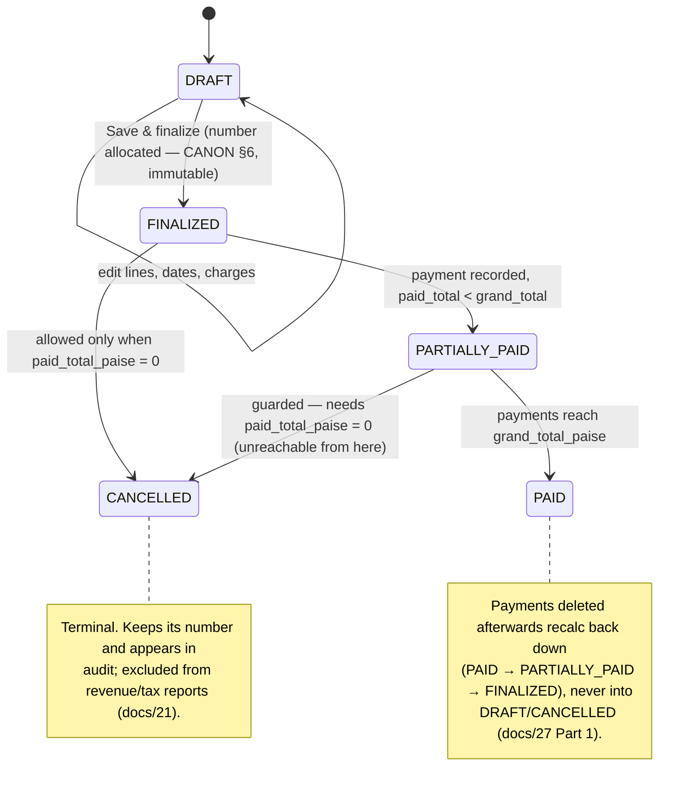

# InvoiceFlow — Invoice Module

> Derived from `docs/_CANON.md` (§4 money rules, §6 numbering, §7 `invoices`/`invoice_items`/`payments`, §9 sync, §12 invoice lifecycle, §13 PDF, §15 editor UX) and the manual-payment contract of `docs/27-PAYMENT-INTEGRATION.md`. If any statement here appears to deviate from CANON, CANON wins and this doc must be corrected.

## 1. Purpose

Specify the invoice feature end-to-end: the `DRAFT → FINALIZED → PARTIALLY_PAID → PAID` lifecycle with the guarded `CANCELLED` transition and future `VOIDED`, the shared editor with due dates, the finalize flow (online server allocation, offline local allocation, and the `number_reassigned` case), payment recording with status recalculation, duplicate/PDF/conversion flows, and the immutability + correction workflow. The invoice is the app's money document — every rule here exists to keep `grand_total_paise` and `paid_total_paise` trustworthy forever.

## 2. Scope

Covers: invoice CRUD and lifecycle, editor behavior (shared line-item engine), finalize/numbering, payments (manual recording, allocation, history), duplicate, PDF, quotation conversion, immutability and corrections, offline/online behavior, and error handling. Does **not** cover GST formula derivations (`docs/13-GST-MODULE.md`), quotation-side behavior (`docs/11-QUOTATION-MODULE.md`), PDF layout internals (`docs/14-PDF-GENERATION.md`), gateway collection (designed extension — docs/27), or sync mechanics (`docs/17-SYNC-ENGINE.md`).

## 3. Business requirements

1. **Finality with a paper trail** — finalizing allocates a real `{prefix}/{FY}/{seq4}` number and freezes content; numbers are never reused, and cancelled invoices keep theirs (CANON §6, §12).
2. **Collectible state** — payment state is always derivable: `paid_total_paise` is a computed snapshot of the payments of record, recalculated by the server on every push (CANON §9 rule 4; docs/27 BR-2).
3. **Partial payments are normal** — any number of payments of any size (≤ balance) move the invoice FINALIZED → PARTIALLY_PAID → PAID; overpayment is allowed and shown as Advance (docs/27 BR-3).
4. **Cancellation is safe** — an invoice may be cancelled only when nothing has been paid (`paid_total_paise = 0`); otherwise the action is blocked with an explanation (CANON §12).
5. **Corrections without edits** — finalized documents are immutable; fixes happen by duplicate → edit → reissue (CANON §10 #6, §12).
6. **From quote to cash in one click** — an ACCEPTED quotation converts into an invoice DRAFT carrying full lineage (`source_quotation_id` ↔ `converted_invoice_id`, CANON §12).
7. **Offline-first cash register** — finalize, record payments, and export the TAX INVOICE PDF all work with zero network (CANON §1).

## 4. Technical design

### 4.1 Lifecycle



Rules (CANON §12):

- **DRAFT** — provisional number `DRAFT-xxxxxxxx`, fully editable, deletable.
- **FINALIZED** — real number allocated (§4.3), content immutable; `finalized_at` stamped.
- **PARTIALLY_PAID / PAID** — payment-driven (`0 < paid_total < grand_total` / `paid_total ≥ grand_total`); the server recalculates both the total and the status from `payments` on every push.
- **CANCELLED** — reachable from FINALIZED (and PARTIALLY_PAID in principle) **only when `paid_total_paise = 0`**; with payments present the cancel is blocked client- and server-side with the payments explanation. CANCELLED is terminal; `cancelled_at` stamped; the number is never released.
- **VOIDED is a future status** — named in CANON §7 but not in the MVP enum; schema/UI leave room for it (e.g., for nil-valued corrections) without reinterpreting existing records.
- **Duplicate is allowed from any state** — creates a fresh DRAFT (§4.6). All transitions validate locally (Zod + state checks) and server-side, and write `audit_logs` rows.

### 4.2 Editor (`#/invoices/new`, `#/invoices/:id`; shared engine `kind: 'invoice'`)

The editor is the shared document editor of docs/11 §4.2 (customer picker + quick-create, line items with `qty_milli` / `unit_price_paise` / `discount_bps` / `gst_rate_bps`, charges, place of supply, tax-inclusive toggle, live totals panel, prefilled notes/terms, controlled state). Invoice-specifics:

- **Dates** — `invoice_date` (default today) and **`due_date`** (optional, `YYYY-MM-DD`). Overdue is computed as `days_past_due = max(0, daysBetween(today, due_date))`, anchoring on `invoice_date` when `due_date` is empty — the exact convention used by the dashboard (docs/20) and Outstanding report (docs/21).
- **Actions** — **Save draft** and **Save & finalize** (§4.3). A converted draft shows a **"From quotation QT/…"** lineage chip linking back (§4.7).
- **Payments panel** (FINALIZED and beyond) — balance, Record payment button, and the payment history table (§4.4).
- **Live totals** — identical engine and semantics as quotations (CANON §4; worked example in docs/11 §4.4 is the canonical fixture for both editors).
- Validation at finalize: ≥ 1 line with non-zero qty, customer present; the same draft-validating gate as quotations.

### 4.3 Finalize & numbering (online, offline, and `number_reassigned`)

```mermaid
sequenceDiagram
    autonumber
    actor U as User
    participant ED as Invoice editor
    participant DB as Dexie (local)
    participant SEQ as document_sequences
    participant OUT as sync_operations
    participant API as POST /api/sync/push
    participant SRV as Server (serializable tx)

    U->>ED: Save & finalize
    ED->>ED: Domain validation (Zod + state check)
    alt Online
        ED->>DB: enqueue op {entity:'invoice', action:'finalize', base_version, payload incl. items}
        OUT->>API: push (batch ≤ 25, docs/17)
        API->>SRV: idempotency (ProcessedOp) · Zod · membership ≥ MEMBER · CAS base_version
        SRV->>SRV: recompute ALL totals from items (CANON §9 rule 4)
        SRV->>SEQ: allocate {prefix}/{FY}/{seq4} in serializable transaction
        SRV->>SRV: stamp status FINALIZED + finalized_at · ChangeLog · audit(FINALIZE)
        API-->>OUT: {status:'applied', record:{number:'INV/2025-26/0042', …}}
        OUT->>DB: adopt server record (number, FINALIZED, sync_state='synced'); op done
        ED-->>U: shows INV/2025-26/0042 (server number always wins — CANON §6)
    else Offline
        ED->>DB: BEGIN rw(invoices, invoice_items, document_sequences, audit_logs, sync_operations)
        ED->>SEQ: read/insert (INVOICE, FY) row → number = {prefix}/{FY}/{pad4(next_seq)} · next_seq + 1 (never decrements)
        ED->>DB: invoice → FINALIZED + finalized_at · audit(FINALIZE) · enqueue finalize op
        ED->>DB: COMMIT (all-or-nothing — docs/16 §4.4)
        ED-->>U: shows locally allocated number immediately
        Note over OUT,API: on reconnect, the same finalize op is pushed…
        OUT->>API: push finalize op
        alt Server sequence behind (number free)
            SRV-->>OUT: {status:'applied'} — server fast-forwards its sequence, adopts client number
        else Server already issued that number
            SRV-->>OUT: {status:'applied', notice:'number_reassigned', record:{number:'INV/2025-26/0043', …}}
            OUT->>DB: adopt the reassigned number (document immutable; audit logged)
            ED-->>U: toast notice — number changed (docs/18)
        end
    end
```

- Format `{invoice_prefix}/{FY}/{seq4}` → `INV/2025-26/0042` (prefix from `company_profiles.invoice_prefix`, default `INV`; FY April–March). Changing a prefix affects only future allocations (docs/08 §4.3).
- Sequences never decrement; CANCELLED invoices keep their numbers (CANON §6). Two devices finalizing the same draft: first finalize wins by CAS; the second receives `conflict` and adopts the server record (CANON §10 #4).

### 4.4 Payments (record dialog, recalc, partials, history)

Eligibility: `status ∈ (FINALIZED, PARTIALLY_PAID, PAID)` — DRAFT and CANCELLED refuse payment recording (docs/27 Part 1).

**Record-payment dialog** (invoice detail and `#/payments`):

| Field | Rule |
|---|---|
| `amount_paise` | rupee input; integer paise; **`0 < amount ≤ balance`** where `balance = grand_total_paise − paid_total_paise`; a "Pay full balance" shortcut fills it |
| `paid_at` | `YYYY-MM-DD`, default today (CANON §3) |
| `method` | enum `CASH \| BANK_TRANSFER \| UPI \| CHEQUE \| CARD \| OTHER` (CANON §7) |
| `reference` | optional free text (UTR / cheque no.) |
| `notes` | optional free text |

**Allocation & status recalc** (shared client/server via the domain engine; server recomputation authoritative — docs/27 Part 1):

```
paid_total_paise = Σ payments.amount_paise   (same invoice, deleted_at IS NULL)
status : paid_total ≥ grand_total_paise  → 'PAID'
         paid_total > 0                  → 'PARTIALLY_PAID'
         paid_total = 0 (after deletes)  → 'FINALIZED'   # never DRAFT/CANCELLED
displayed balance = grand_total_paise − paid_total_paise  (may be negative → shown as "Advance", never clamped)
```

Worked example (the canonical invoice of docs/11 §4.4, grand total `236000` = ₹2,360.00): record `100000` (₹1,000.00, UPI) → `PARTIALLY_PAID`, balance `136000`; record `136000` (₹1,360.00, BANK_TRANSFER) → `PAID`, balance `0`. Deleting the second payment recalcs back to `PARTIALLY_PAID` with balance `136000` — both directions audited (`audit_logs(action='PAYMENT')`).

**Write pattern:** each payment write is one Dexie transaction = payment row + parent-invoice `paid_total`/status recalculation + audit + **two outbox ops** (`payment` upsert + parent `invoice` upsert); the server recomputes `paid_total`/status from the payments of record on push (docs/16 §4.4, docs/27).

**Partial payments & history:** any number of payments accumulate; the invoice detail shows the full history (date, method, reference, amount, deleting member's device) with soft-delete allowed per payment (recalc runs both ways); `#/payments` lists all payments workspace-wide with date filters (CANON §15). Gateway collection is a designed extension reusing this exact allocation (docs/27 Part 2).

### 4.5 Duplicate & PDF

- **Duplicate** from any state → fresh DRAFT: new `id`, new provisional number, items/charges/notes/terms copied; customer re-snapshotted from the live record; `status`, final number, `finalized_at`, `paid_total_paise`, `cancelled_at`, and lineage fields never copied.
- **PDF** (docs/14): title **TAX INVOICE** via the `UnifiedDocumentModel`; bank block from the company profile; amount in words; totals exclusively from the domain engine; `Rs.` prefix (core-font limitation, CANON §19.1); filename `INV-2025-26-0042.pdf` (slashes → dashes); `save` / `blob` / Electron `print`. Payment state can appear as a "Paid: ₹X" annotation; the authoritative register stays the app, not the PDF.

### 4.6 Immutability & correction workflow (duplicate → edit → reissue)

- After FINALIZE the content is immutable: the client disables the editor; the server rejects `upsert`/`delete` on FINALIZED/PAID/CANCELLED invoices — only `cancel` and `payment` ops are accepted (CANON §9 rule 5). `version` moves only via payments, cancel, or server-side recalc.
- **Correction workflow** (CANON §10 #6): **Duplicate** the invoice → edit the draft (fix items/quantities/customer) → **finalize** (new number) → the wrong invoice is handled financially: cancel it if `paid_total = 0`, otherwise leave it in its payment state (money must keep its records) and, if appropriate, record a negative-balance arrangement via the replacement. InvoiceFlow never edits a live invoice's numbers, and never silently merges financial changes (CANON §10).
- Cancellation keeps the number and writes `audit_logs(action='CANCEL')` + `cancelled_at`; the audit chain makes the correction history reconstructible.

### 4.7 Conversion from quotation

From an **ACCEPTED** quotation (docs/11 §4.7): one Dexie transaction creates the invoice **DRAFT** with items/charges/notes/terms copied and `source_quotation_id` set, flips the quotation to `CONVERTED` with `converted_invoice_id`, enqueues both ops, and audits both documents. The draft then follows the ordinary finalize path (§4.3). Conversion never auto-finalizes and never allocates an invoice number (CANON §12).

## 5. Data models

`invoices` (CANON §7): mirrors `quotations` plus `status` (`DRAFT|FINALIZED|PARTIALLY_PAID|PAID|CANCELLED`; `VOIDED` future), `invoice_date`, `due_date?`, `paid_total_paise` (default 0), `source_quotation_id?`, `cancelled_at?` — plus the shared header fields (`number`, `customer_id`, `customer_name_snapshot`, `customer_gstin_snapshot?`, `place_of_supply_code`, `tax_mode`, `price_includes_tax`, all snapshot totals, `charges_json`, `notes?`, `terms?`, `finalized_at?`) and common metadata (CANON §3).

`invoice_items`: mirrors `quotation_items` (`invoice_id`, `position`, description/HSN-SAC/qty/unit/price/discount/rate, computed snapshots, `price_includes_tax`, optional `product_id` per docs/10 §4.4).

`payments` (CANON §7): `invoice_id` (req), `amount_paise` (> 0 integer), `paid_at` (`YYYY-MM-DD`), `method` (`CASH|BANK_TRANSFER|UPI|CHEQUE|CARD|OTHER`), `reference?`, `notes?` + metadata (soft-deletable).

Dexie indexes (CANON §7): `invoices: id, workspace_id, number, status, invoice_date, due_date, customer_id, sync_state, updated_at, deleted_at, [workspace_id+status], [workspace_id+deleted_at]`; `invoice_items: id, invoice_id, workspace_id, [invoice_id]`; `payments: id, workspace_id, invoice_id, paid_at, sync_state, updated_at, deleted_at, [workspace_id+paid_at], [invoice_id]`.

## 6. API contracts

Invoices and payments ride the sync contract (CANON §9, §14) — no dedicated REST endpoints in MVP:

- **Ops:** `upsert` (draft create/edit; draft soft-delete), `finalize` (number allocation, §4.3), `cancel` (guarded by `paid_total = 0` server-side), `payment` entity ops paired with parent `invoice` upserts (§4.4). Items travel embedded in the payload.
- **Push results:** `applied` / `duplicate` (ProcessedOp idempotency) / `conflict` (CAS; two-device finalize → CANON §10 #4) / `rejected` (validation, immutable-content edit, cancel-with-payments, payment on DRAFT/CANCELLED) / `number_reassigned` (§4.3).
- **Server rules on every apply (CANON §9):** Zod revalidation; membership/role ≥ MEMBER; totals recomputed from items and client numbers overwritten; FINALIZED/PAID reject `upsert`/`delete`; `cancel` blocked when payments exist; ChangeLog + `version` bump.
- **Pull:** `entity: 'invoice' | 'payment'` changes converge paired devices; payments recorded by a future gateway arrive through the same pull (docs/27 Part 2).
- Errors `{ error, code? }` per CANON §14; full contracts in docs/30-API-DESIGN.md.

## 7. Offline behavior

- Everything except gateway features works offline: drafts, finalize with local sequence allocation (one-transaction rule, docs/16 §4.4), payments with local recalc, duplicate, convert, cancel (guarded), PDF.
- `number_reassigned` adoption is the only offline-to-online correction a finalized invoice ever receives — content never changes, only the number (§4.3), surfaced with a toast and audit trail (docs/18, docs/23).
- Payment state stays locally consistent across edits/deletes via the recalc rule; the server's recomputation on push is authoritative and, for identical payment sets, bit-identical to the client's (docs/35 fixture).
- Overdue badges compute from the local clock for display; reports use the same pure function so a wrong clock degrades gracefully and never corrupts stored data.

## 8. Online behavior

- Online finalize waits for the server-allocated number before rendering it (spinner on the number chip); the server number always wins and is audit-logged (CANON §6).
- Push revalidates everything (Zod, membership, CAS, recompute); conflicts surface in Settings → Sync → Conflicts per CANON §10; every resolution writes `SYNC_CONFLICT` audit rows.
- Payments recorded on any device converge on pull; `paid_total_paise` and status arrive recomputed from the server's payments of record, keeping all devices identical after one sync cycle.
- Concurrent offline-recorded payment + online payment from another device: both land, the server sums the payments of record — the total is always the exact sum of the records (docs/27).

## 9. Security considerations

- Money integrity is server-enforced: totals recomputed per push, `paid_total` derived from payments of record, immutable-after-finalize rejections, cancel guard — the client can never mint state by editing payloads (CANON §9/§16).
- Zod validation on both ends (shared schemas); `charges_json` parsed through the shared schema before any render; XSS-safe React rendering only.
- Tenancy: every op workspace-scoped, membership/role ≥ MEMBER for writes, OWNER/ADMIN for delete; RLS mirrors this in production (docs/06 §5).
- Audit completeness: CREATE / UPDATE / FINALIZE / PAYMENT / CANCEL / DELETE rows with `device_id` for every mutation; the correction workflow is fully reconstructible from `audit_logs` (§4.6).
- No invoice or payment data in URLs or logs; documents move only inside the authenticated sync channel (docs/07); gateway secrets (future) stay server-side (docs/27).

## 10. Error-handling rules

| Scenario | Detection | Response |
|---|---|---|
| Finalize with no customer / no lines / zero qty | Domain validation | Blocking dialog; stays DRAFT |
| Payment amount ≤ 0 or > balance | Dialog validation + Zod + server re-check | Inline error; server `rejected` if forced |
| Payment on DRAFT/CANCELLED invoice | Client state check + server rule 5 | Action hidden; forced push `rejected` with reason |
| Cancel with payments present | `paid_total_paise > 0` check client & server | Blocked with the payments explanation (CANON §12) |
| Content edit after finalize | Disabled editor + server diff rejection | Impossible locally; forged push `rejected` (§4.6) |
| Two devices finalize the same draft | CAS `base_version` | First wins; second `conflict` → adopt server record (CANON §10 #4) |
| Offline number clash on push | Server sequence check | `number_reassigned`: adopt new number + notice + audit (§4.3) |
| Payment/invoice CAS race (two devices pay) | CAS on `base_version` | Conflict per CANON §10; resolution never edits amounts — recalc re-derives status (docs/27) |
| Push validation failure / 4xx | Server Zod & rules | Op `failed`, error visible in Settings → Sync; never silently dropped |
| Not signed in / workspace unlinked | Engine guard | Ops stay `pending`; drain after claim/login (docs/17) |

## 11. Acceptance criteria

- [ ] The lifecycle of §4.1 is enforced end-to-end (local + server): DRAFT edits free; FINALIZED immutable; PARTIALLY_PAID/PAID driven by payments; CANCELLED only at `paid_total_paise = 0`; CANCELLED/PAID records keep numbers and audit trails.
- [ ] Online finalize shows the server-allocated `INV/{FY}/{seq4}` number; offline finalize allocates locally in a single transaction and, on push, either keeps its number (server fast-forward) or adopts the `number_reassigned` value with a visible notice — both audited (CANON §6).
- [ ] The payment dialog enforces `0 < amount ≤ balance`, the exact method enum, and `YYYY-MM-DD` dates; "Pay full balance" fills the exact balance.
- [ ] Recording ₹1,000.00 then ₹1,360.00 against the canonical ₹2,360.00 invoice (docs/11 §4.4) moves FINALIZED → PARTIALLY_PAID → PAID with correct balances; deleting the second payment reverts to PARTIALLY_PAID (docs/27 AC-1/AC-3).
- [ ] An overpayment (e.g., ₹2,500.00) marks PAID and displays Advance ₹140.00 without clamping (docs/27 AC-2).
- [ ] Each payment write commits payment + invoice recalc + audit + two outbox ops atomically; the server's recomputed `paid_total` matches the client for identical payment sets (docs/27 AC-4).
- [ ] Cancel is offered only when `paid_total_paise = 0`; attempts with payments are blocked with an explanation on both ends.
- [ ] Duplicate works from any state producing a fresh DRAFT (new provisional number, no copied status/payments/lineage); the duplicate→edit→reissue workflow completes with a new number while the original remains intact and audited.
- [ ] The PDF renders TAX INVOICE with bank details, amount in words, domain-engine totals, and a filename derived from the final number.
- [ ] Converting an ACCEPTED quotation produces the lineage-linked draft (`source_quotation_id` / `converted_invoice_id`) per docs/11 §4.7, and the draft finalizes normally.
- [ ] Overdue display uses `max(0, daysBetween(today, due_date))` anchored on `invoice_date` when `due_date` is empty, matching docs/20/docs/21.

## 12. References

CANON §1, §3, §4, §6, §7, §9, §10, §12, §13, §15, §16, §19.1; docs/08-COMPANY-MANAGEMENT.md (prefixes); docs/09-CUSTOMER-MANAGEMENT.md (picker/snapshots); docs/10-PRODUCT-SERVICE-MANAGEMENT.md (picker, `product_id`); docs/11-QUOTATION-MODULE.md (shared editor, conversion origin, canonical worked example); docs/13-GST-MODULE.md (formulas); docs/14-PDF-GENERATION.md; docs/16-INDEXEDDB-DATABASE.md (finalize/payment transaction patterns); docs/17-SYNC-ENGINE.md; docs/18-CONFLICT-RESOLUTION.md; docs/20-DASHBOARD.md (invoice KPIs); docs/21-REPORTS.md (Sales/Outstanding/GST, overdue anchor); docs/23-NOTIFICATIONS.md (overdue badge, toasts); docs/27-PAYMENT-INTEGRATION.md (payment contract, gateway extension); docs/29-SECURITY.md; docs/30-API-DESIGN.md; docs/32-ROUTES.md; docs/35-TESTING.md; docs/36-OFFLINE-TESTING.md.
