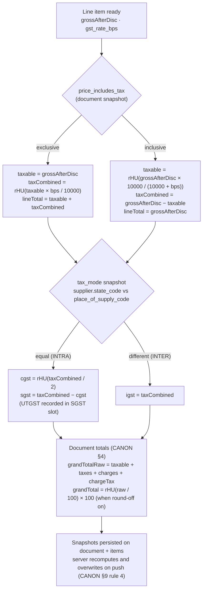

# InvoiceFlow — GST Module

> Derived from `docs/_CANON.md` (§4 money & quantity rules, §5 GST domain, §7 `tax_rates`, §15 UI, §19.2 compliance disclaimer). Per CANON §5, the state/UT table itself lives **only** in `src/lib/domain/gst.ts` (`INDIAN_STATES`) — this doc references it and gives examples, but never re-lists the codes. If any statement here appears to deviate from CANON, CANON wins and this doc must be corrected.

## 1. Purpose

Specify the GST engine in one place: GSTIN validation, the state-code source of truth, the intra vs inter-state decision, the exact half-up CGST/SGST/UTGST/IGST formulas (with intra, inter, and tax-inclusive worked examples, including the odd-paise rule), HSN/SAC handling, place-of-supply selection, round-off, the versioned `tax_rates` table, and the GST summary report outline. Every document (quotation, invoice) and the PDF renderer consume this engine through `computeDocumentTotals` — there is exactly one implementation, shared by client and server (CANON §4).

## 2. Scope

Covers: GST identity validation, tax-mode determination, per-line and per-document tax computation, rate configuration, and GST reporting. Does **not** cover the document editors (`docs/11-`, `docs/12-`), the PDF layout (`docs/14-PDF-GENERATION.md`), the GST **Summary report UI mechanics** (`docs/21-REPORTS.md` — this doc outlines it only), or statutory filing (explicitly out of scope — §3.7, §10).

## 3. Business requirements

1. **One GSTIN validator** — customers, the company profile, and line-item snapshots all validate against the same CANON §5 regex; no second implementation may appear.
2. **Correct split by geography** — the only input to the CGST+SGST-vs-IGST decision is `supplier.state_code == place_of_supply_code` (CANON §5).
3. **Paise-exact math** — integer arithmetic with half-up rounding on the paise; odd paise in the CGST/SGST split always land in SGST/UTGST (CANON §4).
4. **Configurable rates** — rates are configurable per product and per workspace default, with a versioned rate-history table; documents snapshot the numeric rate so old documents never re-interpret (CANON §5, §7).
5. **Human-unit inputs, machine-unit storage** — the UI edits rupees/percent; storage is paise/bps exclusively (CANON §4).
6. **Reports reconcile monthly liability** — the GST Summary groups finalized invoices by month with explicit CGST / SGST(UTGST) / IGST columns (docs/21 BR-4).
7. **No legal-compliance claims** — the app computes GST per Indian rules as commonly understood; it is **not legally certified** and professional validation is required before statutory reliance (CANON §19.2, verbatim in §10).

## 4. Technical design

### 4.1 GSTIN validation (CANON §5)

```
^[0-9]{2}[A-Z]{5}[0-9]{4}[A-Z]{1}[1-9A-Z]{1}Z[0-9A-Z]{1}$     (15 characters)
```

Structure (for UX messaging): `AA` = 2-digit **state code** (first two digits, cross-checked against the entity's `state_code` as a non-blocking warning), `BBBB C` + `D` = the embedded PAN (5 letters + 4 digits + 1 letter), `E` = entity code (`[1-9A-Z]`), literal `Z`, `F` = checksum character (`[0-9A-Z]`). Validation is **format-only in MVP**: the checksum algorithm and the GSTIN directory lookup are deliberately not implemented (no network dependency; documented limitation, docs/10 §4.2). Inputs auto-uppercase and trim before comparison; an empty GSTIN is valid (B2C sales), a non-empty one must match the regex exactly — enforced by the shared Zod schema on client **and** server.

### 4.2 State codes — the single source of truth

- `INDIAN_STATES` in `src/lib/domain/gst.ts` holds all **38 state/UT codes** with `{ code, name, ut }` (UT entries flagged `ut: true` — the UTGST-as-SGST rule of §4.4 keys off the *place-of-supply* being a UT, and the PDF label switches to "SGST/UTGST", CANON §4/§13).
- **Docs and UI code must not re-list states** — every picker (company profile, customer, place of supply) imports the array (CANON §5: "Agents: reference the code file; do not re-list states in docs"). Adding a code or renaming an entry is a one-file change.
- Examples (illustrative only, the file is authoritative): `27` Maharashtra, `29` Karnataka, `33` Tamil Nadu, `07` Delhi (UT), `26` Dadra & Nagar Haveli and Daman & Diu (UT), `35` Andaman & Nicobar Islands (UT), `38` Ladakh (UT).
- The **supplier state** is `company_profiles.state_code` (docs/08); the **customer state** is `customers.state_code` (docs/09); the **place of supply** is per-document (`place_of_supply_code`, CANON §7).

### 4.3 Intra vs inter-state

The document's `tax_mode` snapshot is derived **once per document** from the comparison (CANON §5, §7):

```
INTRA : supplier.state_code == place_of_supply_code   → CGST + SGST/UTGST
INTER : supplier.state_code != place_of_supply_code   → IGST
```

- **Place of supply defaults to the customer's billing state** and can be overridden per document (CANON §5) — the picker in the shared editor (docs/11 §4.2, docs/12 §4.2) always shows the current selection with the resulting tax mode beside it.
- `tax_mode` is a **snapshot**: editing the place of supply recomputes lines and updates the snapshot; once finalized, the mode is frozen with the document.
- If the customer has no `state_code` (schema-nullable, docs/09 §5.1), the editor requires an explicit place-of-supply selection before finalize.

### 4.4 Tax formulas (exact, CANON §4)

Per line item, after `gross = roundHalfUp(qty_milli × unit_price_paise / 1000)` and `discount = roundHalfUp(gross × discount_bps / 10000)`:

**Tax-exclusive pricing** (`price_includes_tax = false`):

```
taxable     = gross − discount
taxCombined = roundHalfUp(taxable × gst_rate_bps / 10000)
lineTotal   = taxable + taxCombined
```

**Tax-inclusive pricing** (`price_includes_tax = true`):

```
taxable     = roundHalfUp(grossAfterDisc × 10000 / (10000 + gst_rate_bps))
taxCombined = grossAfterDisc − taxable
lineTotal   = grossAfterDisc
```

**Split by tax mode:**

```
INTRA : cgst = roundHalfUp(taxCombined / 2)
        sgst = taxCombined − cgst          ← odd paise ALWAYS land in SGST/UTGST (remainder carrier)
INTER : igst = taxCombined
```

UTGST is **recorded in the SGST slot** (flagged by the place-of-supply UT marker; the PDF prints "SGST/UTGST", CANON §4/§13). `roundHalfUp(x) = Math.floor(x + 0.5)` for positive values — floats never enter storage, only the inputs above.

**Charges** (`{ id, label, amount_paise, taxable, gst_rate_bps }`) compute their tax by the same rule; `chargesTaxTotal = Σ chargeTax` is reported alongside the document totals (CANON §4 "Document totals"):

```
subtotalGross = Σ gross ;  discountTotal = Σ discount ;  taxableTotal = Σ taxable
cgstTotal / sgstTotal / igstTotal = Σ (per-line columns)
grandTotalRaw = taxableTotal + cgstTotal + sgstTotal + igstTotal + chargesTotal + chargesTaxTotal
round-off (enable_round_off, default on):
  grandTotal = roundHalfUp(grandTotalRaw / 100) × 100 ;  roundOff = grandTotal − grandTotalRaw
```

#### Worked example A — intra-state, exclusive, odd-paise split

Single line: `taxable = 94995` paise (₹949.95) at `1800` bps, supplier `27`, place of supply `27` (intra):

```
taxCombined = roundHalfUp(94995 × 1800 / 10000) = roundHalfUp(17099.1) = 17099   (odd)
cgst        = roundHalfUp(17099 / 2) = roundHalfUp(8549.5) = 8550
sgst        = 17099 − 8550 = 8549        ← SGST carries the −1 remainder
lineTotal   = 94995 + 17099 = 112094
```

#### Worked example B — inter-state (same economics, different split)

Supplier `27` (Maharashtra), place of supply `29` (Karnataka) ⇒ `INTER`. Using the two canonical lines of docs/11 §4.4 (taxables `100000` and `94999`, charge `5000` @ 18%):

```
igst₁ = roundHalfUp(100000 × 1800 / 10000) = 18000
igst₂ = roundHalfUp(94999 × 1800 / 10000)  = 17100
igstTotal = 35100 ; chargesTaxTotal = 900
grandTotalRaw = 194999 + 0 + 0 + 35100 + 5000 + 900 = 235999 → grand total 236000 (round-off +1)
```

The grand total is **identical** to the intra-state document (₹2,360.00) — intra vs inter changes only the *split* of the same tax, never the total. The GST Summary (§4.7) therefore shifts the same paise between the CGST/SGST and IGST columns month by month.

#### Worked example C — tax-inclusive extraction

Price tag ₹999.00 inclusive of 18% GST (`grossAfterDisc = 99900`, intra):

```
taxable     = roundHalfUp(99900 × 10000 / 11800) = roundHalfUp(84661.016…) = 84661
taxCombined = 99900 − 84661 = 15239              (odd)
cgst        = roundHalfUp(15239 / 2) = roundHalfUp(7619.5) = 7620
sgst        = 15239 − 7620 = 7619                ← remainder lands in SGST
lineTotal   = 99900                              (the customer pays exactly the tag price)
```

Sanity variant: a ₹1,180.00 tag at 18% extracts exactly (`taxable 100000`, tax `18000`, split `9000/9000`) — the formulas are exact whenever the arithmetic is exact, and the odd-paise rule covers everything else.

### 4.5 HSN / SAC codes

- Goods carry **HSN** codes, services carry **SAC** codes; both are stored in the single `hsn_sac` field on `products` (docs/10 §5.1) and **snapshotted onto every line item** (CANON §7) so a later catalog edit never rewrites history.
- MVP validation is format-only (digits, ≤ 8 chars) with **no HSN/SAC directory**; the PDF items table has a dedicated HSN-SAC column (CANON §13). Directory lookup / code validation is a designed extension (docs/41).
- The GST Summary outline (§4.7) can later group by `hsn_sac` for rate-wise summaries — the snapshot columns make this a pure client-side aggregation.

### 4.6 Rate configuration (`tax_rates` versioned table)

- `tax_rates` per workspace: `name`, `rate_bps`, `active`, `effective_from?` + metadata (CANON §7). Presets feed the company default, the product form, and the line-item rate picker (docs/08 §4.4, docs/10 §4.2).
- **Versioning by retention:** a rate change deactivates the old row and inserts a new one — history is never mutated. `effective_from` documents intent; the operative snapshot is the numeric `gst_rate_bps` captured on the product/line/document at save time (CANON §5 "versioned rate history").
- Per-product rates (`products.gst_rate_bps`) override the workspace default (`company_profiles.default_gst_rate_bps`, default `1800`); per-line rates can still be changed in the editor. A document mixing rates is normal and computes line-by-line. Validation accepts only bps values in the **workspace's configured rate set** (the active `tax_rates` values — MVP seeds `{0, 250, 500, 750, 1200, 1800, 2800}`, docs/33 §5.2); a new rate enters through the versioned table first, keeping CANON §5's "configurable rates" contract intact.
- Seeded examples (docs/35 fixture workspace): 5% = `500`, 12% = `1200`, 18% = `1800`.

### 4.7 GST summary report (outline)

Authoritative spec: **docs/21-REPORTS.md §2**. Outline here for completeness:

- **Population:** non-deleted invoices with `status ∈ (FINALIZED, PARTIALLY_PAID, PAID)` and `invoice_date ∈ period` (FY default); DRAFT and CANCELLED never contribute (docs/21 BR-2).
- **Grouping:** one row per fiscal month of `invoice_date` (ordered Apr→Mar) + grand-total row.
- **Columns:** Month, Documents (count), Taxable value, **CGST**, **SGST/UTGST**, **IGST**, Total GST (`Σ cgst + sgst + igst` from the snapshot columns — never recomputed at report time).
- **Export:** CSV with UTF-8 BOM per the docs/21 spec; PDF export of the summary is a designed extension point (docs/21 scope).
- **Disclaimer footer** (§10) permanently visible on the tab.
- Charge tax (`charges_tax_paise`) is part of the grand total but not of the CGST/SGST/IGST snapshot columns — reported figures therefore reconcile exactly with document snapshots (docs/35 fixture values).

### 4.8 Tax decision flow



## 5. Data models

- **`tax_rates`** (CANON §7): `name`, `rate_bps` (integer bps), `active` (bool), `effective_from?` (`YYYY-MM-DD`) + common metadata. Dexie index: `id, workspace_id, active, [workspace_id+active]`.
- **Snapshot fields** (read-only after finalize): documents carry `place_of_supply_code`, `tax_mode`, `price_includes_tax`, `taxable_total_paise`, `cgst_paise`, `sgst_paise`, `igst_paise`, `charges_tax_paise`, `round_off_paise`, `grand_total_paise`; line items carry `hsn_sac?`, `gst_rate_bps`, `taxable_paise`, `cgst_paise`, `sgst_paise`, `igst_paise`, `tax_paise`, `total_paise` (CANON §7).
- **State reference:** `INDIAN_STATES` in `src/lib/domain/gst.ts` (`{ code: string, name: string, ut: boolean }[]`) — imported, never duplicated.
- All monetary columns are integer paise; all rates integer bps (CANON §4). Full field tables: docs/06-DATABASE-DESIGN.md.

## 6. API contracts

No dedicated GST endpoints. GST correctness travels the sync contract:

- **Push (`POST /api/sync/push`):** the server **recomputes every total from the item payloads** and overwrites client numbers before persisting (CANON §9 rule 4) — a client cannot push a mathematically wrong total; a mismatching payload is corrected, and a structurally invalid one is `rejected` via the shared Zod schemas (`src/lib/domain/schemas.ts`, which embed the §4.1 GSTIN regex).
- **Pull (`GET /api/sync/pull`):** documents arrive with server-recomputed snapshot columns; clients store them verbatim (reports read snapshots, never recompute).
- Errors `{ error, code? }` per CANON §14; full contracts in docs/30-API-DESIGN.md.

## 7. Offline behavior

- The entire engine is client-side pure functions (`computeDocumentTotals`, `src/lib/domain/documents.ts`) — invoices, quotations, live totals, and PDFs compute identically with zero network (CANON §1, §13).
- Offline finalize computes and persists the same snapshot columns locally; the server recomputation on push is bit-identical for identical inputs (docs/35 determinism fixture), so no offline/online drift exists by construction.
- State pickers and rate presets read local tables only; no GST service is ever called (there is none in MVP).

## 8. Online behavior

- The server is the arithmetic authority: every applied document op recomputes `gross → discount → taxable → tax → split → totals → round-off` in the exact CANON §4 order and persists the recomputed values (CANON §9 rule 4), keeping all devices and reports consistent after one pull.
- Rate-preset edits and company defaults sync as normal workspace entities; documents already finalized are unaffected (snapshot principle, §4.6).

## 9. Security considerations

- **Single arithmetic implementation** shared client/server (`src/lib/domain/documents.ts`) with server-side recomputation — no trust in client numbers for money (CANON §4, §16).
- Validation is duplicated on both ends via the shared Zod schemas (GSTIN regex, bps bounds 0–10000, non-negative paise); malformed payloads are `rejected`, never partially applied.
- Reports and exports render snapshot columns through React/CSV writers with no HTML injection surface; CSV follows the docs/21 escaping spec.
- Audit: finalize/convert/cancel/payment/conflict rows record who computed what (CANON §16); the numbers themselves are deterministic and reproducible from items at any time.

## 10. Error-handling rules & compliance disclaimer

| Scenario | Detection | Response |
|---|---|---|
| Invalid GSTIN format | Shared Zod schema (client & server), §4.1 regex | Inline field error; save blocked; server `rejected` if forced |
| GSTIN state-prefix ≠ entity `state_code` | First-2-digit cross-check (docs/08, docs/09) | Non-blocking warning |
| Unknown / empty customer state | `customers.state_code` null | Editor requires explicit place-of-supply selection before finalize |
| Rate not in the workspace's configured rate set | Zod against the active `tax_rates` values (docs/33 §5.2) | Inline error on the rate picker; register the rate in `tax_rates` first |
| Round-off disabled | `enable_round_off = false` | `grandTotal = grandTotalRaw`, `round_off_paise = 0` (CANON §4) |
| Client/server total mismatch | Impossible by construction (same pure function); server recomputes regardless | Server values persist; client adopts on push/pull (docs/17) |
| Report/reconciliation doubt | — | Disclaimer below; figures traceable to document snapshots |

> **Compliance disclaimer (CANON §19.2, quoted):** "GST logic follows Indian GST rules as commonly understood; **not legally certified** — professional validation required before statutory reliance." This disclaimer appears on the GST Summary tab (docs/21 BR-7), in Settings → About, and in the README.

## 11. Acceptance criteria

- [ ] The §4.1 regex is the only GSTIN validator in the app, enforced by the shared Zod schema on client and server; invalid formats block save with inline errors and auto-uppercase on entry.
- [ ] All state pickers (company, customer, place of supply) render `INDIAN_STATES` from `src/lib/domain/gst.ts` — no doc or component re-lists state codes; UT entries flag the PDF label "SGST/UTGST".
- [ ] `tax_mode` snapshots derive from `supplier.state_code == place_of_supply_code` at save, default place of supply = customer billing state, overridable per document; a customer without a state forces an explicit selection before finalize.
- [ ] Worked example A reproduces exactly (`17099 → cgst 8550 / sgst 8549`), demonstrating the odd-paise SGST remainder rule; example B reproduces the inter-state split (`igstTotal 35100`, grand total unchanged at `236000`); example C reproduces the inclusive extraction (`84661 / 15239 → 7620 / 7619`).
- [ ] The doc-level tax-inclusive toggle recomputes all lines between the two CANON §4 branches with `lineTotal` semantics preserved (tag price stays the customer price).
- [ ] `tax_rates` presets appear in the product form and line picker; deactivating a rate never mutates history; documents snapshot numeric bps so rate changes never re-interpret finalized documents.
- [ ] Round-off follows `roundHalfUp(grandTotalRaw / 100) × 100` when enabled (canonical fixture: raw `235999` → `236000`, round-off `+1`) and stores `0` when disabled.
- [ ] The GST Summary groups finalized invoices by fiscal month with CGST/SGST-UTGST/IGST columns computed from snapshot columns only, exports CSV (UTF-8 BOM), and shows the §10 disclaimer permanently (docs/21).
- [ ] A pushed document with tampered totals is recomputed server-side (client numbers overwritten) or `rejected` — never stored as sent (CANON §9 rule 4).

## 12. References

CANON §4, §5, §7, §9, §13, §15, §19.2; docs/06-DATABASE-DESIGN.md (field tables); docs/08-COMPANY-MANAGEMENT.md (supplier state, tax defaults); docs/09-CUSTOMER-MANAGEMENT.md (customer state/GSTIN); docs/10-PRODUCT-SERVICE-MANAGEMENT.md (HSN/SAC, rate presets); docs/11-QUOTATION-MODULE.md (worked example, place-of-supply UX); docs/12-INVOICE-MODULE.md (same engine, round-off fixture); docs/14-PDF-GENERATION.md (CGST/SGST/IGST rendering, `Rs.` limitation); docs/16-INDEXEDDB-DATABASE.md; docs/21-REPORTS.md (GST Summary authority); docs/30-API-DESIGN.md; docs/35-TESTING.md (odd-paise and determinism fixtures); docs/41-FUTURE-ROADMAP.md (e-invoice/e-way bill extensions).
