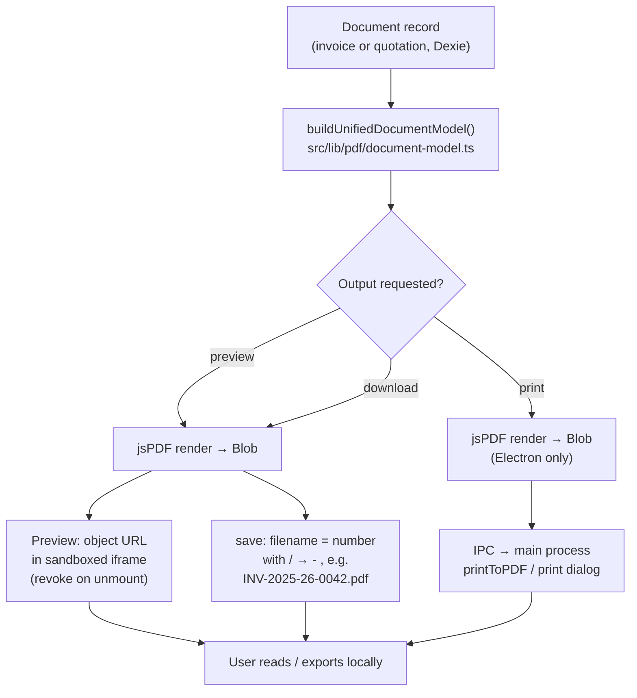

# 14. PDF Generation

> Derived from `docs/_CANON.md` — §1 (golden rule), §4 (money rules), §7 (entity model), §13 (PDF system), §16 (security), §17 (offline modes), §19 (limitations). `_CANON.md` wins on any conflict.

---

## 1. Purpose

Define how InvoiceFlow renders **Tax Invoices and Quotations as A4 PDF documents** entirely on the client, both online and offline, from a single shared document model. This document specifies the rendering library choice and its rationale, the `UnifiedDocumentModel`, the exact A4 layout, the offline generation pipeline, the Electron native printing path, known font/currency limitations, multi-page behavior, and the acceptance criteria the implementation must satisfy.

## 2. Scope

**In scope**

- Library selection and rationale (jsPDF + jspdf-autotable; Electron `printToPDF` as the native alternative).
- `UnifiedDocumentModel` (`src/lib/pdf/document-model.ts`) shared by preview and export.
- A4 portrait layout specification: header, meta, Bill-To, items table, totals block, amount in words, bank details, notes, terms, signature, page numbers.
- Offline generation flow and the Electron IPC path.
- Font and currency limitations (`Rs.` vs `₹`), multi-page behavior, error handling.

**Out of scope**

- Delivery channels (email, WhatsApp, sharing links) — designed extension points, documented separately (CANON §19.3), not implemented in MVP.
- E-invoice / IRN generation (not implemented).
- Reports CSV export (covered by the Reports/Settings documentation).
- Electron process architecture itself (scaffold lives in `electron/`; this doc only defines the PDF-related IPC contract).

## 3. Business requirements

| # | Requirement |
|---|---|
| BR1 | A user must be able to **preview and export a PDF with zero network connectivity** — PDF generation is a local-first operation per CANON §1. |
| BR2 | The PDF must be **deterministic**: the same document data always produces the same layout and pagination. |
| BR3 | Invoice and quotation PDFs must come from **one shared model** (`UnifiedDocumentModel`) used identically by the in-app preview and the exported file — what you preview is exactly what you get. |
| BR4 | **All totals in the PDF come exclusively from the domain engine** (`computeDocumentTotals` in `src/lib/domain/documents.ts`). The PDF layer never recomputes money (CANON §4: never trust client- or layer-level arithmetic duplicates). |
| BR5 | Printed amounts must follow Indian conventions: lakh/crore grouping and amount in words in Indian numbering ("Rupees One Lakh Twenty Three Thousand and Fifty Paise Only"). |
| BR6 | Finalized documents print the allocated number; drafts print their provisional number (`DRAFT-xxxxxxxx`) clearly labeled as provisional (CANON §6). |
| BR7 | Exported filename must be the document number with `/` replaced by `-` (e.g. `INV-2025-26-0042.pdf`). |
| BR8 | The renderer must work in three shells: browser tab, PWA, and Electron renderer, with no browser-only or Electron-only forks of the layout code. |

## 4. Technical design

### 4.1 Library choice and rationale

| Criterion | jsPDF + jspdf-autotable (chosen) | Headless-browser print (puppeteer/wkhtmltopdf) | Native Electron only |
|---|---|---|---|
| Works fully offline in browser | ✅ bundled with app | ❌ needs a server-side renderer | ✅ but desktop only |
| Deterministic vector output | ✅ programmatic vector drawing | ⚠️ depends on print CSS/HTML engine | ⚠️ depends on Chromium print |
| No headless browser / server | ✅ none needed | ❌ heavy dependency, sandbox-hostile | ✅ |
| Bundle cost | ~350 KB gzipped (both libs) | n/a (server fleet) | n/a |
| Table rendering (items grid) | ✅ autotable handles headers, repetition, styling | ✅ via HTML | ✅ via HTML |
| Consistency across browser/PWA/Electron | ✅ same code path | ❌ server/client drift risk | ❌ desktop-only |

**Decision (CANON §13):** **jsPDF + jspdf-autotable**, client-side. It is offline-capable by construction, produces deterministic vector output (crisp at any zoom, small file size, selectable text), and requires no headless browser — which would be impossible to run inside a browser-only PWA and painful inside the sandbox. Electron additionally offers the **native `printToPDF` via IPC** path (§4.6) for physical printing, but it consumes the *same* model, so layout logic is never duplicated.

Both libraries are already installed in the project (`dexie, dexie-react-hooks, jspdf, jspdf-autotable` — see worklog Task 0).

### 4.2 UnifiedDocumentModel

`src/lib/pdf/document-model.ts` exposes `buildUnifiedDocumentModel()`, which projects **either** an invoice **or** a quotation (plus its items, the company profile, and customer snapshot data) into one render-ready model. The in-app preview pane and the export/download button both call the same renderer with the same model instance — a single source of truth (CANON §13).

Key design rules:

1. **Snapshots only.** Documents persist `customer_name_snapshot`, `customer_gstin_snapshot`, `place_of_supply_code`, `tax_mode`, `price_includes_tax`, and per-line computed columns (CANON §7). The PDF therefore never joins live tables at render time — a historical document always prints exactly what was true when it was saved, even offline, even if the customer was edited since.
2. **Totals are trusted, not derived.** `model.totals` is the `DocumentTotals` object produced by `computeDocumentTotals` (CANON §4). The PDF layer formats paise integers; it never multiplies or rounds.
3. **Shell-agnostic.** The model contains no DOM, no `window`, no Electron references.

### 4.3 A4 layout specification

Page: A4 portrait (210 × 297 mm), margins 12 mm left/right, 12 mm top, 14 mm bottom. Fonts: jsPDF core **Helvetica** (regular/bold). All money rendered as `Rs. 1,23,456.78` via `Intl.NumberFormat('en-IN')` over paise/100 (§4.7 for the `Rs.` limitation).

| Zone | Content | Source fields |
|---|---|---|
| **Header — left** | Company logo (image, max 28 mm tall) or company name (bold 16 pt); below: address lines (address_line1/2, city, state_name, pincode), GSTIN, PAN, phone, email, website | `company_profiles` |
| **Header — right** | Document title `TAX INVOICE` or `QUOTATION` (bold 18 pt); meta grid: document number, invoice_date / quotation_date, due_date / valid_until, Place of Supply (state_name, code) | document + `place_of_supply_code` |
| **Bill-To block** | "Bill To" label; customer name (business_name or contact person for INDIVIDUAL), billing_address, GSTIN, state. Shipping address printed beneath when it differs from billing. | `customer_name_snapshot`, `customer_gstin_snapshot`, customer address fields |
| **Items table** (jspdf-autotable) | Columns: **# / Item & description / HSN-SAC / Qty / Rate / Discount / Taxable / GST% / GST amt / Amount**. Header row slate fill, white bold text; zebra rows; numeric columns right-aligned; `position` drives row order; `description` renders under the product name in 8 pt gray; `unit` appended to qty (e.g. `2.5 NOS`); Discount shown as `5%` from `discount_bps`; GST% from `gst_rate_bps` | `invoice_items` / `quotation_items` snapshots |
| **Totals block** (right-aligned, below table) | Subtotal → Discount → Taxable value → CGST → SGST/UTGST **or** IGST (per `tax_mode`) → each additional charge (+ its tax) → Round off → **Grand Total** (bold, boxed). Intra-state prints CGST + SGST/UTGST; inter-state prints IGST only. | `DocumentTotals` |
| **Amount in words** | `Rupees One Lakh Twenty Three Thousand and Fifty Paise Only` — Indian numbering (crore/lakh/thousand), paise appended | `model.amountInWords` (domain engine) |
| **Bank details** (invoices only) | bank_name, bank_account, bank_ifsc, bank_branch | `company_profiles` |
| **Notes / Terms** | Labeled paragraphs, 8 pt, word-wrapped | document `notes`, `terms` (or company defaults at save time) |
| **Signature** | `signature_data` image (max 22 mm wide) above a rule line, authorized_signatory name beneath, right-aligned | `company_profiles` |
| **Footer, every page** | Left: `Generated by InvoiceFlow`; right: `Page x of y` | renderer |

### 4.4 Multi-page behavior

- The autotable items grid **flows across pages**; the column header row repeats on every page (`showHead: 'everyPage'`).
- A compact continuation header (company name + document number + title) is drawn at the top of every page after the first via the `didDrawPage` hook.
- After the table ends, the renderer checks remaining vertical space; if the totals block + amount in words do not fit, the whole closing block moves to a fresh page (totals are never split).
- Footer (`Generated by InvoiceFlow` / `Page x of y`) is drawn on every page; `x of y` is stamped in a final pass using jsPDF's total page count.
- Practical capacity: ~28–32 line items on page 1, ~40 on continuation pages (driven by description wrapping), so a 100-line document prints as 3–4 pages.

### 4.5 Offline generation flow

Generation is synchronous, in-memory, and network-free. The only async boundary is producing the Blob and (in Electron) handing it to the main process.



Steps, in order (works with airplane mode on):

1. Read the document + items from IndexedDB (Dexie, live or by id).
2. Build the `UnifiedDocumentModel` (snapshots in, totals from the domain engine).
3. Render with jsPDF → `doc.output('blob')`.
4a. **Preview:** create `URL.createObjectURL(blob)`, load it into the preview `<iframe>`; revoke the URL on close/re-render.
4b. **Download:** `doc.save(filename)` with the sanitized filename.
4c. **Print (Electron only):** forward the blob over typed IPC to the main process (§4.6).

### 4.6 Electron native path

In the Electron shell (`electron/` scaffold — hardened: `contextIsolation: true`, `nodeIntegration: false`, `sandbox: true`, typed `contextBridge` API only, CANON §16), the renderer never touches Node APIs. The PDF blob is transferred as base64 over a typed IPC channel:

| IPC channel | Direction | Payload | Result |
|---|---|---|---|
| `pdf:print` | renderer → main | `{ pdfBase64: string, filename: string }` | main writes a temp file and opens the OS print dialog / `webContents.print()` |
| `pdf:save` | renderer → main | `{ pdfBase64: string, filename: string }` | main shows the save dialog, writes the file, returns `{ path }` |

The preload script exposes `window.invoiceflow.pdf.print(...)` / `.save(...)` with TypeScript signatures; the web fallback (no `window.invoiceflow`) automatically uses `doc.save()` download instead. **The layout code is identical in both shells** — only the final byte-handling differs.

### 4.7 Font and currency limitations (explicit, CANON §19.1)

- The jsPDF core Helvetica font set **contains no `₹` glyph**. Rendering `₹` would produce a garbage codepoint or require embedding a Unicode font (~200 KB+ per weight). MVP decision: PDFs render **`Rs.`** as the currency prefix (`Rs. 1,23,050.00`), while the app UI continues to show `₹` via `Intl`. This is a documented, accepted limitation.
- Consequently the PDF is **not** a legal-format e-invoice artifact; it is a business document. No GST-compliance claims are made (CANON §19.2).
- Non-Latin scripts (Hindi, regional languages) are out of scope for MVP PDFs; company/customer text is expected to be Latin-script or transliterated. Embedding Indic fonts is a designed extension point.
- If a logo or signature image is a PNG/JPEG dataURL it renders directly; oversized images are capped at 1 MB at upload time (CANON §16).

## 5. Data models

```ts
// src/lib/pdf/document-model.ts (contract)
export type UnifiedLineItem = {
  position: number;
  description: string;          // product name + description lines
  hsnSac?: string;              // snapshot
  qtyMilli: number;             // integer milli-units (2500 = 2.5)
  unit?: string;                // NOS, PCS, …
  unitPricePaise: number;
  discountBps: number;
  gstRateBps: number;
  priceIncludesTax: boolean;    // per-line snapshot
  computed: {                   // precomputed snapshots — formatted, never recomputed
    grossPaise: number;
    discountPaise: number;
    taxablePaise: number;
    cgstPaise: number; sgstPaise: number; igstPaise: number;
    taxPaise: number;
    totalPaise: number;
  };
};

export type UnifiedDocumentModel = {
  kind: 'INVOICE' | 'QUOTATION';
  title: 'TAX INVOICE' | 'QUOTATION';
  number: string;                    // real or DRAFT-xxxxxxxx
  isProvisionalNumber: boolean;      // true → rendered as "DRAFT (provisional) DRAFT-a1b2c3d4"
  status: string;                    // DRAFT | FINALIZED | PAID | SENT | …
  documentDate: string;              // YYYY-MM-DD
  dueDate?: string;                  // invoices
  validUntil?: string;               // quotations
  placeOfSupply: { stateName: string; stateCode: string };
  taxMode: 'INTRA' | 'INTER';        // snapshot → drives CGST/SGST/UTGST vs IGST rows
  company: CompanyPdfBlock;          // name/address/GSTIN/PAN/contacts/bank/signatory/logo
  customer: CustomerPdfBlock;        // snapshot name/address/GSTIN/state (+ shipping)
  items: UnifiedLineItem[];
  charges: DocCharge[];              // { id, label, amount_paise, taxable, gst_rate_bps }
  totals: DocumentTotals;            // straight from computeDocumentTotals (CANON §4)
  amountInWords: string;             // domain engine, Indian numbering
  notes?: string;
  terms?: string;
};
```

Inputs are the persisted records from CANON §7 (`invoices`/`quotations` + `*_items` + `company_profiles` + snapshot fields). No new persistence is introduced by this module.

## 6. API contracts

There is **no server API** for PDF generation — that is the point (offline-first). The module surface is:

```ts
// src/lib/pdf/document-model.ts
buildUnifiedDocumentModel(input: {
  kind: 'invoice' | 'quotation';
  doc: InvoiceRecord | QuotationRecord;
  items: InvoiceItemRecord[] | QuotationItemRecord[];
  company: CompanyProfileRecord;
}): UnifiedDocumentModel;

// src/lib/pdf/renderer.ts
renderDocumentPdf(model: UnifiedDocumentModel, output: 'blob' | 'save'): Promise<Blob | void>;
previewDocumentPdf(model: UnifiedDocumentModel): { url: string; dispose(): void }; // object URL + revoke
```

Electron IPC contract: see §4.6. Filename contract: `doc.number.replaceAll('/', '-') + '.pdf'` → `INV-2025-26-0042.pdf`, `QT-2025-26-0007.pdf`; drafts export as `DRAFT-a1b2c3d4.pdf`.

The connectivity heartbeat (`GET /api/health`) is irrelevant to rendering — PDFs never depend on it.

## 7. Offline behavior

- **Full capability offline**: preview, download, and (in Electron) print work with the network cable pulled, because every input lives in IndexedDB and both libraries are bundled (BR1, CANON §17).
- No font, template, or watermark is fetched at render time; no telemetry.
- In the browser, `save` triggers a normal download; there is no native silent printing outside Electron (CANON §17 browser limitation — falls back to PDF download).
- PDFs are generated from local state; a document edited offline renders with its local (possibly unsynced) data — correct local-first semantics.

## 8. Online behavior

Being online changes nothing about rendering. Online-only effects are upstream of the PDF: a synced document may carry a **server-allocated number or server-recomputed totals** (CANON §6/§9), and the PDF will show the adopted server values because the local record was updated by the sync engine before render. The "Generated by InvoiceFlow" footer and page numbering are unchanged online vs offline.

## 9. Security considerations

- Renderers run in the sandboxed browser context; **no `eval`, no remote templates, no network fetch** during generation (CSP-compatible: `img-src data: blob:` is required for logo/signature dataURLs — CANON §16).
- Logo/signature inputs are validated at upload: PNG/JPEG only, ≤ 1 MB, size-checked dataURL (CANON §16).
- Preview uses `blob:` object URLs which are **revoked** on unmount/re-render to avoid leaking document images into memory beyond their lifetime.
- Electron: the blob crosses the bridge as base64 over the typed `invoiceflow.pdf` API only; `contextIsolation` stays on; the main process writes only to user-chosen paths (dialog), never to arbitrary paths from renderer input.
- PDFs are generated locally and are never auto-uploaded; distribution (email/WhatsApp) is a separate, future, explicitly user-initiated flow (CANON §19.3).

## 10. Error-handling rules

| Failure | Handling |
|---|---|
| Document/items missing or company profile absent | `buildUnifiedDocumentModel` throws a typed `PdfModelError`; UI shows "Cannot render PDF — complete company profile" (onboarding guard) |
| Zero line items | Blocked earlier by domain validation; renderer defensively throws rather than printing an empty table |
| Malformed image (bad dataURL, > 1 MB) | Skip image, render name placeholder; never fail the whole document for a cosmetic asset |
| jsPDF/autotable exception | Caught at the action boundary → sonner toast "PDF generation failed" + console diagnostic; no partial downloads (save is invoked only after successful render) |
| Object URL leak | `dispose()` in preview lifecycle; revoke before creating a replacement URL |
| IPC failure (Electron) | Reject the promise → renderer falls back to `save` download with a toast |
| Filename collisions on download | Browser deduplicates (`file (1).pdf`); Electron save dialog asks the user — acceptable, no data risk |

Rule of thumb: **a failed PDF render never mutates business data** and never blocks document editing.

## 11. Acceptance criteria

1. With the network disabled (DevTools offline / OS airplane mode), preview and download of an invoice and a quotation PDF succeed from IndexedDB data alone.
2. The preview iframe content and the downloaded file are pixel-identical (same model → same render) — BR3.
3. Grand Total, CGST/SGST/IGST split, round-off, and amount in words in the PDF match `computeDocumentTotals` output exactly for: intra-state, inter-state, tax-inclusive, discounted, and charged documents (property tests against the domain engine).
4. A finalized invoice exports as `INV-2025-26-0042.pdf`; a draft exports with its `DRAFT-xxxxxxxx` number clearly labeled provisional.
5. A 60-line document renders as multiple pages with repeated table headers, a compact continuation header, footer `Page x of y` on every page, and an unsplit totals block.
6. Intra-state documents print CGST + SGST/UTGST rows and never IGST; inter-state documents print IGST only.
7. Currency renders as `Rs. 1,23,050.00` with Indian digit grouping; the string `₹` does not appear in PDFs.
8. In Electron, `pdf:print` and `pdf:save` succeed over typed IPC with `contextIsolation` enabled; in the browser the same document falls back to download.
9. Rendering never performs a network request (verified via network log in offline mode).
10. A failed render (e.g. missing company profile) shows an explanatory toast, leaves data untouched, and is retryable without reload.
