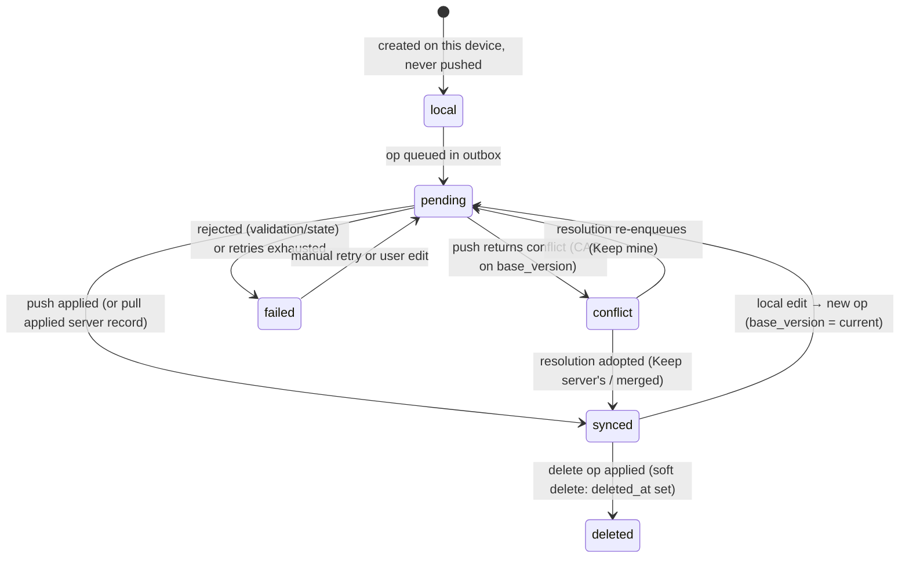

# 15. Offline-First Architecture

> Derived from `docs/_CANON.md` — §1 (golden rule / product identity), §3 (identity & metadata), §7 (local entity model), §9 (sync), §11 (guest mode), §14 (API surface), §17 (offline modes & PWA), §19 (assumptions & limitations). `_CANON.md` wins on any conflict. Deep dives: docs/16-INDEXEDDB-DATABASE.md, docs/17-SYNC-ENGINE.md, docs/18-CONFLICT-RESOLUTION.md, docs/14-PDF-GENERATION.md.

---

## 1. Purpose

State InvoiceFlow's **offline-first philosophy and its exact guarantees**: what works with no network, why, and how. This document defines the local-first operation pipeline every feature must follow, IndexedDB as the per-device source of truth, the outbox pattern, network detection, guest mode, PWA caching strategy, and the honest list of browser limitations.

## 2. Scope

**In scope**

- The local-first pipeline (CANON §1 golden rule) as a normative, testable flow.
- Source-of-truth model: IndexedDB per device; cloud as replication target, never as runtime dependency.
- Offline capabilities matrix (feature × offline support).
- Network detection: `navigator.onLine` + heartbeat to `/api/health`.
- Outbox pattern overview and guest mode; PWA/service-worker caching.
- Browser limitations (CANON §17) and mitigation guidance.

**Out of scope**

- Byte-level sync protocol and retry math — docs/17-SYNC-ENGINE.md.
- Conflict policies — docs/18-CONFLICT-RESOLUTION.md.
- Local database schema details — docs/16-INDEXEDDB-DATABASE.md.
- Cloud deployment topology — docs/19-CLOUD-SYNC.md.

## 3. Business requirements

| # | Requirement |
|---|---|
| BR1 | **Every business operation works locally first.** A shop owner with no internet for a full day must be able to create customers/products, draft and finalize invoices, record payments, and print PDFs (CANON §1, §17). |
| BR2 | No operation may block on, fail because of, or wait for the network. Network errors surface only in the *sync* status, never in the *data entry* flow. |
| BR3 | The device's IndexedDB is the **authoritative store for that device**; the cloud is an eventually-consistent replica for multi-device access and backup. |
| BR4 | Any local mutation that is eligible for cloud sync must be **durable before the UI confirms success** (write-ahead outbox op in the same transaction). |
| BR5 | The app must be usable without an account (**guest mode**, CANON §11), and must offer a lossless path from guest workspace to a cloud-linked workspace. |
| BR6 | Connectivity state must be visible and truthful at all times (offline badge, sync pill: `Synced / Pending N / Offline / Syncing / Error` — CANON §15). |
| BR7 | The app must be installable (PWA) and must open into a working UI with no network (service-worker cache + offline fallback). |
| BR8 | No silent data loss, ever: queued ops survive reloads, crashes, and days offline (also CANON §9 engine guarantees). |

## 4. Technical design

### 4.1 The local-first pipeline (normative)

Every mutating feature — create/edit customer, product, company profile, draft document, finalize, convert, cancel, record payment, delete — executes the **same pipeline** (CANON §1 golden rule):

```
USER ACTION → DOMAIN VALIDATION → LOCAL DB TRANSACTION → LOCAL UI UPDATE → OUTBOX QUEUE → CLOUD SYNC WHEN AVAILABLE
```

The canonical trace of "User creates an invoice", including every branch:

```mermaid
flowchart TD
    A["User creates invoice"] --> B["Domain validation<br/>(Zod + state checks)"]
    B -->|invalid| BE["Inline field errors<br/>nothing persisted"]
    B -->|valid| C["Compute totals via domain engine<br/>(integer paise, CANON §4)"]
    C --> D["Dexie transaction:<br/>invoice + items + sequence<br/>+ audit_log + outbox op"]
    D --> E["UI updates from live query<br/>(useLiveQuery over IndexedDB)"]
    E --> F{"Internet available?"}
    F -->|No| G["Outbox op stays pending<br/>sync_state = pending<br/>badge: 'Pending N'"]
    G --> H["Wait: reconnect / focus /<br/>30 s tick / manual Sync now"]
    H --> F
    F -->|Yes| I["Sync engine pushes op<br/>(docs/17-SYNC-ENGINE.md)"]
    I --> J{"Server accepts?"}
    J -->|applied / duplicate /<br/>number_reassigned| K["Adopt server record<br/>version, totals, number<br/>mark op done, sync_state = synced"]
    K --> L["Pull phase: fetch changes<br/>since cursor → update local DB"]
    L --> M["Badge: Synced"]
    J -->|conflict| N["Record conflict:<br/>op.status = conflict,<br/>sync_state = conflict → Conflict UI"]
    J -->|rejected<br/>(validation / state)| O["Record failure:<br/>op.status = failed with error<br/>visible, never dropped"]
    J -->|temporary error<br/>(network, 5xx, 429)| P["Backoff retry:<br/>2 s, 4 s, 8 s … cap 10 min,<br/>max 8 attempts → failed"]
    P --> H
```

Normative properties of the pipeline:

1. **Validation before write.** Zod schemas from `src/lib/domain/schemas.ts` validate on the client; the server repeats the validation (defense in depth, CANON §9/§16).
2. **One transaction.** The document, its items, the fiscal sequence (on finalize), the audit log, and the outbox op commit atomically or not at all (docs/16 §4.4).
3. **UI reads local only.** Lists and detail views render via `useLiveQuery` over Dexie; no component awaits a network response to display committed data.
4. **The outbox op is part of the commit.** If queuing the sync op fails, the whole business mutation rolls back — data and its sync obligation can never diverge (BR4).
5. **Sync is asynchronous and best-effort**, with retries, backoff, and explicit failure states (docs/17). "Best-effort" refers to *timing*, never to *durability*: an op sits in the outbox for hours or days until it reaches a terminal, user-visible state.

### 4.2 Source-of-truth model

| Concern | Authority |
|---|---|
| This device's business data | **IndexedDB (Dexie)** — reads and writes always hit it first |
| Cross-device consistency | Cloud (dev-cloud API routes or Supabase) via the sync engine |
| Document numbers | Server when online (authoritative allocation, CANON §6); local allocation offline, reconciled at push (adopted or reassigned deterministically — no user action) |
| Totals | Domain engine, recomputed server-side on push; server numbers overwrite local (CANON §4) |
| Identity | UUIDv4 per entity, generated locally (`crypto.randomUUID()`), so offline creation never needs server minting (CANON §3) |

Implications:

- Deleting the browser profile deletes the workspace's data **on that device only**; a synced copy remains in the cloud (mitigations in §7.4).
- Two devices may diverge arbitrarily while offline; convergence is deterministic through the conflict framework (docs/18), never time-based "last write wins" on whole records.
- The cloud never *serves* the UI; there are no server-rendered reads of business data.

### 4.3 Outbox pattern (overview)

Every eligible mutation appends a `sync_operations` row (`op_id`, `entity`, `entity_id`, `action`, `base_version`, `payload_json`, `status: 'pending'`, CANON §7). The sync engine drains the outbox in `created_at` order, batches of 25, through `POST /api/sync/push`, and applies server changes via `GET /api/sync/pull` with a monotonic `ChangeLog.seq` cursor. Terminal op states: `done` (pruned after 7 days), `failed` (visible, user-actionable), `conflict` (routed to the Conflicts UI). Full mechanics, retries, and state machines: docs/17-SYNC-ENGINE.md.

### 4.4 Network detection

Two signals, combined (`src/lib/sync/net.ts` contract):

1. **`navigator.onLine` + browser events.** `online`/`offline` events flip the badge instantly and are an engine *trigger* (CANON §9). Caveat: `navigator.onLine === true` does not guarantee reachability (captive portals, dropped Wi-Fi).
2. **Heartbeat to `GET /api/health`.** When `navigator.onLine` is true, the app probes `/api/health` (returns `{ ok, time, version }`, CANON §14) on trigger events and on a 30 s cadence while the app is visible. A failed/timeout heartbeat demotes the state to **Unreachable** — treated as offline for sync purposes.

Resulting badge states (CANON §15): `Online` (onLine + heartbeat ok) · `Offline` (`navigator.onLine === false`) · `Unreachable` (onLine but heartbeat failing) · plus the sync pill `Synced / Pending N / Syncing / Error`. All engine triggers (online event, app focus, post-mutation, 30 s interval, manual "Sync now") consult this combined state before pushing (docs/17 §4.2).

### 4.5 Guest mode (CANON §11)

- First launch creates a **local workspace** immediately — no account, no network. The full feature set is available offline.
- A persistent banner states: *"Guest workspace — connect cloud to sync"* (Settings → Security offers the same action).
- **Claim path:** `POST /api/workspace/claim { workspace_id, name, device_id }` (authenticated) creates the server workspace, grants `OWNER`, and writes the initial ChangeLog entry. The client then sets `cloud_linked_at`, resets `pull_cursor = 0`, and the sync engine pushes the entire local dataset as normal ops (bulk-safe). Registering while a guest workspace exists triggers the claim automatically.
- Guest data is only as durable as the browser profile — see §7.4 mitigation.

## 5. Data models

Local entities: the 17-table Dexie schema of CANON §7 (full index specification in docs/16-INDEXEDDB-DATABASE.md). Metadata every synced entity carries (CANON §3): `id` (UUIDv4), `workspace_id`, `created_at`, `updated_at`, `deleted_at`, `version` (starts 1), `sync_state`, `origin_device_id`.

`sync_state` lifecycle — the per-record mirror of the outbox:



Outbox op (`sync_operations`): statuses `pending | in_flight | done | failed | conflict` with `attempts`, `last_error`, `next_attempt_at`, `server_record_json` (on conflict) — see docs/17 §3.

## 6. API contracts

Only three endpoints participate in the offline story (full contracts: CANON §14, docs/17, docs/30-API-DESIGN.md):

| Endpoint | Method | Role offline-first |
|---|---|---|
| `/api/health` | GET | Liveness + `{ ok, time, version }`; doubles as the connectivity heartbeat (§4.4) |
| `/api/sync/push` | POST | Drains the outbox when online; per-op results `applied \| duplicate \| conflict \| rejected \| number_reassigned` |
| `/api/sync/pull` | GET | Applies server changes since cursor; `next_cursor` advances only after a successful local transaction |

Requests carry `schema_version` (currently `1`); a mismatch returns HTTP 409 `{code:'schema_version'}` and pauses sync with an upgrade notice (CANON §9). All endpoints verify workspace membership server-side.

## 7. Offline behavior

### 7.1 Capabilities matrix

| Feature | Offline? | Notes |
|---|---|---|
| Create / edit customers | ✅ | UUID minted locally; `code` auto-assigned locally |
| Create / edit products | ✅ | incl. HSN/SAC, rates |
| Create draft invoice / quotation | ✅ | provisional number `DRAFT-xxxxxxxx` (CANON §6) |
| Finalize invoice offline | ✅ | number allocated locally in the sequence transaction; reconciled at push (§6 CANON) |
| Quotation lifecycle (SENT → ACCEPTED/REJECTED, EXPIRED computed, CONVERTED) | ✅ | state checks run locally (CANON §12) |
| Record payments | ✅ | invoice paid status recalculated by domain engine |
| Cancel invoice / delete entities | ✅ | soft delete; server re-validates at push (payments-block rule) |
| PDF preview / download | ✅ | docs/14 — no network use at all |
| Dashboard, reports, CSV export, global search | ✅ | computed from local data |
| JSON backup export / import | ✅ | escape hatch (§7.4) |
| Audit log | ✅ | written locally, synced with ops |
| Cloud sync (push/pull) | ❌ | queued in outbox; badge shows `Pending N` |
| Login / register / account deletion | ❌ | requires network; guest mode covers offline use |
| Multi-device visibility of new data | ❌ | only after sync |

### 7.2 Desktop (Electron) offline

Full CRUD + PDF as in the browser (renderer reuses the web app verbatim, CANON §19.6); local files via typed IPC; outbox drains on reconnect. Identical golden-rule pipeline — the shell changes only file/printing plumbing.

### 7.3 PWA caching (CANON §17)

- Service worker `public/sw.js`: **cache-first** for static assets (hashed bundles, fonts, icons); **network-first** for `/` navigation with an offline fallback page/document shell.
- Cache name versioned `invoiceflow-v1`; on `activate`, old caches are deleted.
- `manifest.webmanifest` makes the app installable (standalone display, icons, theme colors).
- Registration happens **only in production builds** to avoid clobbering dev HMR.
- The SW caches the *app shell*, never business data — IndexedDB remains the data store of record.

### 7.4 Browser limitations and mitigations (CANON §17, §19.8)

| Limitation | Reality | Mitigation |
|---|---|---|
| Storage eviction | Browsers may evict site data under disk pressure; MVP does not request the Persistence API | Advise installing as PWA or using the desktop app for durability; **JSON backup export** (Settings → Data) as the user-facing escape hatch; attachment blobs kept small (≤ 1 MB uploads) |
| No native printing | Browsers cannot silently print | PDF download fallback; true printing via Electron `printToPDF` (docs/14 §4.6) |
| No service worker support | Old/private browsers | App still works **online-first**; offline mode simply unavailable — no crash, banner explains |
| `navigator.onLine` false positives | Captive portals report online | Heartbeat to `/api/health` gates sync (§4.4) |
| Clock skew | Device clock may drift, affecting displayed sync timing | Ordering is by server `ChangeLog.seq` and server_time, never client clocks; financial dates are user-entered `YYYY-MM-DD` |

## 8. Online behavior

Coming online flips no data paths — it only **starts replication**: engine triggers fire (online event, focus, 30 s tick), push drains pending ops oldest-first, pull applies server changes since the cursor inside one Dexie transaction, and the sync pill transitions `Pending N → Syncing → Synced`. Server-side recomputation may legitimately adjust local numbers (totals on push; adopted/reassigned numbers on finalize) — the UI reflects the server record the engine stores (docs/17 §4.4). Conflicts, if any, are surfaced in Settings → Sync → Conflicts (docs/18).

## 9. Security considerations

- Offline does not weaken validation: the same Zod schemas run locally; the server re-validates and re-computes money on every op (CANON §16).
- Local data sits unencrypted in IndexedDB (standard browser storage); confidentiality on shared machines relies on OS/browser profiles — the desktop app and docs/29-SECURITY.md document this posture and the account-deletion behavior (local data remains on device unless the user clears it).
- Guest workspaces carry no credentials; claiming links data to an account server-side with `OWNER` membership (CANON §11).
- The service worker serves only same-origin cached assets; no third-party code is cached or executed (CSP `default-src 'self'`).
- Session cookies are httpOnly, SameSite=Lax (dev; Supabase JWT in production) — offline periods simply expire them, and the engine pauses with `needs_reauth` rather than failing ops (docs/17 §4.7).

## 10. Error-handling rules

| Layer | Rule |
|---|---|
| Domain validation | Reject at the UI with field errors; nothing written (pipeline step 1) |
| Local transaction failure (quota, constraint) | Roll back everything including the outbox op; toast the user; state unchanged |
| Outbox enqueue failure | Whole mutation rolls back (BR4) — never commit data without its sync obligation |
| Network error during feature use | Impossible by design: features never await the network; only the sync engine does |
| Sync errors | Belong to the engine: `rejected` → `failed` + visible error; `conflict` → Conflicts UI; transient → exponential backoff (2 s → 10 min cap, max 8 attempts → `failed`); 401 → pause + `needs_reauth`; 409 schema mismatch → stop + upgrade notice (docs/17 §4.6) |
| Heartbeat failure | Demote to Unreachable; badge updates; no user-facing error toast (normal condition) |
| Eviction / corrupt DB | Dexie open failure → recovery screen offering restore from JSON backup; never silently recreate-and-erase |

Overarching rule (CANON §9): **no silent data loss** — every op ends in a user-visible terminal state (`done`, `failed` with error, or `conflict` in the UI); done ops are pruned only after 7 days post-apply.

## 11. Acceptance criteria

1. Airplane mode from first launch: onboarding, company setup, customers, products, invoice draft → finalize, payment, PDF download all succeed; badge shows Offline then Pending counts.
2. Reconnect: within one engine cycle all queued ops drain; badge reaches `Synced`; a second device pulls the same records (end-to-end).
3. Killing the browser tab mid-session loses no committed data; after reload the outbox still lists previously pending ops (durability).
4. With the server stopped but `navigator.onLine === true`, the heartbeat demotes connectivity to Unreachable and the engine does not attempt pushes that would fail; ops remain pending.
5. Every mutation listed in §7.1 "✅" completes with network fully disabled, verified by network-log (zero non-`/api/health` requests).
6. Guest user can register; the existing workspace is claimed; full local dataset appears on a second signed-in device after sync (CANON §11 claim path).
7. Production build installs as a PWA and launches to a usable UI in airplane mode (SW offline fallback); dev builds never register the SW.
8. No code path other than the sync engine and the heartbeat issues network requests; no UI component blocks rendering on a fetch.
9. Force-clearing IndexedDB (DevTools) yields the recovery screen pointing to JSON backup restore — not silent data regeneration.
10. All failure states in §10 are observable in the UI (badge, sync pill, outbox table in Settings → Sync) — nothing disappears silently.
