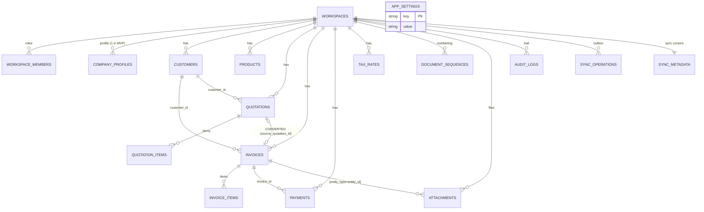

# 16. IndexedDB Database (Dexie)

> Derived from `docs/_CANON.md` — §3 (identity & metadata conventions), §4 (money rules), §7 (entity model + Dexie schema v1), §9 (sync integration), §17 (offline), §19 (limitations). `_CANON.md` wins on any conflict. The exact v1 index strings below are copied verbatim from CANON §7.

---

## 1. Purpose

Specify the local database implementation: the Dexie wrapper around IndexedDB, the complete v1 schema (all 17 tables and their index strings), entity metadata conventions, transaction usage, versioned migration strategy, storage estimates with eviction mitigations, and debugging practices. The local DB is the **source of truth per device** (docs/15 §4.2) — this document defines how it is built.

## 2. Scope

**In scope**

- Why Dexie; the v1 schema verbatim; metadata conventions (CANON §3).
- Transaction usage patterns (document + items + sequence + outbox in ONE transaction).
- Versioned migration strategy with a worked v2 example.
- Storage sizing, eviction risks and mitigations; DevTools debugging tips; local ER diagram.

**Out of scope**

- Sync engine behavior over these tables — docs/17-SYNC-ENGINE.md.
- Cloud-side relational schema — docs/19-CLOUD-SYNC.md.
- Domain computation (money/GST) — CANON §4–§5 and `src/lib/domain/`.

## 3. Business requirements

| # | Requirement |
|---|---|
| BR1 | All business data lives on-device in IndexedDB and is readable/writable with **zero network** (CANON §1). |
| BR2 | Multi-step business mutations (document + items + sequence + audit + outbox) must be **atomic** — all-or-nothing (docs/15 BR4). |
| BR3 | The schema must evolve without data loss via **append-only versioned migrations** (CANON §7: never mutate v1 in place). |
| BR4 | Lists must stay reactive: UI components subscribe to live queries and update on any local write (CANON §15). |
| BR5 | Sync metadata (cursors, outbox state) must be durable in the same DB so restarts resume exactly where sync stopped (CANON §9). |
| BR6 | IDs are minted client-side (UUIDv4) so offline creation never awaits a server (CANON §3). |

## 4. Technical design

### 4.1 Why Dexie

| Need | Dexie feature |
|---|---|
| Promise-based transactions across multiple tables with rollback | `db.transaction('rw', t1, t2, …, fn)` — async/await, automatic abort on throw |
| Reactive UI (BR4) | `useLiveQuery()` from `dexie-react-hooks` — re-runs the query on any affecting write |
| Versioned schema upgrades (BR3) | `db.version(n).stores({...}).upgrade(tx => …)` — declarative, append-only |
| TypeScript ergonomics | Typed table maps: `db.invoices.get(id): Promise<InvoiceRecord \| undefined>` |
| Complex indexes (BR/queries) | Compound indexes `[workspace_id+status]` etc. — first-class syntax |
| Small, dependency-light, battle-tested | ~25 KB gz; no worker/server requirements; works in Electron renderer |

Native IndexedDB alone fails BR1/BR2/BR4 ergonomics (callback APIs, no compound-index sugar, no live queries); Dexie is the pragmatic standard for local-first apps and is already installed (worklog Task 0).

### 4.2 Database identity

- Name: `invoiceflow`; the single Dexie instance is exported from `src/lib/db/` (sandbox mapping of `packages/local-db`, CANON §2).
- One database holds all workspaces; every business row carries `workspace_id`, and the active workspace id lives in `app_settings` (`active_workspace_id`).

### 4.3 Dexie schema v1 — the exact index strings (CANON §7)

```ts
// src/lib/db/schema.ts
import Dexie, { type Table } from 'dexie';

export const db = new Dexie('invoiceflow') as InvoiceFlowDB;

db.version(1).stores({
  workspaces:         'id, name, updated_at',
  workspace_members:  'id, workspace_id, user_id, role',
  company_profiles:   'id, workspace_id, updated_at',
  customers:          'id, workspace_id, code, gstin, phone, sync_state, updated_at, deleted_at, [workspace_id+deleted_at]',
  products:           'id, workspace_id, sku, hsn_sac, active, sync_state, updated_at, deleted_at, [workspace_id+active], [workspace_id+deleted_at]',
  quotations:         'id, workspace_id, number, status, quotation_date, customer_id, sync_state, updated_at, deleted_at, [workspace_id+status], [workspace_id+deleted_at]',
  quotation_items:    'id, quotation_id, workspace_id, [quotation_id]',
  invoices:           'id, workspace_id, number, status, invoice_date, due_date, customer_id, sync_state, updated_at, deleted_at, [workspace_id+status], [workspace_id+deleted_at]',
  invoice_items:      'id, invoice_id, workspace_id, [invoice_id]',
  payments:           'id, workspace_id, invoice_id, paid_at, sync_state, updated_at, deleted_at, [workspace_id+paid_at], [invoice_id]',
  tax_rates:          'id, workspace_id, active, [workspace_id+active]',
  document_sequences: 'id, [workspace_id+doc_type+fiscal_year]',
  attachments:        'id, workspace_id, entity_type, entity_id, [entity_type+entity_id]',
  audit_logs:         'id, workspace_id, entity_type, entity_id, at, [workspace_id+at], [entity_type+entity_id]',
  sync_operations:    'id, workspace_id, entity_id, status, created_at, next_attempt_at, [workspace_id+status], [status+created_at]',
  sync_metadata:      'workspace_id',
  app_settings:       'key',
});
```

Reference table — 17 tables, purpose and primary key:

| Table | PK | Purpose |
|---|---|---|
| `workspaces` | `id` | Workspaces (one local workspace until claimed; schema supports many) |
| `workspace_members` | `id` | Role assignments (`OWNER\|ADMIN\|MEMBER\|VIEWER`) by `user_id` or `device_id` |
| `company_profiles` | `id` | Seller profile: identity, address, GSTIN/PAN, bank, prefixes, defaults, logo/signature data |
| `customers` | `id` | Customers (BUSINESS/INDIVIDUAL) with state codes for GST |
| `products` | `id` | Catalog: price (paise), gst_rate_bps, HSN/SAC, unit, active |
| `quotations` | `id` | Quotation headers + total snapshots + charges_json |
| `quotation_items` | `id` | Quotation line items (snapshot computations per CANON §4) |
| `invoices` | `id` | Invoice headers (+ `paid_total_paise`, `source_quotation_id`, `cancelled_at`) |
| `invoice_items` | `id` | Invoice line items |
| `payments` | `id` | Manual payment records against invoices |
| `tax_rates` | `id` | Versioned GST rates (`name, rate_bps, active, effective_from`) |
| `document_sequences` | `id` | Per `[workspace_id+doc_type+fiscal_year]` counters (`next_seq`) |
| `attachments` | `id` | Small blobs inline (`data`) linked polymorphically via `[entity_type+entity_id]` |
| `audit_logs` | `id` | Local audit trail (`CREATE\|UPDATE\|FINALIZE\|CONVERT\|CANCEL\|PAYMENT\|DELETE\|SYNC_CONFLICT\|STATUS`) |
| `sync_operations` | `id` (= `op_id`) | The outbox (docs/17 §3) |
| `sync_metadata` | `workspace_id` | `pull_cursor` (server ChangeLog seq, default 0), optional `push_cursor`, `last_sync_at`, `last_sync_error` |
| `app_settings` | `key` | Generic k/v: `active_workspace_id`, `device_id`, `theme`, `session_cache`, … |

Indexing principles: every business table indexes `workspace_id` (multi-tenant reads) and `updated_at`/`deleted_at` (change detection and soft-delete filtering); document headers index `number`, `status`, dates, `customer_id`, and the compound status/deleted pairs that drive list views; `sync_operations` indexes `[status+created_at]` (batch claim order) and `next_attempt_at` (retry scheduler).

### 4.4 Transaction usage (normative patterns)

Every multi-table mutation runs in ONE Dexie transaction. Example — **finalize an invoice offline** (CANON §6 offline allocation):

```ts
await db.transaction(
  'rw',
  db.invoices, db.invoice_items, db.document_sequences,
  db.audit_logs, db.sync_operations,
  async () => {
    const inv = await db.invoices.get(invoiceId);
    assertDraft(inv); // DRAFT only, not cancelled, has items

    // 1. Allocate number in the same transaction
    const fy = fiscalYearOf(inv.invoice_date);            // '2025-26'
    const key = [workspaceId, 'INVOICE', fy];
    let seq = await db.document_sequences.where({ '[workspace_id+doc_type+fiscal_year]': key }).first();
    if (!seq) seq = { id: crypto.randomUUID(), workspace_id: workspaceId, doc_type: 'INVOICE', fiscal_year: fy, next_seq: 1, ...meta };
    const number = `${company.invoice_prefix}/${fy}/${String(seq.next_seq).padStart(4, '0')}`;
    await db.document_sequences.put({ ...seq, next_seq: seq.next_seq + 1 });   // never decrements (CANON §6)

    // 2. Mutate the document
    await db.invoices.put({ ...inv, number, status: 'FINALIZED', finalized_at: nowIso(), version: inv.version + 1, sync_state: 'pending', updated_at: nowIso() });

    // 3. Audit + outbox in the SAME commit
    await db.audit_logs.add(audit('FINALIZE', 'invoice', invoiceId, { number }));
    await db.sync_operations.add(outboxOp({ entity: 'invoice', entity_id: invoiceId, action: 'finalize', base_version: inv.version, payload: fullRecordWithItems }));
  }
);
// On throw: number allocation, invoice mutation, audit, outbox all roll back together.
```

The same pattern applies to: create/edit customer (row + outbox), save draft document (document + items replaced atomically + outbox), record payment (payment + invoice `paid_total` recalculation + audit + outbox), convert quotation (both documents + two ops + audit on both, CANON §12), delete (soft `deleted_at` + outbox `delete` op). Rule: **a mutation, its audit row, and its sync obligation share one commit** (docs/15 BR4).

### 4.5 Versioned migration strategy

CANON §7: append `db.version(n+1).stores({...})` with upgrade callbacks; **never mutate v1 in place**. Rules:

1. v1 stays byte-identical forever; a new version declares only changed/new tables (Dexie merges with the previous version's stores).
2. Renaming a field = add the new field in the store, copy data in `.upgrade()`, remove the old index in a later version — two releases, zero data loss.
3. Upgrades run inside Dexie's internal transaction; a throwing upgrade aborts the version bump (app stays on the old schema rather than half-migrating).
4. The dev server persists schema changes only after a reload; during development, clearing the DB is acceptable, but shipped versions must always upgrade in place.

Worked example — future v2 adds `einvoice_ref` to invoices and backfills nothing:

```ts
db.version(2).stores({
  invoices: 'id, workspace_id, number, status, invoice_date, due_date, customer_id, sync_state, updated_at, deleted_at, [workspace_id+status], [workspace_id+deleted_at], einvoice_ref',
}).upgrade(async (tx) => {
  // Data fix-up example: normalize blank HSN codes on line items.
  await tx.table('invoice_items').toCollection().modify((item) => {
    if (item.hsn_sac === '') item.hsn_sac = undefined;
  });
});
```

Note that `sync_metadata`/`app_settings` need no version migration for content changes (schemaless rows); only *indexed* columns require a version bump.

### 4.6 Entity metadata conventions (CANON §3)

Every synced business row carries:

| Field | Convention |
|---|---|
| `id` | UUIDv4 via `crypto.randomUUID()` — never auto-increment for synced entities |
| `workspace_id` | UUIDv4; scoping key for every query |
| `created_at` / `updated_at` | ISO-8601 strings, UTC |
| `deleted_at` | ISO string or `null`; soft delete — records retained so historical invoices keep meaning; UI filters by default (compound `[workspace_id+deleted_at]` indexes) |
| `version` | Integer starting at 1; CAS token for sync (`base_version` on ops) |
| `sync_state` | `local → pending → synced → failed | conflict` |
| `origin_device_id` | UUID persisted in `localStorage` on first launch (mirrored in `app_settings.device_id`) |

Type discipline: **financial dates are `YYYY-MM-DD` strings, never JS Dates** (`invoice_date`, `due_date`, `quotation_date`, `valid_until`, `paid_at`); timestamps are ISO strings; money is integer paise; rates are bps; quantities are integer milli-units (CANON §3/§4). Repositories in `src/lib/db/` are the only writers — components never touch `db` tables directly for mutations.

## 5. Data models — local entity relationships



This is the local mirror of the production Postgres ER model (docs/19 §4.2): identical tables and cardinalities, minus server-only concerns (users/sessions live in the cloud layer; `ChangeLog`/`ProcessedOp` are server tables).

## 6. API contracts

The local DB exposes no HTTP API. Its "contract" is the repository layer in `src/lib/db/` (typed, the only mutation path):

```ts
// Representative surface (full typings in src/lib/db/repositories.ts)
listCustomers(workspaceId): Promise<CustomerRecord[]>            // live variant: useLiveQuery(() => …)
upsertCustomer(input: CustomerInput): Promise<void>              // tx: row + outbox op + audit
saveDraftDocument(kind, draft): Promise<{ id: string }>          // tx: document + items replace + outbox
finalizeInvoice(id): Promise<{ number: string }>                 // tx: sequence + document + audit + outbox (§4.4)
recordPayment(input: PaymentInput): Promise<void>                // tx: payment + invoice totals + audit + outbox
convertQuotationToInvoice(id): Promise<{ invoiceId: string }>    // tx: both documents + 2 ops + audits
softDelete(entity, id): Promise<void>                            // tx: deleted_at + outbox delete op
getSyncMetadata(workspaceId): Promise<SyncMetadataRow>
setPullCursor(workspaceId, seq): Promise<void>                   // called only by the sync engine
exportAllJson(): Promise<BackupBlob>                             // JSON backup (§7.3)
```

The sync engine's contract with this DB is narrow and explicit: it reads `sync_operations` (`[status+created_at]` batch claim), writes applied server records from pull, and updates `sync_metadata.pull_cursor` — everything else belongs to repositories.

## 7. Offline behavior

### 7.1 The DB is the app

With zero network, every table is fully readable/writable; queries use compound indexes so lists filter in IndexedDB itself (no client-side fan-out). Live queries keep the UI consistent with the local truth (docs/15 §4.1).

### 7.2 Multi-tab safety

Dexie coordinates across tabs via IndexedDB transactions and its own change detection; the sync engine additionally uses a mutex so only one tab pushes concurrently (docs/17 §4.2). Business mutations are safe from any tab because they are transactional.

### 7.3 Storage estimates & eviction mitigation

Rough per-record sizes (JSON serialized):

| Record | Approx size |
|---|---|
| customer / product / tax rate | 0.5–1.5 KB |
| invoice or quotation header (incl. charges_json, snapshots) | 2–3 KB |
| line item | 0.3–0.6 KB |
| payment | 0.3 KB |
| audit log entry | 0.3–0.5 KB |
| attachment (inline `data` URL, MVP) | up to ~1.4 MB (1 MB cap × base64 overhead) |

Typical scale — 1,000 invoices (~3 items each), 500 customers/products, 2,000 audit rows, no attachments ≈ **6–10 MB**; a busy year with attachments ≈ tens of MB. Browser quotas are far higher (Chromium allows gigabytes per origin), so the practical risk is **eviction under disk pressure or profile clearing**, not quota exhaustion.

Mitigations (CANON §17/§19.8):

1. **JSON backup export/import** (Settings → Data) — full-workspace dump/restore; the user-facing escape hatch.
2. Recommend **installing as PWA or using the Electron desktop app** for durability.
3. Keep blobs small: uploads capped at 1 MB (CANON §16); large files belong to a future object-storage design, not IndexedDB.
4. Done outbox ops pruned after 7 days; audit logs retained (they are the business record).

### 7.4 Debugging tips (DevTools)

- **Application → Storage → IndexedDB → `invoiceflow`**: inspect every table live; refresh with the circular arrow after a mutation.
- Quick console checks: `await (await indexedDB.databases())`; `db.invoices.count()`; `db.sync_operations.where('status').notEqual('done').toArray()` (stuck ops); `db.sync_metadata.toArray()` (cursor state).
- A `sync_operations` row that never leaves `pending` means the engine is paused (offline, unauthenticated, or backoff) — check `next_attempt_at` and `last_error`, not the network tab.
- Duplicate-looking `version` bumps across devices are normal pre-sync; reconciliation is the engine's job (docs/17).
- Reset: Settings → Data → **Clear local data** (explicit, confirmed), or DevTools → Delete database. Both destroy local data — export a JSON backup first; this is expected and documented behavior, not a bug path.
- Profiling slow lists: ensure queries use the compound indexes (§4.3) rather than `.filter()` full scans; the Dexie "Table view" in DevTools shows index usage indirectly via timing.

## 8. Online behavior

Online, the same database serves reads/writes; the only additional writers are the sync engine's pull phase (applies server records for entities **without pending local ops**, inside one Dexie transaction, replacing embedded items atomically — CANON §9) and its cursor bookkeeping. Version bumps and `sync_state` transitions arrive from the server record on `applied`/pull. Schema-wise, nothing changes online — there is no server-side cache layer in the browser.

## 9. Security considerations

- IndexedDB is origin-scoped and sandboxed by the browser; no cross-origin read is possible, but data is **not encrypted at rest** — shared-machine exposure is documented posture (docs/15 §9, docs/29-SECURITY.md).
- All writes go through repositories that validate with the shared Zod schemas before touching Dexie (CANON §16: validation on both ends).
- No secrets (tokens, passwords, service keys) are stored in Dexie; session state lives in httpOnly cookies and the `app_settings.session_cache` key holds only non-sensitive display data (user name/avatar). The `device_id` is an identifier, not a credential.
- Electron renderer inherits the same origin isolation (`contextIsolation: true`, no Node in renderer, CANON §16).
- Attachments are rendered via `blob:`/`data:` URLs only after MIME/size validation at insert; no executable types are accepted.

## 10. Error-handling rules

| Failure | Rule |
|---|---|
| Transaction throws (validation, missing record) | Dexie aborts **all** writes in the transaction; UI surfaces the domain error; no partial state (§4.4) |
| Quota exceeded on write | Transaction fails atomically; UI offers JSON backup + cleanup guidance; never silently drop the outbox op |
| Corrupt/unopenable DB (version downgrade, corruption) | Open failure → recovery screen: export-if-readable, restore from backup, or explicit clear — never auto-erase |
| Upgrade callback throws | Version bump aborted; app runs on previous schema and reports the migration error (§4.5 rule 3) |
| Constraint violations (e.g. duplicate sequence key) | Treated as programming errors — fail loudly in dev; repositories pre-check invariants (sequence row existence) |
| Stuck `in_flight` ops after a crash | Engine startup reclaims `in_flight` rows older than the run timeout back to `pending` (docs/17 §4.3) — the DB never wedges |
| Version skew between tabs | Dexie blocks new writes from old-schema tabs during upgrade; the app reloads after `db.on('versionchange')` |

## 11. Acceptance criteria

1. All 17 tables exist on first run with exactly the v1 index strings of §4.3 (verified via DevTools + a schema snapshot check).
2. Finalizing an invoice in one transaction allocates the number, updates the document, writes audit + outbox or — on any error — writes nothing (rollback test with an injected failure).
3. Draft save replaces items atomically: a mid-transaction throw leaves the previous items set fully intact.
4. `useLiveQuery` views update within one frame of any repository mutation, online or offline.
5. A v2 upgrade on a populated v1 database completes without data loss and with the new index present; a simulated upgrade failure leaves the DB on v1.
6. Pull applies a server document (with embedded items) atomically and advances `sync_metadata.pull_cursor` only on success; records with pending local ops are skipped (CANON §9).
7. JSON backup export round-trips: export → clear → import restores an equivalent workspace (totals, sequences, sync metadata).
8. Multi-tab: mutations from two tabs interleave safely; only one tab runs the sync engine concurrently.
9. No component writes to `db` outside `src/lib/db/` repositories (enforced by code review/lint conventions).
10. Financial fields in every table conform to CANON §3/§4 types (`YYYY-MM-DD` strings, integer paise/bps/milli) — asserted by repository input validation.
