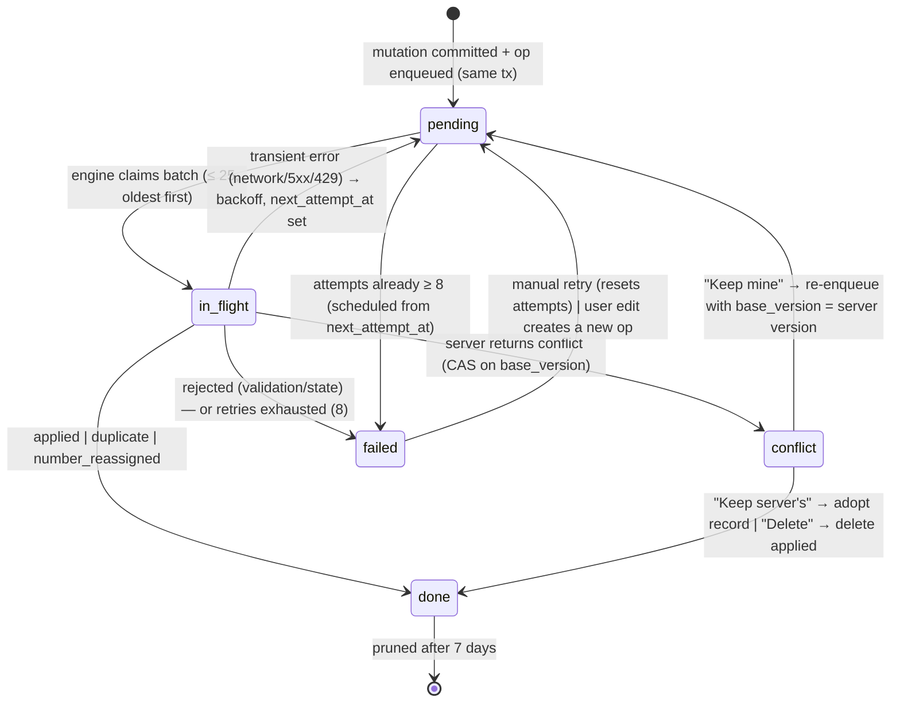
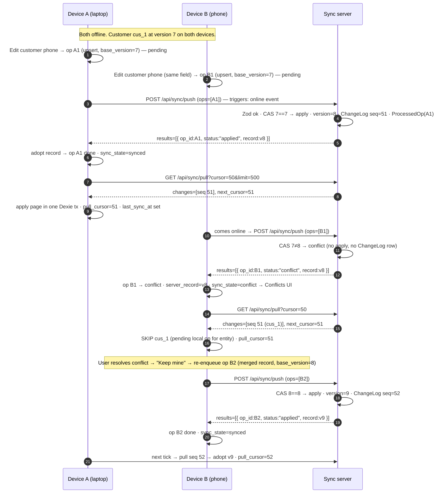
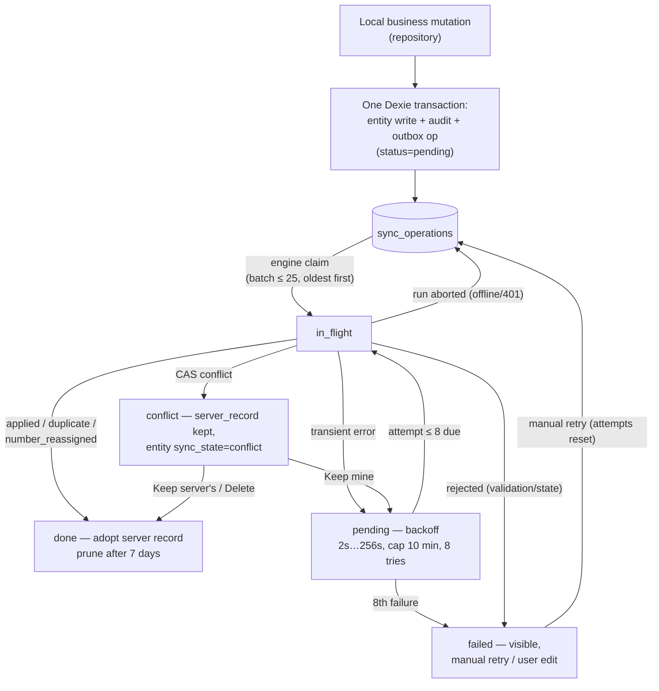

# 17. Sync Engine

> Derived from `docs/_CANON.md` — §3 (metadata), §6 (numbering), §7 (outbox & metadata tables), §8 (server & ChangeLog), §9 (sync protocol — **definitive for the HTTP contract**), §12 (lifecycles), §14 (API surface), §16 (security). `_CANON.md` wins on any conflict. Conflict *policies* live in docs/18-CONFLICT-RESOLUTION.md; local DB mechanics in docs/16-INDEXEDDB-DATABASE.md.

---

## 1. Purpose

Specify **the** synchronization protocol and its client engine: the exact push/pull HTTP contracts, engine lifecycle and triggers, operation statuses and transitions, idempotency, cursor management, retry/backoff schedule, auth and schema-version handling, batch processing, and the guarantees that make the system safe ("no silent data loss"). Implementation lives in `src/lib/sync/engine.ts`.

## 2. Scope

**In scope**

- `POST /api/sync/push` and `GET /api/sync/pull` contracts (reproduced verbatim from CANON §9).
- Engine lifecycle: triggers, mutex, push-then-pull phases, batching.
- Outbox (`sync_operations`) status model, retry/backoff schedule, pruning.
- Idempotency (`ProcessedOp`), pull cursors (`ChangeLog.seq`), auth-expiry pause, schema-version guard.
- Sequence, state, and outbox-lifecycle diagrams; failure-handling matrix.

**Out of scope**

- Conflict resolution policies and UI — docs/18-CONFLICT-RESOLUTION.md.
- Cloud provider topology (Supabase vs dev-cloud) — docs/19-CLOUD-SYNC.md.
- The offline pipeline itself — docs/15-OFFLINE-FIRST.md.

## 3. Business requirements

| # | Requirement |
|---|---|
| BR1 | Sync must be **automatic and invisible** when connectivity returns, and completely silent (non-blocking) when it is absent (CANON §1, §9). |
| BR2 | Every local mutation reaches the server **exactly once in effect**, even across crashes and replays (idempotency). |
| BR3 | A device offline for days must converge to server state with a bounded number of messages (cursors + batches), not unbounded history replay. |
| BR4 | Server arithmetic and numbering are **authoritative**; the client adopts server records/totals/numbers on apply (CANON §4, §6, §9). |
| BR5 | **No silent data loss**: every op ends in a user-visible terminal state (`done`, `failed` with error, or `conflict` in the UI); nothing is auto-dropped (CANON §9). |
| BR6 | Only one sync run may execute at a time per device; runs are short, cancellable, and safe to repeat. |
| BR7 | A schema-incompatible server must halt syncing with an explicit upgrade notice, never corrupt local data. |

## 4. Technical design

### 4.1 Protocol — HTTP contract (CANON §9, verbatim)

Auth: httpOnly session cookie (dev) / Supabase JWT (production). All endpoints verify workspace membership server-side.

#### `POST /api/sync/push`

```json
// request
{ "device_id": "…", "workspace_id": "…", "schema_version": 1,
  "ops": [ { "op_id": "uuid", "entity": "invoice", "entity_id": "uuid",
             "action": "upsert|finalize|cancel|delete", "base_version": 3,
             "payload": { …full record… } } ] }
// response
{ "results": [ { "op_id": "uuid", "status": "applied|duplicate|conflict|rejected|number_reassigned",
                 "record": {…server record…}, "error": "…" } ], "server_time": "ISO" }
```

Server rules (CANON §9):

1. **Idempotency** via `ProcessedOp(op_id PK)` — replays return `duplicate` with the stored outcome.
2. **Zod validation** (shared schemas from `src/lib/domain/schemas.ts`) → `rejected` with error.
3. **CAS on `base_version`** → `conflict` + server record.
4. **Totals recomputed server-side** from item payloads; server numbers overwrite client numbers.
5. **`finalize` allocates document numbers** (CANON §6) and stamps `finalized_at`; FINALIZED/PAID invoices reject `upsert`/`delete` (only `cancel`/payments allowed; cancel blocked when payments exist).
6. Every apply writes a **ChangeLog row** and bumps `version`.
7. The workspace must exist and the caller must be a member with role **≥ MEMBER to write** (CANON §8 roles).

Number reconciliation on `finalize` (CANON §6): if the server sequence is behind, the server adopts the client number by fast-forwarding its sequence; if the server already issued that number, the server issues the next free one and responds with status **`number_reassigned`** (CANON §6 describes the same outcome as "applied + notice: number_reassigned" — client handling is identical: adopt the returned record). Sequences never decrement; cancelled invoices keep their number.

#### `GET /api/sync/pull?workspace_id=…&cursor=<seq>&limit=500`

```json
{ "changes": [ { "seq": 41, "entity": "invoice", "op": "upsert", "record": {…incl items…} } ],
  "next_cursor": 41, "server_time": "ISO" }
```

The server appends a `ChangeLog(seq autoincrement, workspace_id, entity, entity_id, op, payload_json(full record incl. items), at)` row for every applied mutation (CANON §8); the client's pull cursor is the last seen `seq`.

### 4.2 Engine lifecycle

Implementation: `src/lib/sync/engine.ts`. One engine run = **push phase, then pull phase**, always in that order (push first so a device's own work reaches the server before it re-reads the world).

**Triggers** (CANON §9): `online` browser event · window/app focus · after any local mutation (post-mutation, debounced) · 30 s interval · manual "Sync now" (Settings → Sync).

**Guards** — a run is skipped when any of:

- a run is already active (**mutex**; single concurrent run, also across tabs — a `navigator.locks`/localStorage lease);
- offline by combined signal (`navigator.onLine === false`, or heartbeat to `/api/health` failing — docs/15 §4.4);
- the workspace is not cloud-linked (`cloud_linked_at` unset — guest mode) ;
- the user is not authenticated (401 path in §4.7 sets `needs_reauth`).

**Run sequence:**

1. Reclaim safety: any ops left `in_flight` by a crashed previous run are reset to `pending` (their outcome is unknown; idempotency makes re-push safe).
2. **Phase 1 — push**: claim the oldest `pending` ops (batch **25**, ordered by `created_at`, index `[status+created_at]`) → mark `in_flight` → `POST /api/sync/push` → handle per-op results (§4.4).
3. Repeat push while more pending ops exist and the last batch produced progress (max consecutive batches per run: bounded, so a huge backlog drains over several ticks without monopolizing the main thread).
4. **Phase 2 — pull**: `GET /api/sync/pull?cursor=<pull_cursor>&limit=500`; loop while the server returns a full page and `next_cursor` advances; apply each page inside **ONE Dexie transaction**:
   - skip records that have a pending local op for the same `entity_id` (conflict is resolved at push time, docs/18);
   - else upsert when `record.version > local.version`, setting `sync_state = 'synced'`; documents replace embedded items atomically (docs/16 §8);
   - after the page commits, update `sync_metadata.pull_cursor = next_cursor` and `last_sync_at` (cursor advances only after a successful local transaction).
5. On any phase-1 abort (offline mid-run, 401), claimed ops return to `pending` — never lost.

### 4.3 Operation statuses (outbox)

`sync_operations.status`: **`pending | in_flight | done | failed | conflict`** (CANON §7). Row fields: `op_id`, `workspace_id`, `entity`, `entity_id`, `action`, `base_version`, `payload_json`, `server_record_json?` (on conflict), `attempts`, `last_error?`, `next_attempt_at?`, `created_at`.



Per-result handling in the push phase (CANON §9):

| Response `status` | Client action |
|---|---|
| `applied` | Update local record from `record` (version, `sync_state='synced'`, adopt server number/totals); op → `done` |
| `duplicate` | Same as applied — idempotent replay of an earlier success |
| `number_reassigned` | Same as applied; UI toasts "Invoice number adjusted to server-issued number" (document immutable once finalized) |
| `conflict` | Store `server_record` on the op; op → `conflict`; entity `sync_state='conflict'`; surface in Settings → Sync → Conflicts (docs/18) |
| `rejected` | op → `failed` with `last_error`; visible and retryable **only via user edit** (which creates a fresh op); never silently dropped |

Transient failures (network error, HTTP 5xx, 429, timeouts): op stays recoverable — `attempts++`, `next_attempt_at = now + min(10 min, 2^attempts × 2 s)` (0-based `attempts` at scheduling time → series below); after **8 attempts** the op → `failed` with a manual retry button in the UI.

**Retry schedule (exponential backoff):**

| Attempt # | `attempts` (0-based, pre-increment) | Delay before next attempt | Cumulative offline wait |
|---|---|---|---|
| 1 | 0 | 2 s | 2 s |
| 2 | 1 | 4 s | 6 s |
| 3 | 2 | 8 s | 14 s |
| 4 | 3 | 16 s | 30 s |
| 5 | 4 | 32 s | 62 s |
| 6 | 5 | 64 s | 2 m 6 s |
| 7 | 6 | 128 s | 4 m 14 s |
| 8 | 7 | 256 s | 6 m 50 s |

The hard cap in the formula is **10 minutes** (`min(10 min, 2^attempts × 2 s)`) — it is not reached within the 8-attempt window but governs any future configuration change or manual-retry policy that raises the attempt ceiling. No jitter in v1 (deterministic schedule, documented). After the 8th failed attempt the op is marked `failed`; manual retry resets `attempts` to 0 and re-enters the schedule.

**Pruning:** `done` ops older than **7 days** are deleted (their effect is durable server-side and in the pulled records); `failed`/`conflict` ops are never pruned automatically.

### 4.4 Idempotency — `ProcessedOp`

The server persists `ProcessedOp(op_id PK, outcome_json)` for every processed op (CANON §8 mirror list). Because the client resets crashed `in_flight` ops to `pending` and re-pushes, delivery is **at-least-once**; the server's `ProcessedOp` check converts that to **exactly-once in effect**: a replayed `op_id` returns `duplicate` with the originally stored outcome and performs no second mutation, no second ChangeLog row, no second version bump. `op_id` is minted at enqueue time and never changes across retries — it is the dedupe key.

### 4.5 Cursors — `ChangeLog.seq`

- One `ChangeLog` table server-side; `seq` is a per-database autoincrement that never reorders or reuses (CANON §8).
- Client stores `pull_cursor` (last applied `seq`) in `sync_metadata` keyed by `workspace_id` (default 0).
- Pull requests are page-bounded (`limit=500`); the client loops until `next_cursor` stops advancing. A gap-free feed + monotonic cursor = **no missed and no duplicated applies** (duplicated delivery is again absorbed by versioned upserts).
- Records whose `entity_id` has a pending local op are **skipped** (cursor still advances past them); their server state arrives via the conflict path instead (docs/18 §3.2).
- `push_cursor` in `sync_metadata` is reserved (nullable, unused in v1): the outbox table itself is the push queue; a checkpointed push cursor is a future optimization.

### 4.6 Batch processing

- Push batches: 25 ops, oldest-first, one HTTP call; per-op results are handled independently — one `rejected` op does not poison the batch.
- Pull pages: ≤ 500 changes, applied page-at-a-time in single transactions to keep transactions short and memory bounded.
- Backlog draining: an engine run processes multiple push batches but yields between them; the 30 s tick and post-mutation triggers continue the drain. A first sync after workspace claim (full local dataset, CANON §11) may therefore take several cycles — by design, bulk-safe.
- Ordered delivery inside a batch is not required for correctness: CAS `base_version` + idempotency + versioned upserts make any order converge.

### 4.7 Auth expiry and schema-version guard

| Condition | Server | Engine behavior |
|---|---|---|
| Session expired (401) | `401 { error }` | Pause sync; ops return to `pending`; set `needs_reauth`; prompt re-login **without data loss**; resume on next successful auth (CANON §9) |
| Forbidden (403) | not a member / role < MEMBER | Per-op `failed` with `last_error`; surface in Settings → Sync (do not retry automatically — role changes require user action) |
| Schema mismatch (409) | `409 { code: 'schema_version' }` | **Stop syncing entirely**; show upgrade notice (update app / server); local data untouched (CANON §9) |
| Rate limited (429) | `429 { error }` | Treated as transient → backoff schedule (§4.3) |
| Server error (5xx) / network | — | Treated as transient → backoff schedule |

### 4.8 Two devices + server — end-to-end sequence



### 4.9 Outbox lifecycle



## 5. Data models

Client-side (Dexie, docs/16 §4.3): `sync_operations`, `sync_metadata`, and the `sync_state` metadata column on every synced entity (CANON §3: `local → pending → synced → failed | conflict`).

Server-side (both providers, CANON §8): `ChangeLog(seq PK autoincrement, workspace_id, entity, entity_id, op, payload_json, at)` and `ProcessedOp(op_id PK, outcome_json)`; entity tables carry `version` bumped on every apply. Dev-cloud Prisma mirrors and Supabase DDL: docs/19 §4–§5.

## 6. API contracts

Exactly the two endpoints of §4.1 plus the `/api/health` heartbeat used as connectivity gate (CANON §14). Error envelope for all endpoints: `{ error: string, code?: string }` with HTTP 400 (validation), 401 (unauthenticated), 403 (forbidden/not member), 404 (missing), 409 (conflict / schema_version), 429 (rate-limited), 500 (CANON §14). The engine treats codes per §4.7; everything else is a transient error.

Client `device_id`: random UUID persisted in localStorage on first launch (CANON §3), sent in every push for audit and analytics-free traceability.

## 7. Offline behavior

The engine is the *only* consumer of the network. Offline: triggers fire but every guard short-circuits; ops accumulate as `pending` with the badge `Pending N`; nothing expires, nothing is dropped; backoff timers for unreachable ops simply wait. Convergence after long offline periods is cursor-driven (one pull pass per 500 changes), so days offline cost pages, not replays (BR3).

## 8. Online behavior

Online, a run takes: claim → push (≤ 25 ops) → pull (≤ 500 changes/page) — typically a few hundred milliseconds on the dev cloud. The UI reflects progress via the sync pill (`Synced / Pending N / Syncing / Error`, CANON §15) and the outbox table (Settings → Sync). Manual "Sync now" runs the same lifecycle synchronously to the extent the UI needs (await push phase, stream pull pages).

## 9. Security considerations

- Every request is authenticated (httpOnly session cookie dev / Supabase JWT prod) and authorized **server-side** (workspace membership, role ≥ MEMBER to write — CANON §8/§9); the client never trusts its own membership state for enforcement.
- Payloads are validated by the shared Zod schemas server-side; totals are recomputed server-side — a malicious client cannot inject arithmetic (CANON §4, §16).
- `ProcessedOp` + CAS prevent replay and lost-update attacks by construction; `ChangeLog` provides the audit backbone (finalize/convert/cancel/payment/conflict also write `audit_logs` — CANON §16).
- No business data is logged client-side beyond structured `last_error` strings; `payload_json` stays in the local DB and the request body, never in localStorage.
- Service credentials never reach the client (docs/19 §8).

## 10. Error-handling rules (consolidated matrix)

| Situation | Op status | Entity `sync_state` | User-visible | Recovery |
|---|---|---|---|---|
| Applied / duplicate / number_reassigned | `done` | `synced` | Pill → Synced | None needed |
| CAS conflict | `conflict` (+ `server_record_json`) | `conflict` | Conflicts UI (docs/18) | Keep mine / Keep server's / Delete |
| Rejected (Zod, immutable document, cancel-with-payments, 403 role) | `failed` + `last_error` | `failed` | Outbox row with error | User edit → new op; manual retry where sensible |
| Transient (network/5xx/429) | `pending`, backoff scheduled | `pending` | Pill → Pending N | Automatic (8 attempts) |
| Attempts exhausted | `failed` | `failed` | Outbox row + retry button | Manual retry resets attempts |
| 401 | runs aborted; ops `pending` | `pending` | Re-auth prompt, `needs_reauth` | Login → auto resume |
| 409 `schema_version` | engine halted | unchanged | Upgrade notice | Update app/server |
| Crash mid-run | `in_flight` reclaimed → `pending` | unchanged | Invisible | Idempotent re-push |

Golden rules (CANON §9, BR5): rejected ops are **visible and retryable only by user edit**; conflicts are never auto-resolved for financial documents; done ops are pruned only after 7 days; the pull cursor advances **only** after a successful local transaction.

## 11. Acceptance criteria

1. Push request/response bodies conform byte-for-byte to §4.1 (schema-validated in review; contract documented in docs/30-API-DESIGN.md).
2. Replaying the same push (same `op_id`) returns `duplicate` and does not create a second ChangeLog row or version bump (idempotency test).
3. Twenty-six pending ops drain as two batches of ≤ 25, oldest first (`[status+created_at]` order verified).
4. A CAS conflict marks op `conflict`, stores the server record, sets entity `sync_state='conflict'`, and the record appears in Settings → Sync → Conflicts.
5. A `rejected` op shows its `last_error` in the outbox table and is never retried automatically nor deleted (BR5).
6. With the network killed after N failures, delays follow the 2 s → 4 s → 8 s … schedule; the 8th failure marks the op `failed` (timer-based test with fake clocks).
7. A 401 mid-run returns claimed ops to `pending`, sets `needs_reauth`, and resumes after re-login with zero ops lost.
8. A schema-version 409 halts all further runs and shows the upgrade notice until the app is updated.
9. Pull of 1,200 changes applies in 3 pages of one transaction each; `pull_cursor` equals the final `next_cursor`; a change for an entity with a pending local op is skipped but the cursor still advances past it.
10. Only one engine run executes across tabs simultaneously (mutex test); a killed run's `in_flight` ops are reclaimed on next start.
11. After resolution of every scenario in §10, both devices converge to identical server state within one sync cycle (two-device end-to-end, mirroring §4.8).
