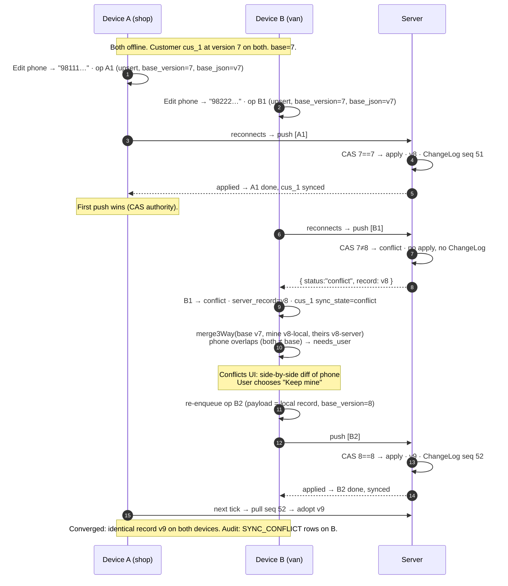
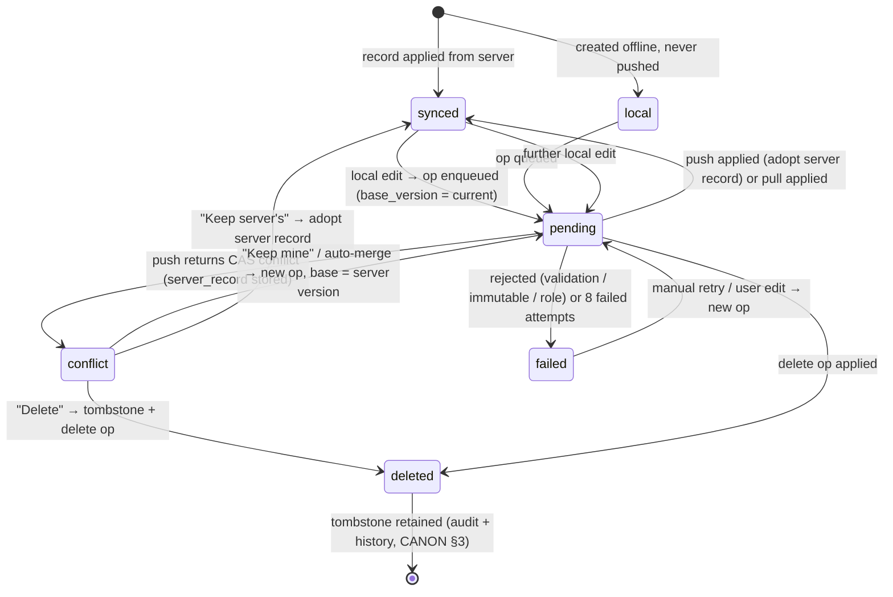

# 18. Conflict Resolution

> Derived from `docs/_CANON.md` — §3 (metadata/CAS), §6 (numbering authority), §7 (outbox fields), §9 (conflict detection at push), §10 (conflict-resolution framework — **definitive policy matrix**), §12 (document lifecycles), §16 (audit). `_CANON.md` wins on any conflict. Detection and transport mechanics live in docs/17-SYNC-ENGINE.md.

---

## 1. Purpose

Define how InvoiceFlow resolves concurrent edits made on devices that were offline simultaneously: the six conflict classes and their policies, the 3-way merge algorithm used for auto-mergeable entities, the conflict UI, audit logging of resolutions, and the canonical reconnect scenarios (delete-vs-edit, double-finalize, duplicate invoice numbers). The governing principle: **never silently merge financial changes** (CANON §10).

## 2. Scope

**In scope**

- Conflict classes 1–6 and the policy matrix (CANON §10, reproduced).
- 3-way field merge (pseudocode) for customers, products, and draft documents.
- What is never auto-merged; the Conflicts UI; resolution audit logging.
- Step-by-step reconnect sequence for two offline devices; record conflict-lifecycle state machine.

**Out of scope**

- How conflicts are *detected and transported* (CAS on `base_version` at push) — docs/17 §4.1/§4.4.
- Server-side rule enforcement (immutable finalized documents, numbering) — CANON §6/§9 and docs/19.

## 3. Business requirements

| # | Requirement |
|---|---|
| BR1 | Concurrent edits must converge deterministically on all devices; the same inputs always yield the same outcome. |
| BR2 | Disjoint (non-overlapping) field edits on customers, products, and **draft** documents auto-merge without bothering the user. |
| BR3 | Overlapping edits and all finalized-financial-document conflicts must be **user-resolved** through an explicit UI — never auto-merged (CANON §10). |
| BR4 | Every resolution is recorded in `audit_logs` with `action='SYNC_CONFLICT'` (CANON §10). |
| BR5 | Document numbers are deterministic even when two devices allocate offline (server authority, no user action — CANON §6). |
| BR6 | No resolution path may lose data silently: unresolvable states remain visible in Settings → Sync → Conflicts until acted upon. |

## 4. Technical design

### 4.1 Conflict classes & policy matrix (CANON §10, verbatim)

| # | Scenario | Policy |
|---|---|---|
| 1 | Customer/product edited on 2 devices | 3-way field merge vs base_version; disjoint fields auto-merged; overlapping fields → user conflict UI |
| 2 | Draft invoice/quotation edited on 2 devices | Same as (1) but whole-document granularity for items: items conflict → user chooses local/server copy |
| 3 | Delete vs edit | Edit pushed after delete → conflict UI (restore vs keep deleted) |
| 4 | Two devices finalize same document | First finalize wins (CAS); second gets `conflict` → adopt server record |
| 5 | Two devices claim same invoice number | §6 numbering — deterministic, server authority, no user action needed |
| 6 | Finalized document edits | Rejected server-side (immutable); correction = duplicate → edit → reissue (documented workflow) |

Classification happens at push time on the server: a CAS failure on `base_version` yields `status: 'conflict'` with the current server record (docs/17 §4.1); classes 5 and 6 are resolved server-side (number reassignment / rejection) and never reach the UI. The client additionally consults local state (e.g. was the local record deleted?) to present class 3 correctly.

### 4.2 Merge base and merge inputs

The 3-way merge needs three snapshots:

- **`mine`** — the full record the local op tried to push (`sync_operations.payload_json`).
- **`theirs`** — the server record returned with the conflict (`sync_operations.server_record_json`).
- **`base`** — the record as of `base_version`, i.e. the last server-acknowledged copy this device had seen.

> **Implementation note (explicit, justified per CANON's deviation clause):** CANON §10 mandates "3-way field merge vs base_version" but no CANON table retains the ancestor content on the client. The engine therefore snapshots the record's last server-acknowledged state into the local outbox row at enqueue time as an **unindexed, local-only field `sync_operations.base_json`**. It never leaves the device, never enters the §9 wire contract, and does not alter any v1 index (docs/16 §4.3). Without it, a correct auto-merge is impossible (the client could not distinguish "server changed this field" from "neither changed it").

If `base_json` is unavailable (e.g. op restored from a backup), the engine degrades gracefully to the conflict UI for every differing field — auto-merge is skipped, never guessed.

### 4.3 3-way merge algorithm (pseudocode)

Applies to **customers, products, and draft documents** (classes 1–2). Everything else goes straight to the UI or the server-side rules.

```ts
type FieldConflict = { field: string; base: unknown; mine: unknown; theirs: unknown };

function merge3Way<T extends SyncedEntity>(
  base: T, mine: T, theirs: T
): { merged: T; conflicts: FieldConflict[] } {
  const merged: any = { ...theirs };          // start from server (newest authority)
  const conflicts: FieldConflict[] = [];

  // 0. Non-mergeable machinery fields — server always wins, never compared.
  for (const f of ['version', 'sync_state', 'updated_at', 'created_at']) delete (mine as any)[f];

  for (const field of mergeableFields(mine)) {
    const b = base[field], m = mine[field], t = theirs[field];

    if (deepEqual(m, t)) {
      merged[field] = m;                       // both sides agree → keep
    } else if (deepEqual(b, m)) {
      merged[field] = t;                       // only server changed → take server
    } else if (deepEqual(b, t)) {
      merged[field] = m;                       // only local changed → keep local
    } else {
      conflicts.push({ field, base: b, mine: m, theirs: t });   // true overlap → user decides
    }
  }

  // Special cases (see §4.4):
  // - deleted_at / tombstones are NOT field-merged: any local delete intent
  //   routes to the delete-vs-edit flow (class 3), never auto-merged.
  // - documents: `items`, `charges_json` and every *_paise/*_bps column are treated
  //   as ONE conflict unit (class 2 — whole-document granularity for items).

  return { merged, conflicts };
}

async function resolveConflict(op: SyncOperation): Promise<'auto_merged' | 'needs_user'> {
  const { merged, conflicts } = merge3Way(op.base_json, op.payload_json, op.server_record_json!);

  if (conflicts.length === 0 && !touchesTombstone(op)) {
    // Class 1/2 clean auto-merge: re-enqueue as a NEW op against the server version.
    await reenqueueOp({
      entity: op.entity, entity_id: op.entity_id,
      action: 'upsert', base_version: op.server_record_json!.version,  // CAS will now pass
      payload: withRecomputedTotals(merged),     // totals via domain engine, never carried over
      audit: 'auto-merged after conflict',
    });
    return 'auto_merged';
  }
  await stageForUserUI(op, merged, conflicts);   // Settings → Sync → Conflicts
  return 'needs_user';
}
```

Rules embedded in the algorithm:

1. Auto-merge produces a **new op** with `base_version = server version` — the CAS succeeds and the merge lands as a normal, audited write (docs/17 §4.8).
2. Totals are **recomputed by the domain engine** on the merged record (CANON §4) — never averaged, never carried from either side.
3. Empty-string/`null` equivalences are normalized before comparison so "cleared a field" vs "never set" doesn't fake a conflict.
4. Draft documents: scalar fields merge field-wise; **`items` and `charges_json` are atomic** — any difference on either side where both devices changed the document → single user choice "local items / server items" (class 2).

### 4.4 What is NEVER auto-merged

| Data | Reason | Path |
|---|---|---|
| **Finalized invoices / quotations** — number, status, totals, items, finalized_at | Financial documents are immutable once finalized (CANON §6/§12); edits are server-**rejected** (class 6) | Correction workflow: duplicate → edit → reissue (CANON §10) |
| Payments | Money records; overlapping recording implies duplicate payments | Server recomputes `paid_total`; conflicts surface in UI |
| `deleted_at` / tombstones | Delete is an intent, not a field value (class 3) | Restore-vs-keep-deleted UI (§4.6) |
| Document numbers & sequences | Server authority (class 5, CANON §6) | `number_reassigned` — client adopts, zero user action |
| `document_sequences` rows | Server-owned after first sync | Never client-merged |
| `version`, `sync_state`, `origin_device_id`, timestamps | Sync machinery | Server record wins on apply |

### 4.5 Conflict UI design (Settings → Sync → Conflicts)

- **Entry point:** Settings → Sync tab → "Conflicts" list; the sync pill shows `Error`/attention state while any conflict exists (CANON §15); each row: entity icon, name/number, "changed on <device/date> vs <server date>".
- **Detail view — side-by-side diff:** left column "This device" (`payload_json`), right column "Server" (`server_record_json`); differing fields highlighted, with the base value shown as strikethrough context where present (from `base_json`); for draft documents an items summary table with counts and totals diff; for class 3 a delete marker banner.
- **Actions (CANON §10):**
  - **Keep mine** — re-enqueue the local record as a new op with `base_version = server version` (applies cleanly; field-level choice of merged scalars is offered first when only *some* fields conflict).
  - **Keep server's** — adopt the server record into IndexedDB (`sync_state='synced'`), mark the op `done`, local edits discarded (recorded in audit, recoverable from the op payload until prune).
  - **Delete** (deletable entities only: customers, products, drafts — never finalized documents or payments) — soft-delete locally and enqueue a `delete` op with `base_version = server version`; the server tombstone wins.
- Class 2 items conflicts add the explicit chooser: "Use this device's items" / "Use server's items" — no item-level splice UI in v1 (whole-document granularity, CANON §10).
- Every action requires a deliberate click (AlertDialog confirm for Delete); there is no "resolve all" bulk button in v1 — financial data deserves eyes.

### 4.6 Canonical scenarios

#### Two offline devices reconnect (step by step)

Both devices edited the **same field** of the same customer while offline (class 1, overlapping):



If the devices had edited **different fields** (A: phone, B: email), the identical transport occurs, but `merge3Way` finds zero overlapping fields and B auto-merges: a new op (`base_version=8`) is pushed with both changes — the user is only notified, never interrupted (class 1 policy, CANON §10).

#### Delete vs edit (class 3)

Device A deletes cus_1 (soft `deleted_at`, op `action='delete'`, `base_version=7`); device B edits cus_1's address offline. B pushes first → applied (v8). A pushes → CAS fails → `conflict`. UI presents **"Restore (keep deleted)" vs "Keep deleted"**: *Restore* re-enqueues an `upsert` of the pre-delete record with `base_version = server version` (entity resurrects: `deleted_at=null`, version bump); *Keep deleted* re-enqueues the `delete` op against the server version (tombstone applied server-side). The reverse order (delete applied first, edit pushed after) is symmetric: the editor gets the conflict UI. Deletes of entities with financial ties (customer with invoices) still soft-delete — history is never physically removed (CANON §3).

#### Double-finalize (class 4)

Both devices finalize the same draft offline, each stamping local `finalized_at` and queueing `action='finalize'`. First push wins: server allocates the number (CANON §6), stamps `finalized_at`, bumps version. Second push: CAS failure → `conflict` with the finalized server record → client **adopts the server record** (Keep server's is the only sensible action; the UI preselects it and labels the local finalize as superseded). The document was numbered exactly once. If the second device had instead edited the draft, class 2 rules would apply — but after finalization, class 6 rejection guards immutability.

#### Duplicate invoice number (class 5, CANON §6 — server authority, no user action)

Two devices each allocate `INV/2025-26/0042` offline from their local `document_sequences` (both seeded at `next_seq=42`). Push order resolves deterministically:

1. A pushes `finalize` with 0042 → server sequence behind (e.g. at 40) → server **adopts** A's number by fast-forwarding its sequence to 43 → `applied`.
2. B pushes `finalize` with 0042 → server already issued it → server issues the **next free** number (`0043`), fast-forwards again, responds `number_reassigned` with the corrected record → B adopts the new number silently (document immutable once finalized), UI toasts the adjustment.
3. Sequences never decrement; cancelled invoices keep their numbers (CANON §6). No user ever picks a number — the outcome is deterministic regardless of push order.

#### Finalized document edits (class 6)

Any `upsert`/`delete` op targeting a FINALIZED/PAID invoice is **rejected** server-side (CANON §9 rule 5) → op `failed` with an explanatory error; the documented correction workflow is duplicate → edit → reissue (CANON §10). Only `cancel` and payment ops are accepted (cancel blocked when payments exist — CANON §9).

### 4.7 Record conflict lifecycle (per record)



Notes: `conflict` is a **stationary, user-visible** state — records never leave it without an explicit resolution (or an auto-merge when policy allows). `deleted` is the soft-delete state (`deleted_at` set); it remains queryable for audit and reporting history.

## 5. Data models

Conflict-relevant fields (CANON §7): `sync_operations.payload_json` (mine), `sync_operations.server_record_json` (theirs, on conflict), `sync_operations.base_json` (base — local-only, unindexed, see §4.2 note), `base_version`, plus the entity `version`/`sync_state` metadata of CANON §3. Audit row (CANON §7): `audit_logs { entity_type, entity_id, action: 'SYNC_CONFLICT', detail_json, device_id, at }`.

`detail_json` schema for resolutions (contract):

```json
{ "op_id": "uuid", "resolution": "keep_mine | keep_servers | delete | auto_merged",
  "fields_conflicted": ["phone"], "base_version": 7, "server_version": 8,
  "device_id": "uuid", "resolved_at": "ISO" }
```

## 6. API contracts

No dedicated conflict endpoints — conflicts are expressed **inside the sync contract** (docs/17 §4.1): push response `status: 'conflict'` with `record` (server record); resolution re-enters the system as ordinary ops (`upsert`/`delete` with the updated `base_version`), inheriting idempotency (`ProcessedOp`), validation, and audit. Resolutions never bypass `/api/sync/push` — there is no "force write" path.

## 7. Offline behavior

All conflict *bookkeeping* is offline-capable: `base_json` snapshots, staged conflict rows, and the Conflicts UI work with zero network; resolving "Keep mine" only **queues** an op (applies when connectivity returns). "Keep server's"/"Delete" complete locally immediately and queue their confirming ops. A conflict can therefore be resolved on a plane and observed by the server days later — deterministically, because `base_version` pins the merge point.

## 8. Online behavior

Conflicts are **detected online** — only the server can compare `base_version` against its current state (docs/17 §4.1). On detection the engine stores the server record and flips `sync_state` (offline-safe), then the UI takes over. Post-resolution, the next engine cycle pushes the outcome and the involved devices converge via pull (§4.6 sequence).

## 9. Security considerations

- Every resolution is **audit-logged** with `action='SYNC_CONFLICT'` including which fields conflicted and which device resolved (CANON §10, §16) — financial traceability.
- Re-enqueued resolutions pass the **same server validation and CAS** as any op; a stale or tampered client cannot force a write (role ≥ MEMBER enforced server-side, CANON §9).
- The Conflicts UI renders records through React (no `dangerouslySetInnerHTML`); server records are data, never markup (CANON §16).
- Discarded local copies remain in the op payload until the 7-day prune of **done** ops; conflict/failed ops are never auto-pruned (docs/17 §4.3) — intentional for recoverability, noted in docs/29-SECURITY.md.
- Delete resolutions on financial history are soft deletes only; physical erasure follows the account-deletion flow (CANON §11).

## 10. Error-handling rules

| Situation | Rule |
|---|---|
| `base_json` missing at conflict time | Skip auto-merge; route every differing field to the UI (never guess a base — §4.2) |
| Re-enqueued resolution loses the CAS race again (server moved) | New `conflict`; re-enter the flow; loop is bounded by human resolution speed, engine imposes no auto-retry |
| Resolution payload fails Zod (corrupt local edit) | Op `rejected` → `failed` with error; the conflicting server record remains the live state; user edits forward |
| User resolves while a newer server version arrives mid-flow | Resolution op is CAS-checked; if it conflicts again the UI re-renders the fresh server record — no stale apply |
| Delete resolution on a non-deletable entity (finalized doc/payment) | Server `rejected` (immutable/protected); op `failed`; UI explains the duplicate-and-reissue workflow (class 6) |
| Conflict resolved on device X while device Y still holds a pending op for the same entity | Y's next push CAS-fails against the resolved version → Y's UI shows the conflict; convergence is CAS-guaranteed, not assumed |

## 11. Acceptance criteria

1. All six CANON §10 classes behave per the matrix: 1–2 merge/UI per §4.3–§4.5; 3 restore/keep UI; 4 first-finalize-wins with adoption; 5 deterministic reassignment with no user action; 6 server rejection with the documented correction workflow.
2. Two devices editing **disjoint** fields converge with **zero** user interaction; the merged record contains both edits and domain-recomputed totals.
3. Two devices editing the **same** field produce exactly one conflict row on the second device, a side-by-side diff, and functional Keep mine / Keep server's / Delete actions.
4. Every resolution writes an `audit_logs` row with `action='SYNC_CONFLICT'` and the `detail_json` of §5.
5. Double-finalize test: exactly one number allocated server-side; the losing device adopts the server record; no device ever holds two numbers for one document.
6. Duplicate-number test: regardless of push order, the server's numbers are unique and monotonic; both devices end with the server-issued numbers; sequences never decrement.
7. A draft's items are resolved at whole-document granularity — no item-level splice is possible in the UI (class 2).
8. Finalized invoices reject edits/deletes server-side; the failed op explains the duplicate → edit → reissue workflow.
9. Conflicts persist across reloads and are resolvable fully offline; "Keep mine" applies only after the queued op is accepted by the server.
10. After every scenario in §4.6, both devices converge to byte-equivalent records within one sync cycle (property: same inputs → same merged state everywhere).
