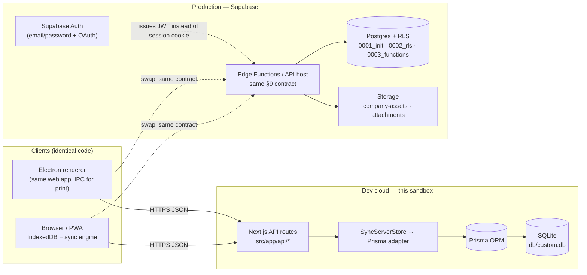

# 19. Cloud Sync — Architecture & Providers

> Derived from `docs/_CANON.md` — §2 (sandbox mapping), §3 (metadata), §7 (entity model), §8 (cloud schema & sync server — **definitive for provider design**), §9 (sync protocol), §11 (auth/claim), §14 (API surface), §16 (security), §19.4 (dev-cloud assumption). `_CANON.md` wins on any conflict. Protocol mechanics live in docs/17-SYNC-ENGINE.md.

---

## 1. Purpose

Specify the cloud layer that backs the sync protocol: the **production Supabase design** (tables mirroring the local model, RLS policy pattern, storage buckets, Edge Functions alternative), the **dev-cloud adapter running in this sandbox** (Next.js API routes + Prisma/SQLite), the provider-agnostic interface that makes the two interchangeable, and the security model (service keys server-only, server-side membership checks).

## 2. Scope

**In scope**

- Supabase production schema and RLS policy pattern with SQL excerpts (CANON §8).
- Storage buckets `company-assets` and `attachments` with the path convention.
- Edge Functions as the serverless alternative for the sync endpoints.
- The dev-cloud (this sandbox): `src/app/api/*` + Prisma/SQLite mirroring the same relational model (CANON §8/§14).
- The provider-agnostic `SyncServerStore` interface and the exact swap path.
- Deployment architecture diagram; security posture.

**Out of scope**

- Client engine internals (push/pull/retry) — docs/17-SYNC-ENGINE.md.
- Auth UX and session lifecycle details — docs/07-AUTHENTICATION.md (interface only referenced here).
- Email/WhatsApp/payment gateways — designed extension points only (CANON §19.3).

## 3. Business requirements

| # | Requirement |
|---|---|
| BR1 | The sync protocol (CANON §9) must be **identical against both providers** — the client cannot tell Supabase from the dev-cloud. |
| BR2 | Every read and write is authorized **server-side** by workspace membership and role (OWNER > ADMIN > MEMBER > VIEWER; VIEWER read-only; MEMBER cannot delete; ADMIN cannot delete workspace — CANON §8). |
| BR3 | The cloud stores the full relational model of CANON §7 with soft deletes, versioning, and a ChangeLog feed sufficient for cursor-based pull. |
| BR4 | Service-role credentials are **never bundled into the client** (CANON §16). |
| BR5 | The sandbox dev-cloud must be fully functional for development/E2E (SQLite via Next API routes) while remaining a drop-in replacement target for Supabase (CANON §19.4). |
| BR6 | Files (logos, signatures, attachments) live in object storage with the same authorization rules as relational data. |

## 4. Technical design

### 4.1 Architecture overview

One protocol, two providers. The client (browser/PWA/Electron) speaks only `POST /api/sync/push` + `GET /api/sync/pull` + auth/workspace endpoints (CANON §14). The provider choice is invisible to the client code.



**Sandbox (dev):** `Next.js API routes` (`/api/health`, `/api/auth/*`, `/api/workspace/claim`, `/api/sync/*`) over a `SyncServerStore` implemented with **Prisma/SQLite** (`prisma/schema.prisma`, DB at `file:./db/custom.db`).

**Production:** the same routes/contract served by a thin host — either a Node host using **Supabase** as the database, or **Supabase Edge Functions** (§4.6) — with **Postgres + RLS**, **Supabase Auth** replacing the dev session adapter, and Supabase **Storage** for files. The monorepo mapping (CANON §2): `packages/cloud` → `src/lib/server/` + `src/app/api/*` + `prisma/schema.prisma` + `supabase/` (migrations `0001_init.sql`, `0002_rls.sql`, `0003_functions.sql`, `seed.sql`).

### 4.2 Supabase production schema

Tables mirror the local model (CANON §7) 1:1 — same column names and types (paise/bps/milli integers, `YYYY-MM-DD` date strings stored as `date`, ISO timestamps as `timestamptz`), UUID PKs, FK to `workspaces(id)`, `updated_at` triggers, soft deletes (`deleted_at`), plus server-only tables. Every business table: `id uuid PK`, `workspace_id uuid FK → workspaces(id)`, `created_at`, `updated_at`, `deleted_at`, `version int NOT NULL DEFAULT 1`, `origin_device_id uuid`.

| Supabase table | Mirrors | Notes |
|---|---|---|
| `workspaces`, `workspace_members`, `company_profiles`, `customers`, `products`, `quotations(+quotation_items)`, `invoices(+invoice_items)`, `payments`, `tax_rates`, `document_sequences`, `attachments`, `audit_logs` | CANON §7 tables | Unique `[workspace_id+doc_type+fiscal_year]` on sequences; `UNIQUE(workspace_id, number)` partial on non-draft documents |
| `users` | Supabase `auth.users` | Referenced by `workspace_members.user_id` — no custom password storage |
| `change_log` | CANON §8 pull feed | `seq bigserial PK`, `workspace_id`, `entity`, `entity_id`, `op`, `payload_json jsonb` (full record incl. items), `at` |
| `processed_ops` | CANON §8/§9 idempotency | `op_id uuid PK`, `outcome_json jsonb`, `at` |

Uniqueness and integrity rules (enforced by constraints, not client): one number per finalized document per workspace; `document_sequences` unique per `(workspace_id, doc_type, fiscal_year)`; FKs for `customer_id`/`invoice_id`/`quotation_id`; `CHECK (version >= 1)`.

### 4.3 RLS policy pattern (CANON §8)

RLS is enabled on **every** table; helpers are `SECURITY DEFINER` functions used by all policies. Server-side enforcement only — the client never relies on its own role state (BR2).

```sql
-- 0002_rls.sql (excerpts — full DDL in supabase/migrations/)
create type member_role as enum ('OWNER', 'ADMIN', 'MEMBER', 'VIEWER');

create or replace function is_workspace_member(ws uuid)
returns boolean language sql stable security definer set search_path = public as $$
  select exists (
    select 1 from workspace_members m
    where m.workspace_id = ws
      and m.user_id = auth.uid()
  );
$$;

create or replace function has_role(ws uuid, allowed member_role[])
returns boolean language sql stable security definer set search_path = public as $$
  select exists (
    select 1 from workspace_members m
    where m.workspace_id = ws
      and m.user_id = auth.uid()
      and m.role = any (allowed)
  );
$$;

alter table customers enable row level security;

create policy customers_select on customers for select
  using (is_workspace_member(workspace_id));                       -- VIEWER may read

create policy customers_insert on customers for insert
  with check (has_role(workspace_id, array['OWNER','ADMIN','MEMBER']::member_role[]));

create policy customers_update on customers for update
  using (has_role(workspace_id, array['OWNER','ADMIN','MEMBER']::member_role[]));

create policy customers_delete on customers for delete
  using (has_role(workspace_id, array['OWNER','ADMIN']::member_role[]));  -- MEMBER cannot delete
```

Role matrix encoded by the policy set (CANON §8): `VIEWER` select-only; `MEMBER` read/write but **no delete**; `ADMIN` adds delete; `OWNER` additionally manages the workspace/members (workspace `delete` restricted to OWNER — "ADMIN cannot delete workspace"). The same four policies are stamped on every business table by the migration; `change_log`/`processed_ops`/`document_sequences` are **service-role only** (no client policies) — they are written exclusively inside the sync transaction functions of `0003_functions.sql` (number allocation, CAS apply, ChangeLog append, version bump — CANON §9 server rules 1–7).

### 4.4 Storage buckets

| Bucket | Contents | Path convention |
|---|---|---|
| `company-assets` | Company logo, signature image | `{workspace_id}/{entity}/{filename}` e.g. `8c0a…/company/logo.png` |
| `attachments` | Document attachments | `{workspace_id}/{entity}/{filename}` e.g. `8c0a…/invoice/INV-2025-26-0042-receipt.pdf` |

Bucket policies mirror the RLS helpers (first path segment = workspace id, validated with the same `has_role()` logic, delete restricted to ADMIN/OWNER). Upload validation (PNG/JPEG ≤ 1 MB for logo/signature; MIME allow-list for attachments) is enforced client- and server-side (CANON §16). In the MVP, small attachments are also inlined in IndexedDB locally (`attachments.data`) — the bucket is their production home when size warrants it.

### 4.5 The dev-cloud adapter (this sandbox)

Per CANON §8/§14: identical relational model in **Prisma/SQLite** exposed through Next.js API routes. Prisma mirrors: `User, Session, Workspace, WorkspaceMember, CompanyProfile, Customer, Product, Quotation(+Item), Invoice(+Item), Payment, TaxRate, DocumentSequence, ChangeLog, ProcessedOp` — plus `Attachment` and `AuditLog` tables mapping CANON §7 (the mirror list in §8 names the synced core; the sandbox schema carries the full 17-table model 1:1).

Auth adapter (dev, CANON §11): scrypt password hashing (16-byte salt, 64-byte key, timing-safe compare), 32-byte session token in the `if_session` httpOnly SameSite=Lax cookie, 30-day expiry, in-memory token-bucket rate limit (10 req/min/IP) on auth routes. In production this adapter is replaced by Supabase Auth behind the same interface (docs/07-AUTHENTICATION.md).

**Provider-agnostic interface** — the route handlers depend only on this port; both adapters implement it:

```ts
// src/lib/server/sync-store.ts (contract)
export interface SyncServerStore {
  // Authn/authz — server-side membership is mandatory (BR2)
  requireUser(): Promise<{ userId: string } | null>;
  assertMember(workspaceId: string, userId: string, minRoles: Role[]): Promise<Membership>;
  // Push-side (CANON §9 server rules 1–7)
  findProcessed(opId: string): Promise<ProcessedOutcome | null>;       // → 'duplicate'
  recordProcessed(opId: string, outcome: ProcessedOutcome): Promise<void>;
  currentRecord(entity: EntityName, workspaceId: string, id: string): Promise<ServerRecord | null>;
  applyUpsert(op: PushOp, membership: Membership): Promise<AppliedRecord>;  // Zod → recompute totals → CAS → version++
  applyFinalize(op: PushOp, membership: Membership): Promise<AppliedRecord>; // number allocation (§6) + finalized_at
  applyCancel / applyDelete(op: PushOp): Promise<AppliedRecord>;       // cancel blocked when payments exist; FINALIZED/PAID immutable
  appendChangeLog(workspaceId: string, entry: ChangeEntry): Promise<number>; // seq
  // Pull-side
  listChanges(workspaceId: string, cursor: number, limit: number):     // ChangeLog feed
    Promise<{ changes: ChangeEntry[]; nextCursor: number }>;
}
```

`PrismaSyncStore` (dev) and `SupabaseSyncStore` (prod) implement it; route handlers, engine, and tests are provider-blind. Both adapters implement push as **one serializable transaction per op**: validate (shared Zod schemas) → idempotency check → CAS (`base_version` vs current `version`) → business rules (§9 server rules) → recompute totals (CANON §4 — `computeDocumentTotals` shared via `src/lib/domain/documents.ts`) → write row + ChangeLog + ProcessedOp → return outcome. The dev adapter serializes writes with SQLite's transactional semantics; the Supabase adapter uses `SELECT … FOR UPDATE`/serializable transactions for sequence allocation (CANON §6).

### 4.6 Edge Functions alternative

The two sync endpoints are small, stateless, and Postgres-adjacent — ideal **Supabase Edge Functions** (Deno):

- `sync-push`: verifies the Supabase JWT (`auth.uid()`), then executes the same apply logic as SQL functions from `0003_functions.sql` (or calls them via RPC) — one round trip, no external API host.
- `sync-pull`: a paged read over `change_log` with the caller's membership enforced by RLS.
- Storage upload/delete flows can likewise be proxied to keep bucket policies JWT-scoped.

Trade-offs documented for the swap decision: Edge Functions remove a server to operate and keep data regional; a Node host (the dev-cloud code nearly verbatim) offers easier shared-TypeScript reuse of Zod schemas and the domain engine. **Either way the §9 wire contract is unchanged** — the client swap is configuration (base URL + auth mode), not code.

### 4.7 Workspace claim & guest→cloud migration (CANON §11)

`POST /api/workspace/claim { workspace_id, name, device_id }` (authenticated): creates the server workspace owned by the caller, inserts the `OWNER` membership, writes the initial ChangeLog entry, and returns the server workspace record. The client sets `cloud_linked_at`, resets `pull_cursor = 0`, and the engine pushes the full local dataset as normal ops (bulk-safe batching — docs/17 §4.6). Both providers implement claim with identical semantics; registering while a guest workspace exists triggers it automatically.

## 5. Data models

- **Client (IndexedDB):** docs/16 — 17 Dexie tables, CANON §7 fields.
- **Supabase (Postgres):** §4.2 — mirrored tables + `change_log` + `processed_ops`; RLS per §4.3; storage buckets per §4.4.
- **Dev-cloud (Prisma/SQLite):** §4.5 mirror list; same columns/types as Supabase modulo SQLite typings (`integer` for paise/bps/milli, `text` for ISO dates, `datetime` for timestamps).

Every synced row in every provider carries the CANON §3 metadata: `id (uuid)`, `workspace_id`, `created_at`, `updated_at`, `deleted_at`, `version` (starts 1), `origin_device_id` — `sync_state` is client-only (a local view of the outbox, never stored in the cloud).

## 6. API contracts

Identical on both providers (CANON §14 — reproduced here as the cloud-facing surface):

| Endpoint | Method | Purpose |
|---|---|---|
| `/api/health` | GET | liveness + `{ ok, time, version }` (connectivity heartbeat) |
| `/api/auth/register` | POST | create account (+claim guest workspace if any) |
| `/api/auth/login` | POST | session cookie (dev) / JWT (prod) |
| `/api/auth/logout` | POST | destroy session |
| `/api/auth/session` | GET | current user or `{ user: null }` |
| `/api/auth/account` | DELETE | delete account + server data |
| `/api/workspace/claim` | POST | attach local workspace to account (§4.7) |
| `/api/sync/push` | POST | CANON §9 contract (docs/17 §4.1) |
| `/api/sync/pull` | GET | CANON §9 contract (docs/17 §4.1) |

Errors: `{ error: string, code?: string }` with 400/401/403/404/409/429/500 semantics (CANON §14). `schema_version` in push requests; mismatch → `409 {code:'schema_version'}` (docs/17 §4.7). Full request/response schemas: docs/30-API-DESIGN.md & `API.md`.

## 7. Offline behavior

The cloud is entirely absent from offline operation: the client queues ops in IndexedDB and serves all reads locally (docs/15). Provider outages degrade to the same offline mode — the engine's transient-error backoff absorbs them (docs/17 §4.7) without any provider-specific handling. Backup/restore (JSON) never requires the cloud.

## 8. Online behavior

Online, the provider executes the CANON §9 server rules inside per-op transactions: idempotency (`processed_ops`), Zod validation, CAS, totals recomputation, numbering (`document_sequences`, serializable), immutability enforcement, ChangeLog append + version bump, and membership/role checks. Pull serves the gap-free `change_log` feed by cursor (`limit` ≤ 500). `/api/health` remains unauthenticated and side-effect free for heartbeats.

## 9. Security considerations

- **Service keys server-only** (CANON §16): `SUPABASE_SERVICE_ROLE_KEY` (and the dev `SESSION_SECRET`/DB URL) live in server environment variables, never in client bundles, never in IndexedDB/localStorage. Browser-facing code uses only session cookies (dev) or the anon key + user JWT (prod), with RLS as the enforcement backstop.
- **Server-side authorization on every request**: membership + role (§4.3 policies / `assertMember` in the adapter); the client's role state is advisory UI only (BR2).
- **Server-side recomputation**: totals from items via the shared domain engine; clients cannot inject arithmetic (CANON §4, §16).
- Transport: HTTPS everywhere; cookies httpOnly + SameSite=Lax (dev) / Bearer JWT (prod); JSON-only APIs (no GET mutations) as CSRF posture; auth routes rate-limited (CANON §11/§16).
- Electron adds no cloud privileges — it reuses the web session; `contextIsolation` keeps tokens out of reach of renderer exploits (CANON §16).
- Account deletion (`DELETE /api/auth/account`) cascades user data server-side (memberships, workspaces owned); local data remains on the device unless the user clears it (CANON §11, docs/29-SECURITY.md).
- Audit: finalize/convert/cancel/payment/conflict events are audit-logged server-side (`audit_logs`), complementing the ChangeLog's technical history (CANON §16).

## 10. Error-handling rules

| Condition | Behavior |
|---|---|
| Validation failure on any op | `rejected` with a field-accurate error string; op `failed` client-side, visible in the outbox (docs/17 §10) |
| CAS failure | `conflict` + server record → docs/18 flow |
| Number already issued | `number_reassigned` with the corrected record (CANON §6) — client adopts silently |
| Not a member / role too low | `403`; per-op `failed`; never a silent skip |
| Unknown workspace / record | `404` |
| Rate limit / auth expiry / schema mismatch | `429` → backoff; `401` → pause + `needs_reauth`; `409 schema_version` → halt + upgrade notice (docs/17 §4.7) |
| Provider outage mid-batch | HTTP 5xx → per-op transient handling; `in_flight` ops reclaimed on next run (idempotency makes re-push safe) |
| SQLite/Postgres constraint violation | Treated as a server bug path: logged server-side, returned as `rejected` (never a 500 leak of internals) |

## 11. Acceptance criteria

1. The same client build syncs against the dev-cloud and a Supabase instance with **zero** client code changes (only base URL/auth configuration) — BR1.
2. RLS is enabled on every business table; a `VIEWER` JWT cannot write, a `MEMBER` JWT cannot delete, an `ADMIN` JWT cannot delete the workspace (policy tests via SQL).
3. `change_log.seq` is gap-free per database and pull with `cursor=<any>` returns exactly the changes after it, `next_cursor` monotonic.
4. Replaying a processed `op_id` returns `duplicate` with the stored outcome and produces no second ChangeLog row (idempotency across providers).
5. Totals on the server always equal `computeDocumentTotals` over the stored items, regardless of what the client sent (recomputation test).
6. `document_sequences` never regresses: concurrent finalize calls (serializable) allocate unique, monotonic numbers per `(workspace_id, doc_type, fiscal_year)`.
7. Storage paths obey `{workspace_id}/{entity}/{filename}`; a foreign-workspace JWT cannot read or write another workspace's objects (bucket policy test).
8. A grep of client bundles contains no service-role key or DB URL; all privileged calls originate from the server/edge layer (BR4).
9. Claim flow: guest workspace → register → claim → full local dataset present on a second device after sync; `pull_cursor` reset to 0 before the bulk push (CANON §11).
10. The dev-cloud passes the full docs/17 acceptance suite (batching, backoff, conflict, reauth, schema guard) unchanged — proving provider independence end-to-end.
