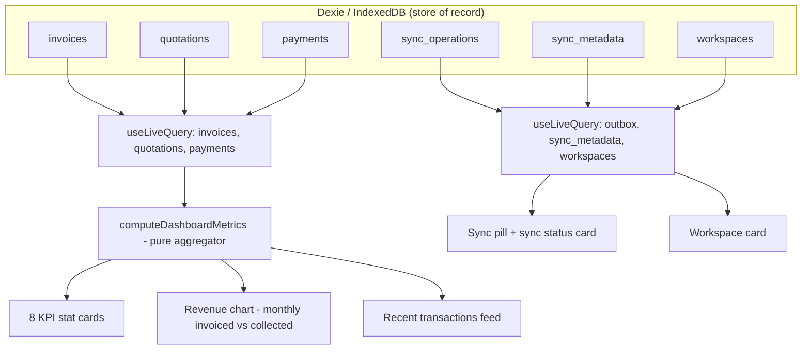

# 20 — Dashboard

> Derives from `docs/_CANON.md` (§4 money rules, §7 tables, §9 sync, §12 lifecycles, §15 UI). All money math in integer paise; dates of financial documents as `YYYY-MM-DD` strings.

Related docs: docs/21-REPORTS.md (shared period component, aggregation conventions) · docs/19-CLOUD-SYNC.md (pill states) · docs/23-NOTIFICATIONS.md (feedback) · docs/16-INDEXEDDB-DATABASE.md (tables) · docs/35-TESTING.md (aggregator tests).

## Purpose

Define the Dashboard (`#/dashboard`, default route): the workspace-scoped, offline-first overview of business health — 8 KPI stat cards with **exact, unambiguous formulas**, the monthly invoiced-vs-collected revenue chart, recent transactions, the sync status card, and the workspace card.

## Scope

- In scope: KPI definitions and formulas, reporting-period semantics, chart series, recent-activity feed, sync status card, workspace card, quick actions, data-flow architecture, offline/online behavior.
- Out of scope: full Reports module (docs/21-REPORTS.md), sync engine internals (docs/19-CLOUD-SYNC.md), PDF preview (docs/14-PDF-GENERATION.md).

## Business requirements

1. BR-1 The dashboard must be **fully computable locally** from IndexedDB with zero network access (CANON golden rule).
2. BR-2 Every metric is scoped to the **active workspace** and the selected **reporting period** (default: current fiscal year, April–March).
3. BR-3 KPI formulas must be deterministic and identical across devices for the same local dataset (no per-device randomness).
4. BR-4 The dashboard must never show soft-deleted records (`deleted_at` non-null) and must never count `CANCELLED` invoices as business volume.
5. BR-5 Users must see at a glance: what is owed to them (Outstanding), what is overdue, and whether their data is synced.
6. BR-6 Quick actions must give one-tap access to the most frequent workflows (new invoice, new quotation, record payment, add customer).

## KPI definitions (EXACT formulas)

Let `WS` = active `workspace_id`; `deleted_at IS NULL` is implied for every predicate below; period `P = [from, to]` inclusive on the document date (`invoice_date` / `quotation_date` / `payment.paid_at`), string comparison on `YYYY-MM-DD`. `today` = device-local date.

| # | KPI card (CANON §15) | Exact formula |
|---|---|---|
| 1 | **Total invoices** | `COUNT(invoices WHERE workspace_id = WS AND status != 'CANCELLED')` — includes DRAFT, filtered to `invoice_date ∈ P`. (Drafts are included; they are broken out separately in card 2.) |
| 2 | **Drafts** | `COUNT(invoices WHERE status = 'DRAFT' AND invoice_date ∈ P)` |
| 3 | **Paid** | `COUNT(invoices WHERE status = 'PAID' AND invoice_date ∈ P)` |
| 4 | **Unpaid** | `COUNT(invoices WHERE status IN ('FINALIZED','PARTIALLY_PAID') AND invoice_date ∈ P)` |
| 5 | **Overdue** | `COUNT(invoices WHERE due_date < today AND status IN ('FINALIZED','PARTIALLY_PAID') AND invoice_date ∈ P)` |
| 6 | **Total quotations** | `COUNT(quotations WHERE quotation_date ∈ P)` — all statuses (CONVERTED quotations remain in the population) |
| 7 | **Accepted quotations** | `COUNT(quotations WHERE status IN ('ACCEPTED','CONVERTED') AND quotation_date ∈ P)` — `CONVERTED` implies prior acceptance (CANON §12) |
| 8 | **Outstanding** | `Σ (grand_total_paise − paid_total_paise)` over `invoices WHERE status IN ('FINALIZED','PARTIALLY_PAID') AND invoice_date ∈ P` |

Supporting metrics (not cards; power the chart panel and Reports):

| Metric | Exact formula |
|---|---|
| **Total revenue (collected)** | `Σ payments.amount_paise WHERE payment.deleted_at IS NULL AND paid_at ∈ P AND parent invoice.deleted_at IS NULL` (payments can only exist on non-CANCELLED invoices — CANON §12 — so no further filter needed) |
| **Invoiced amount** | `Σ invoices.grand_total_paise WHERE status IN ('FINALIZED','PARTIALLY_PAID','PAID') AND invoice_date ∈ P` |

Rationale notes (quote in code comments):
- `CANCELLED` is excluded from Total invoices because it is a dead document (audit preserved, no business value). Drafts are included there and double-listed in Drafts for quick triage.
- Overdue is period-scoped like every other card (uniform rule: document date ∈ P). The Invoices list badge shows the true all-time overdue count — this asymmetry is intentional and documented.
- `EXPIRED` quotations are computed lazily on read (CANON §12) before aggregation.
- Clock caveat: `today` comes from the device clock; skewed clocks skew Overdue only, never stored data.

## Technical design

- **Pure aggregator** `src/lib/dashboard/metrics.ts`: `computeDashboardMetrics(input) → DashboardMetrics` where `input = { period, today, invoices, quotations, payments, customers }` (plain arrays from live queries). No Dexie/DOM access inside — unit-testable per docs/35-TESTING.md.
- **Live queries** via `dexie-react-hooks` `useLiveQuery`: documents + payments for the active `workspace_id` only; outbox + `sync_metadata` + `workspaces` for status cards. Dexie pushes fresh results on any table write → cards update reactively with no polling.
- **Period selector**: segmented presets — Current FY (default), Last FY, Last 6 months, This month, Custom range. `fiscalYearOf` from `src/lib/domain/` (April–March, `2025-26`). Component shared with Reports (docs/21).
- **Revenue chart** (recharts, ComposedChart): monthly buckets within period `P`; series **Invoiced** (slate) = Invoiced amount bucketed by `invoice_date` month; series **Collected** (emerald) = Total revenue bucketed by `paid_at` month. Axis readable: when `P` spans more than 6 months, render the trailing 6 monthly buckets of `P` (CANON §15 "6 months"); cards always aggregate the full period. `₹` formatting via `Intl.NumberFormat('en-IN')` (CANON §13).
- **Recent transactions**: merged feed — latest 8 records across invoices, quotations, payments sorted by `updated_at` (payments by `paid_at`), each row: kind icon, label (`INV/2025-26/0042`), customer name snapshot, amount, relative time, click → hash route (`#/invoices/:id`, `#/quotations/:id`, `#/payments`).
- **Sync status card**: pill state + pending-op count + `last_sync_at` + failed/conflict op counts + "Sync now" button (calls engine manual trigger, docs/19-CLOUD-SYNC.md).
- **Workspace card**: active workspace name, `cloud_linked_at` badge (Guest workspace vs Cloud-linked), member role, link to `#/settings`.
- **Quick actions**: buttons → `#/invoices/new`, `#/quotations/new`, `#/payments`, `#/customers/new`.
- Palette per CANON §15: paid/collected = emerald, unpaid = amber, overdue = red, draft = slate. No blue/indigo.

### Data flow



### Component breakdown

```
src/components/dashboard/
  DashboardPage        — period selector + grid layout, owns useLiveQuery calls
  KpiCard              — 8 instances; props {label, value, tone, badge?, to?}
  RevenueChart         — recharts ComposedChart; props {monthly[], formatPaise}
  RecentTransactions   — merged feed list; props {rows[]}
  SyncStatusCard       — pill + pending counts + "Sync now"
  WorkspaceCard        — name, guest/linked badge, role, settings link
  QuickActions         — 4 primary-action buttons
src/lib/dashboard/metrics.ts   — pure aggregator (no framework imports)
```

Layout: responsive grid — 4 columns of KPI cards on desktop (2 on mobile), chart spanning 2/3 width with the sync + workspace cards stacked right, recent transactions and quick actions below. Mobile: single column, chart after cards (CANON §15 Sheet drawer for navigation).

### Performance & re-render budget

- One `useLiveQuery` per logical group (documents+payments, outbox+metadata, workspaces) — not one per card — so a single Dexie change triggers at most three recomputes.
- The aggregator is `useMemo`-keyed on the query results; cards are memoized components to keep re-renders O(changed card).
- Full aggregation of 10k invoices + 30k payments must stay < 16 ms on baseline hardware; if future scale breaks this, the aggregator gains an incremental (per-status-count) path — the pure-function contract makes that swap invisible to the UI.

## Data models

No new tables. Reads only CANON §7 tables: `invoices` (incl. `grand_total_paise`, `paid_total_paise`, `due_date`, `status`), `quotations`, `payments` (`amount_paise`, `paid_at`, `deleted_at`), `sync_operations`, `sync_metadata`, `workspaces`. Output type:

```ts
interface DashboardMetrics {
  period: { from: string; to: string };
  totalInvoices: number; drafts: number; paid: number; unpaid: number; overdue: number;
  totalQuotations: number; acceptedQuotations: number;
  outstandingPaise: number;
  revenuePaise: number;      // collected
  invoicedPaise: number;
  monthly: Array<{ month: string; invoicedPaise: number; collectedPaise: number }>;
}
```

## API contracts

None. The dashboard performs **no HTTP calls** of its own; connectivity is surfaced only indirectly through the sync pill (docs/19-CLOUD-SYNC.md, `/api/health` heartbeat).

## Offline behavior

Fully functional offline — this is the primary mode. Live queries recompute instantly on every local mutation; the sync pill shows `Offline`; `today` derives from the device clock. No skeleton blocking: cached aggregates render immediately.

## Online behavior

No dashboard-specific requests. When the sync engine drains the outbox, pull-applied ChangeLog records flow into the same Dexie tables and live queries refresh automatically. Successful background syncs are silent (docs/23-NOTIFICATIONS.md).

## Security considerations

- Every query is filtered by the active `workspace_id`; no aggregate ever crosses workspaces (switching workspace remounts queries).
- Aggregation is client-side; no financial data leaves the device except through the standard sync protocol.
- No `dangerouslySetInnerHTML`; amounts rendered through Intl (XSS-safe, CANON §16).

## Error-handling rules

- Malformed/legacy rows (missing snapshot columns) are skipped with `console.warn`, never crash the render.
- Zero-data periods render the standard empty state (icon + copy + CTA), never an empty canvas.
- Chart with a single data point still renders axes; negative `grand_total` (impossible by validation) is clamped and logged.
- Live query failure (rare IndexedDB error) surfaces the app-level error boundary, not a blank page.

## Acceptance criteria

1. AC-1 Seed data produces card values exactly matching hand-computed formulas above for the seeded period.
2. AC-2 Finalizing an invoice updates Total invoices/Unpaid/Invoiced amount and the chart within one animation frame (live query).
3. AC-3 Recording a payment updates Collected series and reduces Outstanding; reaching `paid_total ≥ grand_total` moves the invoice to Paid.
4. AC-4 An invoice with `due_date < today` and status `FINALIZED` counts in Overdue with a red badge; `CANCELLED` invoices affect no card.
5. AC-5 Airplane mode: dashboard identical to online mode except the pill shows Offline; "Sync now" is disabled/inert.
6. AC-6 Switching workspace instantly re-scopes every card (no cross-workspace leakage).
7. AC-7 Aggregator unit tests cover: empty dataset, cancelled/draft mix, overpaid invoice (Outstanding never negative — clamp not required since formula only sums FINALIZED/PARTIALLY_PAID), period boundaries inclusive.
