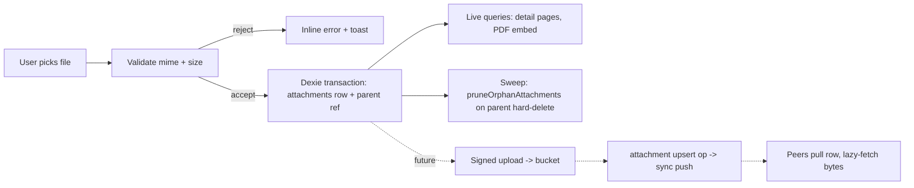

# 22 — Attachment & File Storage

> Derives from `docs/_CANON.md` (§3 conventions, §7 `attachments` table, §8 Supabase Storage, §16 security, §17 offline). Covers local attachment storage, company logo/signature assets, production Supabase Storage buckets with RLS, quota guidance, and orphan cleanup.

## Purpose

Define where binary assets (attachments, company logo, signature image) live in each environment, how they are validated, sized, synced, and cleaned up — keeping the local-first guarantee: **documents and PDFs never depend on the network**, and the MVP needs no storage server at all.

## Scope

- In scope: local `attachments` table design, inline small-blob strategy, logo/signature constraints (`company_profiles`), production Supabase Storage buckets + RLS policy sketch, quota guidance, orphan cleanup, future cloud attachment sync design.
- Out of scope: generated PDFs (ephemeral, never persisted — docs/14-PDF-GENERATION.md), database storage of business records (docs/16-INDEXEDDB-DATABASE.md).

## Business requirements

1. BR-1 Attaching files to invoices/quotations/customers must work fully offline; the attachment must survive restarts and sync later when cloud is linked.
2. BR-2 Logo and signature must be editable offline and embedded into PDFs (CANON §13) — no network fetch in the render path.
3. BR-3 Uploads are validated **before** storage: logo/signature limited to PNG/JPEG ≤ 1 MB (CANON §16); generic attachments in MVP limited to ≤ 2 MB each.
4. BR-4 Storage must degrade gracefully: browsers may evict IndexedDB data (CANON §19.8) — the app must warn before that risk becomes real and offer JSON backup.
5. BR-5 No orphaned garbage: removing/deleting an entity must eventually remove its attachment bytes.
6. BR-6 No executable/active content is ever stored or served as-is (no SVG/HTML attachments).

## Data models

### Local (Dexie) — CANON §7, authoritative for MVP

```
attachments: 'id, workspace_id, entity_type, entity_id, [entity_type+entity_id]'
fields: id (uuid), workspace_id, entity_type ('invoice'|'quotation'|'customer'|'product'|'company'),
        entity_id, filename, mime, size_bytes, data? (small blobs inline in MVP),
        + common metadata (created_at, updated_at, deleted_at, version, sync_state, origin_device_id)
```

`data` holds an `ArrayBuffer` (binary) for MVP inline storage. `company_profiles.logo_data` / `signature_data` hold **dataURL** strings (`data:image/png;base64,…`) because the PDF renderer consumes dataURLs directly.

### Future (schema v2, additive per CANON §7 versioning strategy)

- `attachments.storage_path?` — bucket path when cloud-synced; `attachments.upload_state?` — `'local'|'uploading'|'synced'|'failed'`.
- `company_profiles.logo_attachment_id?` / `signature_attachment_id?` — pointer variant when assets move to the bucket (dataURL kept for PDF compatibility via cache).

## Technical design

### Asset inventory & caps

| Asset | Location (MVP) | Cap | Validation | Synced today? |
|---|---|---|---|---|
| Company logo | `company_profiles.logo_data` (dataURL) | ≤ 1 MB, PNG/JPEG | MIME + bytes + dataURL length | ✔ (inside `company` upsert op) |
| Signature image | `company_profiles.signature_data` (dataURL) | ≤ 1 MB, PNG/JPEG | same | ✔ (same) |
| Entity attachment | `attachments.data` (inline blob) | ≤ 2 MB per file | MIME allow-list | ✖ (local-only in MVP) |
| Email/share PDF (future) | bucket `attachments`, path `{ws}/email/{op_id}.pdf` | ≤ 2 MB | server re-validation | ✔ (cloud-only artifact) |

### Local strategy (MVP — implemented)

- **Small blobs inline** in the `attachments.data` column (≤ 2 MB per file, hard client cap). Rationale: single store of record, atomic transactions with the parent entity, zero infrastructure.
- **Logo/signature**: dataURL on `company_profiles`, PNG/JPEG only, ≤ 1 MB (client checks MIME + byte size + dataURL length before accept; recommend client-side downscale to max 512×512 logo / 800×300 signature before encode).
- Writing an attachment and its parent-entity reference happens in **one Dexie transaction** (no dangling rows if the transaction fails).
- Sync status: in MVP the `attachments` table is **local-only** — the CANON §9 outbox `entity` enum does not include attachments. What *does* sync today: `logo_data`/`signature_data` ride inside the `company` upsert op payload (1 MB cap keeps op payloads sane). Full attachment sync is the designed extension below.

### Cloud strategy (production Supabase — designed)

Buckets (private, CANON §8):

| Bucket | Contents | Path convention |
|---|---|---|
| `company-assets` | logos, signatures | `{workspace_id}/company/{filename}` |
| `attachments` | entity attachments, email PDFs (docs/25) | `{workspace_id}/{entity}/{filename}` |

`filename` = `{uuid}.{ext}` (never user-supplied text — kills path traversal and collisions). `entity` ∈ `invoice|quotation|customer|product|company|email`.

**RLS storage policies sketch** (SQL, `supabase/migrations/0002_rls.sql` continuation):

```sql
-- Read: any workspace member may read own-workspace objects
create policy "att_read" on storage.objects for select to authenticated
  using (bucket_id in ('attachments','company-assets')
         and is_workspace_member((storage.foldername(name))[1]));

-- Write: role >= MEMBER (OWNER, ADMIN, MEMBER)
create policy "att_insert" on storage.objects for insert to authenticated
  with check (bucket_id in ('attachments','company-assets')
         and has_role((storage.foldername(name))[1],
                      array['OWNER','ADMIN','MEMBER']));

-- Delete: role >= ADMIN only
create policy "att_delete" on storage.objects for delete to authenticated
  using (bucket_id in ('attachments','company-assets')
         and has_role((storage.foldername(name))[1], array['OWNER','ADMIN']));
```

Server-side enforcement only (CANON §8/§16); `(storage.foldername(name))[1]` extracts `workspace_id` from the path convention.

**Future attachment sync flow** (extension): client requests a signed upload URL from the cloud adapter (`POST /api/attachments/sign {entity_type, entity_id, filename, mime, size_bytes}` → `{path, upload_url}`), PUTs bytes, then pushes the `attachment` upsert op through the standard sync protocol; pull applies peers' rows and fetches bytes lazily on first open. MIME + size are re-validated server-side before signing.

### Attachment lifecycle (MVP → future cloud)



## Quota guidance

- IndexedDB budgets are browser-dependent (Chrome: up to ~60% of free disk; Safari: far smaller, eviction-prone). Assume **tens of MB is safe, GBs is not**.
- Guidance encoded in the app: per-file cap 2 MB; soft workspace budget **50 MB** of attachment bytes; a banner appears at 80% of the soft budget.
- `navigator.storage.estimate()` (where available) is surfaced in Settings → Data (usage / quota, persistence). CANON §19.8: users are advised to install as PWA or use the desktop app for durability; JSON backup includes attachment dataURLs.
- If `navigator.storage.persist()` is available, request it after the first meaningful user action (workspace creation) — best-effort, non-blocking.

## Orphan cleanup

Definition: an `attachments` row is **orphaned** when its `entity_id` no longer resolves to a live (or soft-deleted) parent row. Soft-deleted parents **keep** their attachments (historical integrity, CANON §3); only hard-removed parents (conflict resolution "Delete", future server GC) orphan rows.

- `pruneOrphanAttachments()` runs at app start (post-migration) and after every successful sync pull: batch-scan `[entity_type+entity_id]` index, resolve parents, delete orphan rows in one transaction. Runs on idle; never blocks first paint.
- Attachment rows are deleted with their parent when a parent is hard-deleted locally.
- **Cloud GC (future, scheduled job)**: list bucket objects per workspace, diff against the cloud `attachments` table, delete unreferenced objects older than 7 days (grace window for in-flight uploads). Service-role only.

## API contracts (future cloud attachments)

```
POST /api/attachments/sign
  req:  { workspace_id, entity_type, entity_id, filename, mime, size_bytes }
  res:  { path, upload_url, expires_at }        # 400 on MIME/size violation; 403 non-member
POST /api/sync/push                              # standard protocol, entity='attachment' (v2)
GET  /api/attachments/:id/url → { url }          # short-lived signed read URL, member-checked
```

MVP implements none of these; the dev-cloud (Prisma/SQLite) exposes no storage endpoints — consistent with the provider-agnostic swap pattern of CANON §8.

## Offline behavior

Attachments are created, read, and rendered (PDF embed, customer detail) entirely from IndexedDB. Offline attachment creation marks `sync_state='pending'` (semantics only in MVP — no outbox op exists yet); the future v2 design enqueues the upload only when online.

## Online behavior

MVP: no storage traffic at all (logo/signature sync rides the company payload through `/api/sync/push`). Future: signed-URL uploads and lazy downloads as specified above; uploads retry with the engine's backoff (`2^attempts · 2 s`, cap 10 min, docs/19-CLOUD-SYNC.md).

## Security considerations

- MIME allow-list (PNG/JPEG for assets; PDF/images/CSV for generic attachments — **no SVG/HTML/JS ever**), enforced client-side before accept and server-side before signing (future).
- Size caps enforced twice (client + server); dataURL length re-checked to catch encoded-size inflation.
- Bucket paths are UUID-based; user strings never enter paths; RLS restricts every object to its workspace; deletes require ADMIN (future cloud flow).
- PDFs embedding logo/signature use local dataURLs — no external image fetches in the render path (CSP `img-src 'self' data: blob:`, CANON §16/§17).
- No `dangerouslySetInnerHTML` for attachment previews; images render via `` with `blob:` URLs revoked on unmount.

## Error-handling rules

- Oversized/wrong-type upload → inline field error + toast (docs/23-NOTIFICATIONS.md), file rejected **before** any write.
- Quota-exceeded on write (`QuotaExceededError`) → transaction aborted safely, user sees a recovery dialog (export backup / free space), no partial state (single-transaction guarantee).
- Missing `data` on a legacy row → placeholder UI, not a crash; logged for the integrity readout.
- Failed future upload → `upload_state='failed'`, retryable from Settings → Sync (same table as failed ops).

## Acceptance criteria

1. AC-1 Attaching a 1.5 MB PDF to a finalized invoice offline works; the row survives restart; size > 2 MB is rejected with a clear message.
2. AC-2 Logo upload accepts PNG/JPEG ≤ 1 MB, rejects a 1.2 MB file and an SVG rename-attack (`logo.svg` served as `image/png`); the logo appears in PDF output offline.
3. AC-3 Creating an attachment and its parent is atomic — simulated failure mid-transaction leaves neither row.
4. AC-4 Deleting a parent entity in conflict resolution ("Delete") removes its attachment rows on the next sweep.
5. AC-5 Settings → Data shows storage estimate; at > 40 MB (80% of 50 MB) the budget banner is visible.
6. AC-6 Company upsert op payload containing a ≤ 1 MB logo dataURL pushes and pulls correctly through the sync protocol.
7. AC-7 RLS policies (future): a non-member's signed-URL request for `{other_workspace}/invoice/x.pdf` is rejected 403/404.
