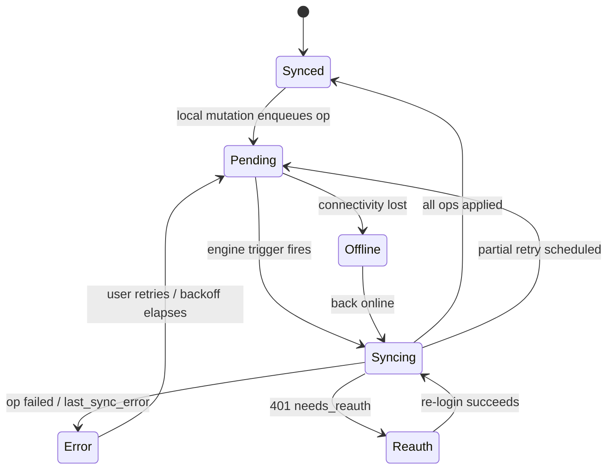

# 23 — Notifications & Feedback

> Derives from `docs/_CANON.md` (§9 sync statuses, §15 UI states, §16 security, §17 PWA). Defines every user-facing feedback channel in the MVP: toast events (sonner), the sync status pill state machine, the overdue badge — and the designed extension points for browser push and desktop notifications.

## Purpose

Give users deterministic, non-noisy feedback for every business operation and every background sync event, so that an offline-first app never feels opaque: actions confirm, failures surface, conflicts demand attention, and money-critical conditions (overdue invoices) are impossible to miss.

## Scope

- In scope: toast catalog and rules, sync status pill states, overdue badges, notification preferences design (future), browser push + Electron desktop notifications (extension points).
- Out of scope: email/WhatsApp messaging (docs/25-EMAIL.md, docs/24-WHATSAPP-SHARING.md), sync engine mechanics (docs/19-CLOUD-SYNC.md).

## Business requirements

1. BR-1 Every mutating action (save, finalize, convert, cancel, payment, delete) produces exactly one confirming toast — success is never silent.
2. BR-2 Background sync must be **quiet on success** and **loud on failure** (error, conflict, re-auth needed) — no toast storms.
3. BR-3 The sync pill must always reflect a truthful state derived from the outbox + connectivity (CANON §15 states).
4. BR-4 Overdue receivables must be visible from the dashboard without opening any list.
5. BR-5 Destructive actions always confirm first via AlertDialog (CANON §15); toasts complement, never replace, confirmation.
6. BR-6 Feedback must work identically offline and online (toasts are local UI; nothing here requires network).

## Technical design

### Toast catalog (sonner)

Sonner is mounted once (`<Toaster richColors position="bottom-right" />`); calls go through a thin wrapper `src/lib/notify.ts` (single place for copy, dedupe, actions). Types: `success | error | warning | info`.

| Event | Type | Message pattern | Action button |
|---|---|---|---|
| Invoice draft saved | success | `Draft {number} saved` | Open |
| Invoice finalized | success | `Invoice {number} finalized` (provisional number if offline: `Draft finalized — number pending sync`) | View |
| Quotation saved / marked SENT | success | `Quotation {number} saved` / `Quotation {number} marked sent` | View |
| Quotation accepted / rejected / converted | success | `Quotation {number} converted to invoice` | Open invoice |
| Payment recorded | success | `Payment of {amount} recorded for {number}` | View invoice |
| Payment deleted | success | `Payment removed — invoice {number} updated` | — |
| Validation failure (Zod, editor) | error | First field message (e.g. `Customer is required`) | — |
| Op rejected by server | error | `{entity} was rejected: {error}` (op visible in Settings → Sync) | Review |
| Sync conflict detected | warning | `{count} conflict(s) need review` | Resolve |
| Sync failed (network/5xx after retries) | error | `Sync failed — will retry` | Retry now |
| Number reassignment (CANON §6) | warning | `{old_number} was already issued — renumbered to {new_number}` | View |
| Cancel blocked (payments exist) | error | `Cannot cancel {number} — payments recorded` | View payments |
| Went offline / back online | info | `You're offline — changes save locally` / `Back online — syncing…` | — |
| Needs re-auth (401) | warning | `Session expired — sign in to resume sync` | Sign in |
| Backup exported / imported / data cleared | success | `Backup exported` / `Workspace restored from backup` / `Local data cleared` | — |
| CSV exported (docs/21) | success | `{report} CSV exported` | — |

**Rules (enforced in `notify.ts`, not at call sites):**
- Coalescing: sync result toasts collapse into at most one per sync run (the catalog's sync rows); per-op failures list counts, not N toasts.
- Dedupe: identical message+type within 3 s is dropped.
- Durations: success/info 4 s; warning 6 s; error persists until dismissed.
- Toasts are never the only signal — every error state is also visible in its surface (pill, conflict list, form field).

### Event bus design (why a wrapper, not scattered toast calls)

`src/lib/notify.ts` exposes a typed emitter + helpers, so the toast catalog and future push/desktop channels share one source:

```ts
type NotifyEvent =
  | { kind: 'document_saved'; entity: 'invoice' | 'quotation'; number: string; provisional?: boolean }
  | { kind: 'payment_recorded'; amountPaise: number; number: string }
  | { kind: 'sync_conflicts'; count: number }
  | { kind: 'sync_failed'; reason: string }
  | { kind: 'number_reassigned'; from: string; to: string }
  | { kind: 'connectivity'; online: boolean }
  | { kind: 'needs_reauth' } /* …closed union mirroring the catalog above… */

notify.emit(event)                       // → toasts today
notify.on(event, handler)                // → future push/desktop adapters subscribe here
```

Call sites (domain/UI code) never import `sonner` directly — they emit events. The sonner adapter maps the union to the catalog table; the future Electron adapter maps the same union to OS notifications. Adding a channel or changing copy touches exactly one file.

### Accessibility & placement

- Toasts render with `role="status"` (success/info) / `role="alert"` (error/warning) so screen readers announce them without stealing focus; actions are reachable by keyboard (visible focus rings, CANON §15).
- Position `bottom-right` on desktop, `top-center` on mobile (useIsMobile) — never overlapping the sticky footer.
- The sync pill exposes `aria-live="polite"` with a text label (state name) — color dots are never the only signal.

### Sync status pill — state machine

Pill lives in the topbar (CANON §15) and footer; derived from `sync_operations` + `sync_metadata` + connectivity via live queries (no polling). States per CANON §15 plus the re-auth variant of §9:

| State | Pill | Trigger |
|---|---|---|
| `syncing` | `Syncing…` (spinner) | engine run in flight (mutex held) |
| `pending` | `Pending {N}` (amber dot) | N queued ops with `status='pending'`, not currently syncing |
| `synced` | `Synced` (emerald dot) | 0 pending ops and `last_sync_at` set |
| `offline` | `Offline` (slate) | `navigator.onLine === false` (heartbeat to `/api/health` corroborates) |
| `error` | `Sync error` (red) | ≥1 op `status='failed'` or `last_sync_error` set |
| `reauth` | `Sign-in required` (amber) | engine flagged `needs_reauth` (HTTP 401, CANON §9) |



Clicking the pill opens Settings → Sync (outbox table, conflicts, failed ops, manual "Sync now").

### Overdue badge

- Dashboard **Overdue KPI card** shows the count with a red badge/semantics (docs/20 formulas); 0 renders muted.
- Invoices list: overdue rows carry a red `Overdue` chip (status chip remains FINALIZED/PARTIALLY_PAID); the Overdue filter chip shows its count.
- Badge recompute is reactive (live queries) — no timers; the lazy `today` rollover means a list opened across midnight refreshes on next render.

### Future: browser push & desktop notifications — EXTENSION POINT (not implemented in MVP)

Design (kept real, deliberately unbuilt):

- **Browser push** (PWA): requires a server component — Web Push (VAPID keys, server-only) + service-worker `push` event handler in `public/sw.js` + `Notification.requestPermission()` gated behind an explicit Settings opt-in. Message payloads carry **no financial data** (only `{kind: 'sync_conflict'|'sync_failed', workspace_id}`) — content is fetched locally after click, respecting the security baseline. Use cases limited to: sync failures while the tab is closed, conflicts needing review. Delivery log and subscription management live server-side (`push_subscriptions` table, future).
- **Electron desktop notifications**: renderer asks the main process via a **typed contextBridge API** (`window.desktop.notify({title, body, kind})` — CANON §16: typed IPC only, no nodeIntegration). Main process uses the OS `Notification`; permission is implicit on most desktop platforms but the in-app preference still gates it. Triggered only for the same sync/conflict events — never for routine saves.
- **Notification preferences** (future): `app_settings` key `notification_prefs` — `{ push: bool, desktop: bool, categories: { sync_errors: true, conflicts: true, payment_recorded: false, document_events: false } }`; defaults: local toasts on (non-configurable in MVP), remote channels off. Preferences UI lives in Settings → Preferences.

Both extension points reuse the **same internal event bus** (`notify.ts` emits typed events) so adding channels never touches business code.

## Data models

No new tables in MVP. Reads: `sync_operations` (status counts), `sync_metadata` (`last_sync_at`, `last_sync_error`), `invoices` (overdue predicates). Future: `push_subscriptions` (server), `notification_prefs` (local k/v) as designed above.

## API contracts

None in MVP. Future browser push adds `POST /api/push/subscribe {subscription}` / `DELETE /api/push/subscribe` (auth + membership checked server-side); VAPID private key is server-only (CANON §16).

## Offline behavior

Toasts, pill, and badges are fully local. Offline transitions themselves raise the catalog's info toast; the pill shows `Offline`; no notification channel depends on connectivity.

## Online behavior

Sync-engine outcomes map onto the catalog: batch success → silent (pill only), failures/conflicts/reauth → the specified toast with action. Push notifications (future) are only meaningful when the app is closed/tab backgrounded.

## Security considerations

- No financial figures in any future push payload; local toasts may show amounts (device-local surface).
- Notification permission is opt-in; the app never nags (one Settings entry point).
- Electron notifications go through the typed preload bridge only — renderer never touches Node APIs (CANON §16).
- Toast actions navigate via the internal hash router only; no external links in notifications.

## Error-handling rules

- Notification API unavailable (unsupported browser / denied permission) → extension points degrade to the in-app pill + Settings indicator; no error toast about notifications themselves (noise rule).
- Toast render failure must never break the action that caused it — `notify.ts` wraps sonner in try/catch.
- Pill derives from derived state; a corrupt op row (unknown status) counts toward `Pending` and is logged, never crashes the topbar.

## Acceptance criteria

1. AC-1 Each catalog event fires exactly its message/type/action; finalizing offline shows the provisional-number wording.
2. AC-2 A sync run with 5 failed ops yields **one** error toast (count-based), not five.
3. AC-3 Pill transitions match the state diagram, including Offline → Syncing on reconnect and Reauth on forced 401.
4. AC-4 Recording a payment on an overdue invoice immediately drops the overdue count/badge when the invoice reaches PAID.
5. AC-5 Airplane mode: all toasts/pills/badges behave identically; no network request is made by this module.
6. AC-6 Duplicate rapid saves produce one toast (dedupe window).
