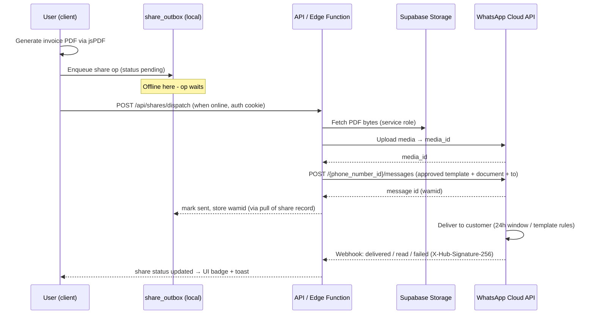

# 24 — WhatsApp Sharing

> **Extension point — not implemented in MVP.** Per CANON §19.3, WhatsApp sharing is a designed extension point (docs 24–27 series), not built in the MVP. This document specifies the current MVP sharing behavior (implemented) and the complete future WhatsApp design (not implemented). Nothing in this module blocks or forks the core architecture.

> Derives from `docs/_CANON.md` (§13 PDF system, §9 sync protocol, §16 security). Route context: sharing actions live on the invoice/quotation detail pages (`#/invoices/:id`, `#/quotations/:id`).

## Purpose

Let users get a generated PDF in front of their customer through the channel Indian businesses actually use — WhatsApp — without compromising the security baseline (no provider tokens in the client, CANON §16) and without breaking offline-first guarantees.

## Scope

- Implemented in MVP: PDF download (all platforms) + Web Share API handoff where the browser supports it.
- Designed extension (not implemented): `wa.me` quick-share deep link; WhatsApp Business Cloud API server-side delivery with PDF attachment; outbox-driven share queue; template message compliance; delivery status tracking.
- Out of scope: email (docs/25-EMAIL.md), online payment links (docs/27-PAYMENT-INTEGRATION.md — future payment links may ride the same share queue).

## Business requirements

1. BR-1 (MVP, implemented) From any finalized document the user can download the PDF and, where the platform allows, hand it to the OS share sheet (WhatsApp included) in one tap.
2. BR-2 (future) A share must be queueable offline and delivered later automatically — sharing follows the same outbox philosophy as every other operation.
3. BR-3 (future) WhatsApp credentials exist **only server-side**; the client never sees tokens or phone-number IDs.
4. BR-4 (future) Delivery outcomes (sent / delivered / read / failed) must be visible in the app and retryable on failure.
5. BR-5 (future) Customer phone numbers are used only for the share the user initiated — no bulk/marketing sends in this design.

## Technical design

### Current MVP behavior (implemented)

- **PDF download**: `renderDocument(model, 'save')` (docs/14-PDF-GENERATION.md) produces `INV-2025-26-0042.pdf` (slashes → dashes). Works everywhere, offline, Electron and browser.
- **Web Share API**: after generating a Blob, if `navigator.canShare({ files: [file] })` is true (primarily mobile browsers), the app offers "Share…" → `navigator.share({ files: [pdfFile], title, text })`; the OS share sheet lets the user pick WhatsApp and attach the file. Graceful degradation: when file-share is unsupported, only the download button shows. This is **user-driven attachment** — no API, no server, works offline.

### Future design 1 — `wa.me` quick share (client-only)

`https://wa.me/<phone>?text=<urlencoded>` opens a WhatsApp chat with prefilled text. **`wa.me` cannot attach files** — the PDF must be attached manually by the user after the (already downloaded) file is picked, or the text carries a link (future: hosted PDF link).

- Phone normalization: strip `+`, spaces, dashes; require E.164 digits without `+` (India: `91XXXXXXXXXX`); invalid numbers disable the action.
- Prefilled message template (client-rendered, plain text): `Hello {customer_name}, here is invoice {number} for {amount}, due {due_date}. — {company_name}`; URL-encoded; **hard cap 1800 chars** after encoding (deep links beyond ~2k chars are truncated by WhatsApp).
- Zero infrastructure, zero credentials — but manual attachment and no delivery tracking. Positioned as the immediate UX win; Cloud API delivery is the complete solution.

### Future design 2 — WhatsApp Business Cloud API (server-side, complete)

**Why a server + public URL is unavoidable for attachments:**
1. The Cloud API `messages` endpoint requires a permanent access token — embedding it client-side violates CANON §16 (service keys never bundled) and WhatsApp policy.
2. Document messages need either a `media_id` (obtained by **server-side** media upload with the app token) or a **publicly fetchable HTTPS link** — a local IndexedDB blob or an offline device is neither. The PDF must therefore be uploaded to Supabase Storage (docs/22-STORAGE.md, bucket `attachments`, path `{workspace_id}/email/{share_id}.pdf`) and either attached from storage server-side or sent as a signed public link.
3. Delivery status arrives via **webhooks**, which need a public endpoint only a server can provide.

**Flow** (share queue is outbox-driven — a new outbox entity, schema_version bump, CANON §9):



**Client contract** (`POST /api/shares/dispatch`, authenticated, membership-checked):

```json
// request
{ "share_id": "uuid", "workspace_id": "…", "entity_type": "invoice", "entity_id": "uuid",
  "to_phone": "9198XXXXXXXX", "template": "invoice_share",
  "variables": { "customer_name": "…", "number": "INV/2025-26/0042",
                 "amount": "₹12,345.00", "due_date": "2025-09-30" },
  "attachment_path": "{workspace_id}/email/{share_id}.pdf" }
// response
{ "share_id": "…", "status": "sent|failed", "provider_message_id": "wamid.…", "error": "…" }
```

The client uploads the PDF to storage first (signed upload, docs/22); the server re-validates MIME/size/membership, renders **nothing** from client strings except escaped template variables, and sends.

### Share queue (outbox-driven)

- Local table (future Dexie v2): `share_outbox: 'id, workspace_id, entity_id, status, created_at, next_attempt_at'` with `status ∈ pending|in_flight|sent|failed`, `attempts`, `last_error`, `provider_message_id`.
- Enqueued at share time (offline-safe); drained by the sync engine's triggers with the standard retry/backoff (`2^attempts · 2 s`, cap 10 min, `failed` after 8 attempts — manual retry in UI, CANON §9).
- Idempotency: `share_id` is the op key; a replayed dispatch returns the stored outcome instead of double-messaging (mirrors `ProcessedOp` semantics).
- Statuses from webhooks update the same record (sent → delivered → read; terminal `failed` with reason). UI: share history list on the document detail page.

### Template message compliance (WhatsApp rules the design must respect)

- Business-initiated messages outside the 24-hour customer-service window **must use pre-approved template messages**; free-form is only possible inside 24 h of the customer's last message. This design always uses templates (deterministic, compliant).
- Templates are registered per WABA with placeholders (`{{1}}…{{5}}`) and approved by Meta; the app maps: `{{1}}` customer name, `{{2}}` document number, `{{3}}` amount, `{{4}}` due date, `{{5}}` document link. Variable values are **plain text, escaped, length-capped**; rejected variables fail the share, never silently alter the message.
- Document header media in templates: `type: document`, `filename: {number}.pdf`, `link` (public signed URL) or `id` (uploaded media).
- **Opt-in**: WhatsApp requires businesses to obtain user opt-in before messaging; the future customer schema gains `whatsapp_opt_in?` (bool + timestamp) and dispatch is blocked when false. No bulk sends; one share = one user action on one document.
- Per-message pricing/meta config, phone-number ID, WABA ID, and permanent token are **server environment secrets**.

**Template registration example** (one-time, Meta Business Manager; stored server-side, referenced by name):

```json
{
  "name": "invoice_share",
  "language": "en",
  "category": "UTILITY",
  "components": [{
    "type": "BODY",
    "text": "Hello {{1}}, invoice {{2}} for {{3}} is attached. Due date: {{4}}. View online: {{5}}. — {{6}}"
  }]
}
```

**Send payload example** (server → Cloud API `POST /{phone_number_id}/messages`):

```json
{
  "messaging_product": "whatsapp",
  "to": "9198XXXXXXXX",
  "type": "template",
  "template": {
    "name": "invoice_share", "language": { "code": "en" },
    "components": [
      { "type": "header", "parameters": [{ "type": "document",
          "document": { "filename": "INV-2025-26-0042.pdf", "link": "https://…signed…" } }] },
      { "type": "body", "parameters": [
          { "type": "text", "text": "Acme Traders" },
          { "type": "text", "text": "INV/2025-26/0042" },
          { "type": "text", "text": "Rs. 12,345.00" },
          { "type": "text", "text": "30 Sep 2025" },
          { "type": "text", "text": "https://…signed…" },
          { "type": "text", "text": "Acme Traders" } ] }
    ]
  }
}
```

### Client UX states (future share UI)

| State | Display |
|---|---|
| Enqueued offline | "Share queued — will send when online" (docs/23 wording) |
| In flight | Spinner on the Share button; history row `Sending…` |
| Sent → delivered → read | History rows with icons + timestamps |
| Failed (after retries) | Red row with `last_error` + "Retry" action (Settings → Sync also lists it) |

## Data models

Future only: `share_outbox` (above), `share_log` (cloud mirror for multi-device visibility, synced as ChangeLog entity `share`): `id, workspace_id, entity_type, entity_id, to_phone, template, status, provider_message_id?, error?, shared_at`. Phone numbers are PII — stored once, never logged in `audit_logs` detail.

## API contracts

As specified above: `POST /api/shares/dispatch`, `POST /api/webhooks/whatsapp` (raw-body `X-Hub-Signature-256` HMAC-SHA256 verification against the app secret, 200 fast-ack, replay-tolerant via `wamid` dedupe), plus the storage signed-upload contract of docs/22-STORAGE.md. MVP implements none of these.

## Offline behavior

(MVP) Download and Web Share work fully offline. (Future) Share intent enqueues into `share_outbox` offline; PDF bytes are already local; upload + dispatch happen on reconnect with engine backoff; the share history shows "Pending" until then.

## Online behavior

(MVP) No network. (Future) Dispatch within one engine run in the happy path; webhook events flow back independently and update history asynchronously.

## Security considerations

- Tokens, phone-number ID, webhook app secret: server env only (CANON §16). Client holds nothing beyond the user's own session.
- Webhook signature verification with timing-safe compare; unsigned/replayed requests rejected 401.
- PDFs exposed via storage use short-lived signed URLs (7-day cap) — no public bucket.
- `to_phone` validated (E.164) server-side; template variables HTML/plain-text escaped to prevent injection into messages.
- No bulk/broadcast endpoints exist — the API surface is one-document-per-call by construction.

## Error-handling rules

| Failure | Handling |
|---|---|
| Invalid/missing customer phone | Action disabled client-side; server rejects 400 — share never queued |
| Media upload fails | Retry with backoff; `failed` after 8 attempts, manual retry |
| Template not approved / invalid variable | Dispatch fails fast with provider error mapped to a readable message |
| Webhook late/never | Record stays `sent` (delivery status is best-effort); UI labels it as such |
| Customer replies | Out of scope (no inbox in this design); conversation happens in WhatsApp itself |

## Acceptance criteria (for the future feature)

1. AC-1 Offline: initiating a share on a finalized invoice queues it; reconnecting delivers it exactly once even if dispatch is replayed (idempotency check).
2. AC-2 A share with an opted-out customer is blocked with an explanatory error before any queue entry is created.
3. AC-3 The customer receives the approved template with the correct variable values and the PDF renders on their device.
4. AC-4 Webhook events (delivered/read/failed) update share history within seconds; a forged webhook without a valid signature is rejected 401.
5. AC-5 No WhatsApp credential is present in any client bundle (build audit greps for `WHATSAPP_*` outside server env usage).
6. AC-6 (MVP, implemented today) On a phone browser, Share… offers WhatsApp via the OS sheet with the PDF attached; on desktop, the download path always works offline.
