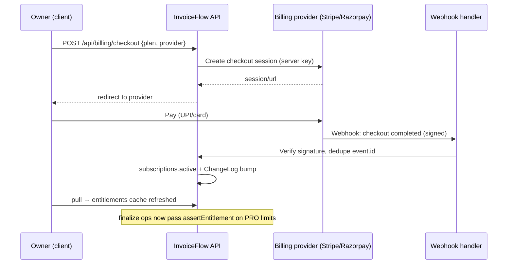

# 26 — Subscription & Plans

> **Extension point — not implemented in MVP.** Per CANON §19.3, subscriptions/billing are designed extension points (docs 24–27 series), not built in the MVP. The MVP is fully usable without accounts (guest-first, CANON §11); this document specifies the complete SaaS monetization design that will wrap it later without any change to the core data model or sync protocol.

> Derives from `docs/_CANON.md` (§8 cloud schema, §9 sync protocol + result contract, §11 auth/workspaces, §16 security).

## Purpose

Define plan architecture (Free/Pro/Business), the entitlements service, plan/usage tables, billing provider hooks (Stripe + Razorpay), the feature-gating pattern (server-enforced with UI hints), and trial handling — such that limits are **always enforced server-side** and the client's role is purely cosmetic guidance.

## Scope

- Designed (not implemented): plan catalog, `subscriptions`/`plan_limits`/`usage_counters` tables, entitlements service + caching, checkout/portal/webhook contracts, gating integration points in the sync pipeline, trial lifecycle.
- Out of scope: payment collection against invoices (docs/27-PAYMENT-INTEGRATION.md), email/WhatsApp credits' delivery mechanics (docs/25-EMAIL.md, docs/24-WHATSAPP-SHARING.md).

## Business requirements

1. BR-1 Plans: **Free** (permanent, generous enough for solo evaluation), **Pro** (growing businesses), **Business** (teams) — limits on volume and collaboration, not on core data ownership.
2. BR-2 A workspace never loses read access to its data, even over limit or after downgrade — gating blocks **new** consumption, never existing records.
3. BR-3 All limit enforcement happens server-side in the sync pipeline; the UI shows hints only (defense in depth, CANON §16).
4. BR-4 Billing works for India (Razorpay: UPI/cards/netbanking) and internationally (Stripe) behind one adapter.
5. BR-5 A workspace owner can trial Pro for 14 days without a card; expiry downgrades to Free with a grace period; data is never deleted.
6. BR-6 Guests (no account) are implicitly Free-plan local workspaces — no gating applies until cloud claim (CANON §11).

## Technical design

### Plan catalog (indicative limits — constants in `plan_limits`)

| Limit | Free | Pro (₹499/mo) | Business (₹1,499/mo) |
|---|---|---|---|
| Finalized documents / month (invoices + quotations) | 20 | 300 | Unlimited |
| Workspace members | 1 | 3 | 10 |
| Customers / Products | 50 / 50 | Unlimited | Unlimited |
| Attachment storage | 100 MB | 2 GB | 10 GB |
| Email credits / month (docs/25) | 0 | 200 | 1,000 |
| WhatsApp shares / month (docs/24) | 0 | 100 | 500 |
| PDF branding footer | InvoiceFlow footer | Removable | Removable |
| Cloud sync + JSON backup | ✔ | ✔ | ✔ + audit export |

Counter semantics: **documents/month = calendar month** of `finalize` ops applied server-side (billing-aligned; deliberately distinct from the FY-based reporting period of docs/20–21). Drafts are unlimited and never counted.

### Plan tables (schema sketch — `supabase/migrations/0004_billing.sql`, future)

```sql
create table plan_limits (
  plan text primary key,                 -- 'FREE' | 'PRO' | 'BUSINESS'
  max_documents_per_month int,           -- null = unlimited
  max_workspace_members int,
  max_customers int, max_products int,
  max_attachment_mb int,
  email_credits_per_month int, whatsapp_credits_per_month int,
  remove_branding bool not null default false,
  features jsonb not null default '{}'
);

create table subscriptions (
  id uuid primary key default gen_random_uuid(),
  workspace_id uuid not null unique references workspaces(id),  -- one active sub per workspace
  plan text not null references plan_limits(plan),
  status text not null,                  -- 'trialing'|'active'|'past_due'|'canceled'|'expired'
  provider text,                         -- 'stripe'|'razorpay'|'system'
  provider_customer_id text, provider_subscription_id text,
  current_period_start timestamptz, current_period_end timestamptz,
  cancel_at_period_end bool not null default false,
  trial_ends_at timestamptz,
  created_at timestamptz default now(), updated_at timestamptz default now()
);

create table usage_counters (
  workspace_id uuid not null references workspaces(id),
  period text not null,                  -- 'YYYY-MM' calendar month
  metric text not null,                  -- 'documents_finalized' | 'emails_sent' | 'whatsapp_shares'
  value bigint not null default 0,
  primary key (workspace_id, period, metric)
);
```

Usage counters are **incremented server-side inside the push transaction** when an op is applied (authoritative; clients never report usage).

### Entitlements service design

- **Server** `src/lib/server/entitlements.ts` (production Edge module): `assertEntitlement(workspace_id, metric, increment = 1)` — reads active plan + counter, throws a typed `PlanLimitError` when exceeded. Called inside the push pipeline **before** applying: `finalize` ops → `documents_finalized`; membership additions → `max_workspace_members`; customer/product creates → their limits; email/WhatsApp dispatch (docs/25/24) → credits.
- **Limit rejections ride the existing push result contract** (CANON §9): per-op `{ op_id, status: 'rejected', error: "Monthly limit reached (20/20 finalized documents on Free) — upgrade to continue", code: 'plan_limit' }`. No new HTTP status, no protocol fork — the op stays `failed` locally with the readable reason, retryable after upgrade (user action), exactly like other rejected ops.
- **Client** `useEntitlements()` hook: `GET /api/billing/entitlements` → `{ plan, status, limits, usage: {documents_finalized, …}, trial_ends_at }`; cached in `app_settings['entitlements_cache']` with a 24 h TTL and refresh-on-focus; **stale cache disables nothing** (hints only — see gating pattern).
- Read paths (lists, PDF export of existing documents, JSON backup) are **never** gated — BR-2.

### Feature gating pattern: server-enforced + UI hints

- **Server (source of truth)**: push-pipeline `assertEntitlement` per table above; role/plan checks in every API route. A patched client or crafted request cannot exceed limits.
- **UI (cosmetic hints)**: over-limit → finalize button shows an upgrade dialog instead of submitting; new-member invite hidden on Free; branding toggle disabled on Free; Settings → Billing tab shows plan, usage bars, upgrade/portal buttons. Hints derive from the cached entitlements; if cache is stale the server still rejects, and the toast/action-item surfaces the exact reason (docs/23-NOTIFICATIONS.md pattern).
- **Offline edge**: offline users can keep finalizing (local-first, CANON golden rule); ops queue as `pending`. On push, over-limit ops are `rejected` with `plan_limit` — the user resolves by upgrading (op becomes retryable) or keeping the document as a draft copy. This is the one flow where gating surfaces *after* the local action; it is documented, intentional, and consistent with the outbox model.

### Billing hooks (Stripe + Razorpay)

```
POST /api/billing/checkout   { plan, provider }        → { checkout_url }   # auth + OWNER role
POST /api/billing/portal                               → { portal_url }     # provider customer portal
GET  /api/billing/entitlements                         → { plan, status, limits, usage, trial_ends_at }
POST /api/webhooks/stripe                              # Stripe-Signature verified
POST /api/webhooks/razorpay                            # X-Razorpay-Signature HMAC verified
```

- **Adapter interface** `BillingProvider { createCheckout(workspace, plan), createPortal(workspace), verifyWebhook(raw, headers), parseEvent(body) }` — `StripeProvider`, `RazorpayProvider` (Razorpay Subscriptions for INR recurring; Stripe for international).
- Handled events → subscription state machine: `checkout.completed` / `subscription.activated` → `active` + plan; `invoice.paid` → extend `current_period_*`; `payment.failed` → `past_due` (dunning by provider; grace = remainder of period + 3 days); `subscription.cancelled` / period end with `cancel_at_period_end` → `expired` → downgrade to FREE. Webhooks are idempotent (`event.id` dedupe table, mirroring `ProcessedOp` semantics); signature verification is timing-safe; raw-body parsing only.
- Every webhook mutation appends an `audit_logs` entry and, when the effective plan changes, bumps a workspace ChangeLog entry (entity `workspace`) so all devices refresh entitlements on next pull.

### Billing lifecycle



### Trial handling

- On **workspace claim** (CANON §11), the server creates `subscriptions { plan: 'PRO', status: 'trialing', trial_ends_at: now + 14d }` — no card required.
- UI shows days remaining (from entitlements cache) in Settings → Billing; a `trial_ending` email fires on day 10 via the docs/25 pipeline (system template).
- At expiry (scheduled server job): plan → `FREE`, status → `expired`. **Grace**: 7 days where over-limit applies only to *new* finalizes beyond the Free counter, with a banner (never data loss — BR-2). Existing members beyond Free's member limit become read-only viewers rather than being removed.
- Re-trials are forbidden (provider-customer-id check); self-hosted/dev clouds run with plan limits disabled via env flag (`BILLING_ENFORCED=false` in the sandbox).

## Data models

- **Cloud (authoritative, future)**: the three tables sketched under Technical design — `plan_limits` (one row per plan), `subscriptions` (unique per workspace), `usage_counters` (PK `workspace_id + period + metric`) — plus the webhook idempotency table `processed_events (event_id pk, provider, at)`. All carry RLS: member-read, service-role write (CANON §8); `updated_at` triggers per CANON §8.
- **Local (client)**: no new Dexie tables. `app_settings['entitlements_cache']` holds the TTL-bound entitlements snapshot; UI reads only from it and never writes entitlement state.
- **Entities affected by gating but unchanged**: `invoices`/`quotations` (finalizes counted), `workspace_members` (seat limit) — the core CANON §7 model is untouched by monetization.

## API contracts

As listed under Billing hooks. All billing routes require authentication + workspace `OWNER` role (CANON §8 roles); webhook routes are the exception (signature-authenticated, no session). Errors: 401 unauthenticated, 403 non-owner, 402-equivalent expressed as per-op `rejected`/`plan_limit` in the sync contract, 429 for entitlement refresh floods.

## Offline behavior

Entitlements cache keeps UI hints alive offline (stale-while-error). All business operations continue offline; only the push of over-limit ops is rejected on reconnect (see gating pattern). Checkout obviously requires online + browser (Electron opens the system browser via the controlled `shell.openExternal` allow-list, CANON §16).

## Online behavior

Entitlements refresh on focus, on workspace ChangeLog bump, and at cache TTL expiry. Upgrade takes effect on next pull — typically seconds after payment.

## Security considerations

- Provider keys/webhook secrets: server env only; clients hold nothing but their session.
- Webhook signature verification + event-id idempotency + raw-body parsing (never re-serialized before verification).
- Plan changes are server-authoritative; the client cache is untrusted and TTL-bound.
- Owner-only billing routes; RLS: `subscriptions`/`usage_counters` readable by members, writable by service role only.
- No card data ever touches InvoiceFlow — providers host all payment UI (PCI scope stays with them).

## Error-handling rules

| Failure | Handling |
|---|---|
| Webhook replay/out-of-order | Event-id dedupe; state machine only moves forward on newer `current_period_end` |
| Provider outage at checkout | 503 with retry hint; entitlements unchanged |
| `assertEntitlement` DB race | Counter increment inside the push transaction (row-locked) — cannot overshoot |
| Stale client cache shows wrong plan | Harmless: server rejects over-limit ops; rejection toast corrects the UI |
| Downgrade with existing team | Extra members → read-only; documents/attachments untouched (BR-2) |

## Acceptance criteria (for the future feature)

1. AC-1 Free workspace: the 21st finalize in a calendar month is `rejected` with `code: 'plan_limit'`; after upgrade the same op (user retry) applies.
2. AC-2 Offline finalizes queue and fail closed only at push time; no local data is ever blocked or deleted.
3. AC-3 Trial: claim creates a 14-day Pro trial; day-10 email fires once; expiry downgrades to Free with the 7-day grace banner.
4. AC-4 Razorpay and Stripe webhooks each drive the full lifecycle (activate → renew → past_due → expired) with replayed/duplicate events causing no double transitions.
5. AC-5 Non-OWNER cannot fetch `/api/billing/entitlements` for a workspace they don't belong to (403), and cannot open checkout for it (403).
6. AC-6 `usage_counters` match the sum of applied finalize ops exactly for a seeded month (no drift after conflict/duplicate paths).
7. AC-7 With `BILLING_ENFORCED=false` (dev cloud), all limits pass and no billing routes are exposed.
