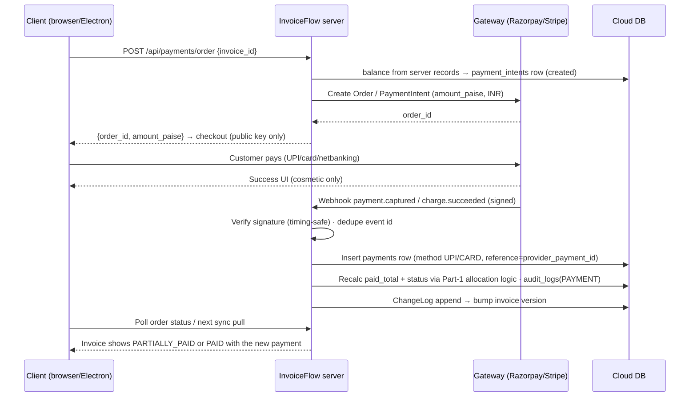

# 27 — Payment Integration

> Derives from `docs/_CANON.md` (§4 money rules, §7 `payments` table, §9 sync protocol, §12 lifecycles, §16 security). **Status per feature:** Manual payment recording — **IMPLEMENTED (MVP)**. Online payment collection (Razorpay/Stripe) — **EXTENSION POINT, not implemented**. UPI intent links — **EXTENSION POINT, not implemented**. Refunds — **EXTENSION POINT, not implemented**. Per CANON §19.3, the MVP has no payment gateway; this doc specifies both the implemented manual flow and the complete future gateway design.

## Purpose

Separate — and fully specify — the two worlds of money-in: (1) **manual payment recording**, the implemented MVP capability (cash/UPI-transfer/cheque entries the user types in), and (2) **online payment collection**, the future gateway-driven flow whose defining property is that a payment enters the system **from the server, via webhook, through the exact same trusted allocation logic** as manual payments.

## Scope

- Implemented (MVP): payments table semantics, allocation to invoice balance, paid-status recalculation, edit/delete semantics, audit.
- Designed extension (not implemented): gateway order creation server-side, checkout clients, signed webhooks, idempotent server-side payment recording, UPI intent links, refunds.
- Out of scope: subscription billing (docs/26-SUBSCRIPTION.md), email/WhatsApp delivery of receipts (docs/25, docs/24).

## Business requirements

1. BR-1 (MVP) Users record part or full payments against any non-draft, non-cancelled invoice, in any of the MVP methods, offline-first.
2. BR-2 (MVP) Invoice payment status must always be derivable from its payments: `paid_total` is a **derived snapshot**, recomputed — never independently editable.
3. BR-3 (MVP) Overpayment is allowed (advances/rounding generosity): `paid_total` may exceed `grand_total`; status is PAID; the excess is visible as "Advance".
4. BR-4 (future) Online collection must reuse the same allocation + recalculation logic — a gateway payment is just a payment with a provenance trail, not a new accounting concept.
5. BR-5 (future) Gateway amounts are computed server-side from the invoice balance; the client never dictates an amount to charge.
6. BR-6 (future) Every gateway event is idempotent and signature-verified; duplicated webhooks must never double-record money.

## Technical design — Part 1: manual payment recording (IMPLEMENTED)

### Rules (CANON §7/§12)

- Eligibility: invoice `status ∈ (FINALIZED, PARTIALLY_PAID, PAID)`. DRAFT and CANCELLED reject payment recording (CANCELLED with payments cannot exist — CANON §12 invariant `paid_total = 0` at cancel).
- Fields: `invoice_id` (req), `amount_paise` (> 0, integer), `paid_at` (`YYYY-MM-DD`, default today), `method` (`CASH|BANK_TRANSFER|UPI|CHEQUE|CARD|OTHER`), `reference?`, `notes?` + common metadata (soft-delete included).
- **Allocation & status recalc (exact, shared client/server via domain engine):**

```
paid_total_paise = Σ payments.amount_paise (deleted_at IS NULL, same invoice)
status: paid_total ≥ grand_total          → 'PAID'
        paid_total > 0                     → 'PARTIALLY_PAID'
        paid_total = 0 (after deletes)     → 'FINALIZED'     # never touches DRAFT/CANCELLED
balance displayed = grand_total − paid_total   (may be negative → shown as Advance)
```

- The server **recomputes** `paid_total` and status from the payments of record on every push (CANON §9 rule 4) — the client's numbers are advisory.
- Each payment write enqueues **two ops** (`payment` upsert + parent `invoice` upsert) and writes `audit_logs(action='PAYMENT')`. Deleting a payment (soft) reverses the same way; the recalc above runs in both directions.

## Technical design — Part 2: online payment collection (EXTENSION POINT, not implemented)

### Order creation — server-side only

```
POST /api/payments/order
  req:  { workspace_id, invoice_id, amount_paise? }        # amount omitted ⇒ full balance
  res:  { order_id, provider, amount_paise, currency: 'INR', payment_intent_id }
  errors: 400 (invoice not collectible / amount ≤ 0 or > balance) · 401 · 403 · 404
```

- Server computes `amount_paise = min(requested || balance, balance)` where `balance = grand_total − paid_total` **from server records** (BR-5); creates a Razorpay **Order** / Stripe **PaymentIntent** with `receipt = invoice number`; persists a `payment_intents` row (below). Client receives only public keys (Razorpay `key_id`, Stripe publishable key).
- Client checkout: Razorpay Checkout.js modal / Stripe Elements → success/failure UX → client **polls** `GET /api/payments/order/:id` for status; the authoritative money movement arrives via webhook (the return path is cosmetic and must not record payments).

### Webhook → trusted allocation (the core invariant)



- The webhook handler records the payment by calling the **same server-side allocation routine** as manual payments (BR-4): insert `payments` row (`method: 'UPI'|'CARD'`, `reference: provider_payment_id`, `paid_at: gateway timestamp date`), recompute `paid_total`/status, `audit_logs(action='PAYMENT', detail={source:'razorpay', provider_payment_id})`, append ChangeLog. Devices learn of it through the normal pull — including the device that initiated checkout (single-writer principle: the server is the only writer for gateway payments; this is a documented, deliberate exception to local-first writes for money-with-external-proof).
- **Idempotency**, three layers: event-id dedupe table (webhook replays), unique index `unique (workspace_id, source, source_ref)` on payments (gateway transaction id), and `ProcessedOp`-style outcome storage for the derived ops. A replayed `payment.captured` returns the stored outcome and inserts nothing.
- **Signature verification**: Razorpay `X-Razorpay-Signature` HMAC-SHA256(webhook secret) and Stripe `Stripe-Signature` with timestamp-tolerance replay protection; raw-body parsing; timing-safe compare; unsigned → 401.

## UPI intent links (EXTENSION POINT, not implemented)

- `upi://pay?pa=<vpa>&pn=<payee name>&am=<amount>&cu=INR&tn=<note>&tr=<ref>` — rendered as QR + tap-to-open on the invoice detail and PDF footer area. `am` is the **balance**, formatted from paise; `tr` is a deterministic reference (`INV-2025-26-0042` slug).
- Scope discipline: raw intent links carry **no automatic reconciliation** (the PSP-side payment lands in the user's bank, not in an API we can hook). The flow is: customer pays → user records the payment manually (Part 1) — the link's job is only to prefill amount/reference correctly. Automatic reconciliation requires the gateway rails of Part 2 (Razorpay UPI), which is exactly why Part 2 exists.

## Refunds (EXTENSION POINT, not implemented)

- New table: `refunds (id, workspace_id, payment_id fk, amount_paise > 0, reason?, provider_refund_id?, status ('pending'|'processed'|'failed'), created_at, updated_at)` — created **server-only** via the gateway refund API for gateway payments; manual payments record refunds directly (cash handed back).
- Invoice schema v2 addition: `refunded_total_paise` (default 0). Effective collection becomes `paid_total − refunded_total`; the status recalc of Part 1 extends to:

```
effective_paid = paid_total − refunded_total
status: effective_paid ≥ grand_total → 'PAID' ; > 0 → 'PARTIALLY_PAID' ; = 0 → 'FINALIZED'
CANCELLED blocked while effective_paid > 0 (CANON §12 invariant preserved)
```

- Refund mutations append ChangeLog + audit (`action='PAYMENT'`, `detail.kind='refund'`); PDFs gain an optional "Refunded: ₹X" line. No `REFUNDED` invoice status is introduced (status remains a collectibility state; refunds are financial events on top).

## Data models

- **MVP**: `payments` per CANON §7 (fields above). No new tables.
- **Future**: `payment_intents (id, workspace_id, invoice_id, provider, provider_order_id unique, amount_paise, status ('created'|'paid'|'failed'|'expired'), provider_payment_id?, created_at, updated_at)`; `payments.source? ('manual'|'razorpay'|'stripe')`, `payments.source_ref?` (v2 additive columns); `refunds` + `invoices.refunded_total_paise` as specified above; webhook event-dedupe table `processed_events (event_id pk, provider, at)`.

## API contracts

- **MVP**: none — payments live and die in Dexie and ride `/api/sync/push` as standard `payment`/`invoice` ops (CANON §9).
- **Future** (all session-authenticated, membership-checked): `POST /api/payments/order`, `GET /api/payments/order/:id → { status, provider_payment_id? }`, `POST /api/webhooks/razorpay`, `POST /api/webhooks/stripe`, `POST /api/refunds { payment_id, amount_paise?, reason? }`. Money errors return 400 with a readable `error`; gateway 5xx map to 502 with retry semantics.

## Offline behavior

- **MVP (implemented)**: fully offline. Recording/editing/deleting payments works in airplane mode; ops queue in the outbox; status recalcs locally; server recomputation on push is authoritative (a conflicting concurrent payment from another device resolves by CAS — the last writer rebases onto the server-recomputed `paid_total`; conflicts surface per CANON §10).
- **Future**: checkout requires online (browser/Electron → system flow). A recorded-while-offline manual payment and a gateway capture that lands concurrently both flow through the same server recalc — the sum is always consistent. UPI intent links are static content and work offline; reconciliation remains manual.

## Online behavior

- **MVP**: none beyond sync. **Future**: order creation (< 1 s), checkout on the gateway's hosted surface, webhook → ChangeLog → all devices update within one pull cycle; client polling covers the UX gap between customer payment and webhook arrival (typically seconds).

## Security considerations

- Gateway secrets (key_secret, webhook secrets) **server env only**; clients hold public keys exclusively (CANON §16).
- Amounts are recomputed server-side at order creation and at webhook recording; the client's numbers are never trusted for money (CANON §4/§9 rule 4).
- Webhook signature + timestamp tolerance + event dedupe; order IDs are workspace-scoped and membership-checked before any detail is disclosed (no IDOR on `order_id`).
- `payments` rows carry provider references — audit-complete (`audit_logs` on every gateway-recorded payment); RLS: workspace-member read, service-role write for webhook-applied rows.
- No card/UPI credentials ever touch InvoiceFlow — gateways host all sensitive UI (PCI scope stays external).

## Error-handling rules

| Failure | Handling |
|---|---|
| Payment on DRAFT/CANCELLED invoice | Blocked client- and server-side with explanation (BR-1) |
| Order for amount > balance | 400 — order creation refuses; UI caps the input at balance |
| Webhook before client returns (already captured) | Benign: recording is webhook-driven; polling shows PAID immediately |
| Duplicate webhook / replay | Event dedupe + unique `(workspace_id, source, source_ref)` → no double record |
| Captured event for expired/unknown order | Logged, 200-acked, quarantined for ops review (money must not be silently dropped) |
| Gateway outage at order creation | 502 + readable error; user falls back to manual recording (MVP path always available) |
| Refund exceeding payment remainder | 400; server computes per-payment refundable headroom |
| Conflicting manual payments (2 devices) | CAS conflict per CANON §10; resolution never edits amounts, only picks records — recalc re-derives status |

## Acceptance criteria

**MVP (implemented):**
1. AC-1 Recording ₹5,000 against a ₹12,345 invoice flips status FINALIZED → PARTIALLY_PAID and shows balance ₹7,345; the second ₹7,345 payment flips to PAID.
2. AC-2 A ₹13,000 payment marks PAID and displays Advance ₹655 (negative balance rendered, never clamped).
3. AC-3 Deleting the only payment reverts PAID → FINALIZED (and PARTIALLY_PAID path likewise) with `paid_total = 0`; audit entries exist for both directions.
4. AC-4 Offline recording queues both ops and syncs; the server's recomputed `paid_total` matches the client's for identical payment sets.
5. AC-5 Cancellation of an invoice with payments is blocked with the payments explanation (CANON §12).

**Future (online collection):**
6. AC-6 Full Razorpay happy path: order → checkout → webhook → payment row with `source='razorpay'`, status recalc, ChangeLog, and the originating device reflects PAID on next pull.
7. AC-7 Replaying the captured webhook five times records exactly one payment; event log shows the dedupe outcomes.
8. AC-8 A forged webhook (bad/absent signature) is rejected 401 and never touches the DB.
9. AC-9 Concurrent manual (offline-queued) + gateway payment sum correctly: server recalc yields the exact total of both records.
10. AC-10 A processed refund reduces `effective_paid`, may flip PAID → PARTIALLY_PAID, and blocks cancellation while `effective_paid > 0`.
