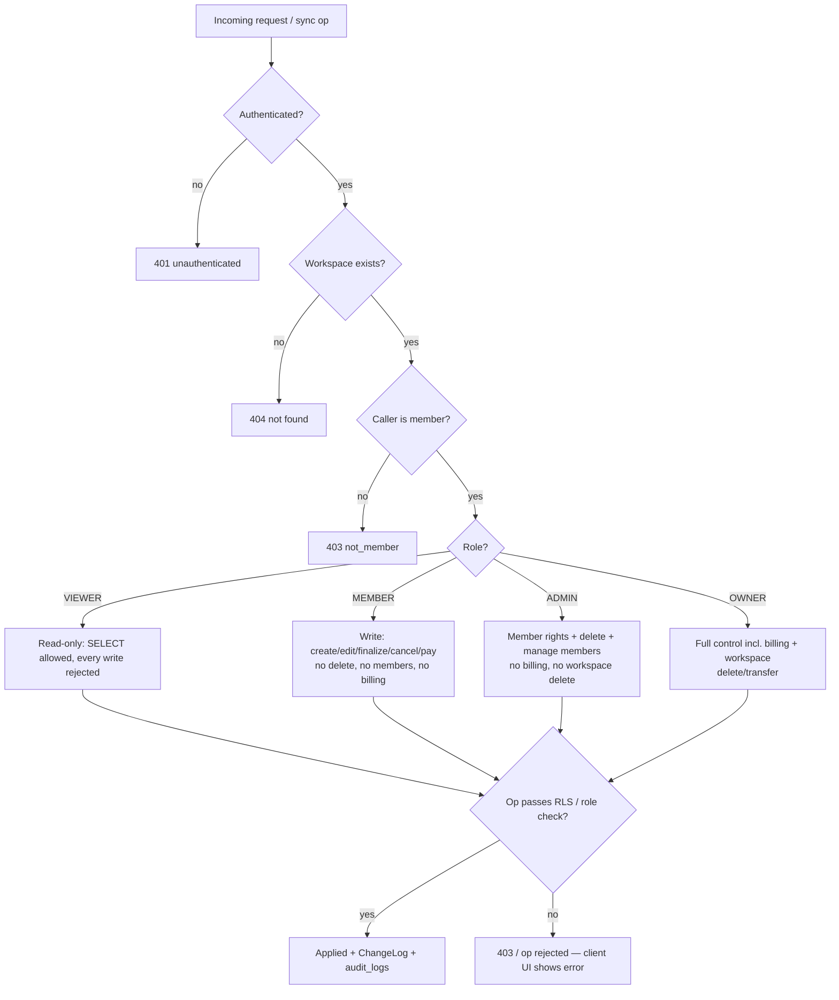

# 28. Team Members & Roles

> Derived from `docs/_CANON.md` — §7 (`workspace_members`, `workspaces`), §8 (roles & server-side enforcement), §9.7 (role ≥ MEMBER to write), §11 (owner_user_id), §19.7 (MVP limitation). `_CANON.md` wins on any conflict. Cloud schema lives in docs/06-DATABASE-DESIGN.md; Supabase policies in docs/19-CLOUD-SYNC.md.

---

## 1. Purpose

Define the team/role model for InvoiceFlow workspaces: the four roles (`OWNER | ADMIN | MEMBER | VIEWER`), the exact permission matrix each role grants, how permissions are enforced **server-side only** (role checks in the dev cloud, RLS in Supabase), the MVP reality (single-owner local workspaces with the schema already in place), and the **future invite/members UI** designed as a documented extension point.

## 2. Scope

**In scope**

- Role definitions, hierarchy, and the permission matrix (8 capability groups × 4 roles).
- Enforcement points: sync push role gate (CANON §9.7), Supabase RLS helpers `is_workspace_member()` / `has_role()` (CANON §8), dev-cloud equivalent checks in `src/lib/server/`.
- Data model: `workspace_members`, `workspaces.owner_user_id`.
- Future members management UI (invite, role change, removal, ownership transfer) — design only, not implemented (CANON §19.7).

**Out of scope**

- Authentication itself (users, sessions, cookies) — docs/07-AUTHENTICATION.md.
- Billing/subscription entitlements — docs/26-SUBSCRIPTION.md (role *gates* billing, plans live there).
- Conflict resolution between concurrent edits by two members — docs/18-CONFLICT-RESOLUTION.md.

## 3. Business requirements

| # | Requirement |
|---|---|
| BR1 | Every workspace has exactly one **OWNER**; ownership is established at claim time (CANON §11: claim creates the workspace owned by the caller + OWNER membership). |
| BR2 | Permissions are **hierarchical**: `OWNER > ADMIN > MEMBER > VIEWER` (CANON §8). |
| BR3 | **VIEWER is read-only**; **MEMBER cannot delete**; **ADMIN cannot delete the workspace**; only OWNER manages billing and can delete/transfer a workspace (CANON §8, §19.7). |
| BR4 | All permission decisions are made **server-side** — the client may hide/disabled UI, but is never trusted (CANON §8: "Server-side enforcement only"). |
| BR5 | MVP ships as **single-owner local workspaces** (CANON §19.7): the UI exposes owner workflows only, while `workspace_members` and all policies are ready for multi-user. |
| BR6 | Every membership change and privileged action is recorded in `audit_logs` (CANON §7) so accountability survives sync. |

## 4. Role definitions

| Role | Meaning | Typical user |
|---|---|---|
| `OWNER` | Full control of the workspace: data, members, billing, deletion, ownership transfer. One per workspace. | Business owner |
| `ADMIN` | Day-to-day administration: full data CRUD, finalize, member management. Cannot delete the workspace or manage billing. | Office manager / accountant |
| `MEMBER` | Working user: create and edit records, finalize/cancel documents, record payments. Cannot delete records or manage members/billing. | Sales / billing clerk |
| `VIEWER` | Read-only access to all data and reports. Cannot create, edit, finalize, or pay. | Auditor / external CA |

## 5. Permission matrix

The authoritative matrix. "—" means the action is not granted; "future" marks actions without an MVP UI (CANON §19.7). `Delete` covers customers, products, payments, and **draft** documents (soft delete via `deleted_at`; finalized documents are immutable and only `CANCELLED` — CANON §12).

| Capability | OWNER | ADMIN | MEMBER | VIEWER | Enforcement (server) |
|---|:---:|:---:|:---:|:---:|---|
| View all data, dashboard, reports, PDFs | ✓ | ✓ | ✓ | ✓ | RLS `SELECT = is_workspace_member` |
| Create (customers, products, documents, payments) | ✓ | ✓ | ✓ | — | RLS `INSERT = has_role(OWNER,ADMIN,MEMBER)` |
| Edit (same entities; drafts only for documents) | ✓ | ✓ | ✓ | — | RLS `UPDATE = has_role(OWNER,ADMIN,MEMBER)` |
| Delete (soft-delete non-finalized records) | ✓ | ✓ | — | — | RLS `DELETE = has_role(OWNER,ADMIN)` (CANON §8: MEMBER cannot delete) |
| Finalize / cancel documents, convert quotation→invoice | ✓ | ✓ | ✓ | — | Push gate `role ≥ MEMBER` (CANON §9.7); finalize writes sequences + ChangeLog |
| Record payments on invoices | ✓ | ✓ | ✓ | — | Push gate `role ≥ MEMBER`; `upsert payment` |
| Manage members (invite, change role, remove) | ✓ | ✓ | — | — | `workspace_members` policies: OWNER/ADMIN (CANON §8; admin cannot act on OWNER) |
| Manage billing (plan, subscription, invoices) — future | ✓ | — | — | — | Entitlement service asserts OWNER (docs/26) |
| Manage workspace (rename, cloud-link, delete, transfer ownership) | ✓ | — | — | — | `workspaces` policies + OWNER check on delete/transfer (CANON §8: ADMIN cannot delete workspace) |

Notes:

- **Company profile** follows the RLS policy set in `supabase/migrations/0002_rls.sql`: `INSERT` OWNER/ADMIN; `UPDATE` OWNER/ADMIN/MEMBER; `DELETE` OWNER/ADMIN.
- **ChangeLog, document sequences, processed ops** are `SELECT`-only to clients — they are written exclusively by server functions (e.g., `sync_finalize_invoice`).
- Role changes by an ADMIN may never target or demote the OWNER (guard in the membership API and RLS `has_role` check).

## 6. MVP reality (CANON §19.7)

- A local (guest) workspace creates one `workspace_members` row: `{ device_id, role: 'OWNER' }` with `user_id = null` (docs/07-AUTHENTICATION.md §4.1).
- The UI implements **owner workflows only**: there is no invite screen, no role picker, no member list beyond this schema-level reality. `Settings → Security` handles account/guest→cloud flows instead (docs/08, docs/32).
- After claim, the caller is the sole member and OWNER. Nothing in the sync protocol or schema prevents additional members; the **UI is the missing piece**, deliberately deferred.
- Local permission checks are **not** applied in the renderer (single trusted owner device); enforcement begins the moment a second member or a second device exists, i.e., at the server.

## 7. Server-side enforcement

### 7.1 Dev cloud (this sandbox — Prisma/SQLite, `src/lib/server/`)

Every mutating request performs, in order:

1. **Session lookup** (`if_session` cookie → `Session` → `User`); anonymous callers get `401`.
2. **Membership lookup**: `workspaceMember.findUnique({ workspace_id, user_id })`; missing → `403 { error, code: 'not_member' }`.
3. **Role check** against the matrix: write ops (`upsert|finalize|cancel|delete` actions on push, claim, membership changes) require `role ∈ {OWNER, ADMIN, MEMBER}`; destructive ops (delete) require `{OWNER, ADMIN}`; workspace-level ops require `OWNER`.
4. **Audit write** for privileged actions (`MEMBERSHIP_CHANGE`, `DELETE`, `CANCEL`, … per CANON §7 `audit_logs.action`).

### 7.2 Production (Supabase — `supabase/migrations/0002_rls.sql`)

- Helper SQL functions (SECURITY DEFINER, STABLE): `is_workspace_member(ws uuid)` and `has_role(ws uuid, roles text[])` — fail-closed (null/unknown workspace ⇒ false).
- **RLS is enabled on every table**; ~58 policies implement the matrix above: `SELECT` for any member; `INSERT`/`UPDATE` for OWNER/ADMIN/MEMBER; `DELETE` for OWNER/ADMIN; `workspace_members` managed by OWNER/ADMIN; `workspaces` selectable/updatable by members only; append-only `audit_logs` (`actor_user_id = auth.uid()`).
- **JWT propagation**: Supabase Auth injects `auth.uid()`; policies resolve membership per row — the client cannot forge a workspace id it does not belong to.
- Storage buckets (`company-assets`, `attachments`) use path convention `{workspace_id}/{entity}/{filename}` with equivalent membership policies (CANON §8).

### 7.3 Push pipeline integration

`POST /api/sync/push` validates role **before** CAS/idempotency work that could leak state, and per CANON §9.7 rejects the whole batch path with per-op `rejected` results if the caller's role is below MEMBER. A VIEWER's client should never enqueue write ops; if it does (bug, tampering), the server response is authoritative and the op lands in `failed` with a visible error (CANON §9).

## 8. Data models

**workspace_members** (CANON §7): `workspace_id`, `user_id?`, `device_id?`, `role` (`OWNER|ADMIN|MEMBER|VIEWER`) + common metadata (§3). Exactly one of `user_id`/`device_id` is set: device rows represent the local owner of a guest workspace; user rows appear once the workspace is claimed (or a member is invited in the future).

**workspaces**: `name`, `slug` (derived), `owner_user_id?` (set server-side at claim; never client-writable), `cloud_linked_at?` (local-only flag), `settings_json?`.

**Invitation (future design, not in MVP schema):** `workspace_invites { id, workspace_id, email, role (ADMIN|MEMBER|VIEWER — never OWNER), token_hash, status (PENDING|ACCEPTED|REVOKED), invited_by, expires_at }` + common metadata. Tokens are single-use, 7-day expiry, stored hashed. Accepting an invite creates the `workspace_members` row inside one server transaction and writes the initial ChangeLog entry for the new member's other devices.

## 9. API contracts (membership — future extension point)

MVP exposes **no** membership endpoints (CANON §14 lists the complete surface; membership management is deliberately absent). The future design reuses the API conventions of docs/30-API-DESIGN.md:

| Endpoint | Method | Roles | Purpose |
|---|---|---|---|
| `/api/workspace/members` | GET | member | List members + pending invites |
| `/api/workspace/invites` | POST | OWNER, ADMIN | Create invite (email + role) |
| `/api/workspace/invites/:id` | DELETE | OWNER, ADMIN | Revoke invite |
| `/api/workspace/members/:id` | PATCH | OWNER, ADMIN | Change role (never on OWNER) |
| `/api/workspace/members/:id` | DELETE | OWNER, ADMIN | Remove member |
| `/api/workspace/transfer` | POST | OWNER | Transfer ownership (atomic swap of both roles + `owner_user_id`) |

All membership mutations write `audit_logs(action='UPDATE', entity_type='workspace_members')` and append a ChangeLog entry so other devices converge.

## 10. Permission model diagram

## 11. Offline behavior

- All local features are available offline regardless of role logic — the local device is, by construction, the OWNER device in MVP (CANON §19.7); offline work is never blocked by team rules.
- Ops created offline are validated for role **only when pushed** (server-side). If a future MEMBER device works offline and later a role is downgraded to VIEWER, queued write ops come back `rejected` with a clear reason — visible in Settings → Sync → Failed (CANON §9; never silently dropped).
- `workspace_members` is a synced table: pull applies membership changes; the client refreshes its cached role from the local row after each pull.

## 12. Online behavior

- Role checks execute on every mutating request before any state change (§7.1); Supabase additionally enforces the same rules inside Postgres via RLS (defense in depth).
- The client caches the current membership row locally (read after login/pull) purely for **UI affordances** (hiding buttons, disabling actions). The cache is advisory; the server remains authoritative.

## 13. Security considerations

- **Never trust the client**: the renderer hiding a button is UX, not security; every capability is re-checked server-side (CANON §8).
- RLS helpers are `SECURITY DEFINER` but read-only lookups over `workspace_members` — they expose membership booleans only.
- Invite tokens (future) are stored **hashed**, single-use, short-lived, and delivered over HTTPS; acceptance requires an authenticated session.
- OWNER actions (transfer, delete) require re-authentication (fresh session, AlertDialog confirm) in the future UI; deletion cascades only server data (CANON §11 for accounts).
- All membership and privileged mutations are audit-logged with actor identity and device id (CANON §7).

## 14. Error-handling rules

| Situation | Response | Client behavior |
|---|---|---|
| No/invalid session | `401 { error, code: 'unauthenticated' }` | Pause sync, flag `needs_reauth`, prompt login (CANON §9) |
| Not a member of workspace | `403 { error, code: 'not_member' }` | Toast; sync halts for that workspace |
| Role too low for action | `403` (REST) or per-op `rejected { error }` (push) | UI disables action; op shown as failed with reason |
| Member targets OWNER | `403 { error, code: 'owner_immutable' }` | Toast explaining OWNER protection |
| Invite expired/revoked (future) | `410 { error, code: 'invite_invalid' }` | Invite screen shows failure state |

## 15. Acceptance criteria

1. The permission matrix in §5 is enforced by code paths that can be exercised server-side without client cooperation (RLS policies exist for every table; dev cloud performs the §7.1 sequence).
2. VIEWER tokens can `SELECT` workspace data but every write path (push op, claim, membership mutation) returns `403`/`rejected`.
3. MEMBER can create/edit/finalize/pay but every `delete` action returns `403`/`rejected` (CANON §8).
4. ADMIN can delete records and manage members but `DELETE /api/workspace` (future) and billing mutations fail for ADMIN.
5. A claimed workspace has exactly one OWNER membership; ownership transfer (future) is atomic and audit-logged.
6. MVP ships with a single local OWNER row per workspace and no membership UI, matching CANON §19.7, while `workspace_members` and all server policies are live.
7. Every membership/privileged mutation appears in `audit_logs` and the ChangeLog.
