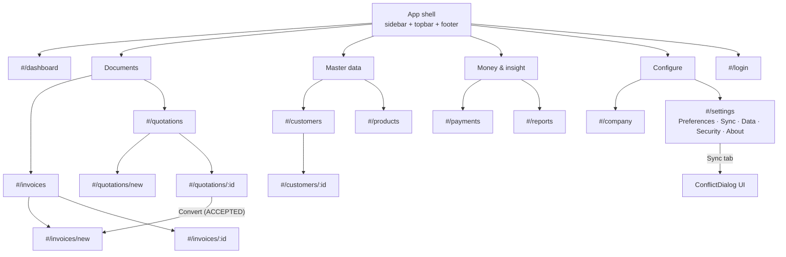

# 31. UI / UX System

> Derived from `docs/_CANON.md` — §15 (**UI/UX system — definitive**), §1 (golden rule: local-first UX), §12 (document lifecycles), §17 (offline badges/PWA). `_CANON.md` wins on any conflict. Routes: docs/32-ROUTES.md; validation UX: docs/33-VALIDATION.md; toasts/errors: docs/34-ERROR-HANDLING.md.

---

## 1. Purpose

Define the InvoiceFlow design system: layout anatomy, color/typography/spacing tokens, the shared component inventory, screen-by-screen specifications for every view, interaction patterns (⌘K search, toasts, confirms, skeletons), responsiveness, accessibility (WCAG 2.1 AA), and theming — so every screen feels like one product and every state (loading/empty/error/offline) is designed, never accidental.

## 2. Scope

Covers the renderer UI in `src/app/` + `src/components/` (sandbox = the whole web app; Electron renders it verbatim — CANON §2). Out of scope: route table (docs/32), domain rules (docs/33), error taxonomy (docs/34).

## 3. Business requirements

| # | Requirement |
|---|---|
| BR1 | Every business operation is usable offline with identical UI; connectivity only changes status indicators (CANON §1, §17). |
| BR2 | Every list has an **empty state** (icon + copy + CTA), loading uses **skeletons**, destructive actions require **AlertDialog** confirmation, feedback uses **sonner** toasts (CANON §15). |
| BR3 | The palette is disciplined: emerald primary + slate neutrals + semantic status colors; **no blue/indigo anywhere** (CANON §15). |
| BR4 | Tables are sortable, searchable, filterable, paginated (client-side, 10/page) with capped height and custom scrollbars (CANON §15). |
| BR5 | Keyboard-first quality: ⌘K global search, every action tab-reachable, visible focus rings, WCAG 2.1 AA contrast. |
| BR6 | Light/dark/system theming via next-themes; Geist type; lucide icons only (CANON §15). |

## 4. Layout anatomy

Root shell (CANON §15): `min-h-screen flex flex-col` — three fixed regions + content:

1. **Sidebar** (desktop, fixed, `w-64`, `bg-slate-950`): app mark, nav items (emerald `text-emerald-400` active state with `bg-emerald-500/10`), grouped: *Dashboard, Invoices, Quotations, Customers, Products, Payments, Reports, Company, Settings*. Bottom: workspace name + cloud-link state.
2. **Topbar** (sticky, content-colored border): page title (from route), global search trigger (`⌘K`), **OfflineBadge**, **SyncPill**, theme toggle, user menu (account, logout, guest→cloud).
3. **Content** (`flex-1`): `bg-slate-50` light / `bg-slate-950` dark; page container `max-w-6xl mx-auto px-4 md:px-6 py-6`.
4. **Footer** (sticky bottom via `mt-auto`): `app version • sync status • workspace name` (CANON §15).

Mobile: sidebar collapses into a **Sheet** drawer opened from a hamburger in the topbar; topbar keeps badges + search; tables scroll horizontally inside `overflow-x-auto` (§8).

## 5. Design tokens

### 5.1 Color

| Token | Light | Dark | Usage |
|---|---|---|---|
| `primary` | `emerald-600` | `emerald-500` | Buttons, active nav, links, focus accents |
| neutrals | `slate-50 … slate-900` | `slate-900/950` | Backgrounds, borders, text (`slate-950` sidebar both modes) |
| paid / synced | `emerald` | `emerald` | Status "PAID", synced dot |
| unpaid / pending-sync | `amber` | `amber` | Status "PARTIALLY_PAID", Pending N dot |
| overdue / error | `red` | `red` | Overdue badge, destructive, sync error |
| draft | `slate` | `slate` | DRAFT documents, neutral chips |

Semantic badges: `DRAFT`=slate, `FINALIZED`=emerald, `PARTIALLY_PAID`=amber, `PAID`=emerald, `CANCELLED`=red, quotation `SENT`=slate, `ACCEPTED`=emerald, `REJECTED`=red, `EXPIRED`=amber, `CONVERTED`=emerald outline. **NO blue/indigo** (CANON §15) — charts use emerald/amber/slate series only.

### 5.2 Typography & spacing

- Font: **Geist** (sans everywhere; tabular numerals for money columns). H1 `text-2xl font-semibold` (page title), H2 `text-lg`, body `text-sm`, table body `text-sm`, money `tabular-nums`.
- Spacing: cards `p-4` (mobile) / `p-6` (desktop); grid/page gaps `gap-4` (mobile) / `gap-6` (desktop); form rows `space-y-4`; table cell padding `px-3 py-2`. Radius: shadcn defaults (`rounded-lg` cards, `rounded-md` inputs). Icons: lucide only, `h-4 w-4` inline, `h-5 w-5` nav.

## 6. Component inventory

| Component | Purpose / key states |
|---|---|
| `AppSidebar` / `MobileNavSheet` | Navigation; active route highlight; Sheet variant on mobile |
| `AppTopbar` | Page title, ⌘K trigger, badges, theme toggle, user menu |
| `AppFooter` | `version • sync status • workspace` (sticky bottom) |
| `StatCard` | Dashboard KPI: label, big number, delta/sub-caption, onClick → filtered list |
| `RevenueTrendChart` | Recharts monthly invoiced vs collected, trailing 6 months (docs/20) |
| `DataTable` | Sortable headers, search input, filter chips, pagination (10/page), `max-h-[70vh] overflow-y-auto`, sticky header, custom scrollbars |
| `DocumentStatusBadge` | Status chip per §5.1 mapping |
| `EmptyState` | lucide icon + title + copy + primary CTA (e.g., "New invoice") |
| `Skeleton` | List/card/table skeletons matching final layout |
| `OfflineBadge` | "Offline" chip when `navigator.onLine = false` or heartbeat fails (CANON §17) |
| `SyncPill` | Synced / Pending N / Syncing / Offline / Error / Reauth (docs/23 state machine) |
| `GuestBanner` | "Guest workspace — connect cloud to sync" (CANON §11) |
| `DocumentEditor` | Shared invoice/quotation editor, `kind: 'invoice' \| 'quotation'` (§7.2) |
| `CustomerPicker` | Searchable combobox + quick-create dialog |
| `ProductPicker` | Per-line combobox; fills HSN/SAC, unit, price, GST rate |
| `ChargesEditor` | Additional charges list `{label, amount, taxable, gst_rate_bps}` |
| `TotalsPanel` | Live totals (subtotal, discount, taxable, CGST/SGST/IGST, charges, round-off, grand total) — domain engine output only |
| `ConflictDialog` | Side-by-side local vs server diff; Keep mine / Keep server's / Delete (docs/18) |
| `CommandPalette` | ⌘K search across nav, customers, products, documents |
| `AlertDialog` (shadcn) | Destructive confirms: finalize, cancel, delete, clear data, delete account |
| `Toaster` (sonner) | Success/error/info feedback (docs/34) |
| `Form` primitives (RHF + zodResolver) | Customer, product, company, auth forms with inline field errors (docs/33) |

## 7. Screen specifications

Every screen: topbar title + primary action; lists = `DataTable` + `EmptyState`; detail/edit forms save to local DB immediately (golden rule) and show toast on success.

1. **Login** (`#/login`): centered card, email/password, links to register; guest mode explainer ("Continue without an account").
2. **Dashboard** (`#/dashboard`): 8 StatCards (total invoices, drafts, paid, unpaid, overdue, quotations, accepted quotations, outstanding), revenue trend chart (6 months), recent activity list, sync status card, quick actions (New invoice / New quotation / Add customer) (CANON §15).
3. **Invoices list** (`#/invoices`): filters (status: DRAFT/FINALIZED/PARTIALLY_PAID/PAID/CANCELLED), search (number/customer), date sort, totals row; row actions: open, PDF, duplicate; badge for pending-sync rows (`sync_state ≠ synced`).
4. **Invoice editor** (`#/invoices/new`, `#/invoices/:id`): DocumentEditor `kind:'invoice'` — customer picker, invoice/due dates, place of supply, product lines (qty, rate, discount, GST%), charges, tax-inclusive toggle, live TotalsPanel, notes/terms prefilled from company; actions **Save draft** and **Save & finalize** (AlertDialog confirm; finalized docs become read-only, CANON §12); provisional number banner `DRAFT-xxxxxxxx` on drafts; Payments section on finalized invoices; PDF preview/download buttons.
5. **Quotations list/editor** (`#/quotations`, `#/quotations/new`, `#/quotations/:id`): same editor with `kind:'quotation'`; actions **Save draft** / **Mark SENT** / **Convert to invoice** (ACCEPTED only; creates invoice DRAFT, sets quotation CONVERTED, both ops enqueued — CANON §12); `valid_until` warning when passed (EXPIRED computed lazily).
6. **Customers list** (`#/customers`): code, name, type, city/state, GSTIN; row → detail. **Customer detail** (`#/customers/:id`): RHF form (docs/33 rules), per-customer stats (invoiced/outstanding), recent documents.
7. **Products list** (`#/products`): name, SKU, price, GST%, active toggle; **Product form** in dialog/page (`#/products/:id` future parity in sandbox via dialog).
8. **Payments** (`#/payments`): payments table (date, invoice, method, reference, amount) + "Record payment" flow (invoice picker, amount ≤ balance validation — docs/33).
9. **Reports** (`#/reports`): tabs Sales / GST Summary / Outstanding / Customers / Products; FY-default date range; CSV export buttons (UTF-8 BOM) (docs/21).
10. **Company** (`#/company`): company profile form (identity, address/state, GSTIN/PAN, branding ≤1 MB, bank details, prefixes, tax defaults, round-off toggle).
11. **Settings** (`#/settings`): tabs — Preferences (defaults), Sync (status, **Sync now**, outbox table with retry, **Conflicts UI**), Data (JSON backup export/import, CSV shortcuts, clear local data), Security (account, guest→cloud claim, logout, delete account), About (version, licenses); Company tab links to `#/company` (CANON §15).
12. **Onboarding** (no company profile): welcome → **Create company** form / **Load sample data** / Sign in (CANON §15).

## 8. Interaction patterns & responsiveness

- **⌘K**: opens `CommandPalette`; arrow keys + Enter navigate; fuzzy matches nav routes, customers, products, invoices/quotations by number.
- **Toasts (sonner)**: success on save/finalize/sync; errors with action button where recovery exists (e.g., "Retry sync"). Durations and coalescing per docs/23.
- **AlertDialog confirms** for: finalize invoice, mark SENT, cancel document, delete record, restore conflict resolution, clear local data, delete account.
- **Skeletons** for first paint of lists/dashboard; **empty states** replace zero-rows tables with the primary CTA.
- **Sync affordances**: rows show a small amber dot when pending, emerald dot when synced; SyncPill always visible in topbar.
- **Responsive breakpoints**: `md` = sidebar on / Sheet off; `sm` = StatCards 2-up→1-up, KPI grid 4→2→1 columns, editor totals panel stacks below items; tables get `overflow-x-auto` and the 70vh vertical cap with custom scrollbar styling (CANON §15).

## 9. Accessibility (WCAG 2.1 AA)

- Full keyboard reachability: all interactive elements tabbable in DOM order; Escape closes Sheet/Dialog/Palette; Enter/Space activate; grid navigation in tables via arrow keys where applicable.
- **Visible focus rings** on every control (`focus-visible:ring-2 ring-emerald-500 ring-offset-2`), never `outline-none` without replacement (CANON §15).
- ARIA: dialogs/sheets use shadcn Radix primitives (`role="dialog"`, `aria-modal`, focus trap); toasts announced via `aria-live="polite"`; status chips pair color **and** text (never color-only); tables use `<th scope>`/`aria-sort`; icon-only buttons carry `aria-label`.
- Contrast: emerald-600 on white and slate text tokens meet 4.5:1 body / 3:1 large-text thresholds in both themes; status colors are verified against their chip backgrounds.
- Reduced motion: chart animations and transitions respect `prefers-reduced-motion`.

## 10. Theming

`next-themes` with `light | dark | system` (CANON §15). Tokens are CSS variables (shadcn theme) so components switch without conditional classes; sidebar stays `slate-950` in both modes for brand consistency. Theme choice persists in `app_settings.theme` locally; flash-of-wrong-theme prevented by the inline script setting `class` on `<html>` before hydration.

## 11. Navigation structure diagram

## 12. Offline behavior

UI is fully functional offline (CANON §1, §17): OfflineBadge + "Offline" SyncPill state appear, save actions succeed locally with a "Saved locally — will sync" toast, network-only affordances (cloud link, manual sync) render disabled with tooltips. No blocking modals ever mention connectivity — the outbox is the mechanism.

## 13. Online behavior

When connectivity returns (online event / heartbeat), the SyncPill transitions to "Syncing" then "Synced" or "Pending N"; server-adopted values (numbers, totals) re-render via Dexie live queries; conflict count surfaces as a badge in Settings → Sync (docs/18). No other UI change is needed — online/offline is a status, not a mode switch.

## 14. Security considerations

Rendering is XSS-safe by React escaping; no `dangerouslySetInnerHTML` (docs/29 §4.4). Branding images are size/MIME-validated dataURLs. The user menu exposes logout and delete-account behind AlertDialog confirms; the app never displays secrets, tokens, or full account identifiers.

## 15. Error-handling rules

- Form validation errors render **inline** under fields (RHF + zodResolver); document-level problems (e.g., "Cannot edit finalized invoice", "add at least one item") appear as a **toast** +, for editor-blocking cases, an inline alert banner (docs/33, docs/34).
- ErrorBoundary wraps each route view: a crash shows a recovery card with a **Reload** CTA instead of a blank screen (docs/34).
- Storage errors (IndexedDB unavailable/quota) show the persistent storage banner; sync errors never interrupt editing.

## 16. Acceptance criteria

1. Every hash route in docs/32 renders the §7 screen with its specified empty/loading/error states present.
2. Palette audit: zero blue/indigo usages; status colors map exactly to §5.1; primary is emerald-600/emerald-500.
3. Footer shows `version • sync status • workspace` and sticks to the viewport bottom on short pages (CANON §15 layout contract).
4. ⌘K opens the palette from any screen; Escape closes; all list actions are operable by keyboard alone with visible focus rings.
5. Each destructive action is gated by an AlertDialog; each mutation produces a sonner toast.
6. Tables meet CANON §15: sortable, searchable, filtered, 10/page pagination, `max-h-[70vh]` scroll area.
7. At 375 px width, navigation uses the Sheet drawer, StatCards stack, and tables scroll horizontally without page-level overflow.
8. axe/WCAG spot-checks: AA contrast passes; interactive elements expose accessible names; status is never color-only.
9. Theme toggle cycles light/dark/system and persists across reloads without flash.
