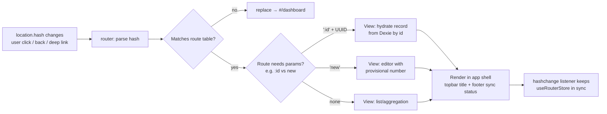
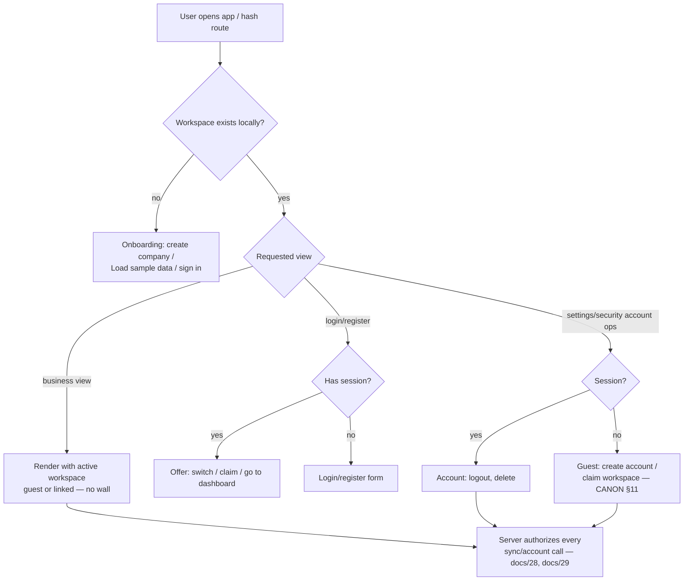

# 32. Routes

> Derived from `docs/_CANON.md` — §2 (**routing constraint — definitive**), §15 (hash routes, `src/lib/router.ts`), §11 (guest-first guards), §19.7 (team UI deferred). `_CANON.md` wins on any conflict. Screens: docs/31-UI-UX.md; settings tabs: docs/08, docs/28.

---

## 1. Purpose

Specify every route in both delivery forms: the **production Next.js App Router routes** (with their auth/workspace guards) and the **sandbox SPA hash routes** that the preview environment actually serves, including the internal router design (`src/lib/router.ts`) and the route-protection flow. One mental model, two URL dialects.

## 2. Scope

**In scope** — route inventory, guards, navigation flow, router implementation contract.

**Out of scope** — screen contents (docs/31), API routes (`/api/*`, docs/30 — not navigable routes), Electron deep links (scaffold; hash URLs work identically in the shell).

## 3. Business requirements

| # | Requirement |
|---|---|
| BR1 | The sandbox preview can serve **only `/`** — the app ships as an SPA at `/` with hash navigation (`#/invoices`, `#/invoices/inv_123`, …); API routes remain real HTTP endpoints (CANON §2). |
| BR2 | `#/dashboard` is the default route; unknown hashes fall back to it (CANON §15). |
| BR3 | Business data lives in IndexedDB, so **all app routes work offline**; only `#/login` is reachable in a logged-out, cloud-linked context, and guest mode never forces a login (CANON §11). |
| BR4 | The production route set matches the hash set 1:1 for implemented screens; production-only splits (settings sub-routes, `workspaces`, `register`) map back to sandbox tabs/dialogs without feature divergence. |
| BR5 | Deep links survive reload: opening `#/invoices/:id` directly must hydrate from IndexedDB and render the document. |

## 4. Production routes (App Router, target architecture)

Guard legend — **Auth**: `none` = public; `guest` = shows the logged-in state differently; `session` = requires a valid session (redirect `/login`). **Workspace**: `auto` = uses the active local workspace (always exists — guest-first); `cloud` = meaningful only when the workspace is cloud-linked.

| Route | Screen | Auth | Workspace | Notes |
|---|---|---|---|---|
| `/login` | Login/register card | none | — | Entry for account flows; guest mode explainer |
| `/register` | Account creation (+ auto-claim guest workspace, CANON §11) | none | auto (claim) | Merges into one card with `/login` in sandbox |
| `/dashboard` | KPIs, trend, activity | guest | auto | Default after app load |
| `/workspaces` | Workspace switcher / management (multi-workspace future) | session | — | MVP: single local workspace → simple info view |
| `/company` | Company profile editor | guest | auto | Onboarding redirect target when no profile |
| `/customers` | Customer list | guest | auto | |
| `/customers/[id]` | Customer detail + edit | guest | auto | `id` = UUID |
| `/products` | Product list | guest | auto | |
| `/products/[id]` | Product detail + edit | guest | auto | Sandbox parity: dialog on `#/products` |
| `/quotations` | Quotation list | guest | auto | |
| `/quotations/new` | Quotation editor (`kind:'quotation'`) | guest | auto | Provisional number `DRAFT-xxxxxxxx` |
| `/quotations/[id]` | Quotation view/edit, status transitions, convert | guest | auto | Read-only after terminal states (CANON §12) |
| `/invoices` | Invoice list | guest | auto | Status filters, totals |
| `/invoices/new` | Invoice editor (`kind:'invoice'`) | guest | auto | |
| `/invoices/[id]` | Invoice view, finalize, payments, PDF | guest | auto | Read-only once FINALIZED |
| `/payments` | Payments list + record payment | guest | auto | Amount ≤ balance (docs/33) |
| `/reports` | 5 report tabs + CSV export | guest | auto | |
| `/settings` | Preferences, Data, About | guest | auto | |
| `/settings/team` | Members & invites — **future UI** (CANON §19.7) | session | cloud | Not exposed in MVP; docs/28 §9 |
| `/settings/sync` | Sync status, outbox, conflicts | guest | auto | Tab inside `#/settings` in sandbox |
| `/settings/security` | Account, guest→cloud claim, logout, delete account | guest (session features gated) | auto | Tab inside `#/settings` in sandbox |

Guards are **client-side affordances**: they route users to the right screen (e.g., `/login` when an account flow requires it). Data protection itself is always server-side (CANON §8; docs/28 §7) — a renderer guard is never the security boundary.

## 5. Sandbox hash routes (the shipped SPA)

Preview constraint (CANON §2): the environment serves exactly `/`; deep server-rendered paths are impossible, so the SPA renders from `location.hash` and listens to `hashchange`. All 15 canonical hash routes (CANON §15):

| Hash route | View | Production counterpart | Mapping notes |
|---|---|---|---|
| `#/dashboard` (default) | Dashboard | `/dashboard` | Unknown/empty hash → normalized here |
| `#/invoices` | Invoice list | `/invoices` | |
| `#/invoices/new` | Invoice editor | `/invoices/new` | |
| `#/invoices/:id` | Invoice view/edit | `/invoices/[id]` | Reload-safe: hydrates from Dexie by UUID |
| `#/quotations` | Quotation list | `/quotations` | |
| `#/quotations/new` | Quotation editor | `/quotations/new` | |
| `#/quotations/:id` | Quotation view/edit | `/quotations/[id]` | |
| `#/customers` | Customer list | `/customers` | |
| `#/customers/:id` | Customer detail | `/customers/[id]` | |
| `#/products` | Product list (edit dialog) | `/products` + `/products/[id]` | Dialog parity (docs/31 §7.7) |
| `#/payments` | Payments | `/payments` | |
| `#/reports` | Reports | `/reports` | |
| `#/company` | Company editor | `/company` | |
| `#/settings` | Settings with tabs (Preferences · Sync · Data · Security · About) | `/settings`, `/settings/sync`, `/settings/security` | Team tab omitted in MVP (CANON §19.7); Sync/Security are tabs |
| `#/login` | Login **and** register (mode toggle) | `/login`, `/register` | Register = same view with mode=register + auto-claim |

Unmapped production routes: `/workspaces` (single local workspace in MVP → `#/settings`) and `/settings/team` (future → hidden per CANON §19.7). The two dialects are therefore **feature-identical**; only URL shape differs.

### 5.1 Internal router design (`src/lib/router.ts`)

- **Parsing**: read `location.hash`; strip leading `#`; empty → `dashboard`. Split into `segments[0] = view`, `segments[1..] = params` (UUID-or-`new` detection distinguishes `#/invoices/new` from `#/invoices/:id`).
- **Route table**: `const routes: { pattern: string; view: () => JSX }[]` matched in declaration order (`new` before `:id`); no match → `navigate('dashboard')` (replace, not push — avoids back-button traps).
- **Navigation**: `navigate(path)` sets `location.hash` (history-integrated by the browser); `back()` delegates to `history.back()`.
- **Subscription**: `hashchange` listener → re-render; Zustand store `useRouterStore` exposes `{ view, params }` so components consume reactively.
- **Scroll & focus**: on view change, scroll to top and move focus to the `h1` (`tabIndex={-1}`) for accessibility (docs/31 §9).
- **Guards**: minimal — login/register view is user-triggered; no auth wall exists in-app because guest mode is first-class (BR3).

## 6. Route protection flow

Notes: the only "redirect" logic in the SPA is onboarding (no company profile → wizard) and unknown-hash → `#/dashboard`. Server-side protection (`401/403`) applies to API calls, not to local views — offline local data needs no network authorization.

## 7. Offline behavior

All hash routes render from IndexedDB with zero network (CANON §1, §17). Reloads work because the service worker serves the shell (`cache-first` static, network-first `/` — CANON §17) and the hash re-parses on load; the view then hydrates from Dexie. If SW is unsupported, reload needs the network once — documented browser limitation (CANON §17, §19.8).

## 8. Online behavior

Hash navigation is purely local even online (no server round-trip per route — that is what makes the SPA preview-compatible). Network activity happens only in the sync engine, `/api/health` heartbeat, and account flows; those are route-independent (docs/17, docs/30).

## 9. Security considerations

Hash segments are **client state**: they are never sent to the server and never trusted — `#/invoices/:id` simply misses in Dexie for foreign UUIDs (empty state). No sensitive data (tokens, PII beyond doc ids) belongs in the hash; document ids are UUIDv4 (CANON §3), unguessable in practice. Production guards remain client-side UX; authorization is server-side per CANON §8 (docs/29 §4.2).

## 10. Error-handling rules

| Situation | Behavior |
|---|---|
| Unknown hash (`#/nope`) | Replace-redirect to `#/dashboard`; no error screen |
| Malformed param (non-UUID `:id`) | Treat as unknown → dashboard |
| Missing record for `:id` | View renders its EmptyState ("Invoice not found — it may be deleted") with back CTA |
| Onboarding incomplete | Any business view redirects to the onboarding wizard until a company profile or sample data exists (CANON §15) |
| Renderer crash inside a view | ErrorBoundary recovery card with Reload CTA (docs/34) |

## 11. Acceptance criteria

1. Opening `/` in the sandbox lands on `#/dashboard`; every hash route in §5 renders its documented view (manual route sweep).
2. Deep links work after reload and in a new tab (Dexie hydration), including `#/invoices/:id`.
3. Unknown or malformed hashes never produce a blank screen or a crash; they resolve to `#/dashboard`.
4. The production table (§4) and hash table (§5) cover the same feature set with the stated mappings (`/register`↔`#/login` register mode, settings splits ↔ tabs, product detail ↔ dialog, `/workspaces` & `/settings/team` deferred per CANON §19.7).
5. No navigable route performs a blocking network call before first paint; all views meet the offline requirement.
6. `src/lib/router.ts` exposes `navigate`, `back`, and a reactive `{ view, params }` store, with the route table ordering guaranteeing `/x/new` matches before `/x/:id`.
