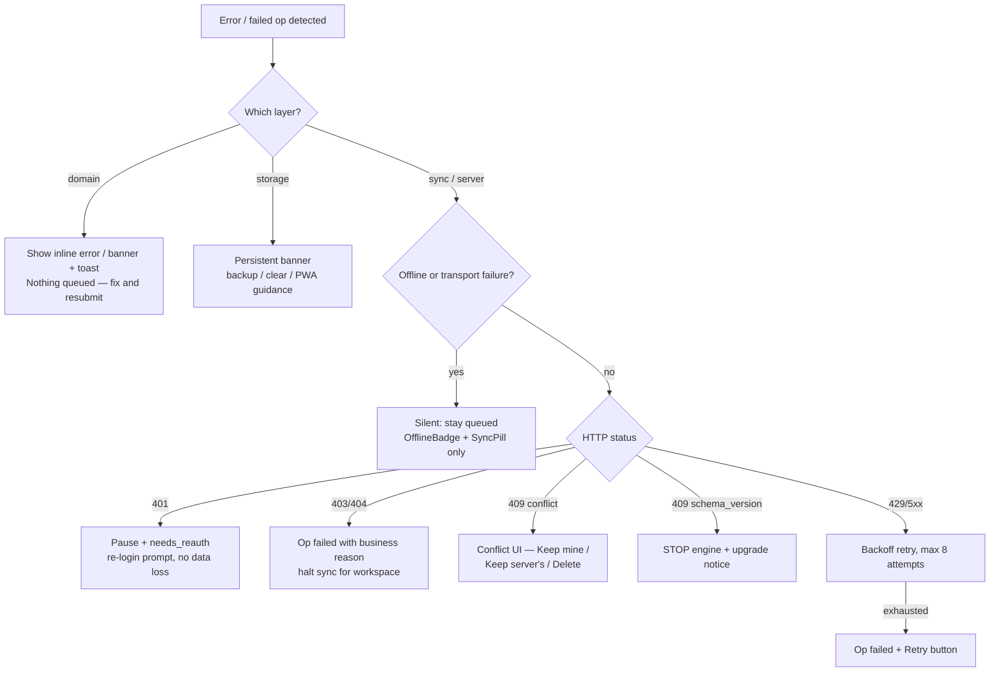

# 34. Error Handling

> Derived from `docs/_CANON.md` — §1 (golden rule: errors never block local work), §4 (money integrity), §9 (**sync protocol & retry/backoff — definitive**), §10 (conflicts), §12 (lifecycle violations), §14 (HTTP error codes), §15 (UI error states), §17 (offline). `_CANON.md` wins on any conflict. Companion docs: docs/17 (engine detail), docs/18 (conflict UI), docs/23 (toast catalog), docs/33 (validation messages), docs/29 (security errors).

---

## 1. Purpose

Define the complete error-handling model: a taxonomy of every failure class (domain, storage, sync, server), the exact server-error → client-behavior mapping, retry policies with the CANON backoff schedule, the user-facing presentation patterns (toasts, inline errors, banners, ErrorBoundary), offline error suppression, and logging so that **no error is ever silent and no data is ever lost** (CANON §9 BR5).

## 2. Scope

Covers renderer, domain engine, local storage (Dexie/IndexedDB), sync engine, and the API surface. Out of scope: validation message content (docs/33), conflict-resolution policies (docs/18), rate-limit internals (docs/07).

## 3. Business requirements

| # | Requirement |
|---|---|
| BR1 | Local-first resilience: a network error must never block a user action — work continues and the outbox retries (CANON §1). |
| BR2 | No silent data loss: every sync op reaches a **user-visible terminal state** — `done`, `failed` (with reason), or `conflict` (docs/18) (CANON §9). |
| BR3 | Errors are classified before presentation: each class has one agreed user-facing pattern (docs/31 §15). |
| BR4 | Server arithmetic/lifecycle violations are explained in business language ("Cannot edit finalized invoice"), never as raw stack traces (CANON §12). |
| BR5 | Auth and schema incompatibility degrade gracefully: pause + prompt, never data loss or loops (CANON §9). |
| BR6 | Security-relevant and privileged failures are logged (`audit_logs` server-side app logs) with correlation, without leaking secrets (CANON §7, §16). |

## 4. Error taxonomy

### 4.1 Domain errors (raised by `src/lib/domain/*` before any write)

| Code / example | Trigger | User-facing pattern |
|---|---|---|
| `validation_*` (e.g., `invalid_gstin`) | Zod schema failure (docs/33 §5) | Inline field error in forms; banner + toast in the document editor |
| `state_transition` — **"Cannot edit finalized invoice"** | Lifecycle gate: edit/delete on FINALIZED/PAID, cancel with payments, status jump (CANON §12) | Action hidden in UI; if attempted programmatically → error toast with the correction workflow ("Duplicate → edit → reissue") |
| `payment_exceeds_balance` | Payment amount > remaining balance | Inline error on the amount field |
| `numbering_exhausted` / sequence misuse | Local sequence anomaly | Toast + sync `failed` op; server resolves on push (CANON §6) |
| `document_incomplete` | < 1 item / missing customer / missing place of supply | Editor banner listing all blockers; finalize blocked |

Domain errors are **deterministic and local**: they prevent bad data from entering IndexedDB or the outbox at all, so they never need retrying.

### 4.2 Storage errors (IndexedDB/Dexie)

| Scenario | Detection | Client behavior |
|---|---|---|
| IndexedDB unavailable (private mode, blocked storage) | Dexie open failure at boot | Persistent **storage banner** ("Local database unavailable — data cannot be saved"), read-only degraded mode where feasible |
| Quota exceeded (`QuotaExceededError`) | Transaction abort on write | Persistent banner with guidance: JSON backup export, clear old outbox rows, install PWA / use desktop app (CANON §17, §19.8) |
| Schema upgrade failure | `db.upgrade()` throw | Banner "Storage upgrade failed — restore from backup"; JSON backup import path (docs/39) |
| Transaction conflict (rare, Dexie serializes) | Dexie `ModifyError` | Automatic single retry; then error toast with retry action |

### 4.3 Sync errors (engine ↔ server)

| Scenario | Detection | Client behavior |
|---|---|---|
| Offline / no route | `navigator.onLine = false`, fetch failure, heartbeat fail | **Silent**: stay queued; SyncPill → "Offline" (CANON §17) |
| Network error mid-run (timeout, DNS) | fetch reject | Op stays `in_flight` → reset to `pending`; backoff (§6); SyncPill → "Error" with retriable state |
| `401` unauthenticated | HTTP status | Pause sync; entity/app flag `needs_reauth`; prompt re-login **without data loss** (CANON §9) |
| `403` forbidden / not member | HTTP status or per-op `rejected` | Halt sync for that workspace; toast explaining permission; op `failed` (visible) |
| `404` missing workspace | HTTP status | Treat as desync: suggest re-claim; op `failed` |
| `409` conflict (CAS) | Push result `status: 'conflict'` | Store `server_record` on op; op + entity → `conflict`; surface in Settings → Sync → Conflicts (CANON §9, docs/18) |
| `409 { code: 'schema_version' }` | HTTP status + code | **Stop syncing entirely**; show upgrade notice (CANON §9) — schema guard |
| `429` rate limited | HTTP status + `Retry-After` | Honor `Retry-After` (clamp to backoff floor); SyncPill → "Pending N" |
| `5xx` server fault | HTTP status | Transient: reset ops to `pending`, backoff, never `failed` (server fault ≠ user fault) |
| Op `rejected` | Push result | Op → `failed` with verbatim reason; retryable **only by user edit**; never auto-retried, never dropped (CANON §9) |

### 4.4 Server errors (API responses outside sync)

Auth/account and claim endpoints follow the mapping in §5. The health heartbeat treats any failure as "cloud unreachable" (offline badge), never as a data error (docs/30 §5.1).

### 4.5 Classification flow

Every terminal path above ends in a **user-visible** state — the "no silent data loss" guarantee (BR2).

## 5. Server error → client behavior mapping (canonical table)

| HTTP | Meaning (CANON §14) | Client behavior | Retried automatically? |
|---|---|---|---|
| `400` validation | Envelope/body failed Zod | Fix-and-resubmit UX: form inline errors (auth/claim); sync envelope → op `failed` with reason | No |
| `401` unauthenticated | No/expired session | Pause + `needs_reauth` + login prompt; local data intact | After re-login |
| `403` forbidden / not member | Role/membership gate (docs/28) | Toast with business explanation; op `failed`; sync halted for the workspace | No (permission is deterministic) |
| `404` not found | Workspace/resource missing | Redirect/empty state (routes); sync → `failed` + re-claim guidance | No |
| `409` conflict | CAS mismatch / schema_version | Conflict UI (docs/18) or upgrade notice | Conflict: no (user resolves); schema: no (halt) |
| `429` rate limited | Auth/claim limiter | Wait per `Retry-After`; queue stays pending | Yes (after wait) |
| `500` internal | Unexpected server fault | Generic message + correlation id; ops stay `pending` | Yes (backoff) |

## 6. Retry policies (CANON §9, verbatim schedule)

- Scope: **only transport/transient failures retry automatically** (network, `429`, `5xx`). Domain `rejected` and permission `403` results never auto-retry.
- Schedule: on failure `attempts++`, `next_attempt_at = now + min(10 min, 2^attempts × 2 s)` → 4 s, 8 s, 16 s, 32 s, 64 s, 128 s, 256 s, 512 s, then capped at **10 minutes**.
- Terminal: after **8 attempts** an op → `failed` (manual **Retry** button in Settings → Sync; retry resets attempts and re-enqueues).
- Batch behavior: ops are claimed oldest-first in batches of 25; per-op results are independent — one `rejected` op never blocks the rest of the batch.
- Triggers that cut retries short: `needs_reauth` (waits for login) and the `schema_version` guard (stops the engine outright).
- Pruning: `done` ops older than 7 days are deleted (their outcome lives in ChangeLog/audit history).

## 7. User-facing patterns (one per class)

| Pattern | Component | Used for |
|---|---|---|
| **Toast** (sonner) | success/error/info, action button where recovery exists | Save/sync feedback; transient sync errors ("Sync will retry"); domain toasts in editors (docs/23) |
| **Inline field error** | under control, red, `aria-describedby` | Form validation (docs/33 §8) |
| **Inline alert banner** | blocking list inside editors | Document-level problems ("add at least one item") |
| **Persistent banner** | below topbar | Offline, guest workspace, storage unavailable/quota (CANON §15, §17) |
| **SyncPill state** | topbar | Synced / Pending N / Syncing / Offline / Error / Reauth (docs/23 state machine) |
| **Conflict dialog** | Settings → Sync → Conflicts | Side-by-side diff, Keep mine / Keep server's / Delete (docs/18) |
| **ErrorBoundary card** | route-level crash boundary | Renderer exception → recovery card with **Reload** CTA; never a blank screen |
| **Failed-ops table** | Settings → Sync | `failed` ops with verbatim reasons + per-op **Retry** (CANON §9) |

## 8. Offline error suppression (silent queue)

Offline is a **mode, not an error**: while `navigator.onLine = false` (or heartbeat fails), the engine does not run and no error toast is shown for unreachable cloud — ops simply accumulate in the outbox and rows show their pending dot (CANON §1, §17). Presentation is limited to the OfflineBadge + SyncPill. Suppression is scoped strictly to connectivity: domain/validation errors still surface immediately offline because they require user action.

## 9. Logging

- **Local**: `audit_logs` records business events incl. failures of finalize/convert/cancel/payment and `SYNC_CONFLICT` resolutions (CANON §7); the failed-ops table exposes `last_error` verbatim; console logging is dev-only guarded (no PII in production consoles).
- **Server**: structured request logs with a correlation id per request; `500`s log the full stack server-side and return the generic message + id; auth failures, 429s, and rejected ops are counted (rate-limit/analytics). Secrets, cookies, and bodies are redacted (docs/29 §4.7).
- **Feedback loop**: the client shows the server correlation id on 500 toasts for support; failed ops carry `op_id` so server logs can be joined with `ProcessedOp`.

## 10. Offline behavior

Summarized by design: nothing user-facing blocks (BR1), everything queues, domain errors still fire locally before enqueue, storage errors use banners with backup guidance, and retry happens invisibly with capped exponential backoff. The system converges when connectivity returns — first push (batches of 25), then pull inside one Dexie transaction (CANON §9).

## 11. Online behavior

The engine's per-op result handling is the authoritative online error flow (CANON §9): `applied | duplicate | number_reassigned` → adopt server record; `conflict` → conflict UI; `rejected` → `failed` + visible reason. Session expiry mid-run is the only flow that interrupts the user (login prompt), and it never discards work.

## 12. Security considerations

Error messages never leak internals: no stack traces, SQL, or identifiers beyond correlation ids (docs/29 §6); 401 vs 403 distinctions are preserved for the engine but presented in neutral business language to users; audit logging covers security-relevant failures without logging secrets (CANON §16).

## 13. Acceptance criteria

1. Killing the network mid-use: no error dialog appears, edits succeed locally, SyncPill shows "Offline"/"Pending N", and queued ops drain automatically on reconnect with correct per-op outcomes.
2. Every op forced to fail ends `done`, `failed` (with visible reason + Retry), or `conflict` (in the conflicts UI) — an audit of `sync_operations` after any test run shows no other terminal state and nothing silently dropped.
3. The backoff schedule matches §6 (4 s → 10 min cap, 8 attempts → `failed`), verified by inspecting `next_attempt_at`/`attempts` in the outbox table.
4. Each HTTP status in §5 produces exactly the documented client behavior, including `401` → `needs_reauth` without data loss and `409 { code: 'schema_version' }` → full stop + upgrade notice.
5. A renderer exception shows the ErrorBoundary reload card, not a blank route; the rest of the SPA remains navigable.
6. Lifecycle violations ("Cannot edit finalized invoice") are impossible to trigger through normal UI and, when forced via API, return the business-language reason (CANON §12).
7. Quota/unavailable storage states render the persistent banner with the backup/clearing guidance; the app degrades gracefully instead of crashing.
8. All user-facing errors avoid internal details and are reachable via keyboard/screen reader per docs/31 §9 (toasts announced, banners persistent).
