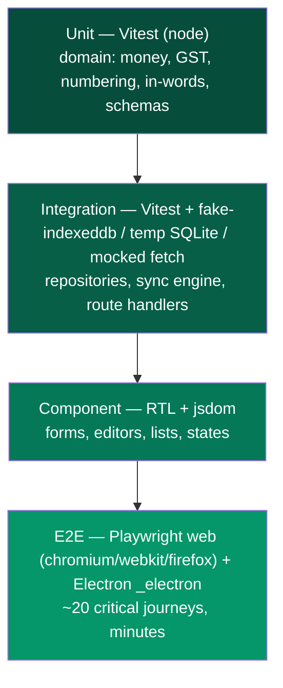

# 35 — Testing Strategy

> Derived from `docs/_CANON.md` (§2, §4, §5, §6, §9, §14, §16, §19.5). If this doc deviates from CANON, CANON wins.

## 1. Purpose

Define the complete, executable test strategy for InvoiceFlow: the test pyramid, per-layer tooling, exact test cases for the money/GST/numbering/in-words domain engine, integration strategies for local DB + sync + server, component and end-to-end coverage including offline flows, test data builders, CI integration, and coverage targets.

**Sandbox statement (IMPORTANT):** per the sandbox environment rules **no test files are bundled in this sandbox yet** — this document specifies the strategy that is executed as soon as the pnpm/Turborepo monorepo is scaffolded (CANON §2, §19.5). Everything below is written so that each section maps 1:1 to files created during scaffolding.

## 2. Scope

| In scope | Out of scope |
|---|---|
| Unit tests: domain money, GST, numbering, amount-in-words | Load/stress testing infrastructure |
| Integration tests: Dexie repositories (fake-indexeddb), sync engine (mocked fetch), server route handlers (temp SQLite) | Manual QA scripts |
| Component tests: React Testing Library | Penetration testing (see docs/29-SECURITY.md) |
| E2E: Playwright (web flows incl. offline→online) + Electron (`_electron`) | Legal/GST certification testing (out of product scope, CANON §19.2) |
| Test data builders, CI (GitHub Actions), coverage targets, Supabase mocking | Visual regression as a gate (kept optional) |

Offline-specific testing scenarios (network interception, SW updates, persistence across reloads, conflicts, clocks) are specified in **docs/36-OFFLINE-TESTING.md**.

## 3. Business requirements

- **BR-1** Money math must be provably exact: every computation in CANON §4 (gross, discount, taxable, CGST/SGST/IGST split, charges, round-off) is locked by tests using integer paise only — no float drift is ever acceptable.
- **BR-2** Odd-paise tax splits, tax-inclusive price extraction and round-off must have named, reviewed edge-case tests (they are the highest-risk financial bugs).
- **BR-3** Every business rule with legal flavor (GSTIN format, intra vs inter state, FY-based numbering, immutability after finalize) must be covered at unit level.
- **BR-4** The sync engine must be tested against the exact HTTP contract of CANON §9, including idempotency (`duplicate`), CAS conflicts, `number_reassigned`, `rejected`, retry/backoff and 401 handling.
- **BR-5** Server code must never trust client arithmetic: tests prove the server recomputes totals and overwrites client numbers (CANON §4, §9).
- **BR-6** A user must be able to create an invoice fully offline, come online, and observe the document synced with a stable number — covered by an automated E2E scenario.
- **BR-7** Coverage gates: domain engine ≥ 95 %; sync + local-db ≥ 85 %; global ≥ 80 % lines.
- **BR-8** Tests run on every PR in CI; the pipeline is the only merge gate (no local-only passes).

## 4. Technical design

### 4.1 Test pyramid



Weight distribution: ~70 % unit, ~20 % integration, ~8 % component, ~2 % E2E by test count. Fast feedback first: unit (< 10 s) → integration (< 60 s) → component (< 2 min) → E2E (< 10 min, CI only).

### 4.2 Layer 1 — Unit tests (Vitest, `environment: node`)

Targets (sandbox paths; 1:1 with monorepo packages per CANON §2):

| Module | File | Must cover |
|---|---|---|
| Money | `src/lib/domain/money.test.ts` | paise/bps/milli conversions, `roundHalfUp`, formatting (`Intl` ₹ UI format vs PDF `Rs.` limitation CANON §13) |
| GST | `src/lib/domain/gst.test.ts` | GSTIN regex (CANON §5), intra/inter determination from state codes, UTGST→SGST slot mapping, state code list sanity (38 entries, `ut` flags) |
| Numbering | `src/lib/domain/numbering.test.ts` | `fiscalYearOf`, `{prefix}/{FY}/{seq4}` formatting, provisional `DRAFT-<8 chars>`, sequence never decrements (CANON §6) |
| In-words | `src/lib/domain/in-words.test.ts` | Indian numbering (crore/lakh/thousand), rupees-only, paise-only, mixed, zero, CANON example string |
| Totals engine | `src/lib/domain/documents.test.ts` | `computeDocumentTotals` — CANON §4 exact math incl. §4.3 sample below |
| Schemas | `src/lib/domain/schemas.test.ts` | Zod schemas shared client/server (CANON §9 validation) |

#### Money & totals edge-case table (contract tests — each row is a separate `it()`)

| # | Case | Input | Expected (exact paise) |
|---|---|---|---|
| 1 | Basic intra-state, tax-exclusive | `qty_milli=2500, unit=40000, disc=0, gst=1800` | gross 100000, taxable 100000, tax 18000, **cgst 9000, sgst 9000**, lineTotal 118000 |
| 2 | **Odd-paise CGST/SGST split** | `qty_milli=1000, unit=5050, disc=0, gst=1800` | gross 5050, taxCombined 909, **cgst 455, sgst 454** (remainder to SGST slot), lineTotal 5959 |
| 3 | **Tax-inclusive extraction, exact** | `grossAfterDisc=11800, gst=1800` | taxable 10000, tax 1800, lineTotal 11800 |
| 4 | **Tax-inclusive extraction, non-exact** | `grossAfterDisc=10000, gst=1800` | taxable = roundHalfUp(10000×10000/11800) = 8475, tax = 10000−8475 = 1525, lineTotal 10000 |
| 5 | **Discount half-up boundary** | `qty_milli=3000, unit=9999, disc=500, gst=1800` | gross 29997, discount roundHalfUp(1499.85)=**1500**, grossAfterDisc 28497, tax 5129, cgst 2565, sgst 2564, lineTotal 33626 |
| 6 | Inter-state (IGST) | taxable 100000, gst 1800, INTER | igst 18000, cgst 0, sgst 0 |
| 7 | Charge with tax | charge `{amount_paise:5000, taxable:true, gst:1800}` | chargesTotal 5000, chargesTaxTotal 900 |
| 8 | Non-taxable charge | charge `{amount_paise:2500, taxable:false}` | chargesTotal 2500, chargesTaxTotal 0 |
| 9 | **Round-off, up** | grandTotalRaw 118560, round-off on | grandTotal 118600, roundOff **+40** |
| 10 | **Round-off, down (negative)** | grandTotalRaw 118543, round-off on | grandTotal 118500, roundOff **−43** |
| 11 | Round-off disabled | grandTotalRaw 118543 | grandTotal 118543, roundOff 0 |
| 12 | Zero-quantity line rejected | `qty_milli=0` | Zod/domain validation error (no NaN ever) |

> **Conformance note on case 2:** CANON §4 defines the normative formula `cgst = roundHalfUp(taxCombined / 2)` and `sgst = taxCombined − cgst` ("odd paise → SGST" = the SGST slot receives the remainder). The tests assert the formula literally: for odd `taxCombined`, CGST takes the half-up half and SGST takes the remainder. UTGST is recorded in the SGST slot with a flag (CANON §4, §5).

#### Numbering edge-case table

| # | Case | Input | Expected |
|---|---|---|---|
| 1 | FY before cutoff | `fiscalYearOf('2025-03-31')` | `'2024-25'` |
| 2 | FY on/after cutoff | `fiscalYearOf('2025-04-01')` / `fiscalYearOf('2025-06-01')` | `'2025-26'` (CANON §6 example) |
| 3 | seq4 padding | seq 42 → `INV/2025-26/0042`; seq 1 → `…/0001` | zero-padded to 4 |
| 4 | seq > 9999 | seq 12345 | renders full digits `12345` (pad is a minimum) |
| 5 | Provisional draft number | `newDraftNumber()` | matches `/^DRAFT-[A-Z0-9]{8}$/` |
| 6 | Sequence immutability | decrement attempt | rejected by domain guard (CANON §6: sequences never decrement) |

#### Amount-in-words table (Indian numbering, CANON §4)

| # | Input paise | Output |
|---|---|---|
| 1 | `0` | `Rupees Zero Only` |
| 2 | `100000` (₹1,000.00) | `Rupees One Thousand Only` |
| 3 | `12300050` (₹1,23,000.50) | `Rupees One Lakh Twenty Three Thousand and Fifty Paise Only` (CANON example) |
| 4 | `1250000000` (₹12,50,00,000) | `Rupees Twelve Crore Fifty Lakh Only` |
| 5 | `99` (₹0.99) | `Rupees Ninety Nine Paise Only` |

#### GSTIN validation table

| # | Input | Expected |
|---|---|---|
| 1 | `27AAPFU0939F1ZV` | valid (regex CANON §5) |
| 2 | `27aapfu0939f1zv` | invalid (lowercase) |
| 3 | `27AAPFU0939F1Z` | invalid (14 chars) |
| 4 | `07AAPFU0939F1ZV` | valid format (different state code — intra/inter logic keyed off first 2 digits) |

### 4.3 Sample test: `computeDocumentTotals` (CANON §4 exact math)

The engine lives at `src/lib/domain/documents.ts` (CANON §2/§4). The test fixes the **numeric contract** (field names follow the implementation; the numbers below are normative). Scenario: intra-state invoice (Maharashtra→Maharashtra), tax-exclusive, 2 items, 1 taxable charge, round-off enabled.

```ts
// src/lib/domain/documents.test.ts
import { describe, expect, it } from 'vitest';
import { computeDocumentTotals } from './documents';

describe('computeDocumentTotals — CANON §4 exact math', () => {
  it('computes items + charges + round-off for an intra-state invoice', () => {
    const result = computeDocumentTotals({
      taxMode: 'INTRA',            // CGST+SGST path (CANON §5)
      priceIncludesTax: false,     // tax-exclusive pricing (CANON §4.3)
      enableRoundOff: true,        // CANON §4 document totals
      items: [
        { qtyMilli: 2500, unitPricePaise: 40000, discountBps: 0,   gstRateBps: 1800 },
        { qtyMilli: 3000, unitPricePaise: 33333, discountBps: 500, gstRateBps: 1800 },
      ],
      charges: [
        { id: 'chg_1', label: 'Packing', amountPaise: 5000, taxable: true, gstRateBps: 1800 },
      ],
    });

    // Item 1: gross = rHU(2500*40000/1000)=100000; tax = rHU(100000*1800/10000)=18000 → 9000/9000
    // Item 2: gross = rHU(3000*33333/1000)=99999; disc = rHU(99999*500/10000)=5000;
    //         taxable 94999; tax = rHU(94999*1800/10000)=17100 → 8550/8550
    expect(result.subtotalGrossPaise).toBe(199999); // 100000 + 99999
    expect(result.discountTotalPaise).toBe(5000);
    expect(result.taxableTotalPaise).toBe(194999);  // 100000 + 94999
    expect(result.cgstPaise).toBe(17550);           // 9000 + 8550
    expect(result.sgstPaise).toBe(17550);           // 9000 + 8550
    expect(result.igstPaise).toBe(0);
    expect(result.chargesTotalPaise).toBe(5000);
    expect(result.chargesTaxPaise).toBe(900);       // rHU(5000*1800/10000)
    expect(result.grandTotalRawPaise).toBe(235999); // 194999+17550+17550+5000+900
    expect(result.roundOffPaise).toBe(1);           // rHU(2359.99)*100 = 236000
    expect(result.grandTotalPaise).toBe(236000);
  });

  it('is deterministic across runs (no float drift)', () => {
    const run = () => computeDocumentTotals({
      taxMode: 'INTER', priceIncludesTax: true, enableRoundOff: true,
      items: [{ qtyMilli: 1000, unitPricePaise: 10000, discountBps: 0, gstRateBps: 1800 }],
      charges: [],
    });
    expect(run()).toEqual(run());
  });
});
```

`rHU = roundHalfUp = Math.floor(x + 0.5)` (CANON §4). Every total asserted here is recomputed independently by hand and by the server (`rejected`/overwrite tests in §4.4).

### 4.4 Layer 2 — Integration tests (Vitest, `environment: node`)

**(a) Repositories + Dexie via `fake-indexeddb`.**
Setup file `vitest.setup.ts` imports `fake-indexeddb/auto`. Each test gets a fresh `Dexie` instance constructed against the v1 schema from CANON §7 (all indexes reproduced verbatim). Suites:

- `src/lib/db/repositories/*.test.ts`: CRUD for customers/products/invoices/quotations/payments; soft-delete sets `deleted_at` and hides from default lists; metadata defaults (`id` UUIDv4, `version=1`, `sync_state='local'`, `origin_device_id`); composite-index queries (`[workspace_id+deleted_at]`, `[workspace_id+status]`, `[invoice_id]`); payments recompute invoice `paid_total_paise` and status transitions (`PARTIALLY_PAID`/`PAID`, CANON §12).
- `src/lib/db/db.test.ts`: schema opens at version 1; the upgrade path pattern (`db.version(n+1).stores(...)`) is exercised with a fixture v1→v2 upgrade; transaction atomicity (a thrown error inside `db.transaction('rw', …)` rolls back all writes).

**(b) Sync engine with mocked fetch.**
`src/lib/sync/engine.test.ts` injects a `fetch` stub returning canned CANON §9 responses:

| Scenario | Stub response | Expected engine behavior |
|---|---|---|
| Happy push (3 ops) | all `applied` + records | ops → `done`, entities `sync_state='synced'`, `version` adopted from server, done ops pruned after 7 days |
| Replay idempotency | `duplicate` | local record updated, op `done` — no duplicate server writes |
| CAS conflict | `conflict` + server record | op `conflict`, `server_record_json` stored, entity `sync_state='conflict'`, listed in Settings → Sync → Conflicts |
| Validation reject | `rejected` + error | op `failed` with `last_error`, entity remains `pending`-adjacent state, surfaced in UI, never dropped |
| Number reassignment (offline finalize) | `number_reassigned` + record | client adopts server number + record (document immutable once finalized, CANON §6) |
| 401 auth expiry | HTTP 401 | sync paused, `needs_reauth` flag, no data loss |
| Schema mismatch | HTTP 409 `{code:'schema_version'}` | syncing stops, upgrade notice shown |
| Backoff | 500 × N | `next_attempt_at = now + min(10 min, 2^attempts × 2 s)`; after 8 attempts → `failed` |
| Pull application | changes batch | single Dexie transaction; records with pending local ops skipped; server wins only when `record.version > local.version`; items replaced atomically; cursor + `last_sync_at` updated |
| Concurrency guard | trigger × 5 simultaneous | single run executes (mutex), others coalesce |

**(c) Server route handlers with temp SQLite.**
`src/lib/server/**/*.test.ts` (dev-cloud, CANON §8) run each handler with `DATABASE_URL=file:<tmpdir>/test-<rand>.db` and `prisma migrate deploy` + seed per suite. Suites mirror the API surface (CANON §14): auth register/login/logout/session/account (scrypt hashing, cookie flags, 30-day expiry, 10 req/min/IP limiter), `/api/workspace/claim` (OWNER membership + initial ChangeLog), `/api/sync/push` (all of §9 server rules: idempotency via `ProcessedOp`, Zod rejection, CAS conflict, **server recomputation of totals overwriting client numbers**, finalize number allocation in a serializable transaction, FINALIZED/PAID immutability, cancel blocked when payments exist), `/api/sync/pull` (cursor pagination, limit 500, `next_cursor`, ChangeLog completeness).

### 4.5 Layer 3 — Component tests (RTL + jsdom)

- Document editor (`kind: 'invoice' | 'quotation'`): line add/remove/reorder, product picker fills HSN/rate/unit/price, tax-inclusive toggle re-renders totals panel, live totals match `computeDocumentTotals` snapshots, Save draft vs Save & finalize paths.
- Lists: sortable headers, search, filters, pagination (client-side, 10/page, CANON §15), empty states, loading skeletons, `sync_state` dots (emerald synced / amber pending).
- Forms: RHF + zodResolver error messages (customer, product, company, auth).
- Settings → Sync: outbox table, conflicts UI ("Keep mine / Keep server's / Delete"), failed-ops retry button.
- Theme toggle, offline banner, sync pill states (`Synced / Pending N / Offline / Syncing / Error`).

### 4.6 Layer 4 — E2E (Playwright)

Web (3 browser projects) + Electron (`_electron`); full scenario list in docs/36-OFFLINE-TESTING.md. Canonical journey (BR-6):

```ts
// e2e/invoice-offline-sync.spec.ts (sketch — full walkthrough in docs/36)
test('create invoice offline → go online → synced with stable number', async ({ page, context }) => {
  await page.goto('/');
  await onboardWithSampleCompany(page);          // or restore seeded local workspace
  await linkWorkspaceToDevCloud(page);           // register/login/claim (CANON §11)
  await firstSync(page);                         // pill = Synced
  await context.setOffline(true);
  await createAndFinalizeInvoice(page, { customer: 'Acme', item: { qty: '2.5', price: '400.00' } });
  await expect(page.getByText('Pending 2')).toBeVisible();   // upsert + finalize ops
  await context.setOffline(false);
  await expectSyncedWithin(page, 30_000);        // online event → engine drains
  await expect(page.getByText(/^INV\/\d{4}-\d{2}\/\d{4}$/).first()).toBeVisible();
});
```

**Electron** (`e2e/desktop.*.electron.spec.ts`): launch via `import { _electron as electron } from 'playwright'` → `electron.launch({ args: ['electron/main.js'] })`; assert window renders the same UI, offline CRUD + PDF export works (local assets), IPC surface is typed and reachable, CSP headers present in the renderer console (no violations).

**Visual regression (optional, non-gating):** Playwright `toHaveScreenshot()` on the dashboard, invoice editor and PDF preview iframe; snapshots reviewed manually, never a hard CI gate in v1 (layout churn during Phase 3–5 would create noise).

### 4.7 Test data builders

`tests/builders.ts` — deterministic factories (seeded faker or fixed sequences), all defaults CANON-compliant:

```ts
export const makeCustomer = (over: Partial<Customer> = {}): Customer => ({
  id: uuid(), workspace_id: WS, type: 'BUSINESS', business_name: 'Acme Traders',
  state_code: '27', state_name: 'Maharashtra', gstin: '27AAPFU0939F1ZV',
  created_at: ISO_NOW, updated_at: ISO_NOW, deleted_at: null,
  version: 1, sync_state: 'local', origin_device_id: DEVICE_ID, ...over,
});
export const makeItem = (over: Partial<DocItem> = {}): DocItem => ({
  description: 'Consulting services', qtyMilli: 1000, unitPricePaise: 100000,
  discountBps: 0, gstRateBps: 1800, ...over,
});
export const makeInvoice = (items: DocItem[] = [makeItem()], over = {}) => /* builds DRAFT with computed snapshot totals */;
```

Builders never call `computeDocumentTotals` for expected values in assertions — expected numbers are hardcoded from §4.2/§4.3 tables.

### 4.8 Mocking Supabase

- **Unit/integration:** production swaps the dev-cloud adapter for Supabase (CANON §8/§11). Tests mock the *adapter interface* (auth + sync transport), never the Supabase SDK deep internals: a `FakeTransport` implementing the CANON §9 push/pull contract. The same fixtures feed both the Prisma dev-cloud handler tests and the Supabase adapter tests.
- **Supabase Auth:** `supabase.auth` is mocked at the client boundary (`getUser`, `signInWithPassword`, `onAuthStateChange`); JWT verification tests use tokens signed with `SUPABASE_JWT_SECRET` in-process (HS256) — no network, no service keys in test bundles (CANON §16).
- **RLS is not mockable in unit tests:** row-level security is verified against a real (local) Supabase CLI project in the dedicated `supabase` CI job (docs/37-DEPLOYMENT.md §4.2).

### 4.9 Example Vitest config

```ts
// vitest.config.ts — monorepo root (sandbox: paths map 1:1 to src/lib per CANON §2)
import { defineConfig } from 'vitest/config';
import react from '@vitejs/plugin-react';
import tsconfigPaths from 'vite-tsconfig-paths';

export default defineConfig({
  plugins: [react(), tsconfigPaths()],
  test: {
    globals: true,
    setupFiles: ['./vitest.setup.ts'],           // fake-indexeddb/auto, MSW server, matchMedia polyfill
    projects: [
      { test: { name: 'domain',      environment: 'node',   include: ['src/lib/domain/**/*.test.ts'] } },
      { test: { name: 'local-db',    environment: 'node',   include: ['src/lib/db/**/*.test.ts'] } },
      { test: { name: 'sync',        environment: 'node',   include: ['src/lib/sync/**/*.test.ts'] } },
      { test: { name: 'server',      environment: 'node',   include: ['src/lib/server/**/*.test.ts'] } },
      { test: { name: 'components',  environment: 'jsdom',  include: ['src/components/**/*.test.tsx', 'src/app/**/*.test.tsx'] } },
    ],
    coverage: {
      provider: 'v8',
      reporter: ['text', 'lcov', 'html'],
      include: ['src/lib/**'],
      thresholds: {
        'src/lib/domain/**': { branches: 95, functions: 95, lines: 95, statements: 95 }, // BR-7
        'src/lib/db/**':    { lines: 85, branches: 80 },
        'src/lib/sync/**':  { lines: 85, branches: 80 },
        global:             { lines: 80 },
      },
    },
  },
});
```

### 4.10 Example Playwright config

```ts
// playwright.config.ts
import { defineConfig, devices } from '@playwright/test';

export default defineConfig({
  testDir: './e2e',
  timeout: 60_000,
  expect: { timeout: 10_000 },
  fullyParallel: true,
  retries: process.env.CI ? 2 : 0,
  reporter: process.env.CI ? [['html'], ['github']] : [['list']],
  use: {
    baseURL: process.env.E2E_BASE_URL ?? 'http://127.0.0.1:3000',
    trace: 'retain-on-failure',
    video: 'retain-on-failure',
    locale: 'en-IN',
    timezoneId: 'Asia/Kolkata',
  },
  projects: [
    { name: 'chromium', use: { ...devices['Desktop Chrome'] } },
    { name: 'webkit',   use: { ...devices['Desktop Safari'] } },
    { name: 'firefox',  use: { ...devices['Desktop Firefox'] } },
    { name: 'electron', testMatch: /.*\.electron\.spec\.ts/, use: { ...devices['Desktop Chrome'] } },
  ],
  webServer: process.env.E2E_SW ? {
    // Service-worker scenarios need a production build (SW registers in prod only, CANON §17)
    command: 'pnpm build && pnpm start',
    url: 'http://127.0.0.1:3000',
    reuseExistingServer: !process.env.CI,
  } : {
    command: 'pnpm dev',
    url: 'http://127.0.0.1:3000',
    reuseExistingServer: !process.env.CI,
    env: { DATABASE_URL: 'file:./e2e-temp/e2e.db', NEXT_PUBLIC_ENABLE_PWA: 'false' },
  },
});
```

### 4.11 CI integration (GitHub Actions)

```yaml
# .github/workflows/ci.yml
name: ci
on:
  push: { branches: [main] }
  pull_request:
jobs:
  quality:
    runs-on: ubuntu-latest
    steps:
      - uses: actions/checkout@v4
      - uses: pnpm/action-setup@v4
        with: { version: 9 }
      - uses: actions/setup-node@v4
        with: { node-version: 22, cache: pnpm }
      - run: pnpm install --frozen-lockfile
      - run: pnpm turbo run lint typecheck          # strict TS (CANON §2)
      - run: pnpm turbo run test -- --coverage      # unit + integration + component
      - uses: actions/upload-artifact@v4
        if: always()
        with: { name: coverage, path: coverage/ }
      - run: pnpm audit --audit-level=high          # dependency audit (CANON §16)
  e2e:
    needs: quality
    runs-on: ubuntu-latest
    steps:
      - uses: actions/checkout@v4
      - uses: pnpm/action-setup@v4
        with: { version: 9 }
      - uses: actions/setup-node@v4
        with: { node-version: 22, cache: pnpm }
      - run: pnpm install --frozen-lockfile
      - run: pnpm exec playwright install --with-deps
      - run: pnpm exec playwright test
      - uses: actions/upload-artifact@v4
        if: failure()
        with: { name: playwright-report, path: playwright-report/ }
  supabase:
    needs: quality
    runs-on: ubuntu-latest
    steps:
      - uses: supabase/setup-cli@v1
        with: { version: latest }
      - run: supabase db start && supabase db reset   # applies 0001→0003 + seed (CANON §8)
      - run: pnpm test:rls                            # anon denies, member sees own workspace only
```

Desktop packaging CI (Windows/macOS/Linux matrix, signing, release artifacts) is specified in docs/37-DEPLOYMENT.md §5–§6.

## 5. Data models / API contracts

- Tests treat CANON §9 (`/api/sync/push`, `/api/sync/pull`) and CANON §14 (auth/health/claim endpoints) as frozen contracts; fixtures in `tests/fixtures/sync-responses.ts` mirror the documented JSON shapes exactly.
- Entity fixtures follow CANON §7 field lists (metadata fields from §3 implied: `id, workspace_id, created_at, updated_at, deleted_at, version, sync_state, origin_device_id`).
- Date-of-business fields are `YYYY-MM-DD` strings; timestamps ISO-8601 strings (CANON §3) — builders enforce this to catch accidental `Date` serialization regressions.

## 6. Offline behavior

- All repository/engine tests run with **zero network** (`fake-indexeddb` + injected fetch) — CI needs no cloud credentials.
- Offline E2E uses Playwright network interception (`context.setOffline`) and a production build for service-worker scenarios; the full offline test matrix lives in docs/36-OFFLINE-TESTING.md.
- The offline→online E2E journey (§4.6) is the release gate for the sync engine: it is skipped for no reason other than infra failure, and its failure blocks release.

## 7. Online behavior

- CI (§4.11) runs on every push/PR: lint + typecheck + tests + audit, then E2E, then Supabase migration/RLS verification.
- Coverage report uploaded as artifact; `main` badge reflects domain ≥ 95 % gate.
- Flaky policy: `retries: 2` in CI; a test that fails twice in 14 days gets quarantined (`test.fixme`) with an issue link — quarantine budget ≤ 5 at any time.

## 8. Security considerations

- Test fixtures never contain real PII, real GSTINs of real businesses (use the documentation-standard example `27AAPFU0939F1ZV`), or real credentials; temp SQLite DBs are created in ephemeral OS tmp dirs and deleted post-suite.
- Secrets are never hardcoded: CI uses repository secrets; tests sign JWTs with a test-only `SUPABASE_JWT_SECRET` value (CANON §16: service-role keys only server-side, never bundled).
- The E2E suite asserts security invariants as behavior: session cookie is `httpOnly` + `SameSite=Lax`, rate limiter returns 429 after 10 auth attempts/min, XSS payloads in customer names render inert (React escaping), CSP violations fail the Electron E2E run.
- Dependency audit (`pnpm audit --audit-level=high`) is a CI gate (CANON §16).

## 9. Error-handling rules

- Engine tests assert error *states*, not just errors: `failed` ops remain visible with `last_error`, retryable only by user edit; nothing is silently dropped (CANON §9).
- Route-handler tests assert CANON §14 error contract `{ error: string, code?: string }` with correct HTTP codes (400/401/403/404/409/429/500) for: malformed JSON, unauthenticated, non-member, missing workspace, version conflict, rate-limited.
- Every `expect` on failure paths also asserts the user-visible surface (toast text / pill state) so error UX is regression-protected, not just internals.

## 10. Acceptance criteria

1. `pnpm turbo run test` passes with zero skipped-by-default tests and coverage gates of §4.9 enforced (domain ≥ 95 %).
2. §4.2/§4.3 tables exist as executable contract tests — each row a named `it()` — including odd-paise split, tax-inclusive extraction, round-off ±, FY boundaries, in-words CANON example.
3. Sync-engine suite covers all 10 scenarios of §4.4(b); server suite covers all CANON §9 push rules incl. server-side total recomputation.
4. The offline→online E2E journey runs on all three browser projects and passes in CI.
5. The Electron project launches, renders, exports a PDF offline, and fails on CSP violations.
6. No test file exists in the sandbox deliverable — this document is the executable blueprint (CANON §19.5); scaffolding creates files at the exact paths named above.

## 11. References

CANON §2 (sandbox mapping), §3 (metadata), §4 (money math), §5 (GST), §6 (numbering), §7 (Dexie schema), §8 (cloud schema), §9 (sync protocol), §11 (auth), §12 (lifecycles), §14 (API), §16 (security), §17 (PWA), §19.5 (no bundled tests); docs/36-OFFLINE-TESTING.md; docs/37-DEPLOYMENT.md; docs/29-SECURITY.md; docs/30-API-DESIGN.md; docs/16-INDEXEDDB-DATABASE.md.
