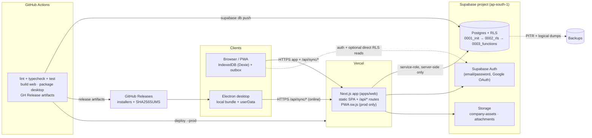

# 37 — Deployment & Release

> Derived from `docs/_CANON.md` (§2, §8, §9, §11, §13, §14, §16, §17). If this doc deviates from CANON, CANON wins.

## 1. Purpose

Define how InvoiceFlow reaches production: the web app on Vercel, the production database on Supabase (migrations, RLS verification, storage, PITR), desktop packaging with electron-builder (Windows NSIS, macOS DMG signed + notarized, Linux AppImage/deb), code signing, semantic versioning and the GitHub Actions release flow, the deployment architecture, rollback strategy, and post-deploy health checks.

## 2. Scope

| In scope | Out of scope |
|---|---|
| Web deploy: Vercel project, env vars, build, headers/CSP, PWA in production | Local development setup (docs/38-ENVIRONMENT.md covers env vars in depth) |
| Database: Supabase migrations 0001→0003, RLS verification, storage buckets, PITR | Dev-cloud (Prisma/SQLite) operation beyond the sandbox (CANON §8) |
| Desktop: electron-builder matrix, code signing overview, auto-update | Store distribution (Microsoft Store / App Store) — not in v1 |
| Release flow: semver, GitHub Actions pipeline, GH Releases artifacts | Subscription metering/billing (extension point, CANON §19.3 → docs/41) |
| Deployment architecture diagram, rollback, health checks | Incident response for third-party outages (runbook-level only) |

## 3. Business requirements

- **BR-1** A release must ship web + desktop + database changes atomically from one semver tag, with reproducible artifacts.
- **BR-2** The production database must enforce row-level security before any user data exists; RLS verification is a release gate, not a post-fix.
- **BR-3** All secrets reach production exclusively through platform secret stores (Vercel encrypted env vars, GitHub Actions secrets); nothing secret is ever bundled into client JS or the Electron package (CANON §16).
- **BR-4** The PWA service worker must never be active in development or preview environments (CANON §17) to avoid stale-cache support incidents.
- **BR-5** Every release artifact (installer) is produced for Windows, macOS and Linux, checksummed (SHA-256), and attached to a GitHub Release.
- **BR-6** Rollback must be a single documented action per tier (Vercel instant rollback; forward-compatible DB migrations; desktop channel revert).
- **BR-7** Post-deploy health is verified via `/api/health` (CANON §14) plus a smoke checklist before announcing the release.

## 4. Technical design

### 4.1 Environments overview

| Tier | Web | Database | Desktop |
|---|---|---|---|
| Development | `next dev` on localhost | Dev-cloud Prisma/SQLite (`DATABASE_URL=file:./db/custom.db`, CANON §8) | `ELECTRON_START_URL=http://localhost:3000` |
| Preview | Vercel preview deployment per PR (SW disabled) | Shared staging Supabase project (separate from prod) | Unsigned CI builds, `artifacts` only |
| Production | Vercel production deployment from `main` / release tag | Production Supabase project (region `ap-south-1`, Mumbai — closest to Indian customers) | Signed + notarized installers on GitHub Releases |

### 4.2 Database → Supabase

**Project setup**

1. Create the Supabase project; region `ap-south-1`; record `NEXT_PUBLIC_SUPABASE_URL`, `NEXT_PUBLIC_SUPABASE_ANON_KEY`, `SUPABASE_SERVICE_ROLE_KEY`, `SUPABASE_JWT_SECRET` into the secret stores (docs/38-ENVIRONMENT.md).
2. Auth providers: email/password + Google OAuth; add redirect URLs (`https://<app-domain>/**`, localhost for dev).
3. Apply migrations **strictly in order** via `supabase db push` (CI job) or linked CLI:

| Order | Migration | Contents (CANON §8) |
|---|---|---|
| 1 | `supabase/migrations/0001_init.sql` | Tables (workspaces → audit_logs, mirroring CANON §7), UUID PKs, FKs to `workspaces(id)`, `updated_at` triggers, soft deletes, unique `[workspace_id+doc_type+fiscal_year]` on `document_sequences` |
| 2 | `supabase/migrations/0002_rls.sql` | `CREATE POLICY` on **every** table using `is_workspace_member(workspace_id)` / `has_role(workspace_id, role[])`; role ladder OWNER > ADMIN > MEMBER > VIEWER (VIEWER read-only; MEMBER cannot delete; ADMIN cannot delete workspace) |
| 3 | `supabase/migrations/0003_functions.sql` | Helper functions (`is_workspace_member`, `has_role`), sequence allocation function (serializable, used by finalize), ChangeLog append trigger |
| 4 | `supabase/seed.sql` | Demo data — **never** applied to production |

**RLS verification (release gate)** — run in CI against the live project after `db push`:

1. `SELECT relname, relrowsecurity FROM pg_class WHERE relname IN (<all tables>)` → every row must show `true`.
2. Anonymous probe with the **anon key**: `SELECT count(*) FROM invoices` → 0 rows (or permission error); any data leak fails the release.
3. Authenticated probe as a workspace member: sees exactly its workspace rows; as a non-member of a second workspace: sees none (test both via `has_role` paths).
4. Role probes: MEMBER attempting `DELETE` on invoices → denied; VIEWER attempting `INSERT` → denied; ADMIN attempting workspace deletion → denied (CANON §8).
5. `FORCE ROW LEVEL SECURITY` confirmed on tables (owner is not exempt where policy requires membership).

**Storage buckets** — create private buckets via dashboard/CLI:
- `company-assets`: logos and signatures; allowed mime `image/png`, `image/jpeg`; max size 1 MB (mirrors client-side rule, CANON §16); path convention `{workspace_id}/company/{filename}`.
- `attachments`: document attachments; path convention `{workspace_id}/{entity}/{filename}` (CANON §8).
- Storage policies mirror table RLS: read/write restricted to workspace members via path-prefix check on `storage.foldername(name)[1] = workspace_id`.

**Backups**: enable **PITR** (point-in-time recovery, 7–28 day window — production uses 14) plus scheduled logical dumps (docs/39-BACKUP-RESTORE.md §4.4).

### 4.3 Web → Vercel

| Setting | Value |
|---|---|
| Framework preset | Next.js (App Router) |
| Root directory | monorepo `apps/web` (sandbox: repo root, CANON §2 mapping) |
| Install command | `pnpm install --frozen-lockfile` |
| Build command | `pnpm turbo run build --filter=web` |
| Output | `.next` (standard Next.js build, standalone if enabled) |
| Node.js version | 22.x |
| Function region | `bom1` (Mumbai) — same region as Supabase project to minimize sync latency |
| Secrets | Vercel encrypted environment variables only (docs/38-ENVIRONMENT.md matrix) |

**Headers / CSP** — applied via `next.config.ts` `headers()` (production + preview):

```
Content-Security-Policy: default-src 'self'; script-src 'self' 'unsafe-inline'; style-src 'self' 'unsafe-inline'; img-src 'self' data: blob: https://*.supabase.co; font-src 'self' data:; connect-src 'self' https://*.supabase.co wss://*.supabase.co; frame-src 'self' blob:; object-src 'none'; base-uri 'self'; form-action 'self'; frame-ancestors 'none'
Strict-Transport-Security: max-age=63072000; includeSubDomains; preload
X-Content-Type-Options: nosniff
Referrer-Policy: strict-origin-when-cross-origin
Permissions-Policy: camera=(), microphone=(), geolocation=()
```

Rationale: `style-src 'unsafe-inline'` and `script-src 'unsafe-inline'` cover Next.js/Tailwind 4 inline bootstrap; `frame-src blob:` serves the in-app PDF preview (object URL in iframe, CANON §13); `connect-src` allow-lists the Supabase endpoints used by the sync/auth transport. The CSP is aligned with the Electron CSP (CANON §16) so behavior is identical across shells.

**PWA in production only**: `public/sw.js` + `manifest.webmanifest` ship with every build, but registration code runs only when `NODE_ENV === 'production'` **and** `NEXT_PUBLIC_ENABLE_PWA !== 'false'` (CANON §17). Preview deployments set `NEXT_PUBLIC_ENABLE_PWA=false` (docs/38 §5) so HMR/preview caching is never poisoned; production gets cache `invoiceflow-v1`, cache-first static assets, network-first `/` navigation with offline fallback, activate-time cleanup of old caches.

### 4.4 Desktop → electron-builder matrix

Config sketch (electron-builder YAML in `apps/desktop`):

```yaml
appId: com.invoiceflow.app
productName: InvoiceFlow
files: [ "dist/**", "package.json" ]
directories: { output: release/${version} }
publish: { provider: github, owner: <org>, repo: invoiceflow }
win:
  target: [{ target: nsis, arch: [x64] }]
  artifactName: InvoiceFlow-Setup-${version}.${ext}
  signingHashAlgorithms: [sha256]
nsis:
  oneClick: false
  allowToChangeInstallationDirectory: true
  createDesktopShortcut: always
mac:
  target: [{ target: dmg, arch: [arm64, x64] }]
  artifactName: InvoiceFlow-${version}-${arch}.${ext}
  category: public.app-category.business
  hardenedRuntime: true
  gatekeeperAssess: false
  entitlements: build/entitlements.mac.plist
  notarize: true
linux:
  target: [AppImage, deb]
  artifactName: InvoiceFlow-${version}.${ext}
  category: Finance
  maintainer: <org>
```

| OS | Target | Signing | Notes |
|---|---|---|---|
| Windows | NSIS installer (`InvoiceFlow-Setup-<version>.exe`) | SHA-256 Authenticode via EV certificate or Azure Trusted Signing (`signtool`) | EV/token-based signing avoids SmartScreen reputation delay |
| macOS | DMG per arch (`arm64`, `x64`) | Developer ID Application certificate, `hardenedRuntime: true`, **notarization** via App Store Connect API key (`notarytool`), stapled ticket | Unsigned builds are dev-only |
| Linux | AppImage + deb | Unsigned (standard practice; note in release notes) | `deb` for apt-based distros, AppImage for the rest |

Renderer reuses the web app verbatim (CANON §19.6): the build embeds the exported Next.js static bundle loaded through the packaged local server/protocol; security flags are fixed in the main process — `contextIsolation: true`, `nodeIntegration: false`, `sandbox: true`, CSP as CANON §16 — and are asserted by the Electron E2E (docs/36 §4.7).

**Auto-update**: `electron-updater` with the GitHub provider consumes the same Releases the CI publishes; staged rollout optional via channel files (`latest.yml`).

### 4.5 Code signing overview

- Certificates live in platform secret stores only: Azure Trusted Signing / EV token (Windows), App Store Connect API key + `APPLE_ID`/`APPLE_APP_SPECIFIC_PASSWORD`/`APPLE_TEAM_ID` secrets (macOS). CI signs; no developer laptop is part of the release path.
- macOS entitlements: JIT for V8, `allow-dyld-environment-variables: false`; network client entitlement only — no raw filesystem access beyond `userData`.
- Version integrity: installers are checksummed (`SHA256SUMS.txt`) at release time; the desktop app verifies update signatures via `electron-updater` before applying.

### 4.6 Versioning & release flow

- **semver** from the root `package.json` (`MAJOR.MINOR.PATCH`); desktop and web always share the same version for a release (single user-visible version, CANON §15 footer shows app version).
- Schema discipline: local Dexie schema versions and Supabase migrations are additive; a PATCH/MINOR release must run against the previous release's schema (docs/16-INDEXEDDB-DATABASE.md upgrade strategy, CANON §7); breaking schema rides a MAJOR.

GitHub Actions release pipeline (`.github/workflows/release.yml`, on tag `v*`):

```yaml
jobs:
  web:
    runs-on: ubuntu-latest
    steps:
      - uses: actions/checkout@v4
      - uses: pnpm/action-setup@v4
        with: { version: 9 }
      - uses: actions/setup-node@v4
        with: { node-version: 22, cache: pnpm }
      - run: pnpm install --frozen-lockfile
      - run: pnpm turbo run lint typecheck test           # release gate (docs/35)
      - run: pnpm turbo run build --filter=web
      - run: npx vercel deploy --prod --token=$VERCEL_TOKEN
        env: { VERCEL_ORG_ID: ${{ secrets.VERCEL_ORG_ID }}, VERCEL_PROJECT_ID: ${{ secrets.VERCEL_PROJECT_ID }} }
  desktop:
    strategy:
      matrix:
        os: [windows-latest, macos-latest, ubuntu-latest]
    runs-on: ${{ matrix.os }}
    steps:
      - uses: actions/checkout@v4
      - uses: pnpm/action-setup@v4
        with: { version: 9 }
      - uses: actions/setup-node@v4
        with: { node-version: 22, cache: pnpm }
      - run: pnpm install --frozen-lockfile
      - run: pnpm turbo run build --filter=web && pnpm --filter desktop package
        env:
          CSC_LINK: ${{ secrets.MAC_CERT_P12 }}            # macos only
          CSC_KEY_PASSWORD: ${{ secrets.MAC_CERT_PASSWORD }}
          APPLE_ID: ${{ secrets.APPLE_ID }}
          APPLE_APP_SPECIFIC_PASSWORD: ${{ secrets.APPLE_APP_SPECIFIC_PASSWORD }}
          APPLE_TEAM_ID: ${{ secrets.APPLE_TEAM_ID }}
          AZURE_SIGNING_*: ${{ secrets.AZURE_SIGNING_* }}   # windows signing
      - uses: actions/upload-artifact@v4
        with: { name: desktop-${{ matrix.os }}, path: apps/desktop/release/** }
  release:
    needs: [web, desktop]
    runs-on: ubuntu-latest
    steps:
      - uses: actions/download-artifact@v4
      - run: shasum -a 256 desktop-*/* > SHA256SUMS.txt
      - uses: softprops/action-gh-release@v2
        with:
          generate_release_notes: true
          files: |
            desktop-windows-latest/InvoiceFlow-Setup-*.exe
            desktop-macos-latest/InvoiceFlow-*.dmg
            desktop-ubuntu-latest/InvoiceFlow-*.AppImage
            desktop-ubuntu-latest/invoiceflow_*.deb
            SHA256SUMS.txt
```

### 4.7 Deployment architecture



The sync endpoints are provider-agnostic (CANON §9): clients talk to `/api/*` on Vercel; the server applies mutations to Supabase Postgres with service-role privileges **after** membership/role checks (RLS remains the second line of defense), appends ChangeLog rows for pulls, and never exposes service keys to any client (CANON §16).

### 4.8 Rollback strategy

| Tier | Action | Guardrails |
|---|---|---|
| Web | Vercel dashboard → Deployments → **Instant Rollback** to previous production deployment | New `/api` code is stateless; rollback is seconds, no data impact |
| Database | **Forward-only** migrations (0001→0003 never rewritten); rollback = redeploy previous app version, which must be compatible (§4.6 schema discipline) | Data-repair (never destructive) via new migration; PITR restore only for corruption (docs/39 §6) |
| Desktop | Re-publish previous tag artifacts to the GitHub Release channel → `electron-updater` serves the older version | Users on auto-update return to the previous version; checksums re-verified |
| Config | Revert env var changes in Vercel/Supabase dashboards (audit-logged) | Feature flags (`NEXT_PUBLIC_ENABLE_*`, docs/38) allow disabling new surfaces without a rollback |

Post-release hotfix flow: branch from the release tag → `vX.Y.Z+1` patch tag → same pipeline.

### 4.9 Health checks post-deploy

1. `GET /api/health` → `200 { ok: true, time, version }`; `version` matches the release tag (CANON §14).
2. Smoke checklist (5 minutes, scripted in CI where possible):
   - Login with a staging account; sync pill reaches **Synced**.
   - Create + finalize an invoice in the browser; number allocated; PDF preview renders.
   - `context.setOffline` create → online drain on staging (docs/36 §4.4, abbreviated).
   - RLS anonymous probe returns zero rows (§4.2 step 2).
   - PWA: manifest served, SW registered on the production origin only.
3. Watch Vercel Analytics + Speed Insights for 24 h: error rate, p95 TTFB, web vitals against docs/40-PERFORMANCE.md budgets.
4. Announcement (changelog) only after 1–3 pass.

## 5. Data models / API contracts

- Deployed API surface is exactly CANON §14 (health, auth register/login/logout/session/account, workspace claim, sync push/pull); no endpoint ships without its docs/30-API-DESIGN.md contract and error codes `{ error, code? }`.
- `/api/sync/push` responses (`applied|duplicate|conflict|rejected|number_reassigned`) and `/api/sync/pull` cursor pagination (`limit ≤ 500`, `next_cursor`) are release-gated by the contract tests of docs/35 §4.4.
- Desktop and web must agree on `schema_version: 1` (CANON §9); a mismatch stops syncing with an upgrade notice (HTTP 409 `{code:'schema_version'}`).

## 6. Offline behavior

- Web production registers the service worker (cache-first static, network-first navigation, `invoiceflow-v1`, activate-time cleanup — CANON §17); offline behavior is specified in docs/36.
- Desktop installs run fully offline (CRUD + PDF); updates require connectivity but never block launch.
- Preview/dev tiers never register the SW, so rollback of the web tier cannot strand users on stale shells.

## 7. Online behavior

- CI/CD is the only path to production: tag → lint/typecheck/test → build/deploy web → package desktop (3-OS matrix) → GitHub Release with checksums (§4.6).
- Supabase migrations run in CI before web deploy of the same release; deployment ordering is **database first, app second** (additive migrations make old+new app versions safe).

## 8. Security considerations

- Secrets: only Vercel encrypted env vars, Supabase dashboard, and GitHub Actions secrets; `SUPABASE_SERVICE_ROLE_KEY` exists **only** in server-side Vercel env and CI (warning box in docs/38-ENVIRONMENT.md); Electron packages contain no secrets — the renderer reuses the public web bundle (CANON §16/§19.6).
- Transport: HTTPS enforced, HSTS preload (§4.3); Supabase storage URLs are signed and private-bucket only.
- Supply chain: `pnpm audit --audit-level=high` gate in CI, lockfile-frozen installs, signed commits recommended; desktop auto-updates verify signatures before apply (§4.5).
- Rate limiting (10 req/min/IP on auth, CANON §11) and 429 semantics are production requirements verified by the smoke suite.

## 9. Error-handling rules

- A failed CI gate blocks the release — no manual artifact uploads, no `--force` deploys.
- Migration failure mid-`db push`: Supabase applies statements transactionally per migration file; a failed migration is fixed forward (new migration), never by editing applied files.
- Deploy health failure (§4.9 step 1–2) triggers automatic rollback to the previous Vercel deployment and a failed-release notification; the desktop tier is unaffected because it depends only on `/api/*` availability.
- All deploy-time errors surface with the CANON §14 error contract (`{ error, code? }`), including 429 rate-limits and 409 schema-version mismatches.

## 10. Acceptance criteria

1. A single tag `vX.Y.Z` produces: production Vercel deployment, applied migrations 0001→0003 with passing RLS probes, and a GitHub Release containing Windows NSIS, macOS DMG (signed + notarized), Linux AppImage/deb and `SHA256SUMS.txt`.
2. `/api/health` reports the released version and the smoke checklist (§4.9) passes on production.
3. CSP/HSTS headers are present on production responses; the Electron E2E reports zero CSP violations (docs/36 §4.7).
4. The service worker is registered on production only — verifiably absent on preview deployments.
5. Rollback drill (staging): instant Vercel rollback restores the previous version in < 2 minutes with `/api/health` green.
6. No secret value appears in any client bundle or installer (build-log scan + `NEXT_PUBLIC_` prefix audit — docs/38 §6).

## 11. References

CANON §2 (monorepo mapping), §7 (Dexie schema/versions), §8 (Supabase schema/RLS/buckets), §9 (sync contract), §11 (auth), §13 (PDF), §14 (API surface), §16 (security), §17 (PWA), §19.6 (Electron scaffold); docs/38-ENVIRONMENT.md; docs/39-BACKUP-RESTORE.md; docs/40-PERFORMANCE.md; docs/35-TESTING.md; docs/36-OFFLINE-TESTING.md; docs/29-SECURITY.md; docs/30-API-DESIGN.md.
