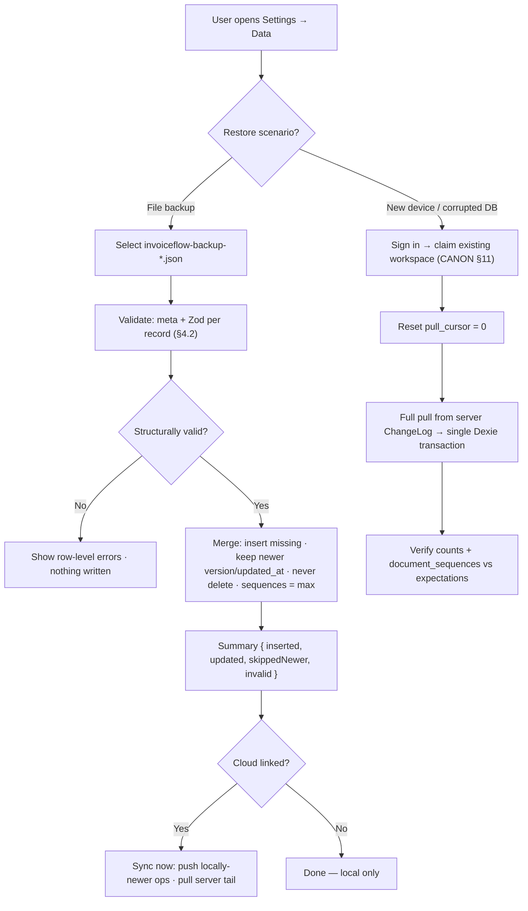

# 39 — Backup & Restore

> Derived from `docs/_CANON.md` (§3, §7, §8, §11, §15, §17, §19.8). If this doc deviates from CANON, CANON wins.

## 1. Purpose

Define every mechanism that protects InvoiceFlow user data and every path that recovers it: local JSON full-database export/import (with exact schema and merge policy), scheduled backup reminders, cloud protections (Supabase PITR + logical backups), desktop `userData` backup pointers, the restore flow, and a disaster-recovery runbook for a corrupted local database.

## 2. Scope

| In scope | Out of scope |
|---|---|
| JSON full-database export/import from Settings → Data (CANON §15) | Document-level PDF archives (user-side convenience, not a restore source) |
| Import validation, merge policy (keep newer, never auto-delete) | Conflict-resolution UI flows (docs/18-CONFLICT-RESOLUTION.md) |
| Scheduled backup reminders in-app | Supabase project provisioning (docs/37-DEPLOYMENT.md) |
| Cloud: Supabase PITR + scheduled logical dumps | Third-party billing/account recovery (email-provider reset flows) |
| Desktop `userData` folder backup pointer + restore flow diagram | Encrypted-at-rest key management (Supabase platform responsibility) |

## 3. Business requirements

- **BR-1** A user must be able to export **everything** (all 17 CANON §7 tables, current workspace) as a single portable JSON file at any time, online or offline.
- **BR-2** An import must never destroy newer data: the merge policy is *keep the newer version per record* and **never auto-delete** records absent from the file (browser storage eviction is a documented platform risk, CANON §19.8 — the backup must be the antidote, not another hazard).
- **BR-3** The app must proactively remind users to back up (scheduled reminder) because most InvoiceFlow data lives only on-device for guest users.
- **BR-4** Cloud-hosted data must survive project-level incidents: PITR plus independent logical backups (docs/37 §4.2).
- **BR-5** Recovery from a corrupted local DB must follow a written runbook with a verified end state (counts, sequences, totals), not improvisation.
- **BR-6** Backups contain financial data: export files are user-initiated downloads; no server ever stores them; cloud dumps are encrypted at rest in storage outside the production project.

## 4. Technical design

### 4.1 Local export (JSON full database)

Trigger: Settings → Data → **Export JSON backup** (CANON §15). Implementation: single Dexie read transaction across all tables → build document → `Blob` download.

- Filename: `invoiceflow-backup-YYYYMMDD-HHmmss.json` (device-local time).
- Scope: the **active workspace** plus global tables (`app_settings`); `sync_operations` rows are exported with status preserved so a restore can resume a drain honestly.
- Works fully offline (no network dependency — CANON golden rule).
- Large-attachment caveat: `attachments.data` inline blobs are included; the UI warns when the estimated export exceeds ~50 MB.

**File schema (canonical):**

```json
{
  "meta": {
    "app": "invoiceflow",
    "version": 1,
    "exported_at": "2025-06-01T10:30:00.000Z",
    "device_id": "3f2c9a1e-…-uuid"
  },
  "tables": {
    "workspaces":          [ /* CANON §7 records incl. settings_json */ ],
    "workspace_members":   [ /* role: OWNER|ADMIN|MEMBER|VIEWER */ ],
    "company_profiles":    [ /* incl. logo_data / signature_data dataURLs */ ],
    "customers":           [ /* + metadata: id, workspace_id, created_at, updated_at, deleted_at, version, sync_state, origin_device_id (CANON §3) */ ],
    "products":            [ ],
    "quotations":          [ ],
    "quotation_items":     [ ],
    "invoices":            [ ],
    "invoice_items":       [ ],
    "payments":            [ ],
    "tax_rates":           [ ],
    "document_sequences":  [ /* doc_type, fiscal_year, next_seq — critical against number reuse (CANON §6) */ ],
    "attachments":         [ /* inline data for MVP (CANON §7) */ ],
    "audit_logs":          [ ],
    "sync_operations":     [ /* outbox snapshot incl. status/attempts */ ],
    "sync_metadata":       [ /* push_cursor?, pull_cursor, last_sync_at */ ],
    "app_settings":        [ /* key/value incl. active_workspace_id, device_id, theme */ ]
  }
}
```

`meta.version` is the **export-format version** (currently `1`); importers accept `version ≤ 1` and reject newer formats with an upgrade message. Optional diagnostic fields (workspace id, per-table row counts) may accompany `meta` but consumers must not require them.

### 4.2 Local import (validation + merge policy)

Trigger: Settings → Data → **Import JSON backup** → file picker → validation → confirmation dialog showing the summary → apply → report.

**Validation pipeline (all-or-nothing on structural errors):**

1. Parse JSON; reject if unparseable or > local storage headroom with a clear message.
2. `meta.app === 'invoiceflow'` and `meta.version` supported (`≤ 1`).
3. Unknown `tables` keys → warning, skipped (forward compatibility).
4. Every record validated against the shared Zod schemas (`src/lib/domain/schemas.ts`, CANON §9) plus CANON §3 metadata invariants (UUIDv4 `id`, ISO timestamps, `YYYY-MM-DD` financial dates, integer money fields ending `_paise`, `_bps` rates, `_milli` quantities).
5. Rows failing validation → import aborts with a row-level error list (`table[index]: <issue>`); nothing is written.

**Merge policy (per record, keyed by `id`):**

| Local state vs file record | Action |
|---|---|
| Absent locally | Insert as-is |
| Present, file `version > local.version` | Overwrite local with file record |
| Present, file `version < local.version` | **Keep local** (local is newer) |
| Equal `version` | Keep the record with the newer `updated_at`; identical `updated_at` → keep local |
| Soft-deleted in either source | Deletion state follows the winning record (`deleted_at` is just a field — never a hard delete) |
| `document_sequences` | Special: `next_seq` becomes **max(local, file)** per `(doc_type, fiscal_year)` — document numbers must never repeat (CANON §6: sequences never decrement) |
| `app_settings` | Key-level same rule; `device_id` of the **current** device always wins (identity is per-install, CANON §3) |

**Never auto-delete:** records that exist locally but are absent from the file are untouched. Import is additive/refreshing only.

**Post-import:** summary toast `{ inserted, updated, skippedNewer, invalid }`; live queries re-render; if cloud-linked, the sync engine runs (post-mutation trigger, CANON §9) pushing records that are now locally newer — the server's CAS/ChangeLog logic reconciles the rest.

### 4.3 Scheduled backup reminder

- `app_settings['last_backup_at']` records the last successful export (device-local).
- Settings → Data shows **"Last export: <date> · N changes since"** (N = local mutations since that timestamp, from `audit_logs` count).
- Reminder policy: if ≥ 7 days have passed **and** ≥ 1 change exists, show a dismissible banner on the dashboard and a toast on app focus: *"Back up your data — your last export was N days ago."* Dismissal snoozes 7 days (recorded in `app_settings['backup_reminder_snoozed_until']`).
- Desktop additionally shows the `userData` pointer (§4.5) in the same card.
- Guest (non-cloud-linked) users see the reminder more prominently: the offline-first model makes their local DB the only copy (CANON §19.8).

### 4.4 Cloud backups (Supabase)

| Mechanism | Configuration | Restore path |
|---|---|---|
| **PITR** (point-in-time recovery) | Enabled on the production project, 14-day window (docs/37 §4.2) | Supabase dashboard restore to a new project at any second in the window; repoint app secrets (docs/38 matrix) |
| **Logical backups** | Scheduled GitHub Action (nightly 02:30 IST): `supabase db dump` (role + data) → encrypted (age/OpenSSL) → uploaded to separate object storage (different provider/account than Supabase) | Decrypt → `psql` restore into a fresh project → run 0001→0003 idempotency check → verify |
| **Retention** | 30 nightly + 12 monthly logical dumps; PITR window per plan | Restore drill quarterly (§7 runbook step 6) |
| **Access** | Dump storage bucket private, separate credentials from production; key held in CI secrets | Two-person rule for production restores |

ChangeLog completeness (CANON §8) is what makes a fresh-client rebuild possible: a new device that signs in, claims its existing workspace and resets `pull_cursor = 0` receives every record server-side (full history payload, not just diffs).

### 4.5 Desktop backups (Electron `userData` pointer)

- All desktop data (Chromium profile incl. IndexedDB) lives under `app.getPath('userData')` — typically `%APPDATA%\invoiceflow` (Windows), `~/Library/Application Support/invoiceflow` (macOS), `~/.config/invoiceflow` (Linux).
- Settings → Data (desktop only) displays the resolved absolute path with a "Reveal folder" button — the **pointer** users need for image-level backups.
- Documented practice: quit the app, copy the `userData` folder (cold copy avoids LevelDB corruption). The **primary** desktop backup remains the JSON export (portable, versioned, cross-device); the folder copy is a like-for-like same-machine safety net.

### 4.6 Restore flow



## 5. Data models / API contracts

- Export/import operate exclusively on CANON §7 table shapes with §3 metadata; no new server endpoints are introduced (backup is client-side for local data; cloud backups are platform/ops mechanisms).
- The export file is a **contract**: `meta.{app,version,exported_at,device_id}` + `tables` map; future format changes bump `meta.version` with a documented migration (importers stay backward-compatible for at least one major).
- `document_sequences.next_seq` monotonicity (CANON §6) is the one place import may *increase* a value and never decrease it.

## 6. Offline behavior

- Export and import are fully offline operations (Dexie transactions only) — backup must not depend on the very infrastructure that failed.
- The reminder timer is local (last-export timestamp), not server-driven.
- Imported records keep their `sync_state`; locally-newer records re-enter the outbox only through the normal sync engine (never a synthetic bulk-op bypass), preserving CANON §9 semantics.

## 7. Online behavior

- After an import on a cloud-linked workspace, one sync run reconciles both directions (push local-newer, pull server-newer) inside the standard engine rules — CAS conflicts surface in the existing conflicts UI (CANON §10), never silently merged.
- Cloud restore drill (quarterly): restore latest logical dump into a staging project → point a staging web deployment at it → run the E2E smoke suite (docs/37 §4.9) → record the drill in the ops log.

### Disaster-recovery runbook (corrupted local DB)

**Symptoms:** Dexie open failure / `VersionError` / IndexedDB corruption on boot; app stuck on loading; specific tables unreadable.

1. **Stop.** Do **not** click "Clear local data" (Settings → Data) — it destroys the only copy for guest users.
2. **Try export** from a working context/device of the same profile — if any export succeeds, it becomes the recovery source (§4.2 import into the fresh DB).
3. **Recover sources in priority order:**
   a. Newest `invoiceflow-backup-*.json` (user-managed, §4.1).
   b. Desktop cold copy of `userData` (§4.5) on the same machine.
   c. Cloud copy: sign in → claim the existing workspace → `pull_cursor = 0` full pull (§4.6 right branch; requires the workspace to have been cloud-linked — guests have no cloud copy, which is exactly what BR-3 reminders mitigate).
4. **Fresh start:** clear the corrupted browser profile (or new device) → launch app → import backup (a/b) or cloud-rebuild (c).
5. **Verify (hard gate, §10):** customer/product/invoice/quotation/payment counts vs backup meta or last-known counts; `document_sequences.next_seq > max(finalized number)` per fiscal year; one sample invoice's totals recomputed by the domain engine match its stored snapshot; outbox contains no `in_flight` zombies (reset to `pending`).
6. **Record:** log the incident + drill in the ops log; if corruption came from a DB upgrade bug, file it against docs/16-INDEXEDDB-DATABASE.md migration strategy.

## 8. Security considerations

- Export files contain full financial and PII data (customer GSTINs, bank details): they are generated client-side, downloaded to the user's disk, and never transit the server; the UI warns users to store them securely.
- Cloud logical dumps are encrypted before leaving CI; storage credentials are separate from production; restores require operator auth (two-person rule, §4.4).
- Import validation doubles as a security boundary: Zod schema enforcement means a malicious backup file cannot inject oversized payloads, wrong-typed money fields, or cross-workspace ids (workspace-scoped records keep their `workspace_id`; import refuses records whose `workspace_id` matches no local workspace).
- Audit trail: import/export actions append `audit_logs` rows (`action: 'CREATE'` class with `detail_json: { backup: 'export'|'import', counts }`, CANON §7) — accountability without storing file contents server-side.

## 9. Error-handling rules

- Validation failures abort the entire import (no partial writes) and list per-row errors with table + index.
- Version-too-new files (`meta.version > supported`) are rejected with "This backup was created by a newer InvoiceFlow version — update the app."
- Import onto a cloud-linked workspace that produces CAS conflicts does **not** fail the import: conflicts surface through the normal sync conflict flow (CANON §9/§10).
- Export failure (quota exceeded, huge attachments) reports the blocking table and suggests exporting with attachments excluded (documented fallback), never a silent truncation.
- The reminder engine must never block UI: it renders after hydration and fails open (no reminder) if `app_settings` is unreadable.

## 10. Acceptance criteria

1. Export produces the exact §4.1 schema with all 17 CANON §7 tables and downloads offline in < 5 s for a 10k-record workspace.
2. Re-importing an export into an empty DB reproduces the workspace bit-for-bit (ids, versions, sequences, totals) — verified by an automated round-trip test.
3. Merging an older backup into a newer DB changes nothing (all `skippedNewer`); merging a newer backup fills gaps and upgrades stale records without deleting anything (BR-2).
4. `document_sequences` merge enforces `max(local, file)` — no invoice number can repeat after any import sequence (CANON §6).
5. Reminder fires at the 7-day/≥1-change threshold, snoozes correctly, and never appears for a brand-new empty workspace.
6. The DR runbook (§7) has been executed once on staging: corrupted-profile simulation → recovery → verification gate passed, in < 30 minutes.
7. Cloud drill: PITR/logical restore into staging passes the docs/37 §4.9 smoke suite.

## 11. References

CANON §3 (metadata conventions), §6 (numbering monotonicity), §7 (tables + `app_settings`), §8 (Supabase/ChangeLog), §9 (sync engine), §10 (conflicts), §11 (claim/guest model), §15 (Settings → Data), §17 (offline/desktop), §19.8 (eviction risk & JSON backup rationale); docs/37-DEPLOYMENT.md (PITR, migrations); docs/16-INDEXEDDB-DATABASE.md; docs/18-CONFLICT-RESOLUTION.md; docs/38-ENVIRONMENT.md.
