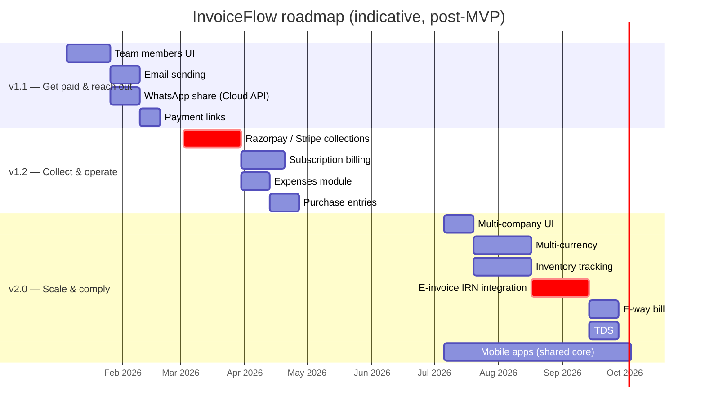

# 41 — Future Roadmap

> Derived from `docs/_CANON.md` (§7, §8, §9, §11, §12, §18, §19.3, §19.7). If this doc deviates from CANON, CANON wins.

## 1. Purpose

Lay out the prioritized post-MVP evolution of InvoiceFlow — v1.1, v1.2 and v2.0 — with per-item rationale, high-level design pointers into the extension-point doc set (docs/24–28), effort estimates (S/M/L), and explicit alignment with the extension points CANON §19.3 declares. This is a planning document: **none of it is implemented in MVP** (CANON §19.3) and nothing here may contradict the canonical architecture.

## 2. Scope

| In scope | Out of scope |
|---|---|
| v1.1: team members UI, email sending, WhatsApp share (Cloud API), payment links | Anything committed for MVP (Phases 0–6, CANON §18) |
| v1.2: Razorpay/Stripe collections, subscription billing, expenses module, purchase entries | Legal/tax advice; e-invoice compliance guarantees (integration note only, §5.3) |
| v2.0: multi-company UI, inventory tracking, e-invoice IRN, e-way bill, TDS, multi-currency, mobile apps | Detailed per-feature specs (each item gets a full doc when it enters its milestone) |
| Milestone timeline (gantt) and capacity assumptions | Pricing strategy / GTM |

**Extension-point doc set convention:** the high-level integration designs referenced throughout live in docs/24–28 (final titles per the docs index):

- **docs/24-WHATSAPP-SHARING.md** — WhatsApp share extension (wa.me tier, Cloud API, share outbox)
- **docs/25-EMAIL.md** — email sending extension (Edge-Function pipeline, templates, email_log, outbox integration)
- **docs/26-SUBSCRIPTION.md** — subscription billing & plan gating (plans, entitlements, trials)
- **docs/27-PAYMENT-INTEGRATION.md** — payments extension (gateway collections, UPI links, refunds; manual recording implemented in MVP)
- **docs/28** — multi-company, multi-currency & inventory design slot (finalized by its owning doc agent)

## 3. Business requirements

- **BR-1** Every roadmap item must build on an existing CANON extension point — no architecture rewrites: the sync protocol (§9), domain engine (§4), entity metadata (§3), and offline-first golden rule hold for all future work.
- **BR-2** Priorities must follow user value density for Indian SMBs: get paid faster (v1.1) → collect & operate end-to-end (v1.2) → run multiple businesses / statutory-grade workflows (v2.0).
- **BR-3** Each item carries: rationale, design pointer, effort (S < 1 wk, M 1–3 wk, L > 3 wk of focused eng), and an explicit CANON anchor so implementation agents can start from the spec, not from archaeology.
- **BR-4** Offline-first is non-negotiable: integrations that require connectivity (email/WhatsApp/gateways) **queue locally and reconcile online**; nothing in this roadmap may introduce a hard online dependency into core CRUD (CANON golden rule, §19.3).
- **BR-5** Server-side recomputation, RLS/membership checks, and audit logging extend to every new entity and webhook surface (CANON §9/§16).
- **BR-6** MVP assumptions may only be relaxed where CANON names the seam: INR-only (§19.1), manual payments (§19.3), owner-only team workflows (§19.7).

## 4. Technical design

### 4.1 Prioritization model

Scored on: user value (payment velocity, retention), architectural readiness (schema/protocol seams already in place), and risk (regulatory, third-party dependency). The result is three milestones; items inside a milestone are ordered by dependency, then value.

Dates are indicative planning anchors (quarter-level accuracy), not commitments; durations reflect the effort classes below at one focused engineer per track.

### 4.2 v1.1 — Get paid & reach out (target: 1 quarter post-MVP)

| # | Item | Effort | Rationale | Design pointer | CANON anchor |
|---|---|---|---|---|---|
| 1.1.1 | **Team members UI** | M | Roles/schema are ready but unused in UI (CANON §19.7): owners need to add teammates, assign OWNER/ADMIN/MEMBER/VIEWER, and see per-device sync activity. Unlocks real multi-user value already promised by the data model. | Server membership + roles exist (CANON §8 `has_role`, role ladder); UI extends Settings → Team; invites flow through the auth adapter (CANON §11); conflict rules unchanged (§10). | §7 `workspace_members`, §8, §19.7 |
| 1.1.2 | **Email sending** | M | The #1 delivery ask: send the PDF invoice/quotation to the customer from the app. | Server-side transactional provider behind the notifications adapter (docs/25): client enqueues a `send_email` intent (entity `attachment` + document id), server renders/sends via stored PDF or regenerates from the UnifiedDocumentModel (CANON §13); delivery status syncs back as a read-only record; **offline: intent queues in the outbox and sends on reconnect**. | §13 (PDF artifact), §9 (queue/ops pattern), §19.3 (extension point) |
| 1.1.3 | **WhatsApp share via Cloud API** | M | Indian SMBs live on WhatsApp; template-based share with PDF link is the fastest adoption lever. | WhatsApp Cloud API adapter (docs/24): pre-approved template + document PDF delivered as a link (hosted attachment via storage bucket, CANON §8 path convention) — no chat inbox in v1.1; opt-in phone verification; rate/quality limits handled server-side; queued offline like email. | §8 (storage), §19.3, docs/24 |
| 1.1.4 | **Payment links** | S/M | Close the loop from invoice → payment without a full gateway: generate a UPI intent / PSP-hosted link, embed on the PDF and share. | Payments extension seam (docs/27): link record attached to an invoice, `payments` rows still created manually or via reconciliation webhook when the PSP notifies; `paid_total` recomputation stays server-authoritative (CANON §9 rule). Gateway-agnostic: UPI deep link first (zero integration cost), PSP links behind the same interface. | §7 `payments`, §9, §19.3, docs/27 |

**v1.1 outcome:** faster payment cycles and multi-user trust, using only existing seams — no schema migration beyond additive fields (e.g., delivery-status records), no protocol change.

### 4.3 v1.2 — Collect & operate (target: 2 quarters post-MVP)

| # | Item | Effort | Rationale | Design pointer | CANON anchor |
|---|---|---|---|---|---|
| 1.2.1 | **Razorpay / Stripe collections** | L | Auto-reconcile incoming money: customers pay by UPI/card/netbanking; payments land without manual entry. | Full gateway integration (docs/27): hosted checkout + webhooks → server creates `payments` (idempotent by provider event id — the `ProcessedOp` idempotency pattern, CANON §9), recomputes invoice status (§12), appends ChangeLog so all devices pull the payment; offline-recorded cash payments reconcile against gateway settlements with audit logs. Razorpay first (India-first), Stripe for international invoicing follow-on. | §7 `payments`, §9 (idempotency/ChangeLog), §12, §19.3 |
| 1.2.2 | **Subscription billing** | L | SaaS monetization: plans, trials, seat limits (ties into 1.1.1 team members), feature gating by plan. | Billing extension (docs/26): plan/entitlement model as server-side policy layer + client feature flags (extends docs/38 flag mechanism); Stripe Billing (or Razorpay Subscriptions for INR) as the metering backend; grace/dunning states surfaced in Settings; **core invoicing never degrades below read/export access** (data safety, CANON §19.8). | §11 (accounts), §19.3, docs/26 |
| 1.2.3 | **Expenses module** | M | SMBs want one place for money in/out; expenses feed GST summaries (input credit view) and profitability. | Expense entities mirror the document pattern (docs/28 design slot): `expenses` + `expense_categories` with CANON §3 metadata, soft deletes, outbox sync, receipts as attachments (CANON §7); Reports gains Expenses/Profit-Loss tabs (extends CANON §15 Reports); GST summary extended with an input-credit section — reported as informational, not certified (§19.2). | §3, §7 `attachments`, §15, §19.2/§19.3, docs/28 |
| 1.2.4 | **Purchase entries** | M | Record purchases from suppliers to complete the cash cycle and stock foundation for v2.0 inventory. | `suppliers` + `purchases(+items)` mirroring the invoice/quotation model (docs/28 design slot): same numbering seam (`document_sequences` with `doc_type='PURCHASE'`, CANON §6), same totals engine (§4), no customer-side lifecycle; feeds inventory deltas and expense-like reporting. | §6 (numbering), §4 (totals), §7, docs/28 |

**v1.2 outcome:** end-to-end money operations (collect automatically, track outgo) with all new entities flowing through the unchanged sync protocol.

### 4.4 v2.0 — Scale & comply (target: 12+ months horizon)

| # | Item | Effort | Rationale | Design pointer | CANON anchor |
|---|---|---|---|---|---|
| 2.0.1 | **Multi-company UI** | M | The schema already supports many `company_profiles` per workspace (CANON §7: "1 per workspace in MVP; schema supports many") — owners with multiple businesses need a switcher, per-company numbering/prefixes and per-company PDF identity. | Company switcher + scoped queries by `company_profile_id` (docs/28); per-company sequences stay inside `document_sequences` (keyed by workspace — extended additively with a company discriminator); PDF header/branding already driven by `company_profiles`. | §7 `company_profiles`, §6, §13, docs/28 |
| 2.0.2 | **Multi-currency** | L | International customers require non-INR documents; CANON §19.1 marks INR-only as an MVP assumption with a named seam. | Per-document `currency` + FX-rate snapshot at issue time (docs/28); the money engine stays integer-minor-unit — `computeDocumentTotals` gains a currency-scaled layer with the same half-up rules (§4); reporting consolidates to INR via stored rate snapshots (deterministic, auditable); GST sections render only for INR/domestic documents. | §4, §19.1, docs/28 |
| 2.0.3 | **Inventory tracking** | L | Products with stock levels (from purchases + invoices) prevent overselling and enable valuation reports. | Inventory ledger built on movement events derived from invoice/purchase line items (docs/28): `stock_movements` (additive table, CANON §7 pattern) with per-product running balance recomputed server-side; low-stock thresholds surface as badges; PDF line items may show HSN + stock snapshot. | §7 `products`/`hsn_sac`, §9, docs/28 |
| 2.0.4 | **E-invoice (IRN) generation** | L | Statutory e-invoicing (IRN via IRP/GSP) is mandatory above turnover thresholds; integration is the top compliance ask for larger SMBs. **Integration note:** requires an IRP/GSP contract, auth tokens, and government schema conformance — InvoiceFlow generates the IRN request payload from the finalized document (immutable, CANON §12 — ideal precondition) and stores the IRN/QR as document fields; failures are retryable ops, not blocking states. No compliance claim beyond faithful payload generation (§19.2). | Adapter per docs/28; IRN request/response as server-side ops with idempotent registration (one IRN per document, ever); QR payload embedded into the PDF renderer (§13). | §12 (immutability), §13, §19.2, docs/28 |
| 2.0.5 | **E-way bill** | M | Movement of goods > threshold needs e-way bills; usually requested together with e-invoice. | Part of the same compliance adapter family (docs/28): e-way bill request from invoice transport details; stored alongside the document; valid/invalid states sync like any record. | §12, §13, docs/28 |
| 2.0.6 | **TDS** | M | B2B services often carry TDS deductions; invoices must show TDS and receivables must net it. | TDS as a document-level deduction field family (rate + section) computed in the totals engine **after** GST (deterministic order extension of §4), with a TDS receivables report; payment reconciliation nets TDS (docs/27 payments view). | §4, §7 `payments`, §15, docs/27+28 |
| 2.0.7 | **Mobile apps via the same core** | L | SMB owners are mobile-first; a companion app multiplies touchpoints without a second business logic base. | The monorepo packages (`packages/domain`, `packages/local-db`, sync engine) are platform-neutral TypeScript (CANON §2): mobile shells (React Native/Expo) reuse domain + a native SQLite/IndexedDB adapter implementing the same repository interfaces and the unchanged §9 sync protocol; PDF reuses the renderer via webview or a port; offline-first behavior identical (docs/36 scenarios apply verbatim). | §2 (package boundaries), §9 (protocol), §17, docs/28 |

**v2.0 outcome:** multi-business scale, statutory workflows, and platform reach — all riding the same domain core and sync protocol established by CANON.

### 4.5 Alignment with CANON §19.3 extension points

CANON §19.3 states: *"MVP payments = manual recording (no gateway). Razorpay/Stripe/WhatsApp/email/subscription are designed extension points (docs 24-28), not implemented."* Mapping of every roadmap item onto the declared seams:

| Extension point (CANON §19.3) | Roadmap items consuming it | Status in MVP |
|---|---|---|
| Payments gateways (Razorpay/Stripe) | 1.1.4 payment links, 1.2.1 collections | Not implemented — manual payments only |
| WhatsApp share | 1.1.3 WhatsApp Cloud API share | Not implemented |
| Email | 1.1.2 email sending | Not implemented |
| Subscription | 1.2.2 subscription billing | Not implemented |
| Docs 24–28 design slots | v1.1–v2.0 integration designs (table above) | Design docs only |

Items *not* covered by §19.3 (team members UI, expenses, purchases, multi-company, inventory, e-invoice/e-way/TDS, multi-currency, mobile) are enabled by other CANON seams (§19.7 team schema readiness, §19.1 currency assumption, §7 schema headroom, §2 package boundaries) — each listed explicitly in §4.2–§4.4. Nothing in this roadmap requires breaking CANON §3/§4/§9 invariants: money stays integer paise (or a documented currency-scaled integer layer), sync stays outbox+ChangeLog, conflicts stay user-resolved (§10).

## 5. Data models / API contracts

- All new entities adopt CANON §3 metadata wholesale (`id` UUIDv4, `workspace_id`, timestamps, `version`, `sync_state`, `origin_device_id`, soft delete) and travel through the unchanged §9 push/pull contract with `entity` enum extended additively (`expense`, `purchase`, `stock_movement`, …) — a schema-version bump per CANON §9 rule (409 `schema_version` handling already specified).
- New server surfaces (webhooks, IRP callbacks) are idempotent by provider-event id using the `ProcessedOp` mechanism (CANON §9) and append ChangeLog rows like every other mutation (CANON §8).
- Feature gating (1.2.2) extends the docs/38 flag mechanism; entitlement checks happen server-side (membership/plan) and are mirrored client-side only for UX — the server remains authoritative (CANON §9 rule 7 spirit).

## 6. Offline behavior

- BR-4 governs every item: emails/WhatsApp/payment intents queue locally and send on reconnect; gateway webhooks only ever create server-side records that devices **pull**; expenses/purchases/multi-company/inventory are fully local CRUD exactly like invoices.
- IRN/e-way generation requires connectivity (government infrastructure) by nature — the design queues the request as a retryable op and surfaces clear pending/failed states; document immutability (§12) means the local workflow is unaffected while offline.
- Mobile apps (2.0.7) inherit the entire offline contract of docs/36 because they reuse the same engine.

## 7. Online behavior

- New integrations add server-to-server calls (PSP, email, WhatsApp, IRP) executed **only** on the server; clients interact through the same `/api` pattern (CANON §14) extended with resource endpoints as each feature ships.
- Subscription metering (1.2.2) is checked at session/sync time; plan changes propagate through normal sync (no separate push channel).

## 8. Security considerations

- Gateway/IRP/WhatsApp credentials are server-only secrets under the docs/38 §4.2 regime; clients never see provider tokens (CANON §16).
- Webhook endpoints verify provider signatures before any state change; replay protection via event-id idempotency (§5).
- New entities inherit RLS policies at creation time (docs/37 migration discipline: every new table ships with its policies in the same migration, CANON §8).
- WhatsApp/email surfaces must not leak customer PII into logs; delivery metadata is the only persisted trace beyond the document itself.

## 9. Error-handling rules

- Third-party failures (PSP, email, WhatsApp, IRP) are recorded on the queued op (`attempts`, `last_error`, `next_attempt_at`) with the existing backoff ladder — no new retry framework (CANON §9).
- Provider rejections map to user-visible states (failed op with reason, retry after edit) — never silent drops, matching CANON §9's `rejected` philosophy.
- Partial multi-record operations (e.g., IRN registration + PDF regeneration) are sequenced as separate idempotent ops; a crash between them leaves a resumable state, not a corrupt one.

## 10. Acceptance criteria

1. Every item in §4.2–§4.4 carries rationale, design pointer (docs/24–28 or a named CANON seam), effort class, and CANON anchor — no item starts implementation without all four.
2. The gantt (§4.1) reflects dependency ordering (e.g., subscription billing after collections; e-way after e-invoice; inventory after purchases).
3. Each milestone's items are verifiably implementable without breaking CANON §3/§4/§9/§10 invariants — reviewed and signed off against this doc before coding starts.
4. Items consuming §19.3 extension points implement the docs/24–28 designs as written or document deviations explicitly (CANON header rule).
5. MVP scope remains frozen: none of these features are partially scaffolded in the MVP deliverable (CANON §18 Phase 7 is docs-only, §19.3).

## 11. References

CANON §2 (package boundaries), §3 (metadata), §4 (money engine), §6 (numbering), §7 (schema headroom: `company_profiles`, `workspace_members`, `attachments`), §8 (server/ChangeLog/RLS), §9 (sync protocol & idempotency), §10 (conflicts), §11 (accounts/claims), §12 (document lifecycles/immutability), §13 (PDF), §14 (API), §15 (UI system), §16 (security), §18 (phase plan), §19.1/§19.3/§19.7 (assumptions & extension points); docs/24–28 (extension design set); docs/38-ENVIRONMENT.md (flags); docs/36-OFFLINE-TESTING.md (offline contract for new surfaces).
