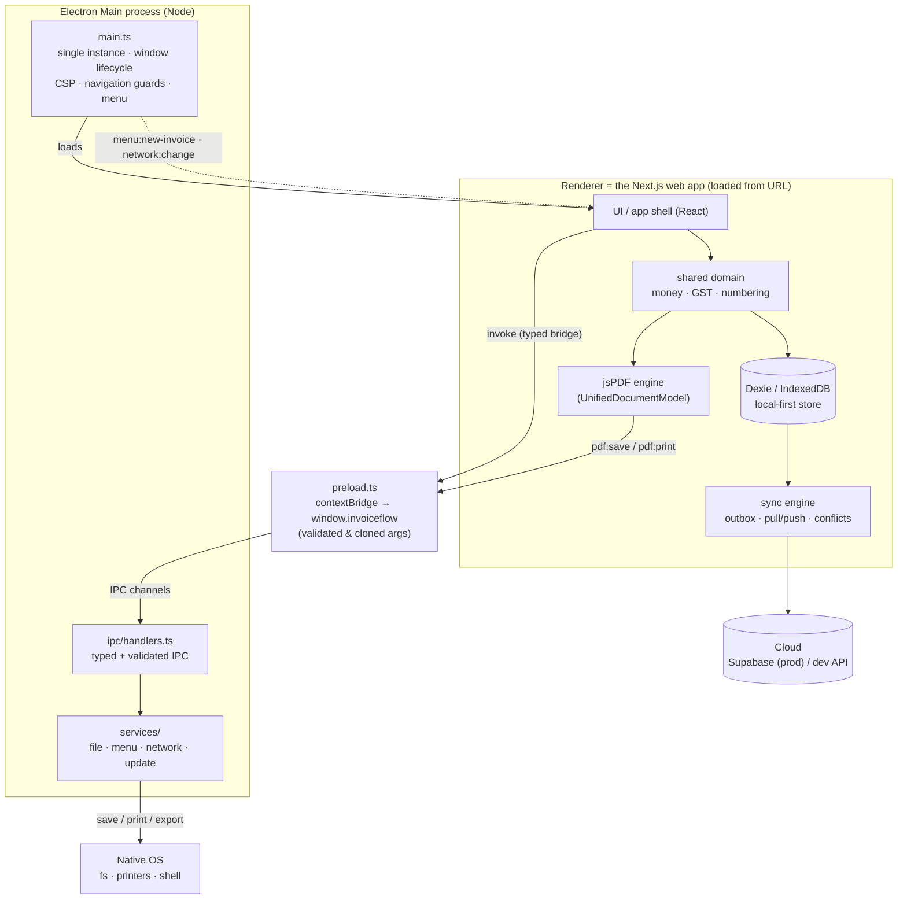

# InvoiceFlow Desktop (Electron shell)

Security-hardened Electron scaffold that wraps **the same Next.js web app** as the
browser build. This package is the `apps/desktop` mapping from the canonical spec
(`docs/_CANON.md` §2). It is intentionally dependency-free at compile time: in the
sandbox Electron is **not installed** and this code cannot be executed — it is the
production foundation for the desktop deliverable.

> Scope guard: everything in the desktop shell lives in `electron/`. The Next.js
> app, root `package.json`, `tsconfig.json` and ESLint config are untouched; the
> orchestrator adds `electron/` to the root build exclusions.

---

## 1. Architecture



**Key point:** the renderer is the web app *verbatim*. The main process adds only
OS integration (files, printing, menu, connectivity truth, updates); it never
touches business data.

## 2. Runtime detection

The renderer checks for the typed bridge injected by `preload.ts`:

```ts
if (window.invoiceflow !== undefined) {
  // desktop runtime — native save/print/export available
  const { appVersion, platform } = window.invoiceflow;
}
```

The full API is typed in [`src/invoiceflow.d.ts`](src/invoiceflow.d.ts)
(`InvoiceFlowBridge` + global `Window` augmentation). In a plain browser the
property is `undefined` and the app falls back to download/PWA behaviour
(CANON §17). In the monorepo the d.ts ships as `@invoiceflow/desktop`'s public
typing surface and is referenced from the renderer tsconfig.

## 3. Shared code

`packages/domain`, `packages/local-db` and `packages/pdf` are framework-agnostic
TypeScript (sandboxed into `src/lib/domain`, `src/lib/db`, `src/lib/pdf`). The
desktop renderer reuses them **unchanged** — same money/GST engine, same Dexie
schema, same jsPDF renderer that produces the `ArrayBuffer` handed to
`window.invoiceflow.savePdf(...)`. Nothing in `electron/` imports application
code; the boundary is strictly the typed bridge.

## 4. IPC surface

| Channel | Direction | Purpose |
|---|---|---|
| `app:get-device-info` | renderer → main | `{ appVersion, electronVersion, platform, hostname, osRelease }` |
| `app:get-version` | preload → main (sync, one-shot) | bootstrap for the `appVersion` property (sandboxed preload cannot import `app`) |
| `pdf:save` | renderer → main | native save dialog + write (`SavePdfRequest → SavePdfResponse`) |
| `pdf:print` | renderer → main | temp file → OS default PDF app (trade-off documented in `file-service.ts`) |
| `file:export` | renderer → main | generic CSV/JSON/… export via save dialog |
| `app:open-external` | renderer → main | `shell.openExternal`, https allow-list enforced in main |
| `updater:check` | renderer → main | stub update check (`{ updateAvailable, latestVersion? }`) |
| `menu:new-invoice` | main → renderer | File ▸ New Invoice → navigate `#/invoices/new` |
| `menu:export-pdf` | main → renderer | File ▸ Export PDF… → open the export flow |
| `network:change` | main → renderer | `{ online }` push (net.online + DNS probe, 15 s) |

Documented deviations from the base channel set (CANON rule: state & justify):
`app:get-version`, `menu:export-pdf`, `app:open-external` — each required by a
tasked menu item / bridge capability and commented in `src/ipc/channels.ts`.

## 5. Security model (CANON §16)

| Control | Implementation |
|---|---|
| `contextIsolation: true`, `nodeIntegration: false`, `sandbox: true` | `createMainWindow()` webPreferences |
| Typed bridge only | `contextBridge.exposeInMainWorld('invoiceflow', …)`; no raw `ipcRenderer` leaks |
| Payload validation | every handler type-guards `unknown` payloads; preload validates + `structuredClone`s arguments |
| CSP injection | `session.defaultSession.webRequest.onHeadersReceived` — `default-src 'self'; script-src 'self'; style-src 'self' 'unsafe-inline'; img-src 'self' data: blob:; font-src 'self' data:; connect-src 'self' https:; frame-src 'self' blob:` (dev adds `'unsafe-eval'` for webpack HMR) |
| Navigation allow-list | `will-navigate` blocked unless same-origin with `ELECTRON_START_URL`/`APP_ORIGIN` (hash routing is unaffected); `file://` only inside the embedded bundle |
| Pop-ups denied | `setWindowOpenHandler` → deny; https allow-listed links go to the OS browser |
| External links | `shell.openExternal` only for https hosts on the allow-list (GitHub, Supabase, invoiceflow.app) |
| Permissions | `setPermissionRequestHandler` denies everything |
| No remote content | renderer is the local app; only allow-listed https egress (sync cloud, update feed) |
| FS hygiene | file names sanitized; only user-chosen paths ever cross back to the renderer; temp print files never exposed |

## 6. Dev workflow

```bash
# 1 — run the web app (sandbox: already running on :3000)
npm run dev                      # in repo root

# 2 — install desktop deps (NOT installed in the sandbox) and start the shell
cd electron
npm install                      # electron ^33, electron-builder ^25, typescript ^5
ELECTRON_START_URL=http://localhost:3000 npm start

# build only
npm run compile                  # tsc -p tsconfig.json → dist/
```

Env vars: `ELECTRON_START_URL` (dev/remote renderer URL), `APP_ORIGIN`
(additional allow-listed origin), `INVOICEFLOW_UPDATE_URL` (update feed stub).

## 7. Packaging

```bash
cd electron
npm run package        # compile + electron-builder → release/
```

`electron-builder.yml` targets: **Windows** NSIS (assisted install, dir choice),
**macOS** DMG (business category, hardened runtime), **Linux** AppImage + deb
(Office), publish to **GitHub Releases**. Renderer embedding: `next build` with
`output: 'export'`, copy `out/` → `electron/renderer/`, uncomment the `files`
entry — the SPA's hash routing then works fully offline via `file://`.

Code signing notes (Phase 8): Windows — EV cert via `CSC_LINK`; macOS —
Developer ID + notarization (`CSC_LINK`, `APPLE_ID`, `APPLE_APP_SPECIFIC_PASSWORD`)
and an entitlements plist (JIT + network) wired into the `mac` block; Linux —
AppImage signing optional. Unsigned builds trigger OS SmartScreen/Gatekeeper
warnings — budget for certificates before distribution.

## 8. Limitations & roadmap

- **Scaffold only (CANON §19.6):** cannot execute in this sandbox; verified by
  review, compiles once `npm install` runs inside `electron/`.
- **Printing:** PDFs open in the OS default viewer's print dialog;
  `webContents.printToPDF` cannot re-print an existing PDF blob (trade-off
  documented in `file-service.ts`). Native spooling (CUPS/Win32) is a Phase 8 item.
- **Updates:** hand-rolled check stub; electron-updater `autoUpdater` lands in
  Phase 8 (builder config already publishes to GitHub).
- **Preload self-containment:** channel strings/allow-list are mirrored in
  `preload.ts` (sandboxed preloads should be dependency-free single files). In the
  monorepo, prefer bundling the preload with esbuild/electron-vite and drop the mirror.
- **Roadmap:** auto-updates, crash reporting (Sentry), tray + background sync,
  deep links (`invoiceflow://`), multi-window support, OS keychain for sessions.
